# GridView - App Flow

## Document information

- Product: GridView
- Document type: App Flow
- Version: 0.1
- Status: Draft
- Platform: Android
- Client technology: Flutter
- Related document: `GridView_PRD.md`
- Product phase: Complete reconstruction of the existing application

---

## 1. Purpose

This document defines how users move through GridView, how the main product areas are connected, and how the application should behave during loading, offline, empty and error states.

The App Flow translates the product requirements into a navigable structure before detailed UI design and technical implementation begin.

It covers:

- Primary navigation.
- Screen hierarchy.
- Entry and exit points.
- Relationships between races, circuits, drivers, teams and standings.
- Back-navigation behavior.
- Loading and degraded states.
- State preservation.
- Future deep-link readiness.

This document does not define final visual styling, component appearance or technical implementation details.

---

## 2. Navigation strategy

GridView will use a bottom navigation bar with four primary destinations:

1. Home.
2. Calendar.
3. Standings.
4. Explore.

Settings will be available as a secondary destination from the application bar or overflow menu.

This structure is recommended because:

- Home, Calendar and Standings represent the most common season-following tasks.
- Drivers, Teams and Circuits are important but belong to the same exploratory content family.
- Combining these entities inside Explore prevents the bottom navigation from becoming crowded.
- Settings does not need permanent primary placement.
- Four destinations remain easy to understand on small Android screens.

---

## 3. Primary information architecture

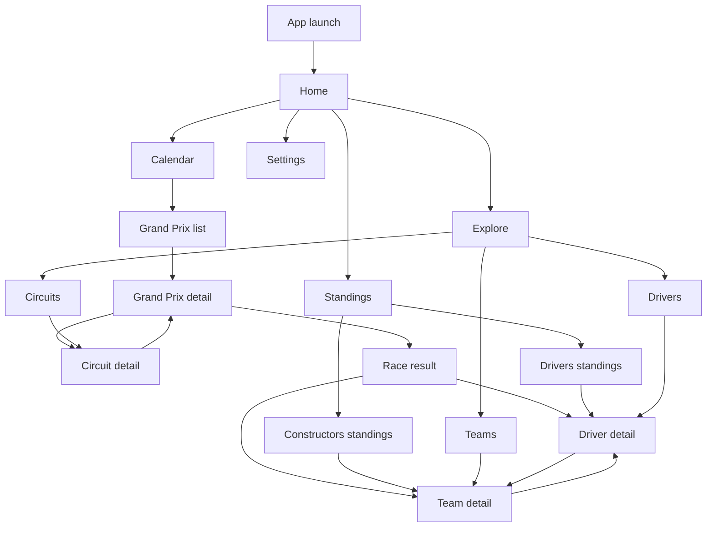

---

## 4. Global application shell

The main application shell will contain:

- A top application bar when appropriate.
- A bottom navigation bar with four destinations.
- A content area for the active section.
- Optional contextual actions.
- A global route to Settings.
- Global handling for connectivity and stale-data notices.

### 4.1 Bottom navigation destinations

| Position | Destination | Purpose |
|---|---|---|
| 1 | Home | Immediate season overview and next relevant event |
| 2 | Calendar | Complete season schedule and Grand Prix access |
| 3 | Standings | Drivers' and Constructors' Championship tables |
| 4 | Explore | Drivers, Teams and Circuits |

### 4.2 Navigation persistence

When the user switches between bottom navigation destinations:

- Each destination should preserve its scroll position where practical.
- Selected tabs or filters should remain active during the current session.
- Returning to a destination should not unnecessarily reload all data.
- Tapping the currently selected bottom-navigation item may return its section to the root screen.
- Repeated taps should not create duplicate routes.

### 4.3 Secondary screens

Detail screens will open above the current primary destination.

Examples:

- Calendar -> Grand Prix detail.
- Standings -> Driver detail.
- Explore -> Team detail.
- Grand Prix result -> Driver detail.

The bottom navigation may remain visible or be temporarily hidden on deep detail screens depending on the final UI design. The behavior must be consistent across comparable screens.

---

## 5. Application launch flow

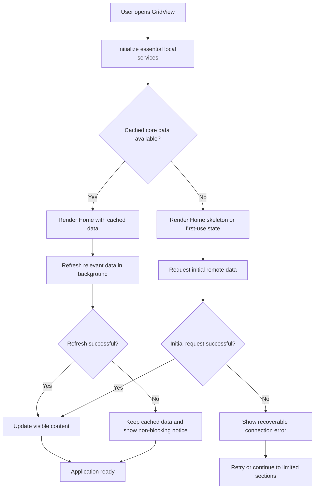

### 5.1 Launch rules

The application must not block startup while waiting for:

- Advertisements.
- Every remote endpoint.
- Full-resolution images.
- Non-essential analytics initialization.
- Data not required by the initial screen.

### 5.2 Returning user

For a returning user with cached data:

1. Open GridView.
2. Render the application shell.
3. Display cached Home content.
4. Refresh dynamic content in the background.
5. Update only the affected areas.
6. Show a subtle message if the refresh fails.

### 5.3 First-time user

For a first-time user without cached data:

1. Open GridView.
2. Render the application shell and Home structure.
3. Display skeletons or a clear loading state.
4. Request only the data needed for the first useful experience.
5. Display content as soon as it becomes available.
6. Load secondary datasets when their sections are opened or during low-priority background work.

### 5.4 Launch failure

When no cached data exists and the initial request fails:

- The application shell should remain usable.
- A clear connection message should be shown.
- A retry action should be available.
- Settings, legal information and other local sections should remain accessible.
- The user should not be trapped on a splash screen.

---

## 6. Home flow

Home is the default application destination.

Its content changes according to the current season context.

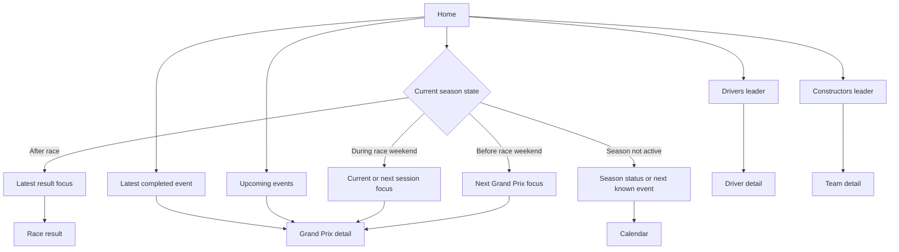

### 6.1 Home entry

Home is reached through:

- Application launch.
- Home bottom-navigation item.
- Returning from a deep link when no previous route exists.
- Optional "Home" action from an error state.

### 6.2 Home content priority

The Home hierarchy should be:

1. Current or next relevant event.
2. Session timing or latest result.
3. Championship leaders.
4. Upcoming events.
5. Data freshness information.

### 6.3 Home interactions

From Home, the user can:

- Open the next Grand Prix.
- Open the latest completed Grand Prix.
- Open the leading driver's profile.
- Open the leading constructor's page.
- Open the complete Calendar.
- Open the complete Standings.
- Open Settings.
- Retry an unsuccessful refresh.

### 6.4 Home empty state

When the current season has no known events:

- Explain that the calendar is not yet available.
- Avoid displaying false placeholder races.
- Keep Drivers, Teams, Circuits and Settings accessible if their data exists.

---

## 7. Calendar flow

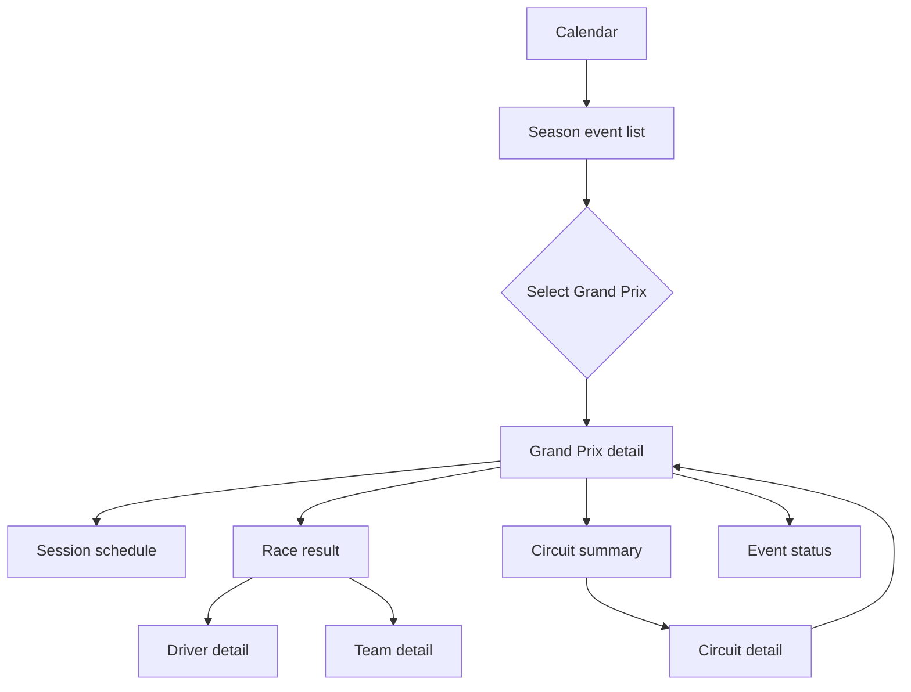

### 7.1 Calendar root

The Calendar root displays all Grand Prix events for the current season.

The list should:

- Be ordered chronologically.
- Distinguish completed, current, upcoming, postponed and cancelled events.
- Make the next event easy to identify.
- Preserve the user's scroll position.
- Allow direct access to each Grand Prix detail page.

### 7.2 Default scroll behavior

On first opening the Calendar during a season:

- The list should position the next relevant event near the visible area.
- Users must still be able to scroll backward to completed events and forward to later events.
- Returning to the Calendar should preserve the previous position unless the user explicitly returns to the section root.

### 7.3 Grand Prix detail flow

The Grand Prix detail page contains:

- Event header.
- Circuit and location.
- Weekend dates.
- Session schedule.
- Event state.
- Results when available.
- Link to Circuit detail.
- Links to Driver and Team details from results.

### 7.4 Weekend-format adaptation

The detail flow must support:

- Standard weekends.
- Sprint weekends.
- Changed session orders.
- Cancelled sessions.
- Sessions without results.
- Incomplete external data.

The application must render the sessions supplied by the data model rather than assuming a fixed sequence.

### 7.5 Completed Grand Prix

For a completed event:

1. User opens the Grand Prix.
2. The page shows the session schedule and completion state.
3. The race-result section becomes available.
4. The user may select a driver result.
5. The driver detail opens.
6. The user may continue to the driver's team.

### 7.6 Upcoming Grand Prix

For an upcoming event:

1. User opens the Grand Prix.
2. The page emphasizes session dates and local times.
3. The result area is absent or clearly marked as unavailable.
4. The circuit remains accessible.
5. The user returns to the Calendar using Android back navigation.

---

## 8. Standings flow

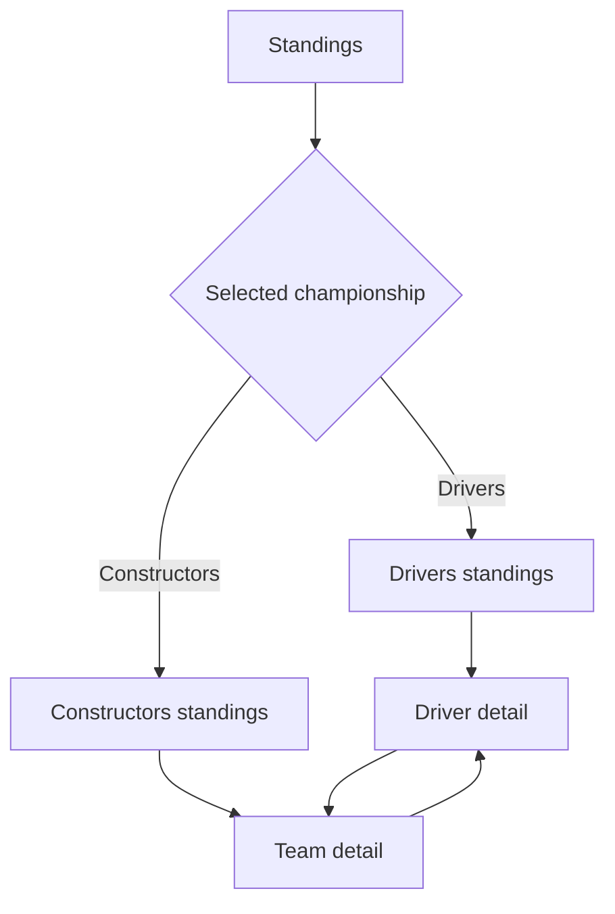

### 8.1 Standings root

The Standings section contains two internal views:

- Drivers.
- Constructors.

The UI/UX document will determine whether these use tabs, a segmented control or another compact selector.

### 8.2 Default selection

The default view should be Drivers unless product testing indicates a stronger reason to restore the last selected championship.

Recommended behavior:

- First visit: Drivers.
- Later visits during the same session: restore the last selected view.
- New app launch: optionally restore the last selection if this does not create confusion.

### 8.3 Drivers' standings interaction

Each driver row opens the Driver detail page.

The user journey is:

1. Open Standings.
2. View Drivers.
3. Select a driver.
4. Open Driver detail.
5. Optionally open the related Team detail.
6. Return to the same standings position.

### 8.4 Constructors' standings interaction

Each constructor row opens the Team detail page.

The user journey is:

1. Open Standings.
2. Switch to Constructors.
3. Select a team.
4. Open Team detail.
5. Optionally open one of its drivers.
6. Return to the same standings position and selected view.

### 8.5 Standings refresh state

When newer standings are being requested:

- Existing values remain visible.
- A small refresh indicator may appear.
- The screen must not return to a full loading state.
- Failed updates retain cached standings.
- The last successful update time remains visible.

---

## 9. Explore flow

Explore groups Drivers, Teams and Circuits.

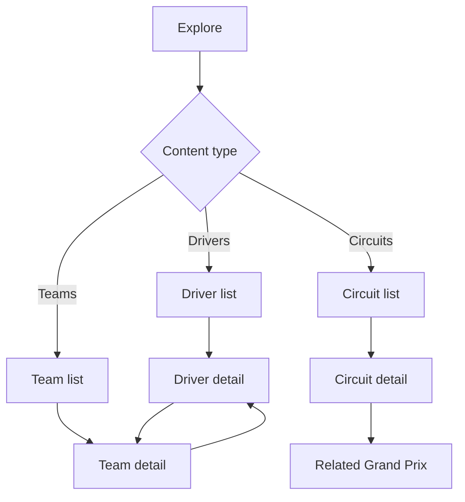

### 9.1 Explore root

The Explore root provides three clear destinations:

- Drivers.
- Teams.
- Circuits.

The final design may use:

- Top tabs.
- Segmented controls.
- Category cards.
- A combination of category selector and list.

The choice will be made in the UI/UX document.

### 9.2 Explore state

Explore should preserve:

- Selected category.
- Scroll position for each category.
- Active search query during the current session, if search is implemented.
- Active sort or filter option during the current session.

### 9.3 Search behavior

Search is useful but not mandatory for the first release because the core lists are relatively small.

If included:

- Search should apply only to the active Explore category.
- Clearing search should restore the previous list position where practical.
- Search should not require a remote request when local data exists.

---

## 10. Driver flow

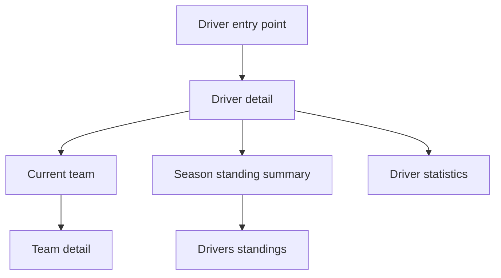

### 10.1 Driver entry points

Driver detail may be opened from:

- Explore -> Drivers.
- Drivers' standings.
- Home championship leader.
- Grand Prix race result.
- Team detail.
- Future deep links.

### 10.2 Driver detail structure

The screen should provide:

- Driver identity.
- Current team.
- Current-season standing.
- Relevant current-season values.
- Curated career or biographical data.
- Driver image when available.
- Data availability and fallback states.

### 10.3 Driver-to-team navigation

Selecting the current team opens Team detail.

Back navigation should return the user to the exact originating context:

- Standings position.
- Explore list position.
- Race-result position.
- Home.

### 10.4 Missing driver data

When optional profile information is unavailable:

- Hide the corresponding field or group.
- Do not display false zero values.
- Do not render empty cards.
- Preserve the rest of the screen.

---

## 11. Team flow

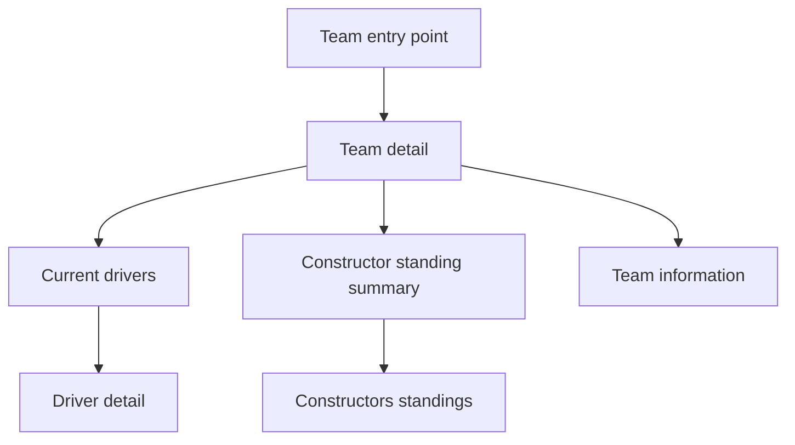

### 11.1 Team entry points

Team detail may be opened from:

- Explore -> Teams.
- Constructors' standings.
- Home championship leader.
- Driver detail.
- Grand Prix result.
- Future deep links.

### 11.2 Team detail structure

The screen should provide:

- Team identity.
- Current-season drivers.
- Constructor standing.
- Power unit and selected team facts.
- Team image or logo when legally available.
- Data availability and fallback states.

### 11.3 Team-to-driver navigation

Selecting a current driver opens Driver detail.

The navigation stack must avoid accidental loops that duplicate the same Driver and Team screens repeatedly.

Recommended behavior:

- Normal forward navigation is allowed.
- Reopening an entity already directly below the current screen may return to the existing route instead of pushing a duplicate.
- The technical strategy will be defined in the TRD.

---

## 12. Circuit flow

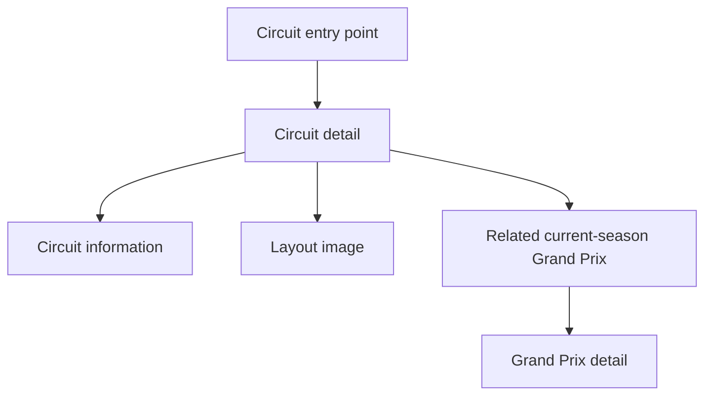

### 12.1 Circuit entry points

Circuit detail may be opened from:

- Explore -> Circuits.
- Calendar -> Grand Prix detail.
- Home event card.
- Future deep links.

### 12.2 Circuit detail structure

The screen should provide:

- Circuit name.
- Location and country.
- Circuit layout or fallback.
- Length and lap information.
- Related current-season Grand Prix.
- Selected historical fact when reliable.

### 12.3 Circuit-to-event navigation

The related Grand Prix opens from Circuit detail.

When Circuit detail was originally opened from that same Grand Prix:

- The application should avoid creating an endless `Grand Prix -> Circuit -> Grand Prix` duplicate stack.
- It may return to the previous Grand Prix route when appropriate.

---

## 13. Settings flow

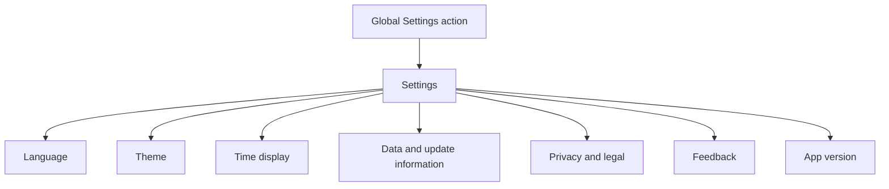

### 13.1 Settings entry

Settings should be reachable from:

- Home application bar.
- A global overflow menu.
- Other primary section app bars if consistent with the final design.
- Error or first-use states when legal or configuration access is needed.

### 13.2 Settings behavior

Changes should apply immediately where practical.

Examples:

- Theme changes update the active screen.
- Language changes update the application after the required reload behavior.
- Time preferences update all session displays consistently.

### 13.3 Settings back behavior

Back navigation returns to the screen from which Settings was opened.

Settings should not reset the primary-navigation destination.

---

## 14. Offline and degraded flows

### 14.1 Cached data available

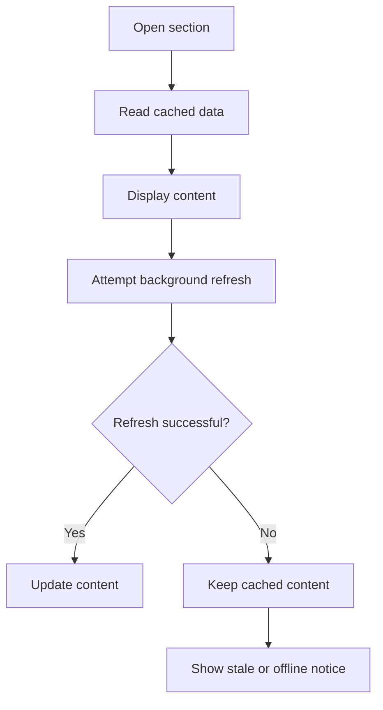

Rules:

- Cached content remains interactive.
- The user can continue navigating among locally available entities.
- Remote images use disk cache where available.
- Update timestamps remain visible.
- Retry is optional and non-blocking.

### 14.2 No cached data

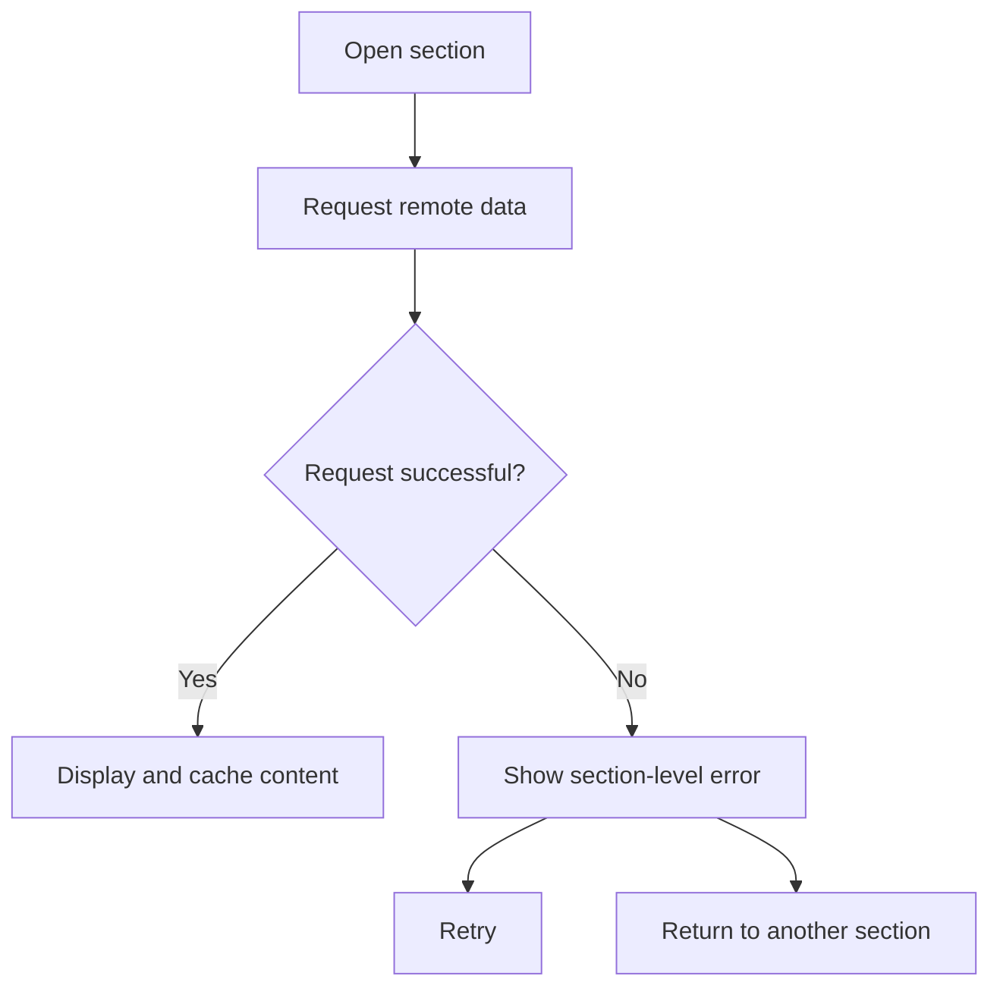

Rules:

- The failure affects only the requested section where possible.
- Bottom navigation remains operational.
- Error copy should explain the problem plainly.
- Technical exception messages must not be shown to users.

### 14.3 Partial data

When one dataset is available and another is not:

- Render available information.
- Show a local placeholder for the missing section.
- Avoid converting the entire page into an error state.

Example:

- Grand Prix schedule available.
- Race result unavailable.
- Circuit image failed.
- The page still renders schedule and circuit text normally.

---

## 15. Loading states

GridView should use three levels of loading behavior.

### 15.1 Initial section loading

Used when no data exists for a section.

- Show a skeleton or structured placeholder.
- Preserve the expected screen layout.
- Avoid a blank screen with only a central spinner where practical.

### 15.2 Background refresh

Used when existing data is visible.

- Keep the content on screen.
- Use a subtle progress indicator.
- Do not block interaction.

### 15.3 Progressive image loading

- Reserve the image area before loading.
- Show a neutral placeholder.
- Fade or replace with the final image without shifting the layout.
- Show a fallback asset after failure.

---

## 16. Error states

Error states should be scoped according to their impact.

### 16.1 Component-level error

Example:

- One image cannot load.
- One optional statistic is missing.

Behavior:

- Replace or hide only the affected component.
- Do not interrupt the rest of the page.

### 16.2 Section-level error

Example:

- Drivers list is unavailable on first request.

Behavior:

- Show an explanation and retry action inside the section.
- Keep global navigation available.

### 16.3 Application-level error

Reserved for failures that prevent the application shell from starting.

Behavior:

- Show a minimal recoverable screen.
- Provide retry.
- Provide access to local legal or support information if possible.
- Never loop indefinitely through an animated splash screen.

---

## 17. Empty states

Empty states must be different from errors.

Examples:

- A race has not produced results yet.
- The season calendar has not been announced.
- A driver's optional statistics are unavailable.
- Search returns no matches.

Each empty state should:

- Explain why no content is shown.
- Avoid suggesting a technical failure when none occurred.
- Offer a relevant next action when one exists.

---

## 18. Back-navigation behavior

GridView must follow Android navigation expectations.

### 18.1 System back

- From a detail screen: return to the previous screen and context.
- From a secondary Settings screen: return to the originating section.
- From the root of a non-Home destination: return to the previous primary destination or follow the chosen Android navigation policy.
- From Home root: exit or background the application according to Android behavior.

### 18.2 Bottom navigation

Selecting a bottom-navigation destination:

- Opens its root route.
- Restores its preserved state.
- Does not append repeated root routes to the stack.

### 18.3 Detail loops

The application must avoid unnecessary duplicate route loops such as:

- Driver A -> Team X -> Driver A -> Team X.
- Grand Prix -> Circuit -> Same Grand Prix -> Same Circuit.

The TRD will define route identity and deduplication rules.

---

## 19. State preservation

The application should preserve the following during a normal session:

- Active primary destination.
- Calendar scroll position.
- Standings selected championship.
- Standings scroll positions.
- Explore selected category.
- Explore category scroll positions.
- Detail-screen origin for correct back navigation.
- Visible cached data during refresh.

The application may persist selected preferences across launches:

- Language.
- Theme.
- Time display.
- Optional last selected Standings or Explore category.

Transient search text does not need to survive a full application restart.

---

## 20. Refresh behavior

### 20.1 Automatic refresh

Automatic refresh should occur:

- At launch when cached data is stale.
- When entering a section whose data requires updating.
- When the application returns to the foreground after a meaningful interval.
- Around race-weekend activity according to the technical caching strategy.

### 20.2 Manual refresh

Pull-to-refresh or an equivalent manual action may be provided for:

- Home.
- Calendar.
- Standings.

Manual refresh should:

- Keep existing content visible.
- Avoid triggering duplicate simultaneous requests.
- Show clear completion or failure feedback.
- Respect provider rate limits.

### 20.3 Entity detail refresh

Driver, Team and Circuit pages generally do not require independent manual refresh if their source collections are already current.

---

## 21. Data freshness communication

Dynamic screens should expose freshness without overwhelming the interface.

Possible placements:

- "Updated 12 min ago" near Standings.
- A small cached-data notice when offline.
- A refresh timestamp inside a contextual menu.
- A stale-data banner only when the information is significantly old.

The UI/UX document will define exact presentation.

---

## 22. Notifications and external entry points

Push notifications are outside the first release.

However, the route structure should remain ready for future external entry points such as:

- Grand Prix detail.
- Driver detail.
- Team detail.
- Circuit detail.
- Standings.

Future deep links should resolve through stable entity identifiers rather than display names.

Example future routes:

```text
/gridview/home
/gridview/calendar
/gridview/grand-prix/{season}/{round}
/gridview/standings/drivers/{season}
/gridview/standings/constructors/{season}
/gridview/drivers/{driverId}
/gridview/teams/{teamId}
/gridview/circuits/{circuitId}
```

These are conceptual route examples. Final technical paths will be defined in the TRD.

---

## 23. Screen inventory

### 23.1 Primary screens

- Home.
- Calendar.
- Standings.
- Explore.

### 23.2 Detail screens

- Grand Prix detail.
- Race result or result section.
- Driver detail.
- Team detail.
- Circuit detail.

### 23.3 Secondary screens

- Settings.
- Language settings.
- Theme settings.
- Privacy policy.
- Data source and acknowledgements.
- Feedback or contact.
- Application information.

### 23.4 System states

- Initial loading.
- Background refresh.
- Offline with cached data.
- Offline without cached data.
- Partial-data state.
- Empty state.
- Component error.
- Section error.
- Application error.

---

## 24. Core user journeys

### 24.1 Find the next race time

1. Open GridView.
2. Home displays the next relevant Grand Prix.
3. User sees the race date and local time.
4. User opens the Grand Prix for the complete session schedule.

Target interaction count:

- Essential race time: zero additional interactions after launch.
- Full weekend schedule: one interaction.

### 24.2 Review the complete season

1. Open Calendar.
2. View the chronological season list.
3. Scroll through completed and upcoming events.
4. Select any Grand Prix.
5. Review schedule, circuit and result where available.

### 24.3 Check the Drivers' Championship

1. Open Standings.
2. Drivers view is displayed.
3. Review positions and points.
4. Select a driver.
5. Open Driver detail.
6. Optionally open the driver's team.

### 24.4 Check the Constructors' Championship

1. Open Standings.
2. Switch to Constructors.
3. Review positions and points.
4. Select a team.
5. Open Team detail.
6. Optionally open one of its drivers.

### 24.5 Explore a driver

1. Open Explore.
2. Select Drivers.
3. Browse or search the list.
4. Select a driver.
5. Review profile and season information.
6. Open the associated team.

### 24.6 Explore a circuit

1. Open Explore.
2. Select Circuits.
3. Select a circuit.
4. Review circuit facts and layout.
5. Open the related Grand Prix.

### 24.7 Use the application offline

1. Open GridView without connectivity.
2. Cached Home data appears.
3. A discreet offline or stale-data notice is shown.
4. User navigates through previously cached Calendar, Standings and Explore data.
5. Remote-only images use cached versions or placeholders.
6. Data refreshes when connectivity returns.

---

## 25. Navigation acceptance criteria

The App Flow is successful when:

- The next Grand Prix is accessible immediately from Home.
- Every current-season Grand Prix is reachable from Calendar.
- Every displayed driver is reachable from Explore or Standings.
- Every displayed team is reachable from Explore or Standings.
- Every displayed circuit is reachable from Explore or a Grand Prix.
- Related entities link to one another.
- Android back navigation returns users to their previous context.
- Switching bottom-navigation destinations does not destroy useful state.
- Loading one section does not block unrelated sections.
- Offline cached data remains navigable.
- Missing optional data does not break a complete page.
- The navigation structure can support future deep links.
- Settings remains available without occupying a primary bottom-navigation destination.

---

## 26. Decisions established by this document

This document establishes the following product-flow decisions:

- GridView will use four primary bottom-navigation destinations.
- Home will be the default launch destination.
- Drivers, Teams and Circuits will be grouped under Explore.
- Settings will be secondary.
- Detail screens will be reachable from multiple contextual entry points.
- Related entities will be interconnected.
- Cached data will be rendered before background refresh completes.
- The application shell will remain usable during section-level failures.
- The flow will support future deep links without including them in the first release.
- The application will avoid fixed assumptions about race-weekend session formats.

---

## 27. Open design decisions

The following items should be resolved in the UI/UX Design document:

- Whether detail screens keep the bottom navigation visible.
- Whether Explore uses tabs, category cards or segmented navigation.
- Whether Standings uses tabs or a segmented control.
- Exact Home content hierarchy during a live race weekend.
- Calendar visual structure.
- Presentation of stale-data and offline notices.
- Search placement inside Explore.
- Manual-refresh interaction.
- Route-transition style.
- Placement of Settings access.
- Presentation of Grand Prix results inside or outside the main detail page.

---

## 28. App Flow summary

GridView will use a simple season-focused structure:

- Home provides the immediate championship context.
- Calendar organizes the season chronologically.
- Standings provides direct championship comparison.
- Explore groups Drivers, Teams and Circuits.
- Detail pages connect all entities without fragmenting the main navigation.
- Settings remains accessible but secondary.
- Cached data and partial rendering protect the user journey from remote failures.

The flow is intentionally compact. It supports both casual users seeking quick answers and habitual followers moving repeatedly between events, standings and participants.
