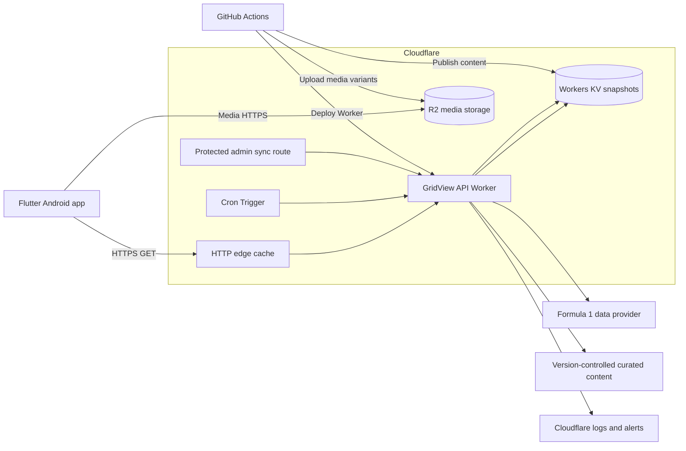

# GridView - Backend Scheme

## Document information

- Product: GridView
- Document type: Backend Scheme
- Version: 0.1
- Status: Draft
- Platform: Cloudflare developer platform
- Runtime language: TypeScript
- Related documents:
  - `GridView_PRD.md`
  - `GridView_App_Flow.md`
  - `GridView_UI_UX_Design.md`
  - `GridView_TRD.md`
- Product phase: Complete reconstruction of the existing application
- Document date: 2026-07-17

---

## 1. Purpose

This document defines the proposed backend and data-delivery architecture for the reconstructed GridView application.

The backend exists to provide a stable, secure and efficient boundary between the Flutter application and external Formula 1 data sources.

It must:

- Protect external provider credentials.
- Normalize provider-specific data.
- Serve a stable GridView API contract.
- Cache read-heavy data efficiently.
- Avoid runtime web scraping.
- Support offline-first behavior in the mobile client.
- Deliver optimized, legally approved media.
- Minimize infrastructure cost and operational complexity.
- Allow the external data provider to be replaced without rewriting the Flutter application.

This is not a traditional transactional backend. GridView v1 has no user accounts, user-generated content or payment workflows. The system is primarily a read-only data aggregation and delivery layer.

---

## 2. Executive decision

The recommended production architecture is:

- **Cloudflare Workers** for the GridView API.
- **TypeScript** for backend implementation.
- **Workers KV** for normalized, read-heavy JSON snapshots and synchronization metadata.
- **Cloudflare R2** for licensed images and generated media variants.
- **Cloudflare Cron Triggers** for provider synchronization.
- **Cloudflare cache** for HTTP response caching.
- **GitHub Actions** for testing and deployment.
- **API-Sports Formula 1 API** as the leading technical provider candidate.
- **Version-controlled curated JSON content** for profile information not safely or reliably supplied by the provider.
- **No production scraper**.
- **No MySQL database**.
- **No always-running Spring Boot server**.

API-Sports is only a technical candidate. Production use remains blocked until the intended ad-supported use and any required data-publication rights are confirmed.

---

## 3. Legal and licensing gate

Provider selection is both a technical and legal decision.

### 3.1 Current provider findings

#### API-Sports

API-Sports provides Formula 1 endpoints, API-key authentication and paid request quotas suitable for a small application.

However, its terms state that:

- It permits customers to build applications and websites using its service.
- Direct resale of its data is prohibited.
- It does not itself grant publication rights for sports competition data.
- Users are responsible for obtaining any rights required by leagues, federations, organizers or other rights holders.
- Images and logos may require separate authorization.

Therefore, subscribing to API-Sports alone must not be treated as complete legal clearance.

#### OpenF1

OpenF1 is technically strong for telemetry, sessions and recent historical data.

Its published access conditions describe:

- Free historical access for personal use.
- Paid live access for personal use.
- Non-commercial and fan-engagement orientation.
- Commercial or other use cases requiring direct discussion.

OpenF1 is not approved as the default production provider for an ad-supported GridView release without written permission.

#### Jolpica F1

Jolpica provides Ergast-compatible endpoints for schedules, results, drivers, constructors, circuits and standings.

Its published terms state:

- Free use is non-commercial.
- The data is licensed under CC BY-NC-SA 4.0.
- Commercial use requires contacting the project.
- Availability and correctness are not guaranteed.

Jolpica may be useful for prototyping or as a development fixture source, but not for an ad-supported production release without explicit commercial permission.

### 3.2 Hard release requirement

Before the production provider integration is approved, GridView must obtain:

- Written confirmation that the intended mobile-app use is permitted.
- Clarification of whether advertising changes the applicable rights.
- Clarification of attribution requirements.
- Clarification of whether normalized data may be cached.
- Clarification of whether historical snapshots may be retained.
- Clarification of whether logos and images are included or require separate rights.
- Confirmation of any restrictions on public redistribution.

### 3.3 Development before legal approval

Development may proceed using:

- Mock JSON fixtures.
- Manually curated test data.
- Provider sandbox/free access where its terms permit development and evaluation.
- A provider adapter that is not enabled in the production environment.

The provider-agnostic API contract should be completed before legal approval so development is not blocked.

---

## 4. Architecture overview



---

## 5. Architectural principles

### 5.1 Read-optimized

The public API must serve normalized snapshots rather than query and transform the provider for every mobile request.

### 5.2 Provider isolation

Only the provider adapter may understand the external provider's field names, identifiers and response structures.

### 5.3 Precomputed public responses

Common collections should be generated during synchronization and stored as complete response documents.

### 5.4 Stale data is preferable to no data

A temporary provider failure must not remove the last valid snapshot.

### 5.5 No secret in the app

Provider keys and administrative credentials remain server-side.

### 5.6 Minimal infrastructure

Do not introduce a database, queue, container or microservice unless the existing Worker/KV/R2 design cannot satisfy a verified requirement.

### 5.7 Legal media only

An image URL being available through a provider does not establish permission to redistribute it.

---

## 6. Component responsibilities

## 6.1 Flutter application

The app is responsible for:

- Requesting GridView API resources.
- Persisting normalized data in Drift.
- Rendering cached data immediately.
- Performing client-side filtering and sorting where appropriate.
- Displaying update timestamps and stale-state information.
- Caching media on the device.
- Never exposing or using the provider API key.

The app is not responsible for:

- Provider normalization.
- Provider quota management.
- Provider failover.
- Server refresh scheduling.
- Image transformation.
- Scraping.

---

## 6.2 GridView API Worker

The Worker is responsible for:

- Routing public API requests.
- Validating path and query parameters.
- Reading normalized snapshots.
- Adding HTTP cache headers.
- Supporting `ETag` and conditional requests.
- Returning stable response and error envelopes.
- Running scheduled synchronization.
- Calling the provider through a dedicated adapter.
- Merging provider and curated content.
- Validating generated snapshots.
- Preserving the last valid snapshot after failures.
- Exposing a protected manual synchronization operation.
- Recording structured logs and provider quota information.

---

## 6.3 Workers KV

KV stores read-heavy and infrequently written values.

Recommended namespaces:

```text
GRIDVIEW_DATA_DEV
GRIDVIEW_DATA_STAGING
GRIDVIEW_DATA_PRODUCTION
```

Stored content includes:

- Current-season pointer.
- Season calendar snapshots.
- Grand Prix detail snapshots.
- Driver list and detail snapshots.
- Team list and detail snapshots.
- Circuit list and detail snapshots.
- Driver standings.
- Constructor standings.
- Home snapshot.
- Synchronization state.
- Provider quota state.
- Content-manifest version.
- API schema version.

KV is suitable because the workload is:

- Highly read-heavy.
- Small in total data volume.
- Infrequently updated.
- Tolerant of eventual propagation over a short period.

It must not be used for:

- User transactions.
- Counters requiring strict consistency.
- Rapid writes to the same key.
- Relational queries.
- Authentication sessions.

---

## 6.4 Cloudflare R2

R2 stores only approved media and generated variants.

It may contain:

- Driver portraits.
- Team imagery.
- Circuit images.
- Circuit-layout graphics.
- GridView-owned decorative content.
- Attribution metadata manifests.
- Placeholder resources.
- Original source masters in a private prefix if legally permitted.

R2 must not become an unreviewed mirror of provider or Formula 1 website images.

---

## 6.5 Curated content repository

Content not supplied reliably by the provider will be stored in the monorepo.

Recommended structure:

```text
content/
├── schemas/
│   ├── driver-profile.schema.json
│   ├── constructor-profile.schema.json
│   ├── circuit-profile.schema.json
│   └── media-asset.schema.json
├── global/
│   ├── drivers.json
│   ├── constructors.json
│   └── circuits.json
└── seasons/
    └── 2026/
        ├── driver-entries.json
        ├── constructor-entries.json
        ├── overrides.json
        └── media.json
```

Curated content may contain:

- Biographical information.
- Corrected display names.
- GridView stable IDs.
- Team colors.
- Country codes.
- Profile descriptions.
- Image references.
- Attribution.
- Provider-ID mappings.
- Manual corrections.

All curated content changes require:

- Schema validation.
- Code review.
- Source or provenance note where relevant.
- Preview/staging validation.

---

## 7. Provider strategy

## 7.1 Recommended provider abstraction

The Worker must depend on an interface similar to:

```ts
interface FormulaOneProvider {
  getSeasonCalendar(season: number): Promise<ProviderCalendar>;
  getDrivers(season: number): Promise<ProviderDriver[]>;
  getConstructors(season: number): Promise<ProviderConstructor[]>;
  getDriverStandings(season: number): Promise<ProviderDriverStanding[]>;
  getConstructorStandings(
    season: number,
  ): Promise<ProviderConstructorStanding[]>;
  getRaceResults(
    season: number,
    round: number,
  ): Promise<ProviderRaceResult | null>;
  getProviderStatus(): Promise<ProviderStatus>;
}
```

Implementations may include:

```text
ApiSportsProvider
MockFormulaOneProvider
FutureLicensedProvider
```

The public API must never return provider DTOs directly.

---

## 7.2 API-Sports candidate

The first real adapter should target API-Sports after the legal gate is passed.

Reasons for technical preference:

- It has a dedicated Formula 1 product.
- It exposes authenticated GET endpoints.
- It offers circuits, drivers, teams, races and rankings-related data.
- It exposes daily and per-minute quota headers.
- Paid plans provide enough calls for a cache-first small app.
- It has a low entry price compared with enterprise sports feeds.

Known limitations:

- Data rights remain the user's responsibility.
- Media rights are not included automatically.
- Data availability and update timing are not guaranteed.
- Some response fields or old imagery may require manual correction.
- A commercial-grade SLA is not assumed.
- Provider IDs must not become GridView public IDs.

---

## 7.3 Alternative providers

### OpenF1

Best suited for:

- Future telemetry.
- Detailed session data.
- Live track information.
- Post-2023 race-weekend analysis.

Not selected for v1 core because:

- GridView does not need telemetry.
- Championship endpoints are marked beta.
- Published access is personal/non-commercial by default.
- It would increase data volume and complexity.

### Jolpica

Best suited for:

- Development fixtures.
- Historical schedule and result prototypes.
- Ergast-compatible exploration.

Not selected for ad-supported production by default because:

- Terms are non-commercial.
- It is volunteer-run.
- Uptime and correctness are not guaranteed.
- Commercial use needs separate approval.

### Enterprise licensed feed

Potential future option when:

- The user base justifies higher cost.
- Contractual rights and SLA are required.
- Live data becomes a core product feature.

The provider adapter prevents this migration from changing the mobile API.

---

## 8. Stable GridView identifiers

The backend must issue its own stable identifiers.

Examples:

```text
driver:max-verstappen
constructor:ferrari
circuit:spa-francorchamps
grand-prix:2026:belgian
```

Recommended JSON forms:

```json
{
  "id": "max-verstappen",
  "providerIds": {
    "apiSports": 25
  }
}
```

### 8.1 Rules

- Public IDs must be lowercase and URL-safe.
- Public IDs must not change after spelling or branding updates.
- Provider identifiers remain internal or diagnostic.
- A mapping file must resolve provider IDs to GridView IDs.
- Unknown provider entities must fail synchronization validation instead of silently creating unstable IDs.
- Mid-season additions require an explicit curated mapping.

---

## 9. Source-of-truth model

Different fields may come from different sources.

| Data category | Primary source | Secondary/override source |
|---|---|---|
| Season calendar | Licensed provider | Curated correction |
| Session schedule | Licensed provider | Curated correction |
| Standings | Licensed provider | None except emergency correction |
| Race results | Licensed provider | None except emergency correction |
| Driver identity | Curated GridView registry | Provider mapping |
| Driver season team | Provider | Curated override |
| Team identity | Curated GridView registry | Provider mapping |
| Circuit identity | Curated GridView registry | Provider mapping |
| Biography/profile facts | Curated content or permitted provider data | Manual correction |
| Team colors | Curated seasonal content | Provider as fallback |
| Media | Licensed GridView media library | Local placeholder |
| Update timestamps | GridView synchronization | Provider timestamp |

### 9.1 Precedence

Recommended precedence:

```text
Validated curated override
    > validated normalized provider value
    > previous valid snapshot
    > null
```

A missing value must not become a guessed value.

---

## 10. Public API design

Base path:

```text
https://api.<gridview-domain>/v1
```

Only `GET` and `HEAD` are public in v1.

---

## 10.1 Health and metadata

### `GET /v1/status`

Returns:

- API availability.
- API contract version.
- Current season.
- Last successful synchronization.
- Snapshot age.
- Provider status category without exposing credentials.
- Optional maintenance state.

This endpoint must not call the provider synchronously.

---

## 10.2 Bootstrap

### `GET /v1/bootstrap?season=current`

Purpose:

- Support first useful mobile synchronization.
- Reduce mobile round trips.
- Provide only compact, high-value collections.

Suggested payload:

- Current season metadata.
- Calendar summaries.
- Driver summaries.
- Constructor summaries.
- Circuit summaries.
- Current standings.
- Home snapshot.
- Media manifest version.

Do not include:

- Full biographies.
- Full race results for every round.
- Large media payloads.
- Provider-specific fields.

---

## 10.3 Home

### `GET /v1/home?season=current`

Returns a precomputed Home view model:

- Current or next event.
- Current or next session.
- Latest completed event.
- Driver championship leader.
- Constructor championship leader.
- Upcoming-event summaries.
- Data freshness metadata.

This endpoint is derived from other normalized snapshots.

---

## 10.4 Seasons

### `GET /v1/seasons/current`

Returns the current active GridView season.

### `GET /v1/seasons/{season}`

Returns season metadata.

Historical season browsing is not a v1 UI requirement, but season-aware routes prevent future redesign.

---

## 10.5 Calendar and Grand Prix

### `GET /v1/seasons/{season}/calendar`

Returns ordered event summaries.

### `GET /v1/seasons/{season}/grand-prix/{round}`

Returns:

- Grand Prix identity.
- Circuit summary.
- Event status.
- Sessions.
- Local event timezone metadata.
- Race-result availability.
- Related media.

### `GET /v1/seasons/{season}/grand-prix/{round}/results`

Returns race results when available.

An unavailable future result should return a meaningful absence status, not fabricated empty standings.

---

## 10.6 Standings

### `GET /v1/seasons/{season}/standings/drivers`

### `GET /v1/seasons/{season}/standings/constructors`

Returns:

- Ordered entries.
- Position.
- Points.
- Wins when available.
- Related stable IDs.
- Last source update.
- Provisional/final state if supplied reliably.

---

## 10.7 Drivers

### `GET /v1/seasons/{season}/drivers`

Returns season-specific driver summaries.

### `GET /v1/drivers/{driverId}?season={season}`

Returns:

- Stable driver identity.
- Biography.
- Current-season entry.
- Constructor summary.
- Standing summary.
- Available statistics.
- Media variants.
- Attribution where required.

---

## 10.8 Constructors

### `GET /v1/seasons/{season}/constructors`

### `GET /v1/constructors/{constructorId}?season={season}`

Returns:

- Stable constructor identity.
- Seasonal branding.
- Current driver line-up.
- Standing summary.
- Team profile.
- Media variants.

---

## 10.9 Circuits

### `GET /v1/seasons/{season}/circuits`

### `GET /v1/circuits/{circuitId}?season={season}`

Returns:

- Circuit identity.
- Location.
- Physical facts.
- Current-season Grand Prix association.
- Circuit media.
- Optional historical fact.

---

## 10.10 Content manifest

### `GET /v1/content/manifest`

Returns:

- Content version.
- Media version.
- Supported seasons.
- Legal attribution version.
- Minimum compatible API schema.

The app may use this to determine whether long-lived profile content requires refresh.

---

## 11. Response envelope

Success response:

```json
{
  "data": {},
  "meta": {
    "apiVersion": "1",
    "schemaVersion": 1,
    "season": 2026,
    "generatedAt": "2026-07-17T18:00:00Z",
    "sourceUpdatedAt": "2026-07-17T17:55:00Z",
    "staleAfter": "2026-07-17T18:15:00Z",
    "contentVersion": "2026.07.17.1",
    "requestId": "01J..."
  }
}
```

Collection response:

```json
{
  "data": [],
  "meta": {
    "apiVersion": "1",
    "schemaVersion": 1,
    "season": 2026,
    "generatedAt": "2026-07-17T18:00:00Z",
    "sourceUpdatedAt": "2026-07-17T17:55:00Z",
    "staleAfter": "2026-07-17T18:15:00Z",
    "contentVersion": "2026.07.17.1",
    "requestId": "01J..."
  }
}
```

---

## 12. Error contract

Recommended error response:

```json
{
  "error": {
    "code": "RESOURCE_NOT_AVAILABLE",
    "message": "The requested resource is not available.",
    "retryable": false,
    "requestId": "01J..."
  }
}
```

Error codes:

```text
INVALID_PARAMETER
SEASON_NOT_FOUND
RESOURCE_NOT_FOUND
RESOURCE_NOT_AVAILABLE
SNAPSHOT_NOT_READY
UPSTREAM_UNAVAILABLE
UPSTREAM_RATE_LIMITED
MAINTENANCE
INTERNAL_ERROR
```

### 12.1 Rules

- Public error messages must be generic and safe.
- Provider error bodies must not be returned.
- Stack traces must not be returned.
- `requestId` must allow server-log correlation.
- Appropriate HTTP status codes must be used.
- A stale valid snapshot should normally be returned instead of `UPSTREAM_UNAVAILABLE`.

---

## 13. Snapshot key design

Recommended KV key structure:

```text
meta:current-season
meta:content-version
meta:last-successful-sync
meta:provider-status

season:2026:metadata
season:2026:calendar
season:2026:home
season:2026:drivers
season:2026:constructors
season:2026:circuits
season:2026:standings:drivers
season:2026:standings:constructors

season:2026:grand-prix:01
season:2026:grand-prix:01:results

driver:max-verstappen:profile
driver:max-verstappen:season:2026

constructor:ferrari:profile
constructor:ferrari:season:2026

circuit:monza:profile
circuit:monza:season:2026

sync:season:2026:calendar
sync:season:2026:standings
sync:season:2026:profiles
```

### 13.1 Versioned publication

To avoid mixed snapshots during updates:

1. Generate all documents using a new release version.
2. Validate all documents.
3. Write versioned keys.
4. Update a small active-version pointer last.
5. Public reads resolve through the active version.
6. Retain the previous version for rollback.

Example:

```text
snapshot:2026:20260717T180000Z:calendar
snapshot:2026:20260717T180000Z:standings:drivers
active:2026 -> 20260717T180000Z
```

This avoids exposing half-updated data if synchronization fails midway.

---

## 14. Synchronization architecture

The public API must not call the provider for every user request.

Synchronization occurs through:

- Scheduled jobs.
- Protected manual jobs.
- Optional stale-while-revalidate triggers only if implemented safely later.

### 14.1 Scheduled handler

A Cron Trigger invokes the Worker's scheduled handler.

The handler:

1. Loads the current calendar snapshot.
2. Determines the current season state.
3. Selects due synchronization jobs.
4. Calls only required provider endpoints.
5. Normalizes and validates results.
6. Merges curated overrides.
7. Generates derived snapshots.
8. Publishes a complete version.
9. Records provider quota headers.
10. Logs success or failure.

### 14.2 No public sync endpoint

The legacy pattern of public routes such as:

```text
GET /api/scraper/driverStandings
```

must not exist.

A public request may never trigger a write merely by opening an endpoint intended for reading.

---

## 15. Refresh policy

The exact provider call frequency must respect quota and event timing.

Recommended baseline:

| Resource | Outside event week | Event week | During/after relevant session |
|---|---:|---:|---:|
| Current season metadata | Daily | Daily | Daily |
| Calendar | Every 6 hours | Every 2 hours | Every hour |
| Driver/team/circuit profiles | Weekly | Weekly | Weekly |
| Session schedule | Every 6 hours | Every 30 minutes | Every 15 minutes |
| Driver standings | Every 6 hours | Every hour | Every 5-10 minutes for a limited window |
| Constructor standings | Every 6 hours | Every hour | Every 5-10 minutes for a limited window |
| Race results | None before event | Every hour near event | Every 5-10 minutes until stable |
| Home snapshot | Derived after every relevant sync | Derived | Derived |

### 15.1 Important qualification

GridView v1 is not a live-timing product.

Refresh frequency should aim to provide timely post-session information, not second-by-second accuracy.

### 15.2 Dynamic due calculation

Cron may run frequently without calling the provider each time.

Example:

```text
Cron invocation every 15 minutes
    -> inspect cached due timestamps
    -> perform zero or more provider calls
```

This allows one scheduling mechanism while keeping provider usage controlled.

---

## 16. Provider quota management

The synchronization layer must record:

- Daily request limit.
- Remaining daily requests.
- Per-minute limit.
- Remaining per-minute requests.
- Provider response status.
- Last provider success.
- Last provider failure.
- Requests used by job type.

### 16.1 Quota safety

Rules:

- Reserve a percentage of daily quota for manual recovery.
- Skip low-priority profile refreshes when quota is low.
- Never consume quota for public mobile requests.
- Stop retries when the provider reports rate limiting.
- Respect `Retry-After` when supplied.
- Alert when remaining daily quota crosses defined thresholds.

Suggested thresholds:

- Warning: 30% remaining.
- High warning: 15% remaining.
- Critical: 5% remaining.

---

## 17. Synchronization validation

A provider response must pass validation before publication.

Examples:

### Calendar

- Season matches request.
- Round numbers are unique.
- Event dates are parseable.
- Circuit mappings exist.
- Required sessions are structurally valid.
- Event count is within a reasonable range.

### Drivers

- Stable mapping exists.
- Names are non-empty.
- Driver number is valid or null.
- Constructor association resolves.
- No duplicate stable IDs.

### Standings

- Positions are positive.
- Points are numeric.
- Stable driver/team mappings exist.
- Entries are unique.
- Major count reduction triggers a warning.
- Empty standings cannot replace previously valid non-empty standings without explicit override.

### Results

- Event identity matches requested season/round.
- Finishing entries have stable identities.
- Duplicate positions are only accepted when the provider model supports a valid reason.
- Provisional/final status is preserved when available.

---

## 18. Failure and fallback behavior

## 18.1 Provider unavailable

- Keep active snapshot.
- Log failure.
- Update internal sync status.
- Do not overwrite data.
- Public API continues serving stale snapshots.
- `meta.staleAfter` indicates age.

## 18.2 Invalid provider response

- Reject publication.
- Save redacted diagnostics.
- Keep previous snapshot.
- Alert if repeated.

## 18.3 Curated content invalid

- CI blocks deployment.
- Scheduled sync continues using last deployed valid content.
- No production runtime should parse an unvalidated content commit.

## 18.4 KV unavailable

- Return edge-cached response where available.
- Otherwise return a controlled service-unavailable response.
- Do not call the provider directly as an emergency path for every mobile request.

## 18.5 Media missing

- API returns fallback media category or null.
- App uses bundled placeholder.
- API data request remains successful.

---

## 19. HTTP caching

The backend should use standard HTTP caching.

Recommended headers:

```text
Cache-Control
CDN-Cache-Control
ETag
Last-Modified
Vary
```

### 19.1 Suggested policies

| Endpoint | Edge TTL | Client revalidation |
|---|---:|---|
| `/status` | 60 seconds | Yes |
| `/home` | 5-15 minutes | Yes |
| Calendar | 30-120 minutes | Yes |
| Standings | 5-15 minutes during event window | Yes |
| Driver/team/circuit list | 6-24 hours | Yes |
| Profile details | 24 hours or content-version based | Yes |
| Completed historic result | 7 days or immutable after final | Yes |
| Content manifest | 1 hour | Yes |

The Worker should generate deterministic `ETag` values from snapshot content or version.

### 19.2 Cache layering

```text
Flutter Drift database
    <- HTTP conditional request
Cloudflare edge cache
    <- Worker snapshot read
Workers KV
    <- scheduled provider synchronization
External provider
```

Each layer reduces load on the next.

---

## 20. Media architecture

## 20.1 R2 key layout

```text
media/
├── drivers/
│   └── max-verstappen/
│       └── v1/
│           ├── thumbnail.webp
│           ├── card.webp
│           ├── detail.webp
│           └── hero.webp
├── constructors/
├── circuits/
└── placeholders/
```

### 20.2 Media variants

Suggested maximum dimensions:

| Variant | Intended use | Suggested maximum |
|---|---|---|
| Thumbnail | Dense rows | 160 px |
| Card | Lists and cards | 480 px |
| Detail | Profile body | 960 px |
| Hero | Large header | 1440 px |

Actual dimensions depend on aspect ratio and visual testing.

### 20.3 Media processing

The CI media pipeline should:

1. Validate rights metadata.
2. Read the approved source master.
3. Remove unnecessary metadata.
4. Resize without upscaling.
5. Generate WebP variants.
6. Optionally generate AVIF after compatibility/performance evaluation.
7. Compute content hashes.
8. Upload immutable files.
9. Publish the media manifest.
10. Never overwrite an immutable versioned key.

### 20.4 Media legal metadata

Every non-GridView-owned asset should record:

```json
{
  "assetId": "driver:max-verstappen:portrait:v1",
  "source": "...",
  "rightsHolder": "...",
  "license": "...",
  "attribution": "...",
  "territory": "...",
  "expiresAt": null,
  "approvedForCommercialUse": true
}
```

An asset without approval must not be published.

---

## 21. Administrative operations

No public administration UI is required for v1.

Operational actions may use:

- Protected HTTP routes.
- GitHub Actions manual workflow dispatch.
- Cloudflare dashboard.
- Wrangler CLI.

Required operations:

- Synchronize all current-season data.
- Synchronize one resource type.
- Synchronize one Grand Prix.
- Rebuild Home snapshot.
- Publish curated content.
- Roll back active snapshot version.
- Purge selected HTTP cache tags.
- Inspect provider quota.
- Inspect last synchronization status.

### 21.1 Authentication

Administrative endpoints must use one of:

- Cloudflare Access.
- A strong secret stored as a Worker secret.
- GitHub Actions with scoped Cloudflare credentials.

Cloudflare Access is preferred if a browser-based operator flow is introduced.

---

## 22. API rate limiting and abuse protection

The public API is read-only but may still be abused.

Requirements:

- Apply per-IP or per-client rate limits.
- Cache successful public responses.
- Reject malformed or excessive query parameters.
- Limit season ranges.
- Do not offer arbitrary provider-query proxying.
- Do not allow arbitrary URL fetches.
- Return `429` with retry guidance when limited.
- Monitor sudden request-volume growth.
- Set Cloudflare budget alerts.

Suggested initial public limit:

```text
60 requests per minute per IP
```

This is provisional and should be adjusted using real usage.

The normal app should require far fewer requests because of bootstrap and local caching.

---

## 23. Security

### 23.1 Secrets

Store as Worker secrets:

```text
FORMULA_ONE_PROVIDER_API_KEY
ADMIN_SYNC_SECRET
SENTRY_DSN if a server error service is adopted
```

Never store secrets in:

- Git.
- Flutter build configuration.
- Public Worker variables.
- JSON content.
- Mobile Remote Config.
- API responses.
- Logs.

### 23.2 Input validation

Validate:

- Season range.
- Round range.
- Entity ID pattern.
- Query parameter allow-list.
- Maximum parameter length.
- Administrative job type.

### 23.3 Outbound requests

- Use fixed provider hostnames.
- Do not accept caller-provided upstream URLs.
- Set timeouts.
- Limit redirects.
- Validate content type.
- Limit response size where practical.
- Redact authentication headers in logs.

### 23.4 CORS

The Android app does not require browser CORS.

If a future website uses the API:

- Allow only approved origins.
- Do not use permissive `*` with credentials.
- Maintain CORS separately from mobile access assumptions.

---

## 24. Observability

### 24.1 Structured logs

Each request or synchronization should record:

- Request ID.
- Environment.
- Route or job.
- Status.
- Duration.
- Snapshot version.
- Cache outcome.
- Provider call count.
- Provider status.
- Error category.
- No secret or full sensitive response.

### 24.2 Metrics

Track:

- Public API request count.
- Response status distribution.
- p50, p95 and p99 duration.
- Edge cache hit ratio.
- KV read errors.
- Scheduled job success rate.
- Snapshot age.
- Provider calls per day.
- Provider quota remaining.
- Invalid provider-response count.
- Manual rollback count.
- R2 operation volume.

### 24.3 Alerts

Recommended alerts:

- No successful current-season sync within expected window.
- Standings snapshot older than threshold after a race.
- Provider remaining quota below critical level.
- Repeated invalid-response validation.
- Public API 5xx rate above threshold.
- Cron job repeated failure.
- Unexpected cost or request-volume spike.

---

## 25. Service targets

Initial operational targets:

| Metric | Target |
|---|---|
| Cached API availability | 99.5% monthly |
| Cached public API p95 | <= 300 ms |
| Error rate | < 1% excluding client errors |
| Provider failure data loss | Zero overwrite of last valid snapshot |
| Calendar freshness outside event | <= 6 hours |
| Standings freshness after race | Target <= 15 minutes, provider-dependent |
| Media availability | 99.5% |
| Recovery from bad snapshot | <= 30 minutes through rollback |

These are internal targets, not contractual SLAs.

---

## 26. Environments

Use separate Cloudflare resources for:

- Development.
- Staging.
- Production.

Recommended resource separation:

```text
gridview-api-dev
gridview-api-staging
gridview-api-production

GRIDVIEW_DATA_DEV
GRIDVIEW_DATA_STAGING
GRIDVIEW_DATA_PRODUCTION

gridview-media-staging
gridview-media-production
```

### 26.1 Rules

- Development may use mock provider data.
- Staging may use a provider test/free key within its allowed terms.
- Production uses the approved paid provider account.
- Production and staging secrets must differ.
- Staging media must not be exposed as production content.
- Production deployment requires protected GitHub environment approval.

---

## 27. Backend project structure

Recommended structure:

```text
services/edge-api/
├── src/
│   ├── index.ts
│   ├── config/
│   ├── routes/
│   ├── providers/
│   │   ├── formula-one-provider.ts
│   │   ├── api-sports/
│   │   └── mock/
│   ├── normalization/
│   ├── snapshots/
│   ├── sync/
│   ├── storage/
│   ├── validation/
│   ├── errors/
│   ├── logging/
│   └── types/
├── test/
│   ├── fixtures/
│   ├── contract/
│   ├── routes/
│   └── sync/
├── wrangler.toml
├── package.json
├── tsconfig.json
└── README.md
```

---

## 28. Validation and schemas

Use runtime validation for:

- Provider responses.
- Curated content.
- Public response generation.
- Environment configuration.

A schema library such as Zod may be used.

Requirements:

- Static TypeScript types alone are insufficient for external JSON.
- Unknown provider fields may be ignored.
- Missing required fields fail the relevant sync job.
- Validation errors must identify the resource without logging secrets.
- Public API examples and schemas should be generated or tested against the same models.

---

## 29. API documentation

The backend should maintain an OpenAPI document.

Recommended location:

```text
services/edge-api/openapi/gridview-api-v1.yaml
```

Requirements:

- Every public endpoint documented.
- Request parameters documented.
- Response examples provided.
- Error responses documented.
- Enum values documented.
- Nullable fields explicit.
- Schema changes reviewed.
- CI validates the OpenAPI document.
- Flutter DTO fixtures align with the contract.

The OpenAPI specification is the public contract between backend and mobile client.

---

## 30. Testing

## 30.1 Unit tests

Test:

- Provider mapping.
- Stable-ID resolution.
- Date/time normalization.
- Points and position parsing.
- Curated override precedence.
- Snapshot generation.
- Freshness calculation.
- Error mapping.
- ETag generation.
- Quota decisions.

## 30.2 Contract tests

Fixtures must cover:

- Standard race weekend.
- Sprint weekend.
- Cancelled session.
- Fractional points.
- Mid-season driver change.
- Team rebranding.
- Missing optional profile fields.
- Provider rate-limit response.
- Empty unexpected standings.
- Malformed provider date.
- Unknown provider entity.
- Provisional and final results.

## 30.3 Route tests

Test:

- Valid success.
- `ETag` and `304`.
- Invalid season.
- Unknown entity.
- Missing snapshot.
- Stale snapshot.
- Safe error body.
- Cache headers.
- HEAD requests.

## 30.4 Synchronization tests

Test:

- Complete successful publish.
- One provider job failure.
- Validation rejection.
- Previous snapshot preservation.
- Atomic active-version switch.
- Rollback.
- Quota-low behavior.
- Manual job authorization.

## 30.5 Integration tests

Use a local Worker runtime and mock provider.

A production provider smoke test should run manually or on a controlled schedule to avoid quota consumption and accidental publication.

---

## 31. Deployment

GitHub Actions deploys the Worker using Cloudflare's supported tooling.

Suggested workflows:

```text
edge-api-pr.yml
edge-api-staging.yml
edge-api-production.yml
content-publish.yml
media-publish.yml
```

### 31.1 Pull request

- Install dependencies.
- Type-check.
- Lint.
- Run unit and route tests.
- Validate OpenAPI.
- Validate curated content.
- Verify generated snapshot examples.
- Run secret scan.

### 31.2 Staging deploy

- Deploy Worker.
- Publish staging content.
- Run endpoint smoke tests.
- Validate cache headers.
- Validate protected sync.
- Produce deployment summary.

### 31.3 Production deploy

- Require environment approval.
- Deploy Worker version.
- Run health smoke test.
- Do not change active data snapshot automatically unless intended.
- Preserve previous Worker version for rollback.
- Record commit and deployment ID.

---

## 32. Cost model

The backend is intentionally designed to remain inexpensive for a small user base.

### 32.1 Cloudflare

Current public pricing indicates:

- Workers has a free plan.
- The paid Workers plan has a minimum charge of USD 5 per month.
- Workers KV is included with limited free/paid allowances.
- R2 includes a free monthly allowance for storage and operations.
- R2 does not charge internet egress directly.

For a small GridView deployment, the likely early Cloudflare cost is:

```text
USD 0-5 per month
```

depending on whether the paid Worker plan is used.

The paid plan is recommended for predictable production capacity and monitoring.

### 32.2 Provider

API-Sports currently lists:

- A free plan with 100 requests per day.
- A Pro plan with 7,500 requests per day, displayed at 15 per month.
- Higher plans with substantially larger quotas.

The final price and currency must be verified at subscription.

A cache-first GridView backend should usually fit within the smallest paid plan from a technical request-volume perspective.

### 32.3 Estimated initial operational cost

Indicative infrastructure-only estimate:

```text
Cloudflare Workers paid plan: approximately USD 5/month
Formula 1 API entry paid plan: approximately 15/month as listed
R2/KV overages: likely zero at small scale
Domain: separate annual cost
Estimated initial total: approximately 20/month plus domain
```

This does **not** include:

- Any Formula 1 or organizer data-rights license.
- Licensed photography.
- Legal review.
- Enterprise support.
- Higher provider quota.
- Future live-data products.

The legal/content rights cost may be more important than the hosting cost.

---

## 33. Alternatives considered

## 33.1 Direct mobile-to-provider connection

Rejected because:

- The key would be extractable.
- Provider changes would require mobile releases.
- User traffic would consume provider quota directly.
- There would be no unified cache or fallback.
- Provider DTOs would leak into the app model.

## 33.2 Existing Spring Boot + MySQL

Rejected for the reconstructed v1 because:

- It is more infrastructure than the read-only use case requires.
- The current model duplicates provider data.
- It requires server lifecycle and database operations.
- It is coupled to scraper updates.
- Credentials were committed publicly.
- Scaling and caching are not the primary strengths of the current implementation.

## 33.3 Firebase-only backend

Not selected because:

- Firestore is unnecessary for immutable public snapshots.
- Cloud Functions plus Storage could work, but Cloudflare provides a simpler edge-cache and object-storage combination for this use case.
- GridView does not need user authentication or realtime user documents.

Firebase remains appropriate for mobile crash, performance and analytics services.

## 33.4 Supabase

Technically valid, especially if relational administration becomes necessary.

Not selected for v1 because:

- A relational backend is not currently required.
- User authentication is not required.
- Most public responses can be precomputed.
- It introduces another database and service surface.

## 33.5 Static JSON files only

Attractive for simplicity but insufficient alone because:

- Dynamic standings and results require automated refresh.
- Provider credentials must remain server-side.
- Conditional freshness and provider failure handling are needed.
- A stable API boundary still provides value.

The proposed backend effectively serves dynamic static-like snapshots through a small API.

---

## 34. Legacy backend migration

The current public mobile version depends on the Railway Spring Boot backend, but GridView has very few active users. Preserving long-term compatibility for the legacy client is therefore not a product requirement.

The migration will use a direct cutover strategy.

### 34.1 Migration phases

#### Phase 1 - Security repair

- Rotate exposed Railway/MySQL credentials immediately.
- Remove secrets from the active repository and Git history.
- Restrict or disable public scraper routes.
- Review service logs.
- Back up only the legacy data or configuration that may be useful as a reference.

#### Phase 2 - New backend development

- Build the edge API.
- Seed current-season curated content.
- Implement the provider adapter.
- Generate validated snapshots.
- Deploy and validate staging.

#### Phase 3 - New app validation

- Point the staging app to the staging edge API.
- Validate offline database synchronization.
- Validate update installation over the current public app.
- Validate the production API and media configuration.
- Complete internal and closed-track testing.

#### Phase 4 - Direct production cutover

- Deploy the production edge API.
- Publish the reconstructed app through a staged Google Play rollout.
- Keep the legacy Railway backend available only as a short rollback precaution.
- Monitor crashes, startup, synchronization and API health.

#### Phase 5 - Early legacy retirement

- Confirm that the reconstructed release is stable.
- Export any final records worth retaining.
- Remove the Railway deployment.
- Remove or close the MySQL database.
- Revoke remaining credentials.
- Archive the legacy backend repository.

### 34.2 Cutover policy

- The new edge API does not need to preserve the old Spring endpoint contract.
- The backend must not include compatibility endpoints solely for the legacy mobile client.
- No long-term dual-operation period is required.
- The legacy backend may be retired shortly after the reconstructed release is confirmed stable.
- Users who remain on the old application may lose data access after retirement.
- This is an accepted product trade-off because the legacy active-user population is negligible.

---

## 35. Operational runbook

Minimum runbook scenarios:

### Provider outage

1. Confirm provider status.
2. Confirm active snapshot age.
3. Keep serving stale data.
4. Disable repeated provider jobs if necessary.
5. Communicate only if user-visible data becomes materially outdated.

### Bad provider data

1. Stop publication.
2. Confirm previous snapshot remains active.
3. Add curated override only when the correct value is verified.
4. Add regression fixture.
5. Re-run synchronization.

### Bad backend deployment

1. Roll back Worker version.
2. Verify `/v1/status`.
3. Purge only affected cache entries if necessary.
4. Do not modify active snapshot unless the snapshot itself is bad.

### Bad snapshot

1. Switch active pointer to previous version.
2. Purge cache tags.
3. Investigate validation gap.
4. Add regression test.

### Provider quota exhaustion

1. Stop low-priority jobs.
2. Continue serving snapshots.
3. Verify unexpected call source.
4. Upgrade plan only after fixing unnecessary usage.

### Media rights removal

1. Remove asset from media manifest.
2. Publish replacement or fallback.
3. Purge CDN cache for the affected path.
4. Retain compliance record.

---

## 36. Backend acceptance criteria

The Backend Scheme is successfully implemented when:

- The Flutter app consumes only the GridView API.
- No provider key exists in the APK or source repository.
- No runtime scraper is required.
- Current-season calendar, standings, drivers, teams and circuits have normalized snapshots.
- Grand Prix detail and results are available through stable endpoints.
- Provider failure preserves the last valid snapshot.
- Synchronization does not expose public write routes.
- `ETag` and HTTP cache headers work.
- KV snapshot publication is versioned and rollback-capable.
- Curated content is schema-validated.
- Media is served from R2 through immutable versioned paths.
- Every published media asset has rights metadata.
- Provider quota is monitored.
- Staging and production resources are separated.
- OpenAPI documentation exists.
- Automated backend tests pass.
- The legacy backend is retired shortly after the reconstructed release is confirmed stable.
- Production provider use has passed the legal/licensing gate.

---

## 37. Decisions established by this document

This document establishes:

- A serverless edge backend rather than Spring Boot/MySQL.
- Cloudflare Workers as the API runtime.
- TypeScript as the backend language.
- Workers KV as the normalized snapshot store.
- R2 as the media store.
- Cron-based provider synchronization.
- Precomputed public API responses.
- API-Sports as the first technical adapter candidate.
- A mandatory legal gate before production provider activation.
- GridView-owned stable entity identifiers.
- Version-controlled curated content.
- Versioned snapshot publication and rollback.
- No public scraper or synchronization routes.
- Direct production cutover with only a short rollback window for the legacy backend.

---

## 38. Open decisions

The following must be resolved before production launch:

- Written approval or rights assessment for the chosen data provider.
- Final Formula 1 provider subscription.
- Final custom API and media domains.
- Whether the Cloudflare paid plan is enabled from the start.
- Final public rate limit.
- Final refresh windows after provider testing.
- Exact provider endpoint mapping.
- Exact media sources and licenses.
- Whether Cloudflare Access is used for administration.
- Whether a server error platform beyond Cloudflare logs is required.
- Retention period for old snapshots.
- Length of the short rollback window before legacy-backend shutdown.
- Final operational budget.

---

## 39. Recommended next implementation proof

Before implementing every endpoint, build one backend vertical slice:

```text
API-Sports or mock calendar fixture
    -> provider adapter
    -> runtime validation
    -> stable ID mapping
    -> normalized calendar snapshot
    -> versioned KV publication
    -> GET /v1/seasons/2026/calendar
    -> ETag / 304
    -> Flutter staging sync
```

Then extend the same path to:

```text
Home
Grand Prix detail
Drivers
Constructors
Circuits
Standings
Results
```

This proof validates the most important backend boundaries before the system grows.

---

## 40. Reference sources

Current provider and platform details should be rechecked before subscription or deployment:

- [API-Sports Formula 1 product](https://api-sports.io/sports/formula-1)
- [API-Sports Formula 1 documentation](https://api-sports.io/documentation/formula-1/v1)
- [API-Sports terms](https://api-sports.io/terms)
- [OpenF1](https://openf1.org/)
- [OpenF1 documentation](https://openf1.org/docs/)
- [Jolpica F1 repository](https://github.com/jolpica/jolpica-f1)
- [Jolpica terms](https://github.com/jolpica/jolpica-f1/blob/main/TERMS.md)
- [Cloudflare Workers pricing](https://developers.cloudflare.com/workers/platform/pricing/)
- [Cloudflare Workers KV](https://developers.cloudflare.com/kv/)
- [Cloudflare KV pricing](https://developers.cloudflare.com/kv/platform/pricing/)
- [Cloudflare KV consistency](https://developers.cloudflare.com/kv/concepts/how-kv-works/)
- [Cloudflare Cron Triggers](https://developers.cloudflare.com/workers/configuration/cron-triggers/)
- [Cloudflare R2 pricing](https://developers.cloudflare.com/r2/pricing/)
- [Cloudflare Workers cache](https://developers.cloudflare.com/workers/runtime-apis/cache/)

---

## 41. Backend summary

GridView does require a backend boundary, but it does not require a traditional server and relational database.

The recommended backend is a small, read-optimized edge service that:

- Synchronizes external Formula 1 data.
- Normalizes it into GridView's own contract.
- Publishes validated snapshots.
- Serves cached data globally.
- Protects credentials and quota.
- Keeps working when the provider is temporarily unavailable.
- Hosts only licensed and optimized media.
- Costs little at the initial scale.

The key architectural distinction is:

```text
The mobile app reads GridView snapshots.
The backend manages the external provider.
The user never waits for a scraper or provider transformation.
```

This preserves the simplicity expected from an information application while giving GridView the control needed to remain reliable and extensible.
