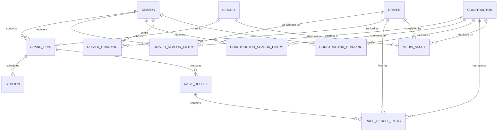

# GridView - Domain Model and Contract Vocabulary

## Document information

- Product: GridView
- Document type: Domain Model / Contract Vocabulary
- Version: 1.0
- Status: Draft (Phase 2, Batch 2A)
- Related documents:
  - `GridView_TRD.md` (section 11 - domain model)
  - `GridView_Backend_Scheme.md` (sections 8, 9, 11, 12 - identifiers, source-of-truth, envelopes, errors)
  - `GridView_Implementation_Plan.md` (section 7 - Phase 2)
  - `../api/gridview-api-v1.yaml` (OpenAPI source of truth)
- Document date: 2026-07-18

---

## 1. Purpose

This document defines the shared domain language between the GridView edge API and
the Flutter client. It is the human-readable companion to
`docs/api/gridview-api-v1.yaml`, which is the machine-readable source of truth.

Where this document and the OpenAPI file disagree, the OpenAPI file wins for wire
shape (field names, types, nullability), and this document wins for meaning,
identity rules and modelling rationale.

This document establishes:

- The final v1 domain vocabulary and relationships.
- Which fields are stable identity and which are season-specific.
- Nullability, numeric type, date/time and enum-fallback rules.
- GridView stable-ID formats for drivers, constructors, circuits and Grand Prix
  events.

It intentionally does **not** define provider mappings, curated-content JSON
Schemas or fixtures. Those are delivered in Batch 2B.

---

## 2. Modelling principles

These principles come from `GridView_TRD.md` section 11 and
`GridView_Backend_Scheme.md` sections 8-9 and are binding for every entity below.

1. **Identity is separate from participation.** A `Driver` and a `Constructor`
   have a stable identity that never changes. Their season role, team, number,
   branding and line-up are separate season-scoped entities.
2. **Missing means null.** A missing value is `null` or an omitted optional
   field. It is never `0`, `""`, `false` or a guessed value. Zero is only ever a
   confirmed measured value.
3. **Unknown enum values are explicit.** Every enum has an `unknown` member.
   Consumers map any unrecognised value to `unknown` and keep working. This keeps
   the contract additive-safe.
4. **Additive fields never break parsing.** Consumers ignore unknown object
   fields. Adding an optional field is a non-breaking change.
5. **Stable weekend model.** Standard and sprint weekends use the same
   `GrandPrix` + ordered `Session[]` shape. The weekend format is data, not a
   separate schema.
6. **Provider identifiers stay internal.** Provider IDs never appear in public
   API responses. They live only in curated registries and mapping files.
7. **GridView owns identity.** Public IDs are GridView-issued, lowercase and
   URL-safe, and survive spelling and branding changes.

---

## 3. Entity catalogue

The v1 domain has fourteen entities.

| Entity | Kind | Identified by |
|---|---|---|
| `Season` | Root, time-scoped | `year` |
| `Driver` | Stable identity | `id` (driver slug) |
| `Constructor` | Stable identity | `id` (constructor slug) |
| `Circuit` | Stable identity | `id` (circuit slug) |
| `GrandPrix` | Season-scoped event | `id` (`{season}-{eventSlug}`, e.g. `2026-belgian-grand-prix`) |
| `Session` | Event-scoped | `id` (`{grandPrixId}-{sessionType}`) |
| `DriverSeasonEntry` | Season participation | `id` (`{season}-{driverId}`, + start round if split) |
| `ConstructorSeasonEntry` | Season participation | `id` (`{season}-{constructorId}`) |
| `DriverStanding` | Season standing row | (`season`, `driverId`) |
| `ConstructorStanding` | Season standing row | (`season`, `constructorId`) |
| `RaceResult` | Session classification | `id` (`{grandPrixId}-{sessionType}-results`) |
| `RaceResultEntry` | Classification row | (`raceResultId`, `driverId`) |
| `MediaAsset` | Media descriptor | `id` (`{entityId}-{category}-{version}`) |
| `DataFreshness` | Snapshot metadata | n/a (value object) |

### 3.1 Relationships



The critical modelling boundary: a driver's team is **not** a property of
`Driver`. It is a property of `DriverSeasonEntry`. A team's sponsor name and
livery are **not** properties of `Constructor`. They are properties of
`ConstructorSeasonEntry`.

---

## 4. Stable identifiers

### 4.1 Slug grammar

A **slug** is a lowercase, URL-safe token matching:

```
^[a-z0-9]+(-[a-z0-9]+)*$
```

Normalisation rules applied when a slug is first minted:

1. Lowercase.
2. Transliterate diacritics to ASCII (`Kimi Räikkönen` -> `raikkonen`,
   `Nico Hülkenberg` -> `hulkenberg`).
3. Remove apostrophes and punctuation (`Sergio Pérez` -> `perez`).
4. Replace spaces and underscores with a single hyphen.
5. Collapse repeated hyphens and trim leading/trailing hyphens.

A slug is minted once and then frozen. Later spelling, branding or sponsor
changes never alter it.

### 4.2 Public stable IDs

Every public identifier is a lowercase ASCII kebab-case slug with **no type
prefix and no colons**. The entity type is conveyed by the field name or the
endpoint, never by the identifier.

| Entity | ID format | Example |
|---|---|---|
| Driver | `{slug}` | `max-verstappen` |
| Constructor | `{slug}` | `ferrari` |
| Circuit | `{slug}` | `spa-francorchamps` |
| Grand Prix (edition) | `{season}-{eventSlug}` | `2026-belgian-grand-prix` |
| Session | `{grandPrixId}-{sessionType}` | `2026-belgian-grand-prix-race` |
| Race result | `{grandPrixId}-{sessionType}-results` | `2026-belgian-grand-prix-race-results` |
| Driver season entry | `{season}-{driverId}` (+ start round if split) | `2026-max-verstappen` |
| Constructor season entry | `{season}-{constructorId}` | `2026-red-bull` |
| Media asset | `{entityId}-{category}-{version}` | `max-verstappen-portrait-v1` |

The OpenAPI contract expresses these with two schemas: `Slug` (atomic entity
references, max 64 chars) and `GridViewId` (composite IDs, max 96 chars). Both
enforce the same kebab-case pattern.

A **Grand Prix edition ID embeds the season year** because an event edition is
season-specific: the same `eventSlug` (`belgian-grand-prix`, `monaco-grand-prix`)
recurs every season, while `round` numbers are not stable across seasons.

### 4.3 Representation in the public API

- Path parameters `{driverId}`, `{constructorId}`, `{circuitId}` are the entity
  slug (`GET /v1/drivers/max-verstappen`).
- Typed reference fields carry the referenced entity's slug, because the field
  name states the type (`DriverSeasonEntry.constructorId = "ferrari"`).
- Grand Prix events are addressed by `{season}/{round}` for calendar ordering
  (`/v1/seasons/2026/grand-prix/13`); each event also exposes its stable `id`
  (`2026-belgian-grand-prix`), `season`, `round` and `eventSlug`.
- Provider identifiers are internal only and never appear in any public response.

### 4.4 Identifier rules (from Backend Scheme section 8.1)

- Public IDs are lowercase and URL-safe.
- Public IDs never change after a spelling or branding update.
- Provider identifiers remain internal or diagnostic and never appear in public
  responses.
- A curated mapping file resolves provider IDs to GridView IDs (Batch 2B).
- An unknown provider entity fails synchronisation validation rather than
  silently minting an unstable ID.
- Mid-season additions require an explicit curated mapping before they can be
  published.

---

## 5. Type, nullability and time rules

These rules are contract-wide and are enforced by the OpenAPI schemas.

### 5.1 Numeric types

| Concept | Type | Notes |
|---|---|---|
| Counts, positions, laps, rounds, race numbers | `integer` | Never stored as strings. |
| Championship / result points | `number` (double) | **Fractional values are valid** (half points, sprint fractions). Never coerced to integer. |
| Durations (lap time, elapsed time, gap) | `integer` milliseconds | Explicit unit in the field name (`...Millis`). |
| Laps behind leader | `integer` | Whole laps, field name `lapsBehind`. |
| Circuit length | `integer` metres | Field name `lengthMeters`. |
| Coordinates | `number` (double) | Decimal degrees. |

**Structured timing is canonical.** Result timing uses `elapsedTimeMillis`,
`gapToLeaderMillis`, `lapsBehind` and `status`; lap records and fastest laps use
millisecond fields. The client formats lap-time and gap strings from these
structured values. A pre-formatted `gapText` may exist only as an optional
display fallback — never required, never parsed by the client, and never the
sole representation of a gap.

Zero is only emitted when zero is a confirmed value (for example, a driver who
has genuinely scored zero points and is ranked). An absence is `null`.

### 5.2 Nullability

- Required fields are present and non-null on every response: an entity's `id`,
  a `Season.year`, a reference field that is structurally mandatory.
- Everything biographical, statistical or provider-dependent is nullable.
- A parse that encounters a missing required field is an error the client must
  surface (it must not silently substitute a default).
- Empty collections are represented as `[]`, not `null`, unless the collection's
  availability itself is unknown (then `null`).

### 5.3 Dates and time

- Instants (session start/end, generation timestamps) use RFC 3339 / ISO 8601
  with an explicit UTC offset, normalised to UTC (`2026-07-26T13:00:00Z`).
  OpenAPI `format: date-time`.
- Calendar-only values (season start/end date, event date) with no meaningful
  time use `format: date` (`2026-07-26`).
- Event-local timezone is carried as an IANA zone string (`Europe/Brussels`) on
  `GrandPrix.timezone`. Time zones are never inferred from country names.
- The client converts instants to device-local time for display. The API always
  transmits UTC.

### 5.4 Enums and fallback

Every enum below includes `unknown`. A consumer receiving an unrecognised value
maps it to `unknown`; it must never throw. This makes adding new enum members a
non-breaking, additive change.

| Enum | Members |
|---|---|
| `SeasonStatus` | `upcoming`, `active`, `completed`, `unknown` |
| `WeekendFormat` | `standard`, `sprint`, `unknown` |
| `EventStatus` | `scheduled`, `upcoming`, `in_progress`, `completed`, `postponed`, `cancelled`, `unknown` |
| `SessionType` | `practice_1`, `practice_2`, `practice_3`, `sprint_qualifying`, `sprint`, `qualifying`, `race`, `unknown` |
| `SessionStatus` | `scheduled`, `live`, `completed`, `cancelled`, `postponed`, `unknown` |
| `DriverRole` | `race`, `reserve`, `test`, `unknown` |
| `ResultStatus` | `provisional`, `final`, `unavailable`, `unknown` |
| `FinishStatus` | `finished`, `lapped`, `dnf`, `dns`, `dsq`, `dnq`, `unknown` |
| `MediaEntityType` | `driver`, `constructor`, `circuit`, `grand_prix`, `placeholder`, `unknown` |
| `MediaCategory` | `portrait`, `logo`, `car`, `circuit_layout`, `hero`, `thumbnail`, `unknown` |
| `MediaFormat` | `webp`, `avif`, `png`, `jpeg`, `unknown` |
| `MediaVariantName` | `thumbnail`, `card`, `detail`, `hero` |

---

## 6. Entity definitions

Legend: **R** = required and non-null. **N** = nullable/optional. Types are the
wire types from the OpenAPI contract.

### 6.1 Season

Identity: `year`. Root of season-scoped data.

| Field | Type | R/N | Meaning |
|---|---|---|---|
| `year` | integer | R | Four-digit championship year. The `{season}` path value. |
| `label` | string | N | Display label, e.g. "2026 FIA Formula One World Championship". |
| `status` | `SeasonStatus` | R | Lifecycle state. |
| `startDate` | date | N | First event date. |
| `endDate` | date | N | Last event date. |
| `roundCount` | integer | N | Number of scheduled rounds. |
| `currentRound` | integer | N | Round considered "current" for an active season. |
| `isCurrent` | boolean | R | Whether this is the current active GridView season. |

### 6.2 Driver

Identity: `id` (driver slug). Stable biographical identity only. **No team, no
race number, no season role** — those live in `DriverSeasonEntry`.

| Field | Type | R/N | Meaning |
|---|---|---|---|
| `id` | string (slug) | R | Stable driver slug, e.g. `max-verstappen`. |
| `fullName` | string | R | Display full name. |
| `givenName` | string | N | First name. |
| `familyName` | string | N | Last name. |
| `shortCode` | string | N | Three-letter TLA, e.g. `VER` (broadcast code; can vary, treated as current biographical value). |
| `permanentNumber` | integer | N | Career permanent number. Season car number lives in `DriverSeasonEntry.raceNumber`. |
| `nationality` | string | N | Display demonym, e.g. "Dutch". |
| `countryCode` | string | N | ISO 3166-1 alpha-2, uppercase, e.g. `NL`. |
| `dateOfBirth` | date | N | Birth date. |
| `placeOfBirth` | string | N | Birth place. |
| `biography` | string | N | Curated biography. |
| `media` | `MediaAsset[]` | N | Portraits and related media. |

### 6.3 Constructor

Identity: `id` (constructor slug). Stable team identity. **Season name, livery,
power unit and line-up** live in `ConstructorSeasonEntry`.

| Field | Type | R/N | Meaning |
|---|---|---|---|
| `id` | string (slug) | R | Stable constructor slug, e.g. `red-bull`. |
| `name` | string | R | Canonical base name, e.g. "Red Bull". Season entrant names differ. |
| `shortName` | string | N | Short display name. |
| `nationality` | string | N | Racing licence nationality display value. |
| `countryCode` | string | N | ISO 3166-1 alpha-2, uppercase. |
| `colorPrimary` | string | N | Base brand colour, `#RRGGBB`. Season livery overrides in the season entry. |
| `biography` | string | N | Curated team profile. |
| `media` | `MediaAsset[]` | N | Logos and related media. |

### 6.4 Circuit

Identity: `id` (circuit slug).

| Field | Type | R/N | Meaning |
|---|---|---|---|
| `id` | string (slug) | R | Stable circuit slug, e.g. `spa-francorchamps`. |
| `name` | string | R | Circuit name. |
| `locality` | string | N | City/locality. |
| `country` | string | N | Country display name. |
| `countryCode` | string | N | ISO 3166-1 alpha-2, uppercase. |
| `latitude` | number | N | Decimal degrees. |
| `longitude` | number | N | Decimal degrees. |
| `lengthMeters` | integer | N | Lap length in metres. |
| `cornerCount` | integer | N | Number of corners. |
| `direction` | string enum | N | `clockwise`, `counter_clockwise`, `unknown`. |
| `firstGrandPrixYear` | integer | N | Year the circuit first hosted a Grand Prix. |
| `lapRecord` | object | N | `{ driverId, timeMillis, year }`; optional historical fact. |
| `media` | `MediaAsset[]` | N | Layout graphics and related media. |

Race distance and lap count are **event** properties, not circuit identity, and
belong to `GrandPrix`/`RaceResult`.

### 6.5 GrandPrix

Identity: `id` (`{season}-{eventSlug}`). A season-scoped event.

| Field | Type | R/N | Meaning |
|---|---|---|---|
| `id` | string | R | Edition ID, e.g. `2026-belgian-grand-prix`. |
| `season` | integer | R | Championship year. |
| `round` | integer | R | 1-based ordering within the season. |
| `eventSlug` | string (slug) | R | Season-independent event key, e.g. `belgian-grand-prix`. |
| `name` | string | R | Event name, e.g. "Belgian Grand Prix". |
| `officialName` | string | N | Full sponsor-inclusive name. |
| `circuitId` | string (slug) | R | Host circuit reference. |
| `status` | `EventStatus` | R | Event lifecycle state. |
| `format` | `WeekendFormat` | R | `standard` or `sprint`. |
| `startDate` | date | N | Event start (local calendar date). |
| `endDate` | date | N | Event end (local calendar date). |
| `timezone` | string (IANA) | N | Event-local zone, e.g. `Europe/Brussels`. |
| `sessions` | `Session[]` | R | Ordered weekend schedule (may be empty if unknown). |
| `hasResults` | boolean | R | Whether any classified result is available. |
| `media` | `MediaAsset[]` | N | Event media. |

### 6.6 Session

Identity: `id` (`{grandPrixId}-{sessionType}`). One entry per scheduled session.

| Field | Type | R/N | Meaning |
|---|---|---|---|
| `id` | string | R | e.g. `2026-belgian-grand-prix-race`. |
| `type` | `SessionType` | R | Session discriminator. |
| `name` | string | N | Display label; derived from `type` when absent. |
| `startTime` | date-time (UTC) | N | Scheduled/actual start instant. |
| `endTime` | date-time (UTC) | N | Scheduled/actual end instant. |
| `status` | `SessionStatus` | R | Session lifecycle state. |

**Sprint vs standard weekends use the same shape.** The difference is the set of
`SessionType` values in the ordered list:

- Standard weekend: `practice_1`, `practice_2`, `practice_3`, `qualifying`, `race`.
- Sprint weekend: `practice_1`, `sprint_qualifying`, `sprint`, `qualifying`, `race`.

The client renders from the ordered `sessions` array and never assumes a fixed
session set.

### 6.7 DriverSeasonEntry

Identity: `id` (`{season}-{driverId}`, plus start round for a split seat). A
driver's participation for a team over a span of a season.

| Field | Type | R/N | Meaning |
|---|---|---|---|
| `id` | string | R | Composite participation ID, e.g. `2026-max-verstappen`. |
| `season` | integer | R | Championship year. |
| `driverId` | string (slug) | R | Driver reference. |
| `constructorId` | string (slug) | R | Team for this participation span (season-specific). |
| `raceNumber` | integer | N | Season car number (may differ from `permanentNumber`). |
| `role` | `DriverRole` | N | `race`, `reserve`, `test`. |
| `shortCode` | string | N | Season TLA override. |
| `startRound` | integer | N | First round of this participation (for mid-season joins). |
| `endRound` | integer | N | Last round of this participation (for mid-season exits). |

**Mid-season driver change** is modelled by two entries: the outgoing driver with
`endRound = N`, and the incoming driver with `startRound = N + 1`, both pointing
at the same `constructorId`. Driver identity never changes; only participation
spans differ. A `startRound`/`endRound` of `null` means "from the season start"
/ "until the season end".

### 6.8 ConstructorSeasonEntry

Identity: `id` (`{season}-{constructorId}`). A team's season-specific branding
and line-up.

| Field | Type | R/N | Meaning |
|---|---|---|---|
| `id` | string | R | Composite entry ID, e.g. `2026-red-bull`. |
| `season` | integer | R | Championship year. |
| `constructorId` | string (slug) | R | Stable team reference. |
| `fullName` | string | N | Season entrant name, e.g. "Oracle Red Bull Racing". |
| `shortName` | string | N | Season short name. |
| `colorPrimary` | string | N | Season livery primary colour `#RRGGBB`. |
| `colorSecondary` | string | N | Season livery secondary colour `#RRGGBB`. |
| `powerUnit` | string | N | Engine/power-unit supplier. |
| `teamPrincipal` | string | N | Team principal. |
| `base` | string | N | Team headquarters. |
| `chassis` | string | N | Chassis designation. |
| `driverLineup` | string[] (slugs) | N | Driver references for the season. |

**Constructor rebranding** is modelled by keeping the stable `Constructor.id`
constant and varying `ConstructorSeasonEntry.fullName`/colours per season. A team
that competes as "Alfa Romeo", then "Stake", then "Audi" keeps one stable
constructor slug; only its season entries change.

### 6.9 DriverStanding

A driver's championship standing row for a season.

| Field | Type | R/N | Meaning |
|---|---|---|---|
| `season` | integer | R | Championship year. |
| `driverId` | string (slug) | R | Driver reference. |
| `constructorId` | string (slug) | N | Primary team for context. |
| `position` | integer | N | Championship position; `null` if unranked. |
| `points` | number | R | Championship points; **fractional allowed**. |
| `wins` | integer | N | Race wins. |
| `podiums` | integer | N | Podium finishes. |
| `provisional` | boolean | N | Whether the standing is provisional. |

### 6.10 ConstructorStanding

A constructor's championship standing row for a season.

| Field | Type | R/N | Meaning |
|---|---|---|---|
| `season` | integer | R | Championship year. |
| `constructorId` | string (slug) | R | Constructor reference. |
| `position` | integer | N | Championship position; `null` if unranked. |
| `points` | number | R | Championship points; **fractional allowed**. |
| `wins` | integer | N | Race wins. |
| `provisional` | boolean | N | Whether the standing is provisional. |

### 6.11 RaceResult

Identity: `id` (`{grandPrixId}-{sessionType}-results`). The classification for a
points-awarding session (race or sprint).

| Field | Type | R/N | Meaning |
|---|---|---|---|
| `id` | string | R | Result document ID, e.g. `2026-belgian-grand-prix-race-results`. |
| `season` | integer | R | Championship year. |
| `round` | integer | R | Round within the season. |
| `grandPrixId` | string | R | Parent Grand Prix. |
| `sessionType` | `SessionType` | R | `race` or `sprint`. |
| `status` | `ResultStatus` | R | `provisional`, `final`, `unavailable`. |
| `entries` | `RaceResultEntry[]` | R | Classification rows (empty only when genuinely empty). |
| `fastestLap` | object | N | `{ driverId, timeMillis, lap }`. |

A future or not-yet-run session returns `status = unavailable` with an empty
`entries` array — never a fabricated empty classification.

### 6.12 RaceResultEntry

A single classification row within a `RaceResult`.

| Field | Type | R/N | Meaning |
|---|---|---|---|
| `driverId` | string (slug) | R | Finishing driver. |
| `constructorId` | string (slug) | R | Team represented. |
| `position` | integer | N | Classified finishing position; `null` if unclassified. |
| `gridPosition` | integer | N | Starting grid position. |
| `points` | number | N | Points scored; **fractional allowed**; `null` if none awarded and none is the confirmed absence. |
| `status` | `FinishStatus` | R | `finished`, `dnf`, `dns`, `dsq`, `dnq`, `lapped`. |
| `laps` | integer | N | Laps completed. |
| `elapsedTimeMillis` | integer | N | Total elapsed race time for a classified finisher, ms. |
| `gapToLeaderMillis` | integer | N | Gap to the leader for a same-lap finisher, ms. |
| `lapsBehind` | integer | N | Whole laps behind the leader for a lapped finisher. |
| `fastestLap` | boolean | N | Whether this entry set the session fastest lap. |
| `dnfReason` | string | N | Reason for retirement/non-finish. |
| `gapText` | string | N | Optional display fallback only; never required, never parsed by the client, never the sole gap representation. |

### 6.13 MediaAsset

Identity: `id` (`{entityId}-{category}-{version}`, e.g.
`max-verstappen-portrait-v1`). Describes an image, not the bytes.

| Field | Type | R/N | Meaning |
|---|---|---|---|
| `id` | string | R | Media asset ID, e.g. `max-verstappen-portrait-v1`. |
| `entityType` | `MediaEntityType` | R | Related entity type. |
| `entityId` | string | N | Related entity slug. |
| `category` | `MediaCategory` | R | Kind of image. |
| `format` | `MediaFormat` | R | Default raster format. |
| `variants` | map<`MediaVariantName`, `MediaVariant`> | R | Size variants; each `{ url, width, height }`. |
| `aspectRatio` | number | N | Width/height ratio. |
| `version` | string | R | Immutable version token, e.g. `v1`. |
| `attribution` | string | N | Required attribution text. |
| `license` | string | N | Licence identifier. |
| `fallbackCategory` | string | N | Placeholder category when the asset is missing. |

`MediaVariant`: `{ url: string (R), width: integer (N), height: integer (N) }`.

### 6.14 DataFreshness

A value object describing snapshot freshness. It is surfaced both inside the
response `meta` (see section 7) and as a standalone object on resources that need
per-resource freshness (Home, standings).

| Field | Type | R/N | Meaning |
|---|---|---|---|
| `generatedAt` | date-time (UTC) | R | When the snapshot was generated. |
| `sourceUpdatedAt` | date-time (UTC) | N | When upstream data last changed. |
| `staleAfter` | date-time (UTC) | N | When the data should be considered stale. |
| `contentVersion` | string | N | Curated-content version identifier. |
| `stale` | boolean | N | Derived: whether the data is currently stale. |

---

## 7. Response and error envelopes

Every successful response is wrapped per `GridView_Backend_Scheme.md` section 11.

```json
{
  "data": {},
  "meta": {
    "apiVersion": "1",
    "schemaVersion": 1,
    "season": 2026,
    "generatedAt": "2026-07-18T18:00:00Z",
    "sourceUpdatedAt": "2026-07-18T17:55:00Z",
    "staleAfter": "2026-07-18T18:15:00Z",
    "contentVersion": "2026.07.18.1",
    "requestId": "01J..."
  }
}
```

The example above is a `SeasonSnapshotMeta`. GridView uses three distinct
metadata schemas rather than one permissive schema with globally-nullable fields:

- **`BaseMeta`** — requires `apiVersion`, `generatedAt`, `requestId`. Used by
  `GET /v1/status` and any other non-snapshot response.
- **`SnapshotMeta`** — extends `BaseMeta` and additionally requires
  `schemaVersion`, `sourceUpdatedAt`, `staleAfter` and `contentVersion`. Used by
  non-season-scoped snapshot responses (the content manifest).
- **`SeasonSnapshotMeta`** — extends `SnapshotMeta` and additionally requires
  `season`. Used by every season-scoped response: calendar, standings, entity
  collections, Grand Prix and entity detail, bootstrap and home.

Snapshot fields are **required** (not nullable) on snapshot responses, so a
synchronized payload always carries full provenance; `GET /v1/status` stays
minimal by using `BaseMeta`. Collection responses use the same envelope with
`data` as an array.

### 7.1 Error envelope

Per `GridView_Backend_Scheme.md` section 12:

```json
{
  "error": {
    "code": "RESOURCE_NOT_AVAILABLE",
    "message": "The requested resource is not available.",
    "retryable": false,
    "requestId": "01J..."
  }
}
```

Canonical error codes (the Backend Scheme section 12 list, plus
`METHOD_NOT_ALLOWED`, which the shipped Worker already emits for non-GET/HEAD):

| Code | Typical HTTP | Retryable |
|---|---|---|
| `INVALID_PARAMETER` | 400 | false |
| `SEASON_NOT_FOUND` | 404 | false |
| `RESOURCE_NOT_FOUND` | 404 | false |
| `RESOURCE_NOT_AVAILABLE` | 404 | false |
| `SNAPSHOT_NOT_READY` | 503 | true |
| `UPSTREAM_UNAVAILABLE` | 503 | true |
| `UPSTREAM_RATE_LIMITED` | 503 | true |
| `MAINTENANCE` | 503 | true |
| `METHOD_NOT_ALLOWED` | 405 | false |
| `INTERNAL_ERROR` | 500 | false |

Public error messages are generic and safe. Provider error bodies, stack traces
and secrets are never returned. `requestId` correlates with server logs.

---

## 8. Endpoint-to-entity map

| Endpoint | Primary payload |
|---|---|
| `GET /v1/status` | Service status object |
| `GET /v1/bootstrap` | Compact `Season` + summaries + standings + home |
| `GET /v1/home` | Home view model (freshness + featured entities) |
| `GET /v1/seasons/current` | `Season` |
| `GET /v1/seasons/{season}` | `Season` |
| `GET /v1/seasons/{season}/calendar` | `GrandPrix[]` (summaries) |
| `GET /v1/seasons/{season}/grand-prix/{round}` | `GrandPrix` (full, with sessions) |
| `GET /v1/seasons/{season}/grand-prix/{round}/results` | `RaceResult` |
| `GET /v1/seasons/{season}/standings/drivers` | `DriverStanding[]` |
| `GET /v1/seasons/{season}/standings/constructors` | `ConstructorStanding[]` |
| `GET /v1/seasons/{season}/drivers` | `DriverSeasonEntry[]` + driver summaries |
| `GET /v1/drivers/{driverId}` | `Driver` + current `DriverSeasonEntry` + standing |
| `GET /v1/seasons/{season}/constructors` | `ConstructorSeasonEntry[]` + summaries |
| `GET /v1/constructors/{constructorId}` | `Constructor` + season entry + line-up |
| `GET /v1/seasons/{season}/circuits` | `Circuit[]` |
| `GET /v1/circuits/{circuitId}` | `Circuit` + related Grand Prix |
| `GET /v1/content/manifest` | Content/media/version manifest |

---

## 9. Modelling decisions and open items

Decisions made in this batch, and the ambiguities that may warrant product
confirmation:

- **M1 - ID format (decided, revised in review).** All public IDs are lowercase
  ASCII kebab-case with no type prefix and no colons (`max-verstappen`, `ferrari`,
  `spa-francorchamps`, `2026-belgian-grand-prix`). Grand Prix edition IDs embed
  the season year. Provider IDs never appear in the public contract. See section
  4.2.
- **M2 - `countryCode` standard (decided, confirmed in review).** ISO 3166-1
  alpha-2, uppercase, exactly two letters (`ES`, `GB`, `NL`, `MC`). IOC/FIA/
  broadcast three-letter codes are not used in `countryCode`; `nationality`
  remains a separate display string. A separate explicitly-defined display code
  may be added later if a real UI requirement appears.
- **M3 - Points as `number` (decided).** Points are always `number` (double) to
  allow fractional/half points, even though most values are whole. Never coerced
  to integer.
- **M4 - Structured timing is canonical (decided, revised in review).** Result
  timing uses `elapsedTimeMillis`, `gapToLeaderMillis`, `lapsBehind` and
  `status`; lap records and fastest laps use millisecond fields. The client
  formats lap times and gaps. `gapText` exists only as an optional display
  fallback: never required, never parsed by the client, never the sole
  representation of a gap.
- **M5 - Sprint results (decided).** `RaceResult.sessionType` distinguishes
  `race` from `sprint`, so a sprint classification uses the same shape. v1 UI
  focuses on the race, but the contract already supports sprint results.
- **M6 - Mid-season changes via participation spans (decided).** `startRound`/
  `endRound` on `DriverSeasonEntry` rather than mutating identity. See section
  6.7.
- **M7 - Metadata schemas split (decided in review).** Separate `BaseMeta`,
  `SnapshotMeta` and `SeasonSnapshotMeta` instead of one globally-nullable meta.
  Snapshot responses carry required provenance. See section 7.
- **A1 - Approved provisional: bootstrap and content-manifest shapes.** Approved
  as provisional. They may evolve additively during development; the OpenAPI file
  remains the source of truth.

---

## 10. Batch 2A exit checklist

- [x] Fourteen entities defined with field-level types and nullability.
- [x] Identity vs season-specific fields separated for drivers and constructors.
- [x] Nullability, numeric, date/time and enum-fallback rules stated.
- [x] Stable-ID formats defined for drivers, constructors, circuits and Grand
      Prix.
- [x] Response and error envelopes aligned with Backend Scheme sections 11-12.
- [x] OpenAPI contract created at `docs/api/gridview-api-v1.yaml`.
- [ ] Curated-content JSON Schemas and fixtures (Batch 2B).
- [ ] Flutter DTOs and mapping tests (Batch 2B).
