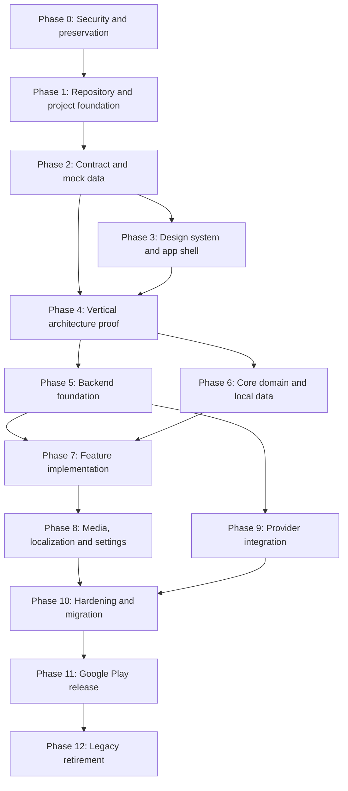

# GridView - Implementation Plan

## Document information

- Product: GridView
- Document type: Implementation Plan
- Version: 0.1
- Status: Draft
- Platform: Android
- Mobile technology: Flutter
- Backend technology: Cloudflare Workers with TypeScript
- Existing Android application ID: `com.sejuma.gridview`
- Related documents:
  - `GridView_PRD.md`
  - `GridView_App_Flow.md`
  - `GridView_UI_UX_Design.md`
  - `GridView_TRD.md`
  - `GridView_Backend_Scheme.md`
- Product phase: Complete reconstruction of the existing application
- Document date: 2026-07-17

---

## 1. Purpose

This document defines the implementation sequence for reconstructing GridView while preserving the existing Google Play application identity.

It converts the product, design and technical decisions into an actionable delivery plan.

The plan establishes:

- Work phases.
- Dependencies.
- Milestones.
- Deliverables.
- Technical validation gates.
- Testing expectations.
- Migration activities.
- Release preparation.
- Legacy-system retirement.
- Definition of completion.

The plan is intentionally structured around validated vertical slices rather than building all backend, frontend or design work independently and integrating them only at the end.

---

## 2. Delivery principles

### 2.1 Build the foundation once

The reconstruction must create a stable basis for future features. Temporary shortcuts that reproduce the fragility of the legacy project are not acceptable.

### 2.2 Validate architecture through working features

The architecture should be proven through a complete vertical slice before it is repeated across every feature.

### 2.3 Use mocks before committing to the production provider

Mobile and backend development should progress using stable mock contracts while provider rights and licensing are resolved.

### 2.4 Keep the app usable throughout synchronization

The local database is the immediate source for UI rendering. Network requests update the database without blocking the whole application.

### 2.5 Integrate continuously

Every phase must leave the repository in a buildable and testable state.

### 2.6 Preserve the published application identity

The implementation may replace almost all code, but it must preserve:

- `com.sejuma.gridview`.
- Compatible signing.
- Monotonically increasing Android version codes.
- Upgrade compatibility with the current published application.

### 2.7 Scope discipline

The first reconstructed release includes only:

- Home.
- Calendar.
- Grand Prix details.
- Circuits.
- Drivers.
- Teams.
- Drivers' standings.
- Constructors' standings.
- Basic settings.

New ideas must be recorded for later phases rather than inserted into the v1 reconstruction.

---

## 3. Overall delivery model

The project will be implemented through the following phases:



Some phases may overlap once their dependencies are satisfied, but release gates must remain sequential.

---

## 4. Milestones

| Milestone | Outcome |
|---|---|
| M0 | Legacy project secured and preserved |
| M1 | New repository structure and CI operational |
| M2 | GridView API v1 contract and fixtures approved |
| M3 | Design system and navigation shell operational |
| M4 | End-to-end vertical slice working offline |
| M5 | Cloudflare backend foundation deployed to staging |
| M6 | All core data stored and queried through Drift |
| M7 | All core product screens implemented with mock/staging data |
| M8 | Media, localization, settings and accessibility baseline completed |
| M9 | Approved provider integrated and production snapshots generated |
| M10 | Release candidate passes migration, performance and quality gates |
| M11 | Reconstructed app released through Google Play |
| M12 | Railway, Spring Boot and MySQL retired |

---

## 5. Phase 0 - Security repair and project preservation

## 5.1 Objective

Secure the legacy infrastructure and preserve a recoverable reference before reconstruction begins.

## 5.2 Tasks

### Security

- Rotate the exposed Railway/MySQL credentials.
- Review whether the exposed credentials are still active.
- Remove credentials from the current backend configuration.
- Rewrite or purge the secret from Git history.
- Confirm that Firebase service-account files are not tracked.
- Confirm that Android signing files are not tracked.
- Disable or protect public scraper-trigger endpoints.
- Review Railway logs for unusual access.
- Revoke unused API keys and tokens.

### Preservation

- Create a Git tag for the current production-compatible frontend.
- Create a Git tag for the final legacy backend state.
- Record the latest Google Play `versionCode` and `versionName`.
- Confirm the production application ID.
- Confirm Play App Signing status.
- Back up the upload key securely.
- Export any legacy data that may be useful as reference.
- Record the current production backend URL.
- Capture representative screenshots and functional behavior.
- Store legacy JSON examples for migration and regression testing.

### Documentation

- Add a prominent legacy/deprecation note to the backend README.
- Record known security incidents and remediation.
- Create the initial Architecture Decision Record directory.
- Add ADRs for retaining Flutter and replacing the backend.

## 5.3 Deliverables

- Rotated credentials.
- Sanitized active repositories.
- Legacy source tags.
- Signing and Play Console verification record.
- Legacy behavior inventory.
- Security remediation checklist.

## 5.4 Exit criteria

- No known live database credential remains in Git.
- Production signing access is confirmed.
- The current application can be rebuilt or referenced from a tag.
- Public write-trigger scraper routes are disabled or secured.
- Reconstruction can proceed without risking loss of the published-app identity.

---

## 6. Phase 1 - Repository and project foundation

## 6.1 Objective

Transform the existing frontend repository into the primary GridView monorepo and establish reproducible development workflows.

## 6.2 Repository tasks

- Rename the repository to `GridView` if desired.
- Keep the Flutter project at the repository root.
- Add:
  - `services/edge-api/`
  - `content/`
  - `docs/`
  - `docs/adr/`
  - `scripts/`
  - `.github/workflows/`
- Remove tracked build artifacts.
- Remove `android/app/.cxx/` from tracking.
- Replace narrow generated-file ignores with correct directory ignores.
- Add secret and environment-file patterns to `.gitignore`.
- Add editor configuration.
- Add contribution and branching guidance.
- Replace the minimal README with project setup instructions.

## 6.3 Flutter baseline tasks

- Pin the chosen Flutter stable SDK.
- Upgrade Android build configuration carefully.
- Preserve `com.sejuma.gridview`.
- Create development, staging and production flavors.
- Configure non-production application IDs.
- Establish environment configuration.
- Remove unused dependencies from the legacy application.
- Remove Unity Ads.
- Remove legacy Hive integration after migration planning is in place.
- Add strict analyzer configuration.
- Add code-generation commands.
- Add localization generation.
- Verify a clean development build.

## 6.4 Backend baseline tasks

- Initialize the TypeScript Worker project.
- Configure Wrangler environments.
- Create dev/staging/production Worker names.
- Configure KV namespaces.
- Configure R2 staging and production buckets.
- Add TypeScript strict mode.
- Add linting and formatting.
- Add local Worker tests.
- Add configuration validation.

## 6.5 CI tasks

Create pull-request workflows for:

- Flutter formatting.
- Flutter analysis.
- Flutter unit and widget tests.
- Development Android build.
- TypeScript type checking.
- Backend linting.
- Backend tests.
- Curated-content schema validation.
- Secret scanning.

## 6.6 Deliverables

- Buildable monorepo.
- Reproducible Flutter and Worker environments.
- Initial CI pipeline.
- Environment separation.
- Updated repository documentation.

## 6.7 Exit criteria

- A clean clone can build the Flutter dev application.
- A clean clone can run the Worker locally.
- Pull requests run automated quality checks.
- No generated build artifacts are tracked.
- Production application ID remains unchanged.

---

## 7. Phase 2 - API contract, domain vocabulary and mock data

## 7.1 Objective

Define the shared language between backend and mobile before implementing production integrations.

## 7.2 Domain tasks

Finalize the meaning and relationships of:

- Season.
- Driver.
- Constructor.
- Circuit.
- Grand Prix.
- Session.
- Driver season entry.
- Constructor season entry.
- Driver standing.
- Constructor standing.
- Race result.
- Race result entry.
- Media asset.
- Data freshness.

## 7.3 Identifier tasks

Define stable identifiers for:

- Drivers.
- Constructors.
- Circuits.
- Grand Prix events.

Create mapping fixtures for representative entities.

## 7.4 OpenAPI tasks

Create `gridview-api-v1.yaml` covering:

- Status.
- Bootstrap.
- Home.
- Season metadata.
- Calendar.
- Grand Prix details.
- Race results.
- Driver standings.
- Constructor standings.
- Driver list and detail.
- Constructor list and detail.
- Circuit list and detail.
- Content manifest.
- Error responses.

## 7.5 Fixture tasks

Create validated fixtures for:

- Standard weekend.
- Sprint weekend.
- Upcoming event.
- Current event.
- Completed event.
- Cancelled session.
- Postponed event.
- Fractional championship points.
- Missing optional profile fields.
- Mid-season driver change.
- Constructor rebranding.
- Provider failure.
- Stale snapshot.
- Empty first-launch state.

## 7.6 Curated content tasks

Create JSON schemas and initial content for:

- Driver registry.
- Constructor registry.
- Circuit registry.
- Season entries.
- Media metadata.
- Provider-ID mappings.
- Manual overrides.

## 7.7 Client contract tasks

- Implement API DTOs.
- Implement JSON generation.
- Implement mapping tests.
- Define internal failure categories.
- Define freshness metadata behavior.
- Confirm nullability and numeric types.
- Confirm UTC and timezone rules.

## 7.8 Deliverables

- Approved OpenAPI v1 document.
- Domain glossary.
- Stable-ID policy.
- Mock API responses.
- Curated-content schemas.
- Contract tests.

## 7.9 Exit criteria

- Flutter can parse all fixture responses.
- Backend can validate and serve all fixture responses.
- Unknown optional fields do not break parsing.
- Missing values remain null instead of false zero values.
- Sprint and standard weekends fit the same contract.
- The contract is sufficient for every v1 screen.

---

## 8. Phase 3 - Design system and application shell

## 8.1 Objective

Implement the reusable visual and navigation foundation without depending on production data.

## 8.2 Theme tasks

- Implement GridView color tokens.
- Implement dark theme.
- Decide whether light theme ships in v1.
- Integrate Sora and Inter if final licensing and package size are acceptable.
- Implement typography tokens.
- Implement spacing, radius and elevation tokens.
- Implement semantic colors.
- Implement safe team-color contrast helpers.

## 8.3 Component tasks

Implement and document:

- App bar.
- Bottom navigation.
- Section header.
- Segmented control.
- Status chip.
- Primary and secondary buttons.
- Hero card.
- Data card.
- Session row.
- Standings row.
- Driver row.
- Team row.
- Circuit row.
- Result row.
- Skeleton loader.
- Error state.
- Empty state.
- Offline/stale notice.
- Reserved advertisement container.
- Remote-image placeholder.

## 8.4 Navigation tasks

- Configure `go_router`.
- Implement the four primary branches:
  - Home.
  - Calendar.
  - Standings.
  - Explore.
- Implement Settings as a secondary route.
- Preserve branch state.
- Implement unknown-route handling.
- Add typed entity routes.
- Verify Android system back.
- Verify duplicate-route prevention.

## 8.5 Screen skeleton tasks

Create responsive screen structures for:

- Home.
- Calendar.
- Grand Prix detail.
- Standings.
- Explore.
- Driver detail.
- Team detail.
- Circuit detail.
- Settings.

Use fixture or placeholder data only.

## 8.6 Accessibility tasks

- Add semantics to shared components.
- Verify touch-target sizes.
- Verify text scaling.
- Verify focus and traversal behavior.
- Verify information is not color-only.
- Establish contrast testing.

## 8.7 Deliverables

- Reusable design-system components.
- App navigation shell.
- Screen skeletons.
- Dark-theme golden tests.
- Accessibility baseline.

## 8.8 Exit criteria

- All routes are navigable with mock data.
- Primary navigation preserves state.
- Comparable screens behave consistently.
- Core components render correctly at supported text sizes.
- No production data dependency exists.

---

## 9. Phase 4 - Vertical architecture proof

## 9.1 Objective

Prove the complete architecture using one small but representative user journey before multiplying the pattern.

## 9.2 Selected vertical slice

```text
Home next Grand Prix card
    -> Home controller
    -> repository
    -> mock GridView API
    -> API DTO validation
    -> Drift transaction
    -> local database stream
    -> UI render
    -> offline reopen
    -> Grand Prix detail route
    -> media placeholder/cache
```

## 9.3 Tasks

### Local database

- Initialize Drift.
- Export the initial schema.
- Add season, circuit, Grand Prix and session tables.
- Add synchronization metadata.
- Enable foreign keys.
- Add representative indexes.
- Add transaction tests.

### Data flow

- Implement API client.
- Implement request cancellation.
- Implement timeout policy.
- Implement error mapping.
- Implement repository contract.
- Implement mock remote data source.
- Implement local data source.
- Implement synchronization command.
- Implement stale-while-revalidate behavior.
- Deduplicate simultaneous requests.

### UI flow

- Read Home data from local database streams.
- Render initial loading only when no local data exists.
- Preserve cached data during refresh.
- Show a non-blocking failure state.
- Open Grand Prix detail with stable route parameters.
- Verify back navigation.

### Observability

- Add request IDs.
- Add structured logging.
- Add placeholder crash/performance hooks.
- Ensure logs do not expose response bodies or keys.

### Tests

- Unit mapping tests.
- Repository tests.
- Database tests.
- Widget loading/data/error tests.
- Integration test for online first launch.
- Integration test for offline second launch.

## 9.4 Architecture review

After the slice works, review:

- Folder structure.
- Provider granularity.
- DTO/domain/database mapping overhead.
- State-management approach.
- Database query design.
- Error model.
- Code-generation strategy.
- Test ergonomics.
- Performance.

Any major architecture correction must occur now, before every feature adopts the pattern.

## 9.5 Deliverables

- End-to-end working slice.
- Architecture review notes.
- Updated ADRs.
- Approved reusable feature template.

## 9.6 Exit criteria

- The app opens with local data while offline.
- Remote refresh updates the local database.
- The UI reacts to local data.
- Failed refresh does not erase content.
- Navigation works.
- Tests demonstrate the entire path.
- The team accepts the pattern for broader implementation.

---

## 10. Phase 5 - Backend foundation

## 10.1 Objective

Deploy a staging GridView API capable of serving normalized snapshots independently of the external production provider.

## 10.2 Worker tasks

- Implement routing.
- Implement response envelopes.
- Implement error envelopes.
- Implement request IDs.
- Implement parameter validation.
- Implement `ETag`.
- Implement `If-None-Match` and `304`.
- Implement cache headers.
- Implement HEAD behavior.
- Implement structured logging.
- Implement status endpoint.

## 10.3 KV tasks

- Implement snapshot storage abstraction.
- Implement versioned keys.
- Implement active-version pointer.
- Implement previous-version rollback.
- Implement synchronization metadata.
- Implement content-version metadata.
- Implement local/mock KV adapter for tests.

## 10.4 Synchronization tasks

- Implement scheduled handler.
- Implement due-job calculation.
- Implement mock provider adapter.
- Implement snapshot validation.
- Implement atomic publication.
- Implement previous-snapshot preservation.
- Implement quota-state model.
- Implement protected manual synchronization.

## 10.5 Derived snapshot tasks

Generate:

- Bootstrap.
- Home.
- Calendar.
- Grand Prix details.
- Driver list.
- Constructor list.
- Circuit list.
- Driver standings.
- Constructor standings.

## 10.6 Administration tasks

Provide controlled operations for:

- Full synchronization.
- Single-resource synchronization.
- Home rebuild.
- Rollback.
- Cache purge.
- Quota inspection.
- Last-sync inspection.

## 10.7 Testing tasks

- Route tests.
- `ETag` tests.
- Cache-header tests.
- Invalid-parameter tests.
- Atomic-publication tests.
- Rollback tests.
- Provider-failure tests.
- Quota-low tests.
- Protected-route tests.

## 10.8 Deliverables

- Staging Worker.
- Staging KV.
- Protected sync operation.
- Mock provider.
- OpenAPI-aligned endpoints.
- Automated backend tests.

## 10.9 Exit criteria

- Staging API serves the approved contract.
- Public requests do not call the provider.
- A failed sync preserves the active snapshot.
- Rollback works.
- Cache behavior is verified.
- Flutter can synchronize from staging.

---

## 11. Phase 6 - Complete local data and repository layer

## 11.1 Objective

Complete the offline-first data foundation for all v1 features.

## 11.2 Database schema tasks

Add and test:

- Seasons.
- Drivers.
- Constructors.
- Driver season entries.
- Constructor season entries.
- Circuits.
- Grand Prix events.
- Sessions.
- Driver standings.
- Constructor standings.
- Race results.
- Race result entries.
- Media metadata.
- Synchronization metadata.

## 11.3 Query tasks

Implement local queries for:

- Home snapshot composition.
- Ordered calendar.
- Next event.
- Latest completed event.
- Grand Prix detail.
- Current session.
- Drivers by season.
- Constructors by season.
- Circuits by season.
- Driver standings.
- Constructor standings.
- Driver detail with season entry.
- Team detail with line-up.
- Circuit detail with related event.
- Race result entries.

## 11.4 Repository tasks

Implement:

- Season repository.
- Calendar repository.
- Grand Prix repository.
- Driver repository.
- Constructor repository.
- Circuit repository.
- Standings repository.
- Home repository.
- Content/media repository.

## 11.5 Synchronization tasks

- Implement bootstrap synchronization.
- Implement resource-level freshness.
- Persist API `ETag` values.
- Process `304` responses.
- Use transactional collection replacement.
- Preserve local data after invalid remote responses.
- Prevent overlapping refreshes.
- Support manual refresh.
- Support application-foreground refresh.

## 11.6 Migration tasks

- Define schema version 1.
- Add migration test harness.
- Export schema snapshots.
- Document migration workflow.
- Add CI migration verification.

## 11.7 Deliverables

- Complete Drift schema.
- DAOs and repositories.
- Synchronization orchestration.
- Database migration tests.
- Offline query coverage.

## 11.8 Exit criteria

- Every v1 screen can be supplied from local data.
- All remote updates pass through repositories.
- No widget directly calls Dio or Drift.
- Database migrations are reproducible.
- Offline behavior works for all synchronized entities.

---

## 12. Phase 7 - Core feature implementation

## 12.1 Objective

Implement all product screens using staging/mock API data and the completed local data layer.

Features should be implemented in dependency-aware order.

---

## 12.2 Feature 1 - Calendar and Grand Prix

### Tasks

- Implement Calendar controller.
- Implement chronological event list.
- Highlight next event.
- Preserve scroll position.
- Support completed/current/upcoming/postponed/cancelled states.
- Implement Grand Prix hero.
- Implement session schedule.
- Support sprint and standard weekends.
- Implement local timezone presentation.
- Implement result availability state.
- Link to Circuit detail.
- Link result entries to Driver and Team detail.
- Add loading, partial, empty, error and offline states.
- Add unit, widget and integration tests.

### Completion gate

- Every fixture weekend format renders correctly.
- Session order comes from data rather than hardcoded assumptions.
- Calendar changes do not require a mobile release.

---

## 12.3 Feature 2 - Standings

### Tasks

- Implement Drivers/Constructors selector.
- Implement driver standings.
- Implement constructor standings.
- Support fractional points.
- Add leader emphasis.
- Show freshness metadata.
- Preserve selected table and scroll position.
- Navigate to Driver and Team details.
- Preserve cached standings on refresh failure.
- Add tests.

### Completion gate

- Standings are correctly ordered.
- Missing values do not appear as false zeroes.
- Background refresh leaves data visible.

---

## 12.4 Feature 3 - Drivers

### Tasks

- Implement driver list.
- Implement driver sorting.
- Decide whether search ships.
- Implement driver detail hero.
- Implement current team association.
- Implement standing summary.
- Implement optional statistics.
- Hide missing sections cleanly.
- Link to Team detail.
- Add image fallbacks.
- Add tests.

### Completion gate

- Current-season driver/team relationships are season-aware.
- Mid-season changes fit the data model.
- Driver detail remains useful without optional biography/media.

---

## 12.5 Feature 4 - Teams

### Tasks

- Implement constructor list.
- Implement team identity cards.
- Implement Team detail.
- Implement current line-up.
- Implement standing summary.
- Implement team facts.
- Apply team colors through contrast-safe helpers.
- Link to Driver details.
- Add tests.

### Completion gate

- Line-ups are season-aware.
- Team rebranding does not change stable identity.
- Missing media does not break layout.

---

## 12.6 Feature 5 - Circuits

### Tasks

- Implement circuit list.
- Implement Circuit detail.
- Implement layout-image area.
- Implement physical facts.
- Implement related Grand Prix.
- Support placeholders.
- Add tests.

### Completion gate

- Every current-season circuit is reachable.
- Circuit-to-event and event-to-circuit navigation avoid duplicate loops.
- Units are consistently formatted.

---

## 12.7 Feature 6 - Home

Home should be completed after its dependencies are stable.

### Tasks

- Implement season-context resolver.
- Implement pre-event state.
- Implement race-weekend state.
- Implement post-race state.
- Implement next Grand Prix hero.
- Implement session timing block.
- Implement championship leader cards.
- Implement latest result.
- Implement upcoming events.
- Implement freshness state.
- Link every card to its related detail.
- Add tests for temporal states.

### Completion gate

- The next relevant event is immediately understandable.
- Home is useful from cached data.
- Partial data produces a coherent screen.
- No non-essential request blocks startup.

---

## 13. Phase 8 - Media, localization, settings and platform services

## 13.1 Objective

Complete cross-cutting product capabilities after core screens are stable.

## 13.2 Media tasks

- Define approved media inventory.
- Collect rights and attribution metadata.
- Create media-processing script.
- Generate WebP variants.
- Upload staging media to R2.
- Publish media manifest.
- Implement remote image component.
- Implement disk cache policy.
- Implement placeholders.
- Profile list scrolling and memory.
- Verify no oversized image is used in small rows.

## 13.3 Localization tasks

- Establish English source ARB.
- Implement Spanish translations.
- Remove hardcoded user-facing text.
- Localize dates, times and numbers.
- Test text expansion.
- Test fallback language.
- Review Formula 1 proper-name behavior.

## 13.4 Settings tasks

Implement:

- Language.
- Theme.
- Time display if retained.
- Data source and acknowledgements.
- Privacy policy.
- App version.
- Feedback/contact.

## 13.5 Firebase tasks

- Decide whether existing Firebase projects are retained.
- Configure dev/staging/production Firebase.
- Integrate Crashlytics.
- Integrate Performance Monitoring.
- Add global error capture.
- Add selected non-fatal reports.
- Verify release-like symbol handling.

## 13.6 Advertising tasks

If ads remain:

- Retain Google Mobile Ads only.
- Remove Unity Ads.
- Configure test IDs outside production.
- Implement consent flow where required.
- Initialize after first frame.
- Reserve ad layout space.
- Verify ad failure does not affect content.
- Avoid interstitial ads in v1.

## 13.7 Accessibility tasks

- Run screen-reader review.
- Run text-scale review.
- Run contrast review.
- Verify semantic state announcements.
- Verify reduced-motion behavior where applicable.
- Fix clipping and small-touch targets.

## 13.8 Deliverables

- R2 media pipeline.
- English and Spanish UI.
- Settings screens.
- Crash/performance monitoring.
- Controlled advertising integration.
- Accessibility review report.

## 13.9 Exit criteria

- Every user-facing string is localized.
- Missing media always has a stable fallback.
- Crash reports arrive from staging/release-like builds.
- Ads never block startup.
- Settings persist correctly.
- Core screens pass the accessibility baseline.

---

## 14. Phase 9 - Production provider integration

## 14.1 Objective

Replace the mock backend provider with the legally approved production data source.

## 14.2 Legal gate

Before implementation is enabled in production:

- Confirm provider contract.
- Confirm ad-supported use.
- Confirm caching rights.
- Confirm redistribution terms.
- Confirm attribution.
- Confirm image/logo exclusions.
- Record approval in project documentation.

If approval is not obtained, select another provider rather than bypassing the requirement.

## 14.3 Adapter tasks

- Implement the production provider adapter.
- Add runtime response validation.
- Add provider-ID mappings.
- Normalize dates and time zones.
- Normalize standings and points.
- Normalize race/session states.
- Handle pagination if required.
- Capture quota headers.
- Implement provider-specific error mapping.
- Add response-size and timeout controls.

## 14.4 Data validation tasks

Validate against the current season:

- Event count.
- Round order.
- Session schedules.
- Sprint weekends.
- Active driver list.
- Team line-ups.
- Circuit mappings.
- Driver standings.
- Constructor standings.
- Completed race result.
- Future race without result.
- Mid-season substitutions if present.

## 14.5 Refresh-policy tasks

- Tune cron frequency.
- Define event-window behavior.
- Define post-session refresh window.
- Define result finalization.
- Reserve quota for manual recovery.
- Configure quota alerts.
- Verify provider calls remain independent of public request volume.

## 14.6 Production snapshot tasks

- Generate staging snapshot from provider.
- Compare with trusted public references manually.
- Resolve mappings and overrides.
- Generate production snapshot.
- Verify the public API.
- Verify Flutter synchronization.
- Preserve mock provider for automated tests.

## 14.7 Deliverables

- Production provider adapter.
- Provider mapping registry.
- Quota monitoring.
- Validated current-season snapshots.
- Legal approval record.

## 14.8 Exit criteria

- All v1 resources are supplied reliably.
- No provider DTO leaks into the public contract.
- Provider failure preserves the previous snapshot.
- Quota usage fits the selected plan.
- Rights and attribution requirements are documented and implemented.

---

## 15. Phase 10 - Hardening, legacy migration and release candidate

## 15.1 Objective

Prepare a production-quality update and verify installation over the existing GridView app.

## 15.2 Legacy preference migration

Preserve where valid:

- Language.
- Theme.
- Consent state when legally reusable.

Discard:

- Legacy Hive API cache.
- Legacy image paths.
- Legacy synchronization timestamps.
- Unsupported preferences.
- Provider-specific data.

### Migration tasks

- Detect legacy keys.
- Validate values.
- Map values to the new preference model.
- Mark migration complete.
- Make migration idempotent.
- Remove obsolete cache after successful startup.
- Test corrupted and unknown legacy data.

## 15.3 Upgrade test matrix

Test installation over the legacy version with:

- Empty legacy cache.
- Populated legacy cache.
- Dark theme.
- Alternate language.
- No network.
- Slow network.
- Corrupted cache.
- Older supported Android version.
- Current Android version.

Verify:

- Package identity.
- Signature.
- Preferences.
- Database initialization.
- First useful screen.
- No crash caused by old Hive files.
- Successful future launches.

## 15.4 Performance tasks

Measure in profile/release mode:

- Cold startup.
- Warm startup.
- Cached Home rendering.
- Database opening.
- Bootstrap synchronization.
- Calendar scrolling.
- Standings scrolling.
- Driver/team image lists.
- Detail-screen transitions.
- Memory after repeated navigation.
- App size.

Optimize only using measured bottlenecks.

## 15.5 Reliability tasks

- Test provider outage.
- Test KV outage behavior.
- Test stale snapshot.
- Test partial API data.
- Test image CDN failure.
- Test Firebase unavailable.
- Test advertisement unavailable.
- Test repeated manual refresh.
- Test application resume after long background period.

## 15.6 Security tasks

- Run secret scan.
- Review production configuration.
- Verify cleartext traffic disabled.
- Verify no provider keys in APK.
- Verify non-production endpoints are absent from production build.
- Review Android permissions.
- Review SDK data collection.
- Review Worker administrative routes.
- Review public rate limits.
- Review logs for sensitive content.

## 15.7 Store tasks

- Update privacy policy.
- Update Data Safety declaration.
- Update app description and screenshots.
- Review independent/non-official branding.
- Review asset licenses.
- Prepare release notes.
- Confirm target SDK.
- Confirm `versionCode`.
- Build signed AAB.
- Store obfuscation symbols if enabled.

## 15.8 Release-candidate gate

The release candidate must pass:

- Formatting and static analysis.
- Unit tests.
- Widget tests.
- Database tests.
- Backend tests.
- Contract tests.
- Integration tests.
- Golden tests selected for release.
- Migration tests.
- Production AAB build.
- Internal Play installation.
- Performance targets.
- Security review.
- Privacy review.
- Provider legal gate.

## 15.9 Deliverables

- Signed release candidate.
- Migration report.
- Performance report.
- Security/privacy checklist.
- Store-listing assets.
- Release notes.

## 15.10 Exit criteria

- The reconstructed build installs over the current public app.
- No release-blocking crash or ANR is known.
- Core journeys work online and offline.
- Production API and media are stable.
- Google Play requirements are satisfied.
- Rollback and emergency-response procedures exist.

---

## 16. Phase 11 - Google Play release

## 16.1 Objective

Publish GridView as an update to the existing application with controlled risk.

## 16.2 Release sequence

1. Upload to internal testing.
2. Install from Google Play on representative devices.
3. Validate Play-delivered signing and bundle splits.
4. Promote to closed testing.
5. Monitor Crashlytics, ANRs and backend health.
6. Start staged production rollout.
7. Expand rollout after each observation window.
8. Complete rollout.

Suggested rollout percentages:

- 5%.
- 20%.
- 50%.
- 100%.

Given the very small active-user population, the rollout may be accelerated after initial stability is confirmed, but the internal and closed-track checks should still be performed.

## 16.3 Monitoring during rollout

Monitor:

- Crash-free users.
- ANRs.
- Startup traces.
- API error rate.
- Snapshot age.
- Image failures.
- Migration failures.
- Provider quota.
- Ad initialization issues.
- Store reviews.

## 16.4 Stop conditions

Pause rollout for:

- Reproducible startup crash.
- Signing/update incompatibility.
- Widespread migration failure.
- Corrupted local database.
- API contract mismatch.
- Excessive ANR rate.
- Significant privacy/configuration error.
- Provider/legal issue.
- Severe data inaccuracy.

## 16.5 Corrective release

A rollback through Google Play requires a new build with a higher `versionCode`.

Prepare corrective-release capability by:

- Keeping the release branch.
- Keeping previous source tags.
- Maintaining server backward compatibility during the short rollout window.
- Using feature flags only for non-core modules.
- Preserving previous backend snapshot versions.

---

## 17. Phase 12 - Legacy retirement

## 17.1 Objective

Remove the old infrastructure shortly after the reconstructed release is confirmed stable.

Long-term support for users remaining on the old version is not required.

## 17.2 Tasks

- Confirm the reconstructed app is stable.
- Confirm no rollback to the old backend is expected.
- Export any final legacy records worth retaining.
- Shut down the Railway Spring Boot service.
- Close or delete the MySQL database.
- Revoke Railway and database credentials.
- Remove DNS references if any.
- Archive the backend repository.
- Preserve the legacy source tag.
- Update documentation to identify the edge API as the only active backend.
- Remove obsolete monitoring and billing.
- Confirm no recurring Railway charges remain.

## 17.3 Deliverables

- Legacy shutdown record.
- Archived backend repository.
- Revoked credentials.
- Updated architecture documentation.
- Final cost review.

## 17.4 Exit criteria

- The production app uses only the edge backend.
- Railway and MySQL are no longer running.
- No legacy secret remains active.
- The old backend incurs no continuing cost.

---

## 18. Workstream dependencies

| Workstream | Depends on |
|---|---|
| Design system | UI/UX document |
| App shell | App Flow and route decisions |
| API contract | PRD, App Flow and TRD |
| Mock fixtures | API contract |
| Drift schema | Domain model and API contract |
| Vertical slice | App shell, fixtures and initial Drift schema |
| Backend staging | API contract and mock provider |
| Feature screens | Design system, repositories and local queries |
| Production provider | Legal gate and provider adapter |
| Media publication | Rights metadata and R2 pipeline |
| Release candidate | All core features and production integration |
| Google Play release | Migration, signing, target SDK and QA |
| Legacy retirement | Confirmed reconstructed-release stability |

---

## 19. Recommended implementation order by pull request

The implementation should use small, reviewable pull requests.

Suggested sequence:

1. Security and Git cleanup.
2. Repository structure and README.
3. Flutter SDK and Android baseline.
4. Development/staging/production flavors.
5. CI quality gates.
6. Worker project baseline.
7. Domain glossary and OpenAPI v1.
8. JSON fixtures and validation.
9. Theme tokens and typography.
10. Shared design-system components.
11. `go_router` shell.
12. Initial Drift schema.
13. API client and typed errors.
14. Next-Grand-Prix vertical slice.
15. Worker snapshot storage and status.
16. Worker mock synchronization.
17. Calendar repository and UI.
18. Grand Prix detail.
19. Standings data and UI.
20. Driver data and UI.
21. Constructor data and UI.
22. Circuit data and UI.
23. Home composition.
24. Media pipeline and remote-image component.
25. English/Spanish localization.
26. Settings.
27. Firebase observability.
28. Advertising and consent.
29. Production provider adapter.
30. Legacy preference migration.
31. Performance and accessibility hardening.
32. Release candidate.
33. Play internal/closed release.
34. Production rollout.
35. Legacy backend shutdown.

Large pull requests containing an entire feature plus unrelated infrastructure should be avoided.

---

## 20. Branching and release strategy

## 20.1 Branches

Recommended model:

- `main`: always releasable or close to releasable.
- Short-lived feature branches.
- Optional temporary `release/*` branch for final release hardening.
- No long-lived frontend/backend development branches.

## 20.2 Pull requests

Every pull request should include:

- Clear purpose.
- Linked issue.
- Testing performed.
- Screenshots for visual changes.
- Migration impact.
- API-contract impact.
- Accessibility impact where relevant.
- Follow-up work explicitly listed.

## 20.3 Commit style

Use clear English commit messages.

Suggested categories:

```text
feat
fix
refactor
test
docs
build
ci
chore
```

## 20.4 Tags

Use tags for:

- Legacy reference.
- Release candidates.
- Production releases.

Example:

```text
legacy-mobile-v1.2.1
legacy-backend-final
v2.0.0-rc.1
v2.0.0
```

The final reconstructed application version does not have to be `2.0.0`, but a major-version increment is appropriate for a complete rebuild.

---

## 21. Issue and backlog structure

Recommended issue hierarchy:

```text
Epic
  -> Feature
      -> Technical task
      -> Test task
      -> Documentation task
```

Suggested epics:

- Security and legacy cleanup.
- Project foundation.
- API contract.
- Design system.
- Offline data.
- Backend snapshots.
- Calendar and Grand Prix.
- Standings.
- Drivers.
- Teams.
- Circuits.
- Home.
- Media and legal assets.
- Localization and settings.
- Observability and ads.
- Provider integration.
- Migration and release.

Each issue should include:

- Scope.
- Non-scope.
- Acceptance criteria.
- Dependencies.
- Test expectations.
- Documentation impact.

---

## 22. Definition of Ready

A task is ready for implementation when:

- Product behavior is understood.
- Required design exists or the task is intentionally non-visual.
- API/data requirements are known.
- Dependencies are available.
- Acceptance criteria are testable.
- Legal approval exists for any required external asset or provider use.
- Unknowns that could invalidate the work have been resolved.

---

## 23. Definition of Done

A task is complete when:

- Code is implemented.
- Code follows architecture and style rules.
- Tests cover relevant behavior.
- Static analysis passes.
- No new secret or sensitive data is introduced.
- Loading, error and empty states are handled.
- Accessibility is considered.
- Localization is included.
- Documentation is updated.
- CI passes.
- The feature works in a release-like build.
- The acceptance criteria are demonstrated.

A feature is not complete merely because its successful online path renders.

---

## 24. Release-blocking requirements

The reconstructed release must not ship if any of the following remain unresolved:

- Production provider rights are unclear.
- Provider key is present in the mobile app.
- Exposed legacy credentials remain active.
- App update signing is unverified.
- `com.sejuma.gridview` is changed.
- Migration over the current app fails.
- Cold startup is blocked by network or ads.
- Core screens cannot render cached data.
- Database migration tests fail.
- API contract is unstable.
- Crash reporting is not operational.
- Privacy/Data Safety declarations are inaccurate.
- Critical images or fonts lack permitted use.
- Target SDK does not meet Play requirements.
- A release-blocking crash or ANR is known.

---

## 25. Optional scope decisions to close early

These decisions should be made before their affected phase begins:

### Light theme

Recommendation:

- Retain theme architecture for light mode.
- Ship dark mode first if light mode threatens schedule or visual quality.

Decision deadline:

- Before Phase 3 component completion.

### Explore search

Recommendation:

- Include only if local search is simple and design space permits it.
- Do not add remote search.

Decision deadline:

- Before Phase 7 Explore implementation.

### Race results

Recommendation:

- Include race classification because it is part of the approved PRD.
- Do not expand into qualifying, lap-by-lap or telemetry in v1.

Decision deadline:

- Before final provider contract approval.

### Advertising

Recommendation:

- Retain only if revenue or continuity justifies SDK and consent complexity.
- Do not allow advertising to delay core reconstruction.

Decision deadline:

- Before Phase 8 production integration.

### Light historical season support

Recommendation:

- Keep season-aware architecture.
- Do not expose historical browsing in the first release.

Decision deadline:

- Already considered out of scope unless negligible.

---

## 26. Risk register

| Risk | Impact | Mitigation |
|---|---|---|
| Provider use is not legally approved | Release blocked | Complete contract using mocks; evaluate alternatives |
| External provider lacks required fields | Feature gaps | Curated content and provider-independent contract |
| Architecture becomes overcomplicated | Slow delivery | Validate one vertical slice and simplify early |
| Legacy signing is unavailable | Cannot update existing app | Verify in Phase 0 |
| Legacy local data crashes new app | Failed update | Idempotent migration and upgrade tests |
| Remote images hurt performance | Slow scrolling and memory pressure | Variants, caching and profiling |
| Team/driver mappings change mid-season | Incorrect content | Stable IDs and curated mappings |
| Flutter dependency changes | Build instability | Pin SDK and dependencies |
| Worker/KV eventual consistency causes mixed data | Inconsistent snapshots | Versioned atomic publication |
| Provider quota is exhausted | Stale data | Scheduled snapshots, alerts and quota reserve |
| Scope expands during rebuild | Delayed release | Enforce PRD out-of-scope list |
| Ads degrade startup | Poor UX | Deferred initialization or removal |
| Media rights are uncertain | Legal risk | Rights metadata as publication gate |
| Release target SDK changes | Store rejection | Verify during Phase 10 |
| Small user base reduces testing feedback | Hidden production issues | Internal/closed tests and automated coverage |

---

## 27. Documentation deliverables

The repository should contain:

```text
docs/
├── product/
│   ├── GridView_PRD.md
│   ├── GridView_App_Flow.md
│   └── GridView_UI_UX_Design.md
├── technical/
│   ├── GridView_TRD.md
│   ├── GridView_Backend_Scheme.md
│   └── GridView_Implementation_Plan.md
├── adr/
├── api/
│   └── gridview-api-v1.yaml
├── testing/
├── release/
└── operations/
```

Additional documents to create during implementation:

- Local development guide.
- Environment configuration guide.
- API contract.
- Database schema and migration guide.
- Data-provider mapping guide.
- Media-rights register.
- Analytics tracking plan.
- Test strategy.
- Release checklist.
- Incident runbook.
- Legacy shutdown record.

---

## 28. Suggested first implementation cycle

The first cycle should produce visible and technically meaningful progress.

### Cycle scope

- Secure repository.
- Establish new monorepo structure.
- Pin Flutter.
- Set up CI.
- Create OpenAPI draft.
- Create current-season mock fixtures.
- Implement dark theme tokens.
- Implement four-branch app shell.
- Create initial Drift schema.
- Complete the next-Grand-Prix vertical slice.

### Cycle outcome

At the end of the first cycle:

- The app launches into the new visual shell.
- Home can display a next Grand Prix from local Drift data.
- A mock API refresh can update it.
- The same content remains visible offline.
- Grand Prix detail navigation works.
- Automated tests cover the flow.
- The architecture is ready for review before broader implementation.

This cycle is more valuable than separately completing either the entire backend skeleton or every static screen.

---

## 29. Project completion criteria

The GridView reconstruction is complete when:

### Product

- All PRD v1 features are available.
- The app clearly supports casual and habitual followers.
- The current season can be followed from Home, Calendar and Standings.
- Drivers, Teams and Circuits are fully connected.

### Design

- The dark-first design system is consistent.
- Core screens match the approved UI/UX direction.
- Loading, empty, error and offline states are designed.
- Accessibility baseline is met.

### Mobile

- The app is offline-first after initial synchronization.
- All dynamic content is stored through Drift.
- Riverpod and `go_router` architecture is established.
- Remote images are optimized and cached.
- English and Spanish are supported.
- Production errors are observable.

### Backend

- Cloudflare Worker serves API v1.
- KV snapshots are versioned and rollback-capable.
- Provider calls happen only during controlled synchronization.
- R2 serves approved media.
- Provider quota and synchronization are monitored.

### Security and legal

- No production secret is in source control or the APK.
- Provider use is approved.
- Media rights are recorded.
- Privacy and Data Safety declarations are accurate.

### Release

- The app updates over the existing published version.
- The signed AAB is accepted by Google Play.
- Internal and closed tests pass.
- Production rollout completes.
- Railway, Spring Boot and MySQL are retired.

---

## 30. Implementation summary

The reconstruction should proceed in this order:

```text
Secure the legacy project
    -> establish the monorepo and CI
    -> define the API contract and fixtures
    -> build the design system and navigation shell
    -> prove one offline-first vertical slice
    -> complete the edge backend and local database
    -> implement core features
    -> add media, localization, settings and observability
    -> integrate the approved provider
    -> harden and test the update path
    -> publish through Google Play
    -> retire the legacy backend
```

The central implementation rule is:

> Do not build every layer independently. Complete and validate one vertical slice, then extend the proven pattern across the product.

This approach minimizes late architectural surprises and ensures that GridView becomes a coherent, maintainable application rather than another collection of disconnected components.
