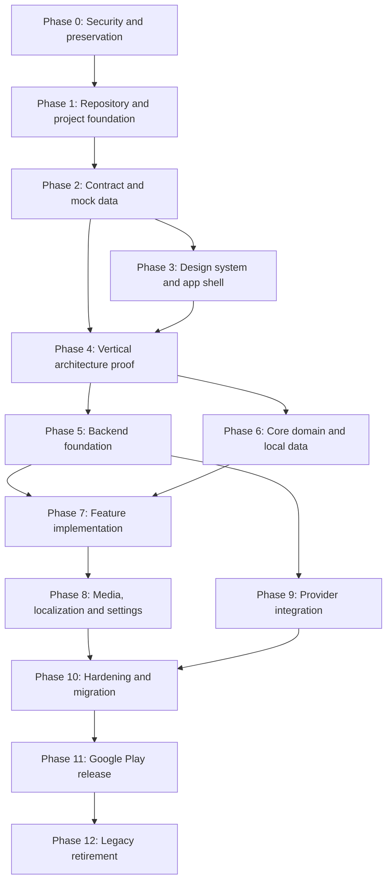

# GridView - Implementation Plan

## Document information

- Product: GridView
- Document type: Implementation Plan
- Version: 0.1
- Status: Draft
- Platform: Android
- Mobile technology: Flutter
- Backend technology: Cloudflare Workers with TypeScript
- Existing Android application ID: `com.sejuma.gridview`
- Related documents:
  - `GridView_PRD.md`
  - `GridView_App_Flow.md`
  - `GridView_UI_UX_Design.md`
  - `GridView_TRD.md`
  - `GridView_Backend_Scheme.md`
- Product phase: Complete reconstruction of the existing application
- Document date: 2026-07-17

---

## 1. Purpose

This document defines the implementation sequence for reconstructing GridView while preserving the existing Google Play application identity.

It converts the product, design and technical decisions into an actionable delivery plan.

The plan establishes:

- Work phases.
- Dependencies.
- Milestones.
- Deliverables.
- Technical validation gates.
- Testing expectations.
- Migration activities.
- Release preparation.
- Legacy-system retirement.
- Definition of completion.

The plan is intentionally structured around validated vertical slices rather than building all backend, frontend or design work independently and integrating them only at the end.

---

## 2. Delivery principles

### 2.1 Build the foundation once

The reconstruction must create a stable basis for future features. Temporary shortcuts that reproduce the fragility of the legacy project are not acceptable.

### 2.2 Validate architecture through working features

The architecture should be proven through a complete vertical slice before it is repeated across every feature.

### 2.3 Use mocks before committing to the production provider

Mobile and backend development should progress using stable mock contracts while provider rights and licensing are resolved.

### 2.4 Keep the app usable throughout synchronization

The local database is the immediate source for UI rendering. Network requests update the database without blocking the whole application.

### 2.5 Integrate continuously

Every phase must leave the repository in a buildable and testable state.

### 2.6 Preserve the published application identity

The implementation may replace almost all code, but it must preserve:

- `com.sejuma.gridview`.
- Compatible signing.
- Monotonically increasing Android version codes.
- Upgrade compatibility with the current published application.

### 2.7 Scope discipline

The first reconstructed release includes only:

- Home.
- Calendar.
- Grand Prix details.
- Circuits.
- Drivers.
- Teams.
- Drivers' standings.
- Constructors' standings.
- Basic settings.

New ideas must be recorded for later phases rather than inserted into the v1 reconstruction.

---

## 3. Overall delivery model

The project will be implemented through the following phases:


```mermaid
flowchart TD
    P0[Phase 0: Security and preservation]
    P1[Phase 1: Repository and project foundation]
    P2[Phase 2: Contract and mock data]
    P3[Phase 3: Design system and app shell]
    P4[Phase 4: Vertical architecture proof]
    P5[Phase 5: Backend foundation]
    P6[Phase 6: Core domain and local data]
    P7[Phase 7: Feature implementation]
    P8[Phase 8: Media, localization and settings]
    P9[Phase 9: Provider integration]
    P10[Phase 10: Hardening and migration]
    P11[Phase 11: Google Play release]
    P12[Phase 12: Legacy retirement]

    P0 --> P1
    P1 --> P2
    P2 --> P3
    P2 --> P4
    P3 --> P4
    P4 --> P5
    P4 --> P6
    P5 --> P7
    P6 --> P7
    P7 --> P8
    P5 --> P9
    P8 --> P10
    P9 --> P10
    P10 --> P11
    P11 --> P12
```

Some phases may overlap once their dependencies are satisfied, but release gates must remain sequential.

---

## 4. Milestones

| Milestone | Outcome |
|---|---|
| M0 | Legacy project secured and preserved |
| M1 | New repository structure and CI operational |
| M2 | GridView API v1 contract and fixtures approved |
| M3 | Design system and navigation shell operational |
| M4 | End-to-end vertical slice working offline |
| M5 | Cloudflare backend foundation deployed to staging |
| M6 | All core data stored and queried through Drift |
| M7 | All core product screens implemented with mock/staging data |
| M8 | Media, localization, settings and accessibility baseline completed |
| M9 | Adopted data sources integrated under their public licence, and production snapshots generated. **No provider approval is involved** — see [ADR 0019](../adr/0019-formula-one-provider-legal-gate.md) |
| M10 | Release candidate passes migration, performance and quality gates |
| M11 | Reconstructed app released through Google Play |
| M12 | Railway, Spring Boot and MySQL retired |

---

## 5. Phase 0 - Security repair and project preservation

## 5.1 Objective

Secure the legacy infrastructure and preserve a recoverable reference before reconstruction begins.

## 5.2 Tasks

### Security

- Rotate the exposed Railway/MySQL credentials.
- Review whether the exposed credentials are still active.
- Remove credentials from the current backend configuration.
- Rewrite or purge the secret from Git history.
- Confirm that Firebase service-account files are not tracked.
- Confirm that Android signing files are not tracked.
- Disable or protect public scraper-trigger endpoints.
- Review Railway logs for unusual access.
- Revoke unused API keys and tokens.

### Preservation

- Create a Git tag for the current production-compatible frontend.
- Create a Git tag for the final legacy backend state.
- Record the latest Google Play `versionCode` and `versionName`.
- Confirm the production application ID.
- Confirm Play App Signing status.
- Back up the upload key securely.
- Export any legacy data that may be useful as reference.
- Record the current production backend URL.
- Capture representative screenshots and functional behavior.
- Store legacy JSON examples for migration and regression testing.

### Documentation

- Add a prominent legacy/deprecation note to the backend README.
- Record known security incidents and remediation.
- Create the initial Architecture Decision Record directory.
- Add ADRs for retaining Flutter and replacing the backend.

## 5.3 Deliverables

- Rotated credentials.
- Sanitized active repositories.
- Legacy source tags.
- Signing and Play Console verification record.
- Legacy behavior inventory.
- Security remediation checklist.

## 5.4 Exit criteria

- No known live database credential remains in Git.
- Production signing access is confirmed.
- The current application can be rebuilt or referenced from a tag.
- Public write-trigger scraper routes are disabled or secured.
- Reconstruction can proceed without risking loss of the published-app identity.

---

## 6. Phase 1 - Repository and project foundation

## 6.1 Objective

Transform the existing frontend repository into the primary GridView monorepo and establish reproducible development workflows.

## 6.2 Repository tasks

- Rename the repository to `GridView` if desired.
- Keep the Flutter project at the repository root.
- Add:
  - `services/edge-api/`
  - `content/`
  - `docs/`
  - `docs/adr/`
  - `scripts/`
  - `.github/workflows/`
- Remove tracked build artifacts.
- Remove `android/app/.cxx/` from tracking.
- Replace narrow generated-file ignores with correct directory ignores.
- Add secret and environment-file patterns to `.gitignore`.
- Add editor configuration.
- Add contribution and branching guidance.
- Replace the minimal README with project setup instructions.

## 6.3 Flutter baseline tasks

- Pin the chosen Flutter stable SDK.
- Upgrade Android build configuration carefully.
- Preserve `com.sejuma.gridview`.
- Create development, staging and production flavors.
- Configure non-production application IDs.
- Establish environment configuration.
- Remove unused dependencies from the legacy application.
- Remove Unity Ads.
- Remove legacy Hive integration after migration planning is in place.
- Add strict analyzer configuration.
- Add code-generation commands.
- Add localization generation.
- Verify a clean development build.

## 6.4 Backend baseline tasks

- Initialize the TypeScript Worker project.
- Configure Wrangler environments.
- Create dev/staging/production Worker names.
- Configure KV namespaces.
- Configure R2 staging and production buckets.
- Add TypeScript strict mode.
- Add linting and formatting.
- Add local Worker tests.
- Add configuration validation.

## 6.5 CI tasks

Create pull-request workflows for:

- Flutter formatting.
- Flutter analysis.
- Flutter unit and widget tests.
- Development Android build.
- TypeScript type checking.
- Backend linting.
- Backend tests.
- Curated-content schema validation.
- Secret scanning.

## 6.6 Deliverables

- Buildable monorepo.
- Reproducible Flutter and Worker environments.
- Initial CI pipeline.
- Environment separation.
- Updated repository documentation.

## 6.7 Exit criteria

- A clean clone can build the Flutter dev application.
- A clean clone can run the Worker locally.
- Pull requests run automated quality checks.
- No generated build artifacts are tracked.
- Production application ID remains unchanged.

---

## 7. Phase 2 - API contract, domain vocabulary and mock data

## 7.1 Objective

Define the shared language between backend and mobile before implementing production integrations.

## 7.2 Domain tasks

Finalize the meaning and relationships of:

- Season.
- Driver.
- Constructor.
- Circuit.
- Grand Prix.
- Session.
- Driver season entry.
- Constructor season entry.
- Driver standing.
- Constructor standing.
- Race result.
- Race result entry.
- Media asset.
- Data freshness.

## 7.3 Identifier tasks

Define stable identifiers for:

- Drivers.
- Constructors.
- Circuits.
- Grand Prix events.

Create mapping fixtures for representative entities.

## 7.4 OpenAPI tasks

Create `gridview-api-v1.yaml` covering:

- Status.
- Bootstrap.
- Home.
- Season metadata.
- Calendar.
- Grand Prix details.
- Race results.
- Driver standings.
- Constructor standings.
- Driver list and detail.
- Constructor list and detail.
- Circuit list and detail.
- Content manifest.
- Error responses.

## 7.5 Fixture tasks

> **Status correction (Phase 8C-3).** These scenarios exist and are validated in
> the **Edge API contract corpus** under
> `services/edge-api/test/fixtures/api/v1/`, which remains the single source of
> truth for contract fixtures. They are **not** all present in the **app's**
> bundled development inventory, `assets/dev_fixtures/`, which currently contains
> only `home.json`, `grand-prix-2026-12.json` and `grand-prix-2026-13.json`.
> There is no bundled bootstrap or current-season response, so
> `FixtureGridViewApi` returns `notFound` for both and every season-scoped screen
> shows "Season unavailable".
>
> This is a **development-tooling gap**. It does not affect the production or
> staging HTTP path, production never falls back to fixtures, and it does not
> block Phase 8 engineering closure. The follow-up — deriving the app's bundled
> inventory from the already-validated contract corpus rather than authoring new
> data — belongs to the owner of this section and of §8.8. It is **not fixed**,
> and fixture mode is **not** removed.

Create validated fixtures for:

- Standard weekend.
- Sprint weekend.
- Upcoming event.
- Current event.
- Completed event.
- Cancelled session.
- Postponed event.
- Fractional championship points.
- Missing optional profile fields.
- Mid-season driver change.
- Constructor rebranding.
- Provider failure.
- Stale snapshot.
- Empty first-launch state.

## 7.6 Curated content tasks

Create JSON schemas and initial content for:

- Driver registry.
- Constructor registry.
- Circuit registry.
- Season entries.
- Media metadata.
- Provider-ID mappings.
- Manual overrides.

## 7.7 Client contract tasks

- Implement API DTOs.
- Implement JSON generation.
- Implement mapping tests.
- Define internal failure categories.
- Define freshness metadata behavior.
- Confirm nullability and numeric types.
- Confirm UTC and timezone rules.

## 7.8 Deliverables

- Approved OpenAPI v1 document.
- Domain glossary.
- Stable-ID policy.
- Mock API responses.
- Curated-content schemas.
- Contract tests.

## 7.9 Exit criteria

- Flutter can parse all fixture responses.
- Backend can validate and serve all fixture responses.
- Unknown optional fields do not break parsing.
- Missing values remain null instead of false zero values.
- Sprint and standard weekends fit the same contract.
- The contract is sufficient for every v1 screen.

---

## 8. Phase 3 - Design system and application shell

## 8.1 Objective

Implement the reusable visual and navigation foundation without depending on production data.

## 8.2 Theme tasks

- Implement GridView color tokens.
- Implement dark theme.
- Decide whether light theme ships in v1.
- Integrate Sora and Inter if final licensing and package size are acceptable.
- Implement typography tokens.
- Implement spacing, radius and elevation tokens.
- Implement semantic colors.
- Implement safe team-color contrast helpers.

## 8.3 Component tasks

Implement and document:

- App bar.
- Bottom navigation.
- Section header.
- Segmented control.
- Status chip.
- Primary and secondary buttons.
- Hero card.
- Data card.
- Session row.
- Standings row.
- Driver row.
- Team row.
- Circuit row.
- Result row.
- Skeleton loader.
- Error state.
- Empty state.
- Offline/stale notice.
- Reserved advertisement container.
- Remote-image placeholder.

## 8.4 Navigation tasks

- Configure `go_router`.
- Implement the four primary branches:
  - Home.
  - Calendar.
  - Standings.
  - Explore.
- Implement Settings as a secondary route.
- Preserve branch state.
- Implement unknown-route handling.
- Add typed entity routes.
- Verify Android system back.
- Verify duplicate-route prevention.

## 8.5 Screen skeleton tasks

Create responsive screen structures for:

- Home.
- Calendar.
- Grand Prix detail.
- Standings.
- Explore.
- Driver detail.
- Team detail.
- Circuit detail.
- Settings.

Use fixture or placeholder data only.

## 8.6 Accessibility tasks

- Add semantics to shared components.
- Verify touch-target sizes.
- Verify text scaling.
- Verify focus and traversal behavior.
- Verify information is not color-only.
- Establish contrast testing.

## 8.7 Deliverables

- Reusable design-system components.
- App navigation shell.
- Screen skeletons.
- Dark-theme golden tests.
- Accessibility baseline.

## 8.8 Exit criteria

- All routes are navigable with mock data. **Qualified since Phase 8C-3:** this
  was satisfied for the Phase 3 screen skeletons, and every route remains
  navigable and fully exercised in the widget/golden suites, which inject their
  own fixtures. It is **not** currently true of the **bundled**
  `assets/dev_fixtures/` inventory: that bundle carries only `home.json` and two
  Grand Prix rounds, with no bootstrap or current-season response, so a
  `DATA_SOURCE=fixture` build cannot resolve the current season and every
  season-scoped screen renders "Season unavailable". See §7.5 and
  [GridView_Synchronization.md](GridView_Synchronization.md) §8.1.
- Primary navigation preserves state.
- Comparable screens behave consistently.
- Core components render correctly at supported text sizes.
- No production data dependency exists.

---

## 9. Phase 4 - Vertical architecture proof

## 9.1 Objective

Prove the complete architecture using one small but representative user journey before multiplying the pattern.

## 9.2 Selected vertical slice

```text
Home next Grand Prix card
    -> Home controller
    -> repository
    -> mock GridView API
    -> API DTO validation
    -> Drift transaction
    -> local database stream
    -> UI render
    -> offline reopen
    -> Grand Prix detail route
    -> media placeholder/cache
```

## 9.3 Tasks

### Local database

- Initialize Drift.
- Export the initial schema.
- Add season, circuit, Grand Prix and session tables.
- Add synchronization metadata.
- Enable foreign keys.
- Add representative indexes.
- Add transaction tests.

### Data flow

- Implement API client.
- Implement request cancellation.
- Implement timeout policy.
- Implement error mapping.
- Implement repository contract.
- Implement mock remote data source.
- Implement local data source.
- Implement synchronization command.
- Implement stale-while-revalidate behavior.
- Deduplicate simultaneous requests.

### UI flow

- Read Home data from local database streams.
- Render initial loading only when no local data exists.
- Preserve cached data during refresh.
- Show a non-blocking failure state.
- Open Grand Prix detail with stable route parameters.
- Verify back navigation.

### Observability

- Add request IDs.
- Add structured logging.
- Add placeholder crash/performance hooks.
- Ensure logs do not expose response bodies or keys.

### Tests

- Unit mapping tests.
- Repository tests.
- Database tests.
- Widget loading/data/error tests.
- Integration test for online first launch.
- Integration test for offline second launch.

## 9.4 Architecture review

After the slice works, review:

- Folder structure.
- Provider granularity.
- DTO/domain/database mapping overhead.
- State-management approach.
- Database query design.
- Error model.
- Code-generation strategy.
- Test ergonomics.
- Performance.

Any major architecture correction must occur now, before every feature adopts the pattern.

## 9.5 Deliverables

- End-to-end working slice.
- Architecture review notes.
- Updated ADRs.
- Approved reusable feature template.

## 9.6 Exit criteria

- The app opens with local data while offline.
- Remote refresh updates the local database.
- The UI reacts to local data.
- Failed refresh does not erase content.
- Navigation works.
- Tests demonstrate the entire path.
- The team accepts the pattern for broader implementation.

---

## 10. Phase 5 - Backend foundation

## 10.1 Objective

Deploy a staging GridView API capable of serving normalized snapshots independently of the external production provider.

## 10.2 Worker tasks

- Implement routing.
- Implement response envelopes.
- Implement error envelopes.
- Implement request IDs.
- Implement parameter validation.
- Implement `ETag`.
- Implement `If-None-Match` and `304`.
- Implement cache headers.
- Implement HEAD behavior.
- Implement structured logging.
- Implement status endpoint.

## 10.3 KV tasks

- Implement snapshot storage abstraction.
- Implement versioned keys.
- Implement active-version pointer.
- Implement previous-version rollback.
- Implement synchronization metadata.
- Implement content-version metadata.
- Implement local/mock KV adapter for tests.

## 10.4 Synchronization tasks

- Implement scheduled handler.
- Implement due-job calculation.
- Implement mock provider adapter.
- Implement snapshot validation.
- Implement atomic publication.
- Implement previous-snapshot preservation.
- Implement quota-state model.
- Implement protected manual synchronization.

## 10.5 Derived snapshot tasks

Generate:

- Bootstrap.
- Home.
- Calendar.
- Grand Prix details.
- Driver list.
- Constructor list.
- Circuit list.
- Driver standings.
- Constructor standings.

## 10.6 Administration tasks

Provide controlled operations for:

- Full synchronization.
- Single-resource synchronization.
- Home rebuild.
- Rollback.
- Cache purge.
- Quota inspection.
- Last-sync inspection.

## 10.7 Testing tasks

- Route tests.
- `ETag` tests.
- Cache-header tests.
- Invalid-parameter tests.
- Atomic-publication tests.
- Rollback tests.
- Provider-failure tests.
- Quota-low tests.
- Protected-route tests.

## 10.8 Deliverables

- Staging Worker.
- Staging KV.
- Protected sync operation.
- Mock provider.
- OpenAPI-aligned endpoints.
- Automated backend tests.

## 10.9 Exit criteria

- Staging API serves the approved contract.
- Public requests do not call the provider.
- A failed sync preserves the active snapshot.
- Rollback works.
- Cache behavior is verified.
- Flutter can synchronize from staging.

---

## 11. Phase 6 - Complete local data and repository layer

## 11.1 Objective

Complete the offline-first data foundation for all v1 features.

## 11.2 Database schema tasks

Add and test:

- Seasons.
- Drivers.
- Constructors.
- Driver season entries.
- Constructor season entries.
- Circuits.
- Grand Prix events.
- Sessions.
- Driver standings.
- Constructor standings.
- Race results.
- Race result entries.
- Media metadata.
- Synchronization metadata.

## 11.3 Query tasks

Implement local queries for:

- Home snapshot composition.
- Ordered calendar.
- Next event.
- Latest completed event.
- Grand Prix detail.
- Current session.
- Drivers by season.
- Constructors by season.
- Circuits by season.
- Driver standings.
- Constructor standings.
- Driver detail with season entry.
- Team detail with line-up.
- Circuit detail with related event.
- Race result entries.

## 11.4 Repository tasks

Implement:

- Season repository.
- Calendar repository.
- Grand Prix repository.
- Driver repository.
- Constructor repository.
- Circuit repository.
- Standings repository.
- Home repository.
- Content/media repository.

## 11.5 Synchronization tasks

- Implement bootstrap synchronization.
- Implement resource-level freshness.
- Persist API `ETag` values.
- Process `304` responses.
- Use transactional collection replacement.
- Preserve local data after invalid remote responses.
- Prevent overlapping refreshes.
- Support manual refresh.
- Support application-foreground refresh.

## 11.6 Migration tasks

- Define schema version 1.
- Add migration test harness.
- Export schema snapshots.
- Document migration workflow.
- Add CI migration verification.

## 11.7 Deliverables

- Complete Drift schema.
- DAOs and repositories.
- Synchronization orchestration.
- Database migration tests.
- Offline query coverage.

## 11.8 Exit criteria

- Every v1 screen can be supplied from local data.
- All remote updates pass through repositories.
- No widget directly calls Dio or Drift.
- Database migrations are reproducible.
- Offline behavior works for all synchronized entities.

---

## 12. Phase 7 - Core feature implementation

## 12.1 Objective

Implement all product screens using staging/mock API data and the completed local data layer.

Features should be implemented in dependency-aware order.

---

## 12.2 Feature 1 - Calendar and Grand Prix

### Tasks

- Implement Calendar controller.
- Implement chronological event list.
- Highlight next event.
- Preserve scroll position.
- Support completed/current/upcoming/postponed/cancelled states.
- Implement Grand Prix hero.
- Implement session schedule.
- Support sprint and standard weekends.
- Implement local timezone presentation.
- Implement result availability state.
- Link to Circuit detail.
- Link result entries to Driver and Team detail.
- Add loading, partial, empty, error and offline states.
- Add unit, widget and integration tests.

### Completion gate

- Every fixture weekend format renders correctly.
- Session order comes from data rather than hardcoded assumptions.
- Calendar changes do not require a mobile release.

---

## 12.3 Feature 2 - Standings

### Tasks

- Implement Drivers/Constructors selector.
- Implement driver standings.
- Implement constructor standings.
- Support fractional points.
- Add leader emphasis.
- Show freshness metadata.
- Preserve selected table and scroll position.
- Navigate to Driver and Team details.
- Preserve cached standings on refresh failure.
- Add tests.

### Completion gate

- Standings are correctly ordered.
- Missing values do not appear as false zeroes.
- Background refresh leaves data visible.

---

## 12.4 Feature 3 - Drivers

### Tasks

- Implement driver list.
- Implement driver sorting.
- Decide whether search ships.
- Implement driver detail hero.
- Implement current team association.
- Implement standing summary.
- Implement optional statistics.
- Hide missing sections cleanly.
- Link to Team detail.
- Add image fallbacks.
- Add tests.

### Completion gate

- Current-season driver/team relationships are season-aware.
- Mid-season changes fit the data model.
- Driver detail remains useful without optional biography/media.

---

## 12.5 Feature 4 - Teams

### Tasks

- Implement constructor list.
- Implement team identity cards.
- Implement Team detail.
- Implement current line-up.
- Implement standing summary.
- Implement team facts.
- Apply team colors through contrast-safe helpers.
- Link to Driver details.
- Add tests.

### Completion gate

- Line-ups are season-aware.
- Team rebranding does not change stable identity.
- Missing media does not break layout.

---

## 12.6 Feature 5 - Circuits

### Tasks

- Implement circuit list.
- Implement Circuit detail.
- Implement layout-image area.
- Implement physical facts.
- Implement related Grand Prix.
- Support placeholders.
- Add tests.

### Completion gate

- Every current-season circuit is reachable.
- Circuit-to-event and event-to-circuit navigation avoid duplicate loops.
- Units are consistently formatted.

---

## 12.7 Feature 6 - Home

Home should be completed after its dependencies are stable.

### Tasks

- Implement season-context resolver.
- Implement pre-event state.
- Implement race-weekend state.
- Implement post-race state.
- Implement next Grand Prix hero.
- Implement session timing block.
- Implement championship leader cards.
- Implement latest result.
- Implement upcoming events.
- Implement freshness state.
- Link every card to its related detail.
- Add tests for temporal states.

### Completion gate

- The next relevant event is immediately understandable.
- Home is useful from cached data.
- Partial data produces a coherent screen.
- No non-essential request blocks startup.

---

## 13. Phase 8 - Media, localization, settings and platform services

## 13.1 Objective

Complete cross-cutting product capabilities after core screens are stable.

## 13.2 Media tasks

These split into engineering, which Phase 8 owns and has delivered, and external
operator actions, which Phase 8 cannot perform and does not own.

**Engineering — delivered in Phase 8B (merged, PR #1):**

- Create media-processing script. **Done** — deterministic, offline dry-run,
  no credentials required.
- Generate WebP variants. **Done** — never upscales, never overwrites an
  immutable object key.
- Implement remote image component. **Done** — `GvRemoteImage`, data-agnostic.
- Implement disk cache policy. **Done** — one shared bounded cache; image bytes
  never enter Drift.
- Implement placeholders. **Done** — one stable fallback for every no-image
  state, at the same size, with no broken-image icon and no URL on screen.
- Implement the media URL policy. **Done** — HTTPS only, non-empty host, no
  embedded credentials; the loopback relaxation must be injected explicitly and
  no environment selects it.
- Verify no oversized image is used in small rows. **Done** — a pure
  size-and-DPR variant selector decides before the widget is built.
- Profile list scrolling and memory. **Measured in Phase 8C-3 as provisional
  evidence**, on the authorized HONOR DNP-NX9 in profile mode: placeholder-only
  Explore scrolling (2 025 frames across six category/cache-state captures) and
  240 repeated-navigation round trips with no monotonic heap retention. Recorded
  in [GridView_Performance.md](GridView_Performance.md). The DNP-NX9 is
  **flagship-class, not representative mid-range**, and no media existed to
  scroll, so this is **not** representative-device acceptance: that is deferred
  to Phase 10 (§15) and the real-media measurements to the media-publication
  owner.

**External operator actions — reassigned, not completed:**

- Define approved media inventory. **Not done. External.**
- Collect rights and attribution metadata. **Not done. External.**
- Upload staging media to R2. **Not done. External** — no R2 bucket is
  provisioned in any environment.
- Publish media manifest. **Not done. External** — blocked by the two above.

These four are **prerequisites for media publication**, and they are tracked on
the operator checklist in their owning phase. They are **not blockers for Phase
8 engineering closure** — see §13.9.

## 13.3 Localization tasks

- Establish English source ARB.
- Implement Spanish translations.
- Remove hardcoded user-facing text.
- Localize dates, times and numbers.
- Test text expansion.
- Test fallback language.
- Review Formula 1 proper-name behavior.

## 13.4 Settings tasks

Implement:

- Language.
- Theme.
- Time display if retained.
- Data source and acknowledgements.
- Privacy policy.
- App version.
- Feedback/contact.

## 13.5 Firebase tasks

- Decide whether existing Firebase projects are retained.
- Configure dev/staging/production Firebase.
- Integrate Crashlytics.
- Integrate Performance Monitoring.
- Add global error capture.
- Add selected non-fatal reports.
- Verify release-like symbol handling.

## 13.6 Advertising tasks

**Closed: advertising is not retained for v1.** See
[ADR 0018](../adr/0018-advertising-not-retained-for-v1.md). The PRD (§17) says
advertising *may* remain, so it was optional rather than mandatory, and the §25
decision deadline — before Phase 8 production integration — passed with no
approval to integrate it.

No task in this subsection is performed in Phase 8. There is no advertising SDK,
no consent SDK, no ad unit, no ad request and no advertising runtime; the
forbidden-dependency gate in `android/app/build.gradle` fails the build if
`play-services-ads` is ever resolved. The production AdMob **application ID**
`meta-data` is preserved unchanged as published-app identity (§2.6) and is inert
without the SDK. `GvAdContainer` remains a development catalogue component only,
unreachable from every live production route. Dev and staging need no test ad
units, because there is no integration to point at one.

The original task list is retained below as the starting point a future
advertising phase would work from. It describes no Phase 8 work.

<details>
<summary>Superseded task list (a future advertising phase only)</summary>

- Retain Google Mobile Ads only.
- Remove Unity Ads.
- Configure test IDs outside production.
- Implement consent flow where required.
- Initialize after first frame.
- Reserve ad layout space.
- Verify ad failure does not affect content.
- Avoid interstitial ads in v1.

</details>

## 13.7 Accessibility tasks

The original task list is preserved above the outcome, because it is what the
phase set out to do. The classification below records what actually happened,
under the product-priority decision documented in
[GridView_Accessibility.md](GridView_Accessibility.md) §5.

- Run screen-reader review.
- Run text-scale review.
- Run contrast review.
- Verify semantic state announcements.
- Verify reduced-motion behavior where applicable.
- Fix clipping and small-touch targets.

**Outcome (Phase 8C-3):**

- Automated semantics baseline — **complete.** 111 passing tests in `test/a11y`,
  plus the component-level suites; reading order, semantic flags, identifier
  suppression, EN/ES.
- Touch-target verification — **complete**, including under 200% text.
- Text-scale matrix — **complete.** 200% across every width, locale and theme.
- Contrast verification — **complete**, for both themes, **with one confirmed
  exception**: the selected segmented-control label draws 14 px bold text on the
  decorative red at 3.55:1 in the dark palette, below the 4.5:1 small-text
  threshold. Pre-existing, unfixed and recorded in
  [GridView_Accessibility.md](GridView_Accessibility.md) §4.11.
- Reduced-motion automated verification — **complete**, with a non-vacuity guard.
- Populated TalkBack review — **executed once**, on the dedicated emulator
  against public staging data, with human-heard confirmation. Findings recorded
  in [GridView_Accessibility.md](GridView_Accessibility.md) §4 and **not fixed**.
- Further manual screen-reader polish — **deferred, non-blocking.** No longer a
  Phase 8 engineering exit criterion.
- Formal accessibility certification — **outside v1 scope.** None is claimed.

What the text-scale matrix establishes at 200% is bounded, and worth stating
precisely: no `RenderFlex` overflow exception, the important semantic labels
still present, the applicable 48 dp touch-target minimum, and a surviving
`Scrollable` where it asserts one.

It does **not** detect visual truncation. A `Text` that ellipsizes under
`maxLines` keeps its full semantics label and throws no exception, so the suite
stays green through it. Small-touch-target coverage is therefore established;
**absence of visible clipping at 200% is not**, and is neither claimed nor
disproven here.

## 13.8 Deliverables

- R2 media pipeline — **the pipeline is implemented**; the R2 bucket itself is
  not provisioned, which is an external operator action (§13.2).
- English and Spanish UI.
- Settings screens.
- Crash/performance monitoring.
- ~~Controlled advertising integration.~~ Not applicable: advertising is not
  retained for v1 ([ADR 0018](../adr/0018-advertising-not-retained-for-v1.md)).
- Accessibility review report — **delivered** as
  [GridView_Accessibility.md](GridView_Accessibility.md).
- Performance evidence report — **delivered** as
  [GridView_Performance.md](GridView_Performance.md), with its provisional,
  partial and blocked classifications intact.

## 13.9 Exit criteria

Each criterion is assessed honestly below. A deferred or blocked measurement is
never recorded as satisfied.

- **Every user-facing string is localized — satisfied.** ARB parity and the
  existing localization coverage hold, subject to the previously documented
  development-only catalogue copy, which is unreachable in production.
- **Missing media always has a stable fallback — satisfied.** Confirmed on a
  physical device during Phase 8C-3: every media slot rendered the same stable
  placeholder at the same size, with no broken-image icon, no error text, no URL
  on screen and no layout shift, including where a detail request was genuinely
  attempted and failed.

**Resolving the media-publication conflict.** Phase 8 engineering closure
requires the *implemented* media architecture: variant selection, the stable
fallback, the URL policy, the cache behaviour, and the operator publication
pipeline. All of these exist and are merged.

It does **not** require GridView to display a published image. No Formula 1
media rights have been approved and no R2 bucket is provisioned, so the approved
inventory is empty and nothing has been published. A placeholder is therefore
the **correct** rendered outcome of a working architecture, not evidence of a
missing one.

Rights approval, R2 provisioning, media upload and manifest publication are
**external operator actions**, reassigned to the operator checklist and their
owning phase (§13.2). They remain **visible prerequisites for media
publication** and are **not marked complete**. They do not block Phase 8
engineering closure, and no engineering work is waiting on them.
- **Crash reports arrive from a release-like build — satisfied by Phase 8C-2.**
  Console-confirmed from a production **debug** pass and from a **release-like**
  pass built from a signed, R8-minified, non-debuggable production release APK.
  No staging Firebase project exists, and none is claimed: dev and staging own no
  Firebase configuration at all.
- **Ads never block startup — not applicable, because advertising is not
  retained for v1** ([ADR 0018](../adr/0018-advertising-not-retained-for-v1.md)).
  Deliberately *not* recorded as satisfied: nothing would be proved by it. No
  advertising integration was built, so none was tested, and the risk this
  criterion guards against cannot occur because its cause does not exist.
- **Settings persist correctly — satisfied.**
- **Core screens meet the selected v1 accessibility baseline — satisfied under
  the revised product-priority decision.** The automated baseline is implemented
  and retained (111 `test/a11y` tests within a 1977-test suite); one populated
  manual TalkBack review was executed with human-heard confirmation; and the
  screen-reader polish issues it found are documented and deferred in
  [GridView_Accessibility.md](GridView_Accessibility.md) §4.
  **This does not state that every accessibility defect is fixed** — four
  confirmed duplicate-announcement findings, a focus-restoration gap, an
  unrepeated keyboard observation and one confirmed dark-theme contrast
  shortfall on the selected segmented-control label (§4.11) remain open and
  unfixed. Manual TalkBack validation is no longer a Phase 8 engineering exit
  criterion.

## 13.10 Performance tasks — outcome

Classified against the evidence in
[GridView_Performance.md](GridView_Performance.md). No partial or blocked
measurement is converted into a pass.

- P9 offstage-prefetch regression guard — **complete**, permanently automated.
- Placeholder / reference-device profiling — **complete as provisional
  evidence** on flagship hardware with no media present.
- Repeated-navigation memory — **complete without media pressure.**
- Representative mid-range acceptance — **deferred to Phase 10 (§15).** The
  TRD requirement is unchanged; only its acceptance owner and phase move.
- Real-media decode and cache-pressure measurements (P2, populated P4, P3 under
  pressure) — **deferred until approved media publication exists**, and owned by
  the media-publication owner.
- Startup and app-size measurements (P7 / P8, P10) — **remain Phase 10.**
- Thresholds — **still not invented.** No agreed threshold exists for janky
  frames, memory, disk-cache bytes, image-cache occupancy or rebuild counts.

## 13.11 Phase 8 status

**Phase 8C-3 engineering implementation and evidence collection are complete on
this branch, with explicitly documented deferrals.**

**Phase 8 engineering scope is ready for review and may be formally closed after
this branch is merged and post-merge CI is green.** Neither the merge nor the
post-merge CI run has happened yet, and neither is claimed here. Release
readiness remains separately blocked by the external Play and privacy
requirements tracked in
[`../release/play-store-baseline.md`](../release/play-store-baseline.md).

---

## 14. Phase 9 - Production provider integration

**Phase 9 has started. Phase 9A is complete and merged** (PR #7, merge commit
`b233da4`), **and its post-merge CI is green. Phase 9B implementation has
started**: Phase 9B-1 (2026-08-23) closed **G6** and **G10 / G-k**,
Phase 9B-2 (2026-08-23) closed **G7** and **G-f**, Phase 9B-3 (2026-08-25)
closed **G8 / G-e**, Phase 9B-4 (2026-08-26) closed **G4 / G-c**, and
Phase 9B-5 (2026-09-02) closed **deep normalized-contract validation** - the
[ADR 0023](../adr/0023-multi-source-provider-coordination.md) D14 activation
gate - together with the deferred **F3**, **F4** and **F5** referential
findings. Everything else remains open: **no adapter, event-aware scheduler,
reconciliation or provenance state machine, live provider mode, production cron
or provider request exists**, and no provider request has ever been made.
`PROVIDER_MODE` still admits exactly `mock | none` and production remains
`"none"`. See §14.0 and §14.0.5-§14.0.9.

## 14.0 Phase 9A status

Phase 9A ran as a research, evaluation and licensing-basis pass on 2026-08-19.
Its licence-compliance analysis, permitted-use mapping, mandatory obligations,
feasibility evidence, dual-source design, quota model, residual-risk record,
optional clarification templates and code audit are in
[GridView_Provider_Evaluation.md](GridView_Provider_Evaluation.md), and the
decision it produced is
[ADR 0019](../adr/0019-formula-one-provider-legal-gate.md) (**Accepted** as an
architecture and product-risk decision, not as provider approval).

| Item | Status |
|---|---|
| Provider evaluation and licensing basis | **Complete and merged** — PR #7, merge commit `b233da4`, post-merge CI green. Phase 9A was documentation-only. |
| Licensing basis | **Settled: the public CC BY-NC-SA 4.0 licence** published by OpenF1 and Jolpica. For uses inside its scope, the licence is the permission. |
| Individual provider permission | **Not required and not awaited.** Outreach is an optional courtesy channel only. **No inquiry has been sent**, and no waiting period exists. |
| Provider approval | **None.** No provider, and no Formula 1 entity, has approved, endorsed or reviewed GridView. None has been asked. |
| Formula 1 rights clearance | **Not obtained and not claimed.** A licensor can only license rights it holds, and CC BY-NC-SA 4.0 §2(b) does not license trademark rights. Accepted as residual risk. |
| Production provider adapter | **Not implemented and not activated.** Production remains `PROVIDER_MODE = "none"`; the mock provider is unchanged. |
| Phase 9B entry decisions (E5a, E5b, E6) | **Recorded 2026-08-21** in [ADR 0020](../adr/0020-provider-source-observation-and-reconciliation.md). Documentation and contract-description only — no adapter, no live request, no infrastructure change. |
| Phase 9B-1 (source-aware accounting and quota foundation) | **Implemented 2026-08-23** (§14.0.5). Typed provider identity, typed per-source request accounting and per-source locally modelled quota state. No adapter, no request, no deployment. |
| Phase 9B-2 (outbound hardening and per-provider rate limiter) | **Implemented 2026-08-23** (§14.0.6). One hardened outbound boundary and a Durable Object rate limiter with one identity per real source. No adapter, no request, nothing provisioned or deployed. |
| Phase 9B-3 (curated provider-identifier mapping registry) | **Implemented 2026-08-25** (§14.0.7). A season-qualified, exactly-matched, fail-closed identifier mapping registry with structural and semantic validation. **Dormant: no adapter consumes it.** No request, nothing deployed. |
| Phase 9B-4 (multi-source provider coordination) | **Implemented 2026-08-26** (§14.0.8). A typed, deterministic, fail-closed coordination seam over independent per-source resource ports, superseding the whole-season provider call. **Dormant: no adapter consumes it and no port is registered.** No request, nothing deployed. |
| Phase 9B-5 (deep normalized-contract validation) | **Implemented 2026-09-02** (§14.0.9). Field-by-field validation of every normalized value an adapter produces, at the coordination boundary. **Dormant: no adapter produces one.** No request, nothing deployed. |
| Phase 9B-6 (snapshot revision identity) | **Partially implemented 2026-09-03** (§14.0.10). The canonical revision input and `snapshotRevision` hashing exist and are tested; **they have no production caller and no published value changed.** The observation clock is **blocked** on a serialization guarantee Workers KV cannot provide. **Still open** — not closed by 9B-6b below. |
| Phase 9B-6b (season publication authority and rollback republication) | **Design decision recorded 2026-09-05** (§14.0.11), [ADR 0025](../adr/0025-season-publication-authority-and-rollback-republication.md). **Documentation only.** No Durable Object class exists, nothing is bound or provisioned, `snapshotRevision` still has no production caller, and Phase 9B-6/G-i remain open. Names the mechanism that closes the D1.10 block: authority over each season's active/previous pair moves to one per-season Durable Object's own storage; rollback becomes provider-independent republication through the same protocol. |
| Next action | **Implement the Phase 9B-6b Mechanism PR** (§14.0.11) — an inert Durable Object class, storage state machine and deterministic tests, no binding or caller — which is the dependency for closing Phase 9B-6's observation clock; independently, **continue Phase 9B implementation** (§14.3-§14.7) from the Jolpica adapter, which the coordination seam is still missing. The OpenF1 real-network path stays locked until a justified session-end bound is recorded with its official source and access date. |

### 14.0.1 Product constraints governing Phase 9

Recorded on 2026-08-19 and binding on every provider decision:

| # | Constraint |
|---|---|
| C1 | Provider budget for v1 is **EUR 0** |
| C2 | GridView remains **free** while it relies on non-commercial data sources |
| C3 | **No monetisation**: no advertising, in-app purchases, subscriptions, affiliate links or sponsorship |
| C4 | Any future monetisation requires written commercial permission from every affected provider, or migration to a provider whose licence permits it — and **reopens the provider decision** |
| C5 | **No live telemetry or live timing** is required |
| C6 | Freshness objective for **provisional** results, points and standings: **30-60 minutes after a session ends** |
| C7 | Freshness objective for **reconciled** data: **within 24 hours**, subject to provider availability |
| C8 | **Reliability and replaceability matter more** than in-session updates |

C3 restates an existing state rather than removing anything: advertising was
already absent from v1 per
[ADR 0018](../adr/0018-advertising-not-retained-for-v1.md). **It is not the
removal of an implemented advertising SDK, because none exists.** While these
sources are in use, C1–C3 are **licence compliance requirements**, not merely
product preferences: CC BY-NC-SA 4.0 permits use only for NonCommercial
purposes.

**C6 and C7 are GridView objectives, not provider guarantees.** Neither source
publishes an SLA, an uptime commitment or a correctness guarantee, and both
disclaim them. Reconciliation latency is currently **unmeasured**.

### 14.0.2 Adopted direction

A **dual-source, zero-cost, post-session model**, operating under the public
CC BY-NC-SA 4.0 licence each project publishes. **For uses inside that licence's
scope, the licence is the permission**; separate written permission from either
project is not required before Phase 9B.

| Source | Role | Status |
|---|---|---|
| **OpenF1** | *Provisional* post-session classification, points and championship state | **Specified but NOT unlocked** — see below |
| **Jolpica F1** | *Complete* season metadata, calendar, session times, participants, circuits, historical depth, and *reconciled* final results and standings | **Selected and unlocked** — no adapter exists yet, so nothing is running |

**The OpenF1 path is locked, and Phase 9B must not implement it as though it
were live.** OpenF1's data is free only outside a live window that closes **30
minutes after a session actually ends**. A delayed or red-flagged session moves
that boundary, so GridView may only fetch from a **justified upper bound** on
the actual end — and where no such bound exists, it **skips the session
entirely**.

**No usable bound is recorded today.** The one candidate that looked serviceable
— the scheduled start of the next session — is unsound, because delays cascade
and its timestamp passes while the earlier session is still running.
Consequently:

- the skip rule applies to **every** session;
- **Jolpica is the source for all data**, including session schedules — once its
  adapter is built. Neither adapter exists today, so nothing is running and
  production remains `PROVIDER_MODE = "none"`;
- **the C6 freshness objective is not met by any implemented mechanism**;
- **no GridView request reaches OpenF1 by any route** — there is no baseline
  poll, metadata refresh or health check outside the gated path.

Recording a bound, with an official source and access date, is the **first Phase
9B item** on this path. Until then the OpenF1 adapter may be built and tested
against fixtures, but it must not be enabled against the live service.

Sportmonks is **rejected for v1 on budget grounds only** (C1) and is the named
fallback if C1 or C3 is relaxed. API-Sports remains unselected and unverified.

The licence carries mandatory obligations — non-commercial operation,
attribution in the app and the public API documentation, ShareAlike on adapted
data and derived datasets, no additional downstream restrictions, and an
excluded-material list covering logos, photographs, audio, broadcasts, branding
and live telemetry. These are Phase 9B implementation requirements and release
requirements, not optional polish.

### 14.0.3 Phase 9B entry criteria

Phase 9B may begin once Phase 9A is merged and its post-merge CI is green,
provided all twelve criteria below hold. They are of **two kinds**, matching
[GridView_Provider_Evaluation.md](GridView_Provider_Evaluation.md) §15.2.1:

- **State checks** — something that must be true of the repository *now*. E1
  (unmonetised), E9 (no protected imports) and E10 (no approval claimed) are
  licence-critical states, and writing the requirement down does **not** satisfy
  them; the state itself must hold at the moment of entry.
- **Specification checks** — whether a requirement is decided and written down
  clearly enough to build against.

Neither kind requires Phase 9B's own output, which would be circular.
Verification that a requirement was *built* belongs to §14.8 and the release
sweep. Every one is objective and verifiable in
this repository. **No provider email, reply or waiting period is a
prerequisite.** Full detail in
[GridView_Provider_Evaluation.md](GridView_Provider_Evaluation.md) §15.2.

> **Status mirror, not the owner.** The authoritative status table is
> [GridView_Provider_Evaluation.md](GridView_Provider_Evaluation.md) §15.2; this
> one summarises it and must not diverge. As of **2026-08-21** — Phase 9A merged
> and its post-merge CI green, and the Phase 9B-0 entry-decision package
> recorded in [ADR 0020](../adr/0020-provider-source-observation-and-reconciliation.md) —
> **all twelve hold and Phase 9B implementation may begin.** Entry is not
> release approval (§14.0.4), and none of the §14.3-§14.7 work has started.

| # | Criterion | Status |
|---|---|---|
| E1 | The product remains **unmonetised** | **Holds** (state check, verified 2026-08-21) |
| E2 | **Both current licence notices are recorded**, with source URL and access date | **Holds** |
| E3 | **Attribution requirements are part of the implementation plan** — in the app and in the public API documentation | **Holds** (specified; built in §14.3, verified at §14.8) |
| E4 | The **separation of provider-derived data from application source code is specified** | **Holds** |
| E5 | The normalized data output has a **documented ShareAlike strategy** | **Holds** |
| E5a | **Both halves of the absent-recency-signal problem are decided** — the `sourceUpdatedAt` conflict ([GridView_Provider_Evaluation.md](GridView_Provider_Evaluation.md) §10.7.1) **and** the residual reconciled-ordering risk (§10.9.1), which share one root cause. Neither source publishes an update timestamp, yet the field is contract-required and is [ADR 0005](../adr/0005-snapshot-conflict-and-freshness.md)'s primary conflict key. | **Decided** — [ADR 0020](../adr/0020-provider-source-observation-and-reconciliation.md) §1 (publish the snapshot-level `snapshotObservedAt` under `sourceUpdatedAt`, bound to `snapshotRevision`; the resource-level `sourceObservedAt` stays internal and is never published, D1.12; field stays required, wire shape unchanged) and §2 (residual ordering risk accepted with monitoring) |
| E5b | The **five settling invariants are recorded and accepted as binding** ([GridView_Provider_Evaluation.md](GridView_Provider_Evaluation.md) §10.4.1). The design itself is a §14.3 task verified at exit, not an entry condition | **Satisfied at entry** — ADR 0020 §3. The design was additionally completed early (Evaluation §10.4.1); its **implementation** is still a §14.3 task verified at §14.8 |
| E6 | **Live-window and rate-limit restrictions are written down as binding requirements** | **Specified and binding** — ADR 0020 §5. **Not implemented**; the OpenF1 real-network path stays locked until a session-end bound is recorded |
| E7 | **Independent per-source disablement is specified** — the switches themselves are §14.3 work and are verified at exit | **Holds** |
| E8 | The **provider-neutrality requirement for the public DTO contract is recorded** | **Holds** |
| E9 | **No protected images, logos or branding are imported** | **Holds** (state check, verified 2026-08-21) |
| E10 | **No provider is described as officially approving GridView** | **Holds** (state check, verified 2026-08-21) |

ADR 0019 records the structural seams Phase 9B must add, the largest being that
the current single-call provider interface cannot express two sources with
different roles. **None of G1-G10 has been implemented, scaffolded or stubbed.**

### 14.0.4 Release remains separately gated

Phase 9B entry is not release approval. Public release remains subject to the
existing Play, privacy, media and production-environment gates, **plus a final
licence-compliance sweep** verifying the non-commercial, attribution,
ShareAlike, no-additional-restrictions and excluded-material obligations in the
shipped build and the published API documentation.

### 14.0.5 Phase 9B-1 status - source-aware accounting and quota foundation

Implemented on **2026-08-23**. Documentation-plus-code, entirely inside the
Worker: **no provider was contacted, no outbound request was made or made
possible, and no Cloudflare resource, binding, secret, migration or deployment
was added or changed.**

| Item | Status |
|---|---|
| **G6 - untyped provider call counting** | **Implemented.** The `as unknown as { callCount?: unknown }` cast is gone. `FormulaOneProvider` requires a typed `sourceId`, a `quotaPolicy` and a `requestMetrics()` method, so an adapter that omits telemetry fails to compile rather than silently reporting zero. `SyncResult` keeps its `providerCallCount` lifetime total and adds typed `providerRequests` detail: operation-scoped and lifetime attempt counts, split by canonical source and by synchronization job category, with successful, failed and rate-limited attempts counted separately. A failure and a rate-limit rejection both count as attempted requests. |
| **G10 / G-k - quota state with the wrong windows and no per-source identity** | **Implemented.** The fixed `dailyLimit` / `dailyRemaining` / `perMinuteLimit` / `perMinuteRemaining` shape is replaced by an extensible per-source window collection carrying usage, remaining capacity, window start and reset, a bounded burst-saturation streak, last provider success and failure, `Retry-After`, usage by job category and a derived warning level. OpenF1 is modelled as per-second and per-minute, Jolpica as per-second and per-hour, and **no adopted source is given a daily bucket**. The mock limits are marked test-only. Persistence is source-specific (`quota:provider:<sourceId>`) in both the memory and KV implementations. |
| **G4 and every other Phase 9B gap** | **Still open at the end of 9B-1.** G7 - the outbound HTTP helper and the per-provider rate limiter - was subsequently **closed by Phase 9B-2** (§14.0.6), G8 - the provider-ID mapping registry - by **Phase 9B-3** (§14.0.7), and G4 - the multi-source coordination mechanism - by **Phase 9B-4** (§14.0.8); everything below remains open. No provider adapter, no multi-source coordinator, no event-aware scheduling (G5), no production cron (G3/G-b), no reconciliation or provisional/reconciled state (G9), no `sourceObservedAt` / `snapshotRevision` / `snapshotObservedAt` persistence, no operator backlog, no attribution or ShareAlike publication surface. |
| Provider modes | **Unchanged.** `PROVIDER_MODE` admits exactly `mock` and `none`; production is `"none"`; the mock provider remains the only runtime provider. Canonical source identifiers are internal and never reach a v1 DTO, the OpenAPI schema or a generated fixture. |
| OpenF1 | **Still fail-closed and still incapable of a real request** ([ADR 0020](../adr/0020-provider-source-observation-and-reconciliation.md) §5). Recording its published window policy is quota modelling, not an unlock: no adapter exists and the session-end bound remains unrecorded. |

The warning semantics implemented are the ones in
[GridView_Backend_Scheme.md](GridView_Backend_Scheme.md) §16.1: sustained
windows escalate at 30%, 15% and 5% remaining; a single saturated burst window
is normal pacing pressure and does not follow that progression; repeated burst
saturation stays observable; a provider rate-limit rejection is critical and
preserves `Retry-After`; the most severe relevant condition wins. **This is
quota modelling and alert-state calculation, which is a different concern from
the per-provider rate limiter**; that limiter was delivered separately by Phase
9B-2 (§14.0.6).

### 14.0.6 Phase 9B-2 status - outbound hardening and the per-provider rate limiter

Implemented on **2026-08-23**. Code and configuration only, entirely inside the
Worker: **no provider was contacted, no request was made or made possible, and
no Cloudflare resource was provisioned or deployed.**

| Item | Status |
|---|---|
| **G7 - HTTP hardening and rate limiter** | **Implemented.** One hardened outbound boundary supplies every Backend Scheme §23.3 control, and the per-provider rate limiter is a Durable Object with one identity per canonical real source, reserving across every published window atomically. |
| **G-f - outbound hardening helper** | **Closed** with the same boundary, including Jolpica's mandatory identifying `User-Agent`. |
| **G4, G5, G9 and everything else** | **Still open at the end of 9B-2.** G8 - the provider-ID mapping registry - was subsequently **closed by Phase 9B-3** (§14.0.7), and G4 - the multi-source coordination mechanism - by **Phase 9B-4** (§14.0.8). No Jolpica or OpenF1 adapter, no event-aware scheduling, no production cron, no reconciliation or provenance persistence, no operator backlog, no attribution or ShareAlike publication surface. |
| Provider modes | **Unchanged.** `PROVIDER_MODE` admits exactly `mock` and `none`; staging is `mock`, production is `none`; the mock provider remains the only runtime provider and stays deterministic and network-free. |
| OpenF1 | **Still fail-closed** ([ADR 0020](../adr/0020-provider-source-observation-and-reconciliation.md) §5). Recording its origin and published windows is hardening and pacing, not an unlock: no adapter exists and the session-end bound is still unrecorded. |
| Cloudflare | The `PROVIDER_RATE_LIMITER` Durable Object binding and its SQLite `exports` entry are declared and validated locally. **Nothing is provisioned or deployed**, and while the namespace is unbound every reservation resolves to `unavailable`, so no request can be issued. |

**A reservation is not a provider attempt.** A local deferral or an unavailable
limiter means nothing left GridView, so it increments no request ledger, no
quota usage and no provider success or failure timestamp. A typed
`ProviderRequestNotAttemptedError` carries that case and deliberately does not
extend `ProviderError`, so the synchronization service cannot record a failed
attempt for a request that never happened. An upstream HTTP 429 remains an
attempted, rate-limited request.

A deferral carries a deterministic `retryAt` for a future scheduler. **Acting
on it is G5 event-aware scheduling, which remains open**, and nothing in this
phase reschedules anything.

The **10-second timeout** and **2 MiB response cap** are chosen engineering
constants, not published provider figures. They are tunable only while
preserving the bounded-wait and bounded-memory invariants they enforce.

### 14.0.7 Phase 9B-3 status - the curated provider-identifier mapping registry

Implemented on **2026-08-25**. Curated content, validation and Worker code
only: **no provider was contacted, no request was made or made possible, and
nothing was provisioned or deployed.**

| Item | Status |
|---|---|
| **G8 / G-e - provider-ID mapping registry (mechanism)** | **Implemented.** A curated, version-controlled, season-qualified registry keyed on season, source, entity kind, exact provider field and exact provider value together, with an immutable typed resolver that fails closed. Backend Scheme §8.1 is satisfied: unknown provider entities fail synchronization validation instead of minting an unstable ID. |
| Matching | **Exact typed equality only.** The value type is part of the key, so integer `1` is never string `"1"`. No case folding, trimming before lookup, punctuation removal, transliteration, whitespace collapsing, slug generation, substring matching, display-name fallback, fuzzy matching or cross-field fallback exists anywhere in resolution, and a test asserts the modules contain no such primitive. |
| Validation | **Structural and semantic.** JSON Schema 2020-12 owns one record (closed discriminated union of the six valid combinations, `additionalProperties: false`, bounded strings, no empty or whitespace-padded value, safe-integer bounds, public-ID grammar). Composite-key uniqueness, target existence in the matching curated registry and evidence coverage are enforced semantically, both inside the existing `npm run validate:content`. |
| Failure mode | **All-or-nothing.** One malformed, duplicated, ambiguous or dangling record means no index is exposed at all and every lookup answers `registry-invalid`. There is no valid subset and no last-entry-wins behaviour. |
| Operational signal | One bounded structured event (`failureCategory: provider_mapping_unresolved`) carrying source, season, entity kind, provider field and a closed failure reason, plus the bounded exact provider value in a single **internal** diagnostic field. No registry, mapping record, upstream payload or exception body is serialized. |
| Provider-ID containment | **Unchanged and extended.** Provider identifiers appear only in the curated mapping and evidence content, the internal diagnostic log field and narrowly scoped internal tests. Tests assert they reach no public v1 response, no OpenAPI text, no public fixture, no published snapshot and no Flutter-facing artifact. |
| Operator workflow | A **reviewed repository change**, documented in [GridView_Provider_Mapping_Guide.md](../operations/GridView_Provider_Mapping_Guide.md). There is no admin mutation endpoint and no KV, Durable Object or database store. |
| **G-l - mapping dataset coverage** | **Open, and deliberately so.** The mechanism is complete; the dataset is not. Only identifiers already recorded in Provider Evaluation §8 are curated, and five approved identities are explicitly acknowledged as unmapped because no canonical GridView identity exists for them. Every one blocks the affected resource. This is tracked separately from G8 so "the registry works" is never read as "the season is mapped". |
| **G4, G5, G9 and everything else** | **Still open at the end of 9B-3.** G4 - the multi-source coordination mechanism - was subsequently **closed by Phase 9B-4** (§14.0.8). No Jolpica or OpenF1 adapter, no event-aware scheduling (G5), no production cron (G3/G-b), no reconciliation or provisional/reconciled state (G9), no `sourceObservedAt` / `snapshotRevision` / `snapshotObservedAt` persistence, no operator backlog, no attribution or ShareAlike publication surface. |
| Provider modes | **Unchanged.** `PROVIDER_MODE` admits exactly `mock` and `none`; staging is `mock`, production is `none`. |
| OpenF1 | **Still fail-closed** ([ADR 0020](../adr/0020-provider-source-observation-and-reconciliation.md) §5). Recording its field names and a driver number is curation, not an unlock. |

**The registry is dormant.** No adapter consumes it, and a test asserts that no
runtime module outside `src/providers/mappings/` imports it. The mock provider
emits GridView-owned identities and therefore neither needs nor may have a
mapping: `mock` is not a member of the mapping-source union at all.

**Coverage is bounded by recorded evidence.** Only identifiers already recorded
in [GridView_Provider_Evaluation.md](GridView_Provider_Evaluation.md) §8 are
seeded; nothing was fetched, scraped, inferred from a display name or recalled
from memory. Two of the four §8.5 constructor-name disagreements -
`Cadillac` and `Racing Bulls` - have **no canonical GridView
constructor identity** (the curated registry holds six constructors against the
eleven on the recorded grid), so they are left unmapped with a written reason
rather than having an ID minted for them. No OpenF1 `circuit_key` value is
recorded anywhere, so no OpenF1 circuit mapping could be seeded. **This does not
establish live-provider coverage**, and nothing here authorizes production
synchronization or public release.

### 14.0.8 Phase 9B-4 status - multi-source provider coordination

Implemented on **2026-08-26**. Worker code, tests and documentation only: **no
provider was contacted, no request was made or made possible, and nothing was
provisioned or deployed.**

| Item | Status |
|---|---|
| **G4 / G-c - the provider interface cannot express two sources** | **Implemented as a mechanism.** The whole-season `fetchSeasonSource(season, jobs)` assumption is superseded by a typed multi-source coordination seam in `services/edge-api/src/providers/coordination/`. Provider Evaluation §10.10 is satisfied: the adapters are independent ports and reconciliation lives above them. |
| Adapter independence | **Structural.** A port is asked for one resource and answers with one typed outcome. It receives the source identity, the resource identity and the caller's cancellation signal and nothing else - not the plan, not another source's outcome, not the selection. A test asserts the request shape carries no additional field. |
| Request granularity | **Per resource, per source.** A closed discriminated union of resource identities carrying season, and round or session scope only where the resource genuinely has one. The job category used for accounting is **derived** from the resource kind by a total function, never supplied by the caller, and **no resource kind maps to `home-rebuild`** - a derived document can never become a provider request. |
| Source role and capability | **Owned above the adapters and closed.** Jolpica is `reconciled` over every coordinated resource; OpenF1 is `provisional` over the documented post-session result and championship resources only, with **no** telemetry, live-timing, media, baseline-metadata refresh or health-check exception. A request outside a source's capability is skipped with a bounded typed reason **before** the adapter is called, so it can never reserve capacity or reach transport. |
| OpenF1 | **Still fail-closed** ([ADR 0020](../adr/0020-provider-source-observation-and-reconciliation.md) §5, D5.1-D5.8). Eligibility is an already-decided input the coordinator consumes, never a bound it calculates, and **no bound is recorded** - the production policy constant is `null`. Absence, `null`, a bare number, a wrong discriminant, a non-integer, a non-positive or absurd value and an extra property all mean **locked**. A locked source performs no reservation, no transport and no attempted-request accounting. |
| Outcome taxonomy | **Closed, and structurally honest.** Not-attempted (`source-locked`, `source-unavailable`, `resource-unsupported`, `rate-limit-deferred`, `limiter-unavailable`, `cancelled`), attempted failure (`provider-rate-limited`, `provider-unavailable`, `invalid-payload`) and coordination failure (`malformed-outcome`, `adapter-error`, `mapping-unresolved`, `coordination-invariant`) are separate. The not-attempted variant **carries no attempt field at all**, so counting one as a provider request is unrepresentable rather than merely forbidden. |
| Selection | **Declared role only.** `reconciled` outranks `provisional`, and that table is the whole decision. Arrival time, completion order, plan order, payload size, truthiness, display-name similarity and string comparison are unreachable from selection. A provisional payload therefore never overwrites a reconciled one, is returned only for a resource the provisional source can serve, and is never relabelled as reconciled. |
| Partial success | **First class.** Each resource carries its own selection plus every considered source's contribution, including the diagnostic outcome of a source that lost. One failing resource never blocks an independent one, and a healthy subset never conceals an invariant violation. A duplicate logical resource **rejects the whole plan fail-closed** with nothing attempted - never last-entry-wins, never a silent canonicalization. |
| Accounting | **Exactly once per real request.** An outcome carries a bounded transport reference identifying the single physical request it came from; one response serving several derived resources is counted once while crediting every job category it served. A reference is scoped to its source - the adapters are independent and share no token namespace, so the same string from both is two requests, never deduplicated - and a same-source reference claiming a different attempt outcome fails the later contribution closed. A 429 stays an attempted, source-attributed, rate-limited request; a limiter deferral stays not attempted and may carry `retryAt` as **data only**. The one knowing under-report is an adapter that throws instead of answering: the coordinator will not invent an attempt it cannot observe, and the Durable Object reservation ledger - not these counts - is the pacing authority. |
| Mapping | **Contained, not duplicated.** Identity resolution stays with the adapter and the Phase 9B-3 registry raises its own bounded signal there. An unmapped identity or an invalid registry fails only the affected contribution; unrelated resources continue. No coordination module imports the registry, and nothing infers, normalizes or mints an identity. |
| Publication and last-known-good | **Unchanged.** The coordinator never publishes and never writes an active pointer. One guarded step assembles a complete season or withholds with a bounded gap reason, and calls the existing publisher **at most once** from one call site with no loop and no retry. A cancelled run, a rejected plan, an unavailable planned resource, a missing required resource and a calendar round without a race classification are distinct and none reaches the publisher. A publisher failure leaves the prior active release serving. |
| Cancellation and concurrency | **Bounded.** A pre-cancelled run performs no reservation, adapter call, accounting write or publication; a mid-run cancellation stops scheduling further operations and never publishes; a granted reservation is not returned. Cancellation and timeout stay distinguishable. Overlap is an explicit pool with a hard ceiling, defaulting to **sequential** exactly as the synchronization service is today. |
| Operational signals | Three bounded structured events - contribution, selection and run summary - carrying only operation, season, source id, source role, resource kind, job category, status, attempted flag, closed failure reason, validated `retryAt` / `retryAfter` and integer counts. No payload, snapshot body, entity identity, transport reference or raw exception is ever logged. |
| **G5** | **Open and untouched.** The coordinator executes an explicit plan and computes no event offset, session-relative window or recurring cadence; a test asserts the coordination modules contain none of the scheduler's primitives. |
| **G9** | **Open and untouched.** No source role, provenance value or reconciliation state is persisted and no schema changes. `sourceUpdatedAt` and the rest of the snapshot metadata are supplied by the caller, exactly as the mock provider supplies them today, because deriving them is G9. |
| **G1, G3, G-l** | **Open.** No live provider mode, no production cron, and the mapping dataset is still limited to identifiers already recorded in Provider Evaluation §8. |
| **Deep normalized-contract validation** | **Open, and an activation gate.** `SnapshotValidator` is structural - snapshot metadata, required top-level document shape and provider neutrality - not a deep per-field OpenAPI validator, and this is stated rather than implied. Per-field validation of normalized output is an **adapter** responsibility, and a real Jolpica or OpenF1 adapter must not be registered or enabled until its normalized outputs pass the authoritative contract validators. The gate belongs to G1 and to the adapter work; it is not evidence of reconciliation running today. The coordinator-owned **normalized outcome** does **not** close this gate: it guarantees that every value the coordinator uses after the port boundary - variant, attempt reference and outcome, reason, retry hints and payload - is a copy taken once and validated as taken, not that the payload satisfies the public contract field by field. The **session-to-event** identity relation does not close it either: it is one declared identity rule enforced in the referential preflight, not per-field validation. |
| Version transitions | **Recoverable.** Each version records the exact set of document names generation produced; completeness, rollback eligibility, cache invalidation and the operator purge all derive from that one set rather than from the collection documents, which are known to omit documents a version really carries. `setActiveVersion` is the commit point and `previous:{season}` is written after it, so a failed publication can no longer overwrite the one version a default rollback reaches, and an already-active rollback is a bounded no-op. Every expected storage or purge failure in rollback returns a bounded result naming the phase instead of a rejected promise. |
| Payload ownership | **Detached at the boundary.** An accepted candidate payload is the coordinator's own snapshot, taken the instant the adapter's outcome crosses the boundary and before the next operation in the plan can run. Resource binding is evaluated against that snapshot and the **same** snapshot is stored, selected, assembled and published, so an adapter that keeps and mutates the object it returned, refills one buffer for its next request, or answers through a stateful accessor cannot change a contribution after it was classified. Detachment uses the platform `structuredClone`, never a JSON round trip, which normalizes rather than copies. A payload that cannot be detached - a function-valued field, a hostile proxy - is contained as the existing bounded `malformed-outcome` contribution: never selected, never assembled, never published, with the real request still accounted exactly once and `attempted` still true, and a healthy fallback still able to carry the resource. This is an aliasing and time-of-check/time-of-use guarantee and is **not** deep normalized-contract validation. |
| Boundary closure | **Plan, attempt and payload.** The plan object is validated as untrusted input - closed root shape, bounded season, array `resources` read by index, all reflection contained - so a hostile plan becomes a bounded `plan-rejected` run with no port call, no accounting and no hostile detail logged. Resource identities are closed with the same `Reflect.ownKeys` / `Object.hasOwn` / `in` mechanism the outcome boundary uses, and a validated identity is executed as a frozen copy whose fields were read once. A transport attempt is shape-closed, and a `null` or array candidate payload is refused before resource validation. |
| Season entry identity | **Both keys checked.** A season entry has two independent stored identities - the row's own `id` and the participant it names. Only the second was checked for constructor entries, so two entries naming different teams under one entry `id` collided on the primary key. Both entry collections are now checked on both identities, and the documented multiplicities (split driver participation spans, historical circuit lap-record drivers) stay accepted. |
| Rejected publication | **Classified explicitly.** Only `older-source-updated-at` is a benign completed no-op; `contract-validation`, `active-version-incomplete` and every other integrity refusal fail the synchronization, preserve `lastCompletedAt`, mark no due job successful and log `sync.failed`. One exhaustive switch with no default, so a new reason is a compile error rather than a silent success. |
| Provider modes | **Unchanged.** `PROVIDER_MODE` admits exactly `mock` and `none`; staging is `mock`, production is `none`. |

**The seam is dormant.** No Jolpica adapter and no OpenF1 adapter exists, so no
port is registered anywhere in production wiring, and a test asserts that no
runtime module outside `src/providers/coordination/` consumes the coordinator.
`SynchronizationService` is deliberately **not** rewired: every branch would be
unreachable today, which is a dead duplicate orchestration path beside the
service that actually runs. The mock provider continues to serve the
synchronization path unchanged.

**G4 is closed as a coordination mechanism, not as working reconciliation.**
Real multi-source synchronization is not operating, has never run, and cannot
run until an adapter exists. Nothing here authorizes a live provider mode, a
cron trigger, a deployment, production synchronization or public release.

### 14.0.9 Phase 9B-5 status - deep normalized-contract validation

Implemented on **2026-09-02**. Worker code, tests and documentation only: **no
provider was contacted, no request was made or made possible, and nothing was
provisioned or deployed.**

| Item | Status |
|---|---|
| **Deep normalized-contract validation** | **Implemented as a mechanism**, closing the [ADR 0023](../adr/0023-multi-source-provider-coordination.md) D14 activation gate ([ADR 0024](../adr/0024-deep-normalized-contract-validation.md)). `src/contract/normalized/` validates a normalized value field by field - property presence, exact primitive types, integer versus general number, finiteness, identifier grammar, patterned strings, enumerated vocabularies, calendar dates, RFC 3339 date-times, absolute URLs, array elements and nested objects - over every entity the seven `CoordinatedPayload` variants carry. |
| Authority | **Explicit and ordered.** `src/contract/types.ts` decides which properties exist (declared without `?` means present; absent optionals are represented as `null`, and only `MediaVariants` declares optional keys). `docs/api/gridview-api-v1.yaml` decides what values may be; its `required` list is the floor a *consumer* may rely on, not a licence for a producer to omit a declared property. |
| Bounds | **Only what the contract states.** `position >= 1`, `round >= 1` and the season range are enforced. No sign or range rule is invented for wins, podiums, laps, lengths, corner counts, coordinates, aspect ratios, durations, gaps or points, and tests pin those as accepted. |
| Unknown properties | **Refused**, including symbol-keyed and non-enumerable own keys. This is the producing direction and does not contradict the tolerant-consumer posture: `snapshots/generator.ts` carries a normalized entity into `driver:{id}`, `constructor:{id}`, `circuit:{id}`, `grand-prix:{round}`, `grand-prix:{round}:results`, `standings:*`, `home` and `bootstrap` **verbatim**, so an undeclared property is provider-controlled content published unexamined. Both consumer-tolerance fixtures are asserted to be *refused* by the producing rule, so the distinction is pinned rather than assumed. `unknown` stays a valid enum member - it is what an adapter must normalize an unrecognised token into - while the raw token is refused. |
| Where it runs | **The coordination boundary**, after outcome normalization, after payload detachment and after resource binding, on the same detached snapshot that is later selected, assembled and published. Publication is deliberately not the place: a document reaching the publisher was already assembled from candidates. `RuntimeSnapshotValidator` keeps its existing structural scope **unchanged**. |
| Failure containment | The **existing** `invalid-payload` attempted-failure contribution. No new reason, status or vocabulary. The contribution stays `attempted`, the transport is counted exactly once, the payload is never selected, assembled or published, a healthy fallback still carries the resource, an independent resource is unaffected, and the run is not tainted. |
| Redaction | An issue says **where** and **what kind**, never **what**. Structural paths and closed codes only - no value, no key name, no upstream token - and the issue list reaches neither a contribution nor a log line. |
| Hostile input | **Contained, never executed.** Accessor-backed, inherited, prototype-polluted, symbol-keyed, non-enumerable, sparse-array and throwing-proxy cases all answer bounded issues rather than throwing. Every declared field is read once through the shared `ownDataProperty` discipline, which moved to `src/runtime/` so the contract validator and the coordination package can share one implementation without either depending on the other. |
| Bounds on traversal | A documented collection cap and issue cap, both an order of magnitude above real season data. **No depth limit is invented**: the schema is finite and non-recursive, so traversal depth is bounded statically. |
| **F3 / F4 / F5** | **Closed**, and recorded in the repository rather than only in PR #12's discussion. Three independent relations join the closed `seasonRelations` vocabulary: `event-identity` (`calendar[].id` must equal `{season}-{eventSlug}`), `constructor-entry-identity` (`{season}-{constructorId}`) and `driver-entry-span` (no inverted or overlapping participation spans, mirroring `CompetitorDao._validateDriverSpans()` including its null-bound semantics and its treatment of touching spans). No symmetric identity relation is added for a *driver* season entry, because §6.7 appends a start round for a split seat and its identity is therefore not a strict function of the payload. |
| Non-vacuity | The curated mock season and every production public fixture validate clean, so the gate is demonstrably openable rather than merely closed. |
| **G1, G3, G5, G9, G-l** | **Open.** No live provider mode, no production cron, no event-aware scheduling, no persisted provenance or provisional/reconciled state, and the mapping dataset is still limited to identifiers already recorded in Provider Evaluation §8. |
| Adapters | **Still none.** Registering a real adapter remains gated on that adapter's own normalization being correct for its source: this validator proves conformance of what an adapter produces, not that it maps its provider's semantics correctly, which is per-source work needing recorded evidence. |
| OpenF1 | **Still fail-closed** ([ADR 0020](../adr/0020-provider-source-observation-and-reconciliation.md) §5). No maximum-session-duration bound is recorded; the production policy constant is still `null`. |
| Attribution and ShareAlike | **Still outstanding.** No per-source attribution or ShareAlike publication surface exists. |
| Provider modes | **Unchanged.** `PROVIDER_MODE` admits exactly `mock` and `none`; staging is `mock`, production is `none`. |

**The seam stays dormant.** No class implements `ProviderResourcePort`, no
production module constructs `MultiSourceCoordinator`,
`SynchronizationService` remains on the single-provider path, the rate-limiter
namespace remains unbound, and the existing dormancy assertions are unchanged
and green. Nothing here authorizes a live provider mode, a cron trigger, a
deployment, production synchronization or public release.

### 14.0.10 Phase 9B-6 status - snapshot revision identity (partial)

Implemented on **2026-09-03**, as the **inert half** of the block. Worker code,
tests and documentation only: **no provider was contacted, no request was made
or made possible, nothing was provisioned or deployed, and no published value
changed.**

| Item | Status |
|---|---|
| **Canonical revision input** | **Implemented.** A schema-aware canonical representation of the normalized public `data` payload plus its `schemaVersion`, one declaration per snapshot key (`src/publication/canonical/snapshot-schemas.ts`). The input is **constructed**, never filtered out of a serialized envelope, so every [ADR 0020](../adr/0020-provider-source-observation-and-reconciliation.md) D1.7 exclusion holds by construction. |
| **`snapshotRevision`** | **Implemented.** SHA-256 over the UTF-8 bytes of a length-framed canonical text prefixed `gv-canon/1`, rendered `sha256:<64 hex digits>`. Both the canonical text and the digest encoding are pinned by test. |
| Determinism | UTF-8 byte key ordering with a dedicated comparator (JavaScript's default UTF-16 unit order is **not** the documented rule); ordered arrays kept in domain order; exactly two arrays declared unordered, each with its stable GridView identity; absent/null collapsed only for the properties the contract declares with `?`; RFC 3339 canonicalized to UTC without truncating fractional precision and without `Date`; one canonical numeric spelling. |
| `freshness` | **Excluded wholesale.** `HomeData.freshness` is the one place excluded metadata lives inside `data`, and all five of its properties are D1.7 exclusions - `sourceUpdatedAt` among them, which would otherwise be hashed into the input that derives it. |
| Precision | ADR 0020's "fixed precision" is implemented as **one canonical spelling**, not a digit cap. Truncating to the publication clock's millisecond would make two distinct instants share a revision, which contradicts the wire contract Phase 9B-5 deliberately accepts. Recorded as an ADR implementation note, not a change to the decision. |
| Hostile input | **Contained, never executed.** Every property is taken once through the shared `ownDataProperty` discipline, records are classified by prototype, and every reflective trap that can throw is contained. The public boundary never throws; a mismatch becomes a bounded marker carrying the *kind* of mismatch, never the value. |
| **`snapshotObservedAt` / D1.9-D1.11** | **Not implemented, and D1.10 is blocked.** The assignment `max(now, previous + 1 ms)` must be computed pre-commit from the pair the active pointer names, and two publications for one season can both reach `SnapshotPublisher` - the staging cron and the protected `/internal/admin/sync/full`, which forces every job and always publishes. Both read the same pointer, neither observes the other, and the commit order is decided by interleaving, so two changed revisions can receive equal or decreasing timestamps. Workers KV offers no compare-and-set and no cross-isolate lock ([ADR 0007](../adr/0007-versioned-kv-publication-active-pointer.md), [ADR 0010](../adr/0010-workers-kv-consistency-limitation.md)). Closing it needs a mechanism that genuinely serializes the assignment - an infrastructure decision Phase 9B-6 was not authorized to take. |
| **`meta.sourceUpdatedAt`** | **Unchanged.** Still the provider-supplied value; staging still publishes the mock provider's constant. No wire, DTO, OpenAPI, Drift or client change. |
| **G-i** | **Open, in both halves.** Neither the published-snapshot half nor the resource-level half is complete. |
| **G1, G3, G5, G9, G-l** | **Open.** No live provider mode, no production cron, no event-aware scheduling, no persisted provenance or provisional/reconciled state, and no curated identity work. |
| Adapters | **Still none.** |
| OpenF1 | **Still fail-closed.** No maximum-session-duration bound is recorded; the production policy constant is still `null`. |
| Provider modes | **Unchanged.** `PROVIDER_MODE` admits exactly `mock` and `none`; staging is `mock`, production is `none`. |

**The seam stays dormant.** No class implements `ProviderResourcePort`, no
production module constructs `MultiSourceCoordinator`,
`SynchronizationService` remains on the single-provider path, the rate-limiter
namespace remains unbound, and `src/publication/snapshot-revision.ts` has **no
production caller at all**. Nothing here authorizes a live provider mode, a cron
trigger, a deployment, production synchronization or public release.

### 14.0.11 Phase 9B-6b — Season publication authority and rollback republication (design)

Recorded on **2026-09-05**, as a **documentation-only design decision**:
[ADR 0025](../adr/0025-season-publication-authority-and-rollback-republication.md).
No Worker code, test, binding, provisioning or deployment is created by this
slice. **This does not close Phase 9B-6 or gap G-i** — see the row above.

| Item | Status |
|---|---|
| Decision | **Recorded.** One `SeasonPublicationSequencer` Durable Object per season (`idFromName(String(season))`) becomes the sole authority for `activeVersion`/`previousVersion`, per-key `snapshotRevision`/`snapshotObservedAt`, and publication-operation state, via a `prepare`/`finalize` protocol. The authoritative commit is one atomic Durable Object storage transaction with **no** external Workers KV pointer write inside it. |
| Why | A read-only design-safety pass, folded into ADR 0025's Context, found that layering a state machine on top of the existing two Workers KV pointer writes cannot prove either safety property a correct design needs (no two write-sequences in flight per season; no earlier write landing after a later commit) — Workers KV documents last-write-wins with no cross-instance ordering guarantee and no conditional write. Moving authority to Durable Object storage, which is documented as strongly consistent, closes both, backed by a documented shutdown guarantee that a request still touching a Durable Object's own storage is stopped and errors rather than allowed to land later. |
| Rollback | **Model 1 authorized.** Rollback becomes republication of historical public data as a new immutable version, provider-independent, with per-key timestamps compared against the currently active revision and committed through the same `prepare`/`finalize` protocol — never a direct pointer flip. No public activation-epoch field. |
| `snapshotRevision` / D1.9-D1.11 | **Unchanged.** Still no production caller ([ADR 0020](../adr/0020-provider-source-observation-and-reconciliation.md)). ADR 0025 names the mechanism that will let D1.10's assignment be computed safely; it does not implement it. |
| Provider state | **Unchanged.** `PROVIDER_MODE` still admits exactly `mock`/`none`; `recordedProvisionalSessionEndBound` is still `null`; no provider was contacted. |
| Cloudflare resources | **None provisioned or activated.** No Durable Object class, binding, migration or deployment exists from this slice. |

**Separated future work**, each requiring its own explicit authorization
before starting:

1. **Mechanism PR** — an inert `SeasonPublicationSequencer` class, its
   storage state machine, a port/client interface and deterministic tests.
   No production caller. No binding, no provisioning.
2. **Integration PR** — two-phase snapshot construction wired into the
   publisher and rollback paths, and public-router authority-lookup wiring,
   with the sequencer authority mode **disabled by default**. No staging
   activation.
3. **Staging provisioning and cutover** — the Durable Object export/binding
   declared through this repository's supported `exports` mechanism (the
   pattern `ProviderRateLimiter` already uses, not the legacy
   `[[migrations]]` block, which conflicts with it); explicit deployment
   authorization; the one-time pointer-state import; the authority-mode
   switch; bounded smoke tests.
4. **Production activation** — a separate future decision, blocked behind
   every Phase 9B exit gate and production-readiness requirement, exactly
   like every other Phase 9B production step above.

## 14.1 Objective

Replace the mock backend provider with production data sources used in
compliance with their published public licence.

**Not "legally cleared".** GridView holds no Formula 1 competition-data or
trademark clearance and does not claim any. It relies on each project's
published CC BY-NC-SA 4.0 licence, whose limits are recorded in
[GridView_Provider_Evaluation.md](GridView_Provider_Evaluation.md) §7.3.4 and
whose residual risk is accepted in §14.

## 14.2 Licence-compliance gate

> This section was previously the **legal gate** and was written around obtaining
> approval from a commercial provider. Under
> [ADR 0019](../adr/0019-formula-one-provider-legal-gate.md) it is a
> **compliance gate**: the permission is the public licence each source
> publishes, and what must be established is that GridView's use stays inside it.
> **No provider reply, approval or waiting period is required or awaited**, and
> none has been sought. The one case that does require contacting a provider is
> monetisation, which must reopen the decision **before** implementation.

Before implementation is enabled in production, verify each of the following.
Every item is checkable inside this repository against
[GridView_Provider_Evaluation.md](GridView_Provider_Evaluation.md); none depends
on a third party responding.

- **Record the licence each source publishes**, with its source URL and access
  date. For OpenF1 and Jolpica that is CC BY-NC-SA 4.0 (Evaluation §7.1, §7.2).
- **Confirm the intended use is inside the licence.** For v1 that use is free
  and unmonetised (C1-C3), following
  [ADR 0018](../adr/0018-advertising-not-retained-for-v1.md), which satisfies
  the NonCommercial term. Separately establish that any future monetisation
  would leave that scope and must reopen the provider decision first. The
  original wording of this line ("Confirm ad-supported use") predates ADR 0018
  and the zero-monetisation constraint, and is reinterpreted rather than
  deleted.
- **Verify caching and retention are inside the grant** — Evaluation §7.5
  acts 2, 3 and 7.
- **Verify redistribution through GridView's own public API is inside the
  grant** — Evaluation §7.5 acts 8-10, classified as Sharing and potentially
  adapting licensed database material.
- **Verify attribution is implemented**, in both the application and the public
  API documentation, per source, including the modification notice and the
  unofficial-status notice — Evaluation §7.6.2.
- **Verify the ShareAlike strategy is documented and honoured** for adapted
  data, the normalized database material and any publicly redistributed derived
  dataset — Evaluation §7.6.3.
- **Verify no additional downstream restrictions** are imposed by GridView's own
  terms or API documentation, keeping operational rate limiting visibly distinct
  from the data licence — Evaluation §7.6.4.
- **Verify the excluded-material list is respected** — no logos, photographs,
  audio, broadcasts, protected artwork, official branding or live telemetry, and
  no claim of official status — Evaluation §7.6.5.
- **Verify provider-imposed operational limits are honoured** — OpenF1's live
  window and Jolpica's rate limits and mandatory `User-Agent`.
- **Record the compliance decision in project documentation**, as ADR 0019 and
  the evaluation do. **What is recorded is a licence-compliance decision, not a
  provider approval and not legal clearance.**

If a use cannot be shown to sit inside the licence, change the use or select
another source rather than bypassing the requirement.

## 14.3 Adapter tasks

> **Two adapters, not one, and one of them is locked. Neither exists yet.**
> Build a **Jolpica** adapter (selected and unlocked) and an **OpenF1** adapter
> (selected but locked, §14.0.2) behind a coordinator, since the single-call provider interface cannot
> express two sources with different roles. The OpenF1 adapter may be built and
> tested against fixtures but **must not contact the live service** until an end
> bound is recorded.

- ~~Specify the post-reconciliation cadence and settling predicate.~~
  **Already specified** in
  [GridView_Provider_Evaluation.md](GridView_Provider_Evaluation.md) §10.4.1
  under [ADR 0020](../adr/0020-provider-source-observation-and-reconciliation.md)
  §3-§4: the five invariants are binding, and the state machine, the bounded
  cadence and the fixed-budget slow sweep resolve the I3/I4 tension. The Phase
  9B task is now to **implement it as specified** and record the implementation
  against I1-I5 individually, verified at exit (§14.8).
- ~~Implement the reconciliation coordinator.~~ **Done in Phase 9B-4**
  (§14.0.8, [ADR 0023](../adr/0023-multi-source-provider-coordination.md)) as a
  **dormant coordination mechanism**: independent per-source ports, typed
  per-resource requests and outcomes, source role and capability policy above
  the adapters, deterministic role-based selection, exact accounting and a
  guarded at-most-once bridge to the unchanged publisher. Real reconciliation
  additionally needs both adapters and **G9**.
- Implement the **Jolpica** adapter against the coordination port.
- Implement the **OpenF1** adapter, fixture-tested only, behind the
  bound-or-skip gate.
- ~~Add runtime response validation.~~ **Done in Phase 9B-5** (§14.0.9,
  [ADR 0024](../adr/0024-deep-normalized-contract-validation.md)): an
  authoritative per-field validator for every entity a coordinated payload
  carries, enforced at the coordination boundary on the detached snapshot, with
  a closed unknown-property rule, bounded redacted issues and hostile-value
  containment. A real adapter is still responsible for **normalizing** its own
  source correctly; this is what **verifies** the result.
- ~~Add the **curated provider-ID mapping registry** — mandatory, because 4 of 11
  constructor names differ between the two sources
  ([GridView_Provider_Evaluation.md](GridView_Provider_Evaluation.md) §8.5).~~
  **Done in Phase 9B-3** (§14.0.7,
  [ADR 0022](../adr/0022-curated-provider-identifier-mappings.md)): season-qualified,
  exactly matched, fail-closed, structurally and semantically validated. It is
  **dormant** until an adapter consumes it, and it seeds only identifiers already
  recorded in §8.
- Add the **curated maximum-session-duration bound** that unlocks the OpenF1
  path, with an official source and access date. **Until this exists every
  provisional fetch is skipped.**
- Normalize dates and time zones.
- Normalize standings and points.
- Normalize race/session states, including deriving sprint from OpenF1
  `session_name` because `session_type` conflates it with race.
- Handle pagination — Jolpica defaults to 30 and caps at 100. The 31-driver
  season result is silently truncated without an explicit `limit`; the 23-race
  calendar is not, but passing `limit` explicitly on season-scoped queries costs
  nothing and survives a calendar growing past 30.
- ~~Capture quota headers.~~ **Neither source publishes any**
  (Evaluation §8.6); model quota locally per source instead.
- ~~Add an **explicit per-provider rate limiter**.~~ **Done in Phase 9B-2**
  ([ADR 0021](../adr/0021-hardened-provider-boundary-and-durable-object-rate-limiter.md)):
  a Durable Object with one identity per real source performing exact
  sliding-window reservations across every published window. Nothing is paced
  yet, because no adapter exists.
- Implement provider-specific error mapping.
- ~~Add response-size and timeout controls, a fixed-hostname outbound helper,
  and Jolpica's mandatory identifying `User-Agent`.~~ **Done in Phase 9B-2**:
  a 2 MiB streamed body cap, a 10-second whole-operation timeout, pinned
  origins and path prefixes, no followed redirects, JSON-only content types,
  no automatic retry, and the identifying `User-Agent` as a reviewed constant.
  Every future adapter must route through this boundary.
- **Implement the `sourceUpdatedAt` decision** (Evaluation §10.7.1,
  [ADR 0020](../adr/0020-provider-source-observation-and-reconciliation.md) §1).
  Neither source publishes an update timestamp, so the published value is
  `snapshotObservedAt` — the first observation of the currently published
  normalized **snapshot revision**, persisted with it in the publication
  transaction, assigned strictly monotonically per snapshot key, never advanced
  by an identical revision, and never GridView's fetch time. The per-resource
  `sourceObservedAt` is **internal** reconciliation state and is never published.
  Both are **coordinator/publication** state, not adapter state, because deriving
  them needs the previously stored revision.

## 14.4 Data validation tasks

Validate against the current season:

- Event count.
- Round order.
- Session schedules.
- Sprint weekends.
- Active driver list.
- Team line-ups.
- Circuit mappings.
- Driver standings.
- Constructor standings.
- Completed race result.
- Future race without result.
- Mid-season substitutions if present.

## 14.5 Refresh-policy tasks

The policy is specified in
[GridView_Provider_Evaluation.md](GridView_Provider_Evaluation.md) §10 and §11;
these are the implementation tasks.

- Add a **production cron trigger** — none exists today; only staging has one.
- Implement the **event-aware schedule**, replacing the fixed-interval
  scheduler. Not doing so would cost roughly 415 requests a day year-round
  against a modelled figure of about 356 a month — itself a lower bound for the
  Jolpica path until the §10.4.1 settling design is fixed.
- Implement the **bound-or-skip live-window guard** for OpenF1, anchored on the
  actual session end, with the detect-and-re-anchor backstop.
- Implement the **Jolpica start-anchored cadence** — +5/+9/+15/+24 hours from
  the scheduled session start, then daily — and the six-hourly calendar poll
  that both meets the §25 freshness target and drives every session trigger.
- Implement result finalization to the **specified** state machine
  ([GridView_Provider_Evaluation.md](GridView_Provider_Evaluation.md) §10.4.1),
  including the bounded cadence, the 14-day ceiling, the fixed-budget weekly
  post-settlement sweep and both operational events. Corroboration and the
  superseded-revision ledger **reduce** the chance of a stale read rolling data
  back; they do not prevent it. An older payload GridView never stored passes
  both while the record is unsettled (§10.9.1). The strategy chosen under
  **E5a** is *accept the residual risk with monitoring*
  ([ADR 0020](../adr/0020-provider-source-observation-and-reconciliation.md)
  §2), so build the mitigations and the monitoring, and **do not certify a
  guarantee that strategy does not deliver**.
- Reserve capacity for manual recovery and configure alerts on **locally
  modelled** counters, since neither source returns quota headers.
- Verify provider calls remain independent of public request volume.

## 14.6 Production snapshot tasks

- Generate staging snapshot from **Jolpica** — the only unlocked source.
- Compare with trusted public references manually.
- Resolve mappings and overrides.
- Generate production snapshot.
- Verify the public API.
- Verify Flutter synchronization.
- Preserve mock provider for automated tests.

## 14.7 Deliverables

- Jolpica adapter, plus a fixture-tested OpenF1 adapter behind its gate.
- Reconciliation coordinator with provenance and provisional/reconciled state.
- ~~Curated provider-ID mapping registry.~~ **Mechanism delivered in Phase
  9B-3** (§14.0.7,
  [ADR 0022](../adr/0022-curated-provider-identifier-mappings.md)), dormant
  until an adapter consumes it. **The mapping dataset remains incomplete and
  is still outstanding work under gap G-l**: eight exact mappings are curated
  and five approved identities are explicitly acknowledged as unmapped, so any
  identity outside that set still blocks its resource.
- Locally modelled quota monitoring (Phase 9B-1) and a per-provider rate
  limiter (Phase 9B-2, [ADR 0021](../adr/0021-hardened-provider-boundary-and-durable-object-rate-limiter.md)).
- Attribution surface in the app and in the public API documentation, held as
  per-source data rather than hard-coded strings.
- Documented ShareAlike strategy for the normalized output.
- Validated current-season snapshots.
- ~~Legal approval record.~~ **A licence-compliance record instead**
  ([ADR 0019](../adr/0019-formula-one-provider-legal-gate.md)). No provider
  approval exists or is sought.

## 14.8 Exit criteria

- All v1 resources are supplied reliably.
- No provider DTO leaks into the public contract.
- Provider failure preserves the previous snapshot.
- **Reconciled-write behaviour matches the strategy chosen under E5a, and the
  guarantee claimed is the one that strategy actually delivers.** If E5a accepts
  the residual risk (§10.9.1), the criterion is that the mitigations and the
  monitoring are in place and the residual rollback hole is documented — not
  that it cannot occur, which would be false. If E5a requires review for every
  reconciled overwrite, the criterion is that none reaches publication without
  it. A blanket "no stale or superseded payload can replace a newer one" was the
  withdrawn absolute assurance and must not reappear.
- Quota usage fits the published free limits, measured against locally modelled
  counters.
- **Licence obligations are implemented and verifiable** — non-commercial
  operation, per-source attribution in both surfaces, the ShareAlike strategy,
  no additional downstream restrictions, and the excluded-material list
  (Evaluation §7.6).
- **No GridView request reaches OpenF1 outside its gate**, and the gate is
  either unlocked by a recorded bound or skipping every session.
- `sourceUpdatedAt` carries `snapshotObservedAt` per
  [ADR 0020](../adr/0020-provider-source-observation-and-reconciliation.md) §1:
  bound to the snapshot revision, assigned strictly monotonically per snapshot
  key at millisecond precision, never advanced by an identical revision, never
  GridView's fetch time, and surviving a restart. A snapshot that changed only
  by a removal or a membership change is published rather than rejected. No
  surface describes it as the upstream modification time or claims provider
  ordering from it.
- The implementation **matches** the settling design in §10.4.1, satisfies all
  five invariants, and is recorded against I1-I5 individually.
- The reconciled-overwrite and staged-review events exist and respect the
  bounded, non-personal field discipline (ADR 0020 D2.7-D2.9).

---

## 15. Phase 10 - Hardening, legacy migration and release candidate

## 15.1 Objective

Prepare a production-quality update and verify installation over the existing GridView app.

## 15.2 Legacy preference migration

Preserve where valid:

- Language.
- Theme.
- Consent state when legally reusable.

Discard:

- Legacy Hive API cache.
- Legacy image paths.
- Legacy synchronization timestamps.
- Unsupported preferences.
- Provider-specific data.

### Migration tasks

- Detect legacy keys.
- Validate values.
- Map values to the new preference model.
- Mark migration complete.
- Make migration idempotent.
- Remove obsolete cache after successful startup.
- Test corrupted and unknown legacy data.

## 15.3 Upgrade test matrix

Test installation over the legacy version with:

- Empty legacy cache.
- Populated legacy cache.
- Dark theme.
- Alternate language.
- No network.
- Slow network.
- Corrupted cache.
- Older supported Android version.
- Current Android version.

Verify:

- Package identity.
- Signature.
- Preferences.
- Database initialization.
- First useful screen.
- No crash caused by old Hive files.
- Successful future launches.

## 15.4 Performance tasks

Measure in profile/release mode:

- Cold startup.
- Warm startup.
- Cached Home rendering.
- Database opening.
- Bootstrap synchronization.
- Calendar scrolling.
- Standings scrolling.
- Driver/team image lists.
- Detail-screen transitions.
- Memory after repeated navigation.
- App size.

Optimize only using measured bottlenecks.

## 15.5 Reliability tasks

- Test provider outage.
- Test KV outage behavior.
- Test stale snapshot.
- Test partial API data.
- Test image CDN failure.
- Test Firebase unavailable.
- Test advertisement unavailable.
- Test repeated manual refresh.
- Test application resume after long background period.

## 15.6 Security tasks

- Run secret scan.
- Review production configuration.
- Verify cleartext traffic disabled.
- Verify no provider keys in APK.
- Verify non-production endpoints are absent from production build.
- Review Android permissions.
- Review SDK data collection.
- Review Worker administrative routes.
- Review public rate limits.
- Review logs for sensitive content.

## 15.7 Store tasks

- Update privacy policy.
- Update Data Safety declaration.
- Update app description and screenshots.
- Review independent/non-official branding.
- Review asset licenses.
- Prepare release notes.
- Confirm target SDK.
- Confirm `versionCode`.
- Build signed AAB.
- Store obfuscation symbols if enabled.

## 15.8 Release-candidate gate

The release candidate must pass:

- Formatting and static analysis.
- Unit tests.
- Widget tests.
- Database tests.
- Backend tests.
- Contract tests.
- Integration tests.
- Golden tests selected for release.
- Migration tests.
- Production AAB build.
- Internal Play installation.
- Performance targets.
- Security review.
- Privacy review.
- Provider legal gate.

## 15.9 Deliverables

- Signed release candidate.
- Migration report.
- Performance report.
- Security/privacy checklist.
- Store-listing assets.
- Release notes.

## 15.10 Exit criteria

- The reconstructed build installs over the current public app.
- No release-blocking crash or ANR is known.
- Core journeys work online and offline.
- Production API and media are stable.
- Google Play requirements are satisfied.
- Rollback and emergency-response procedures exist.

---

## 16. Phase 11 - Google Play release

## 16.1 Objective

Publish GridView as an update to the existing application with controlled risk.

## 16.2 Release sequence

1. Upload to internal testing.
2. Install from Google Play on representative devices.
3. Validate Play-delivered signing and bundle splits.
4. Promote to closed testing.
5. Monitor Crashlytics, ANRs and backend health.
6. Start staged production rollout.
7. Expand rollout after each observation window.
8. Complete rollout.

Suggested rollout percentages:

- 5%.
- 20%.
- 50%.
- 100%.

Given the very small active-user population, the rollout may be accelerated after initial stability is confirmed, but the internal and closed-track checks should still be performed.

## 16.3 Monitoring during rollout

Monitor:

- Crash-free users.
- ANRs.
- Startup traces.
- API error rate.
- Snapshot age.
- Image failures.
- Migration failures.
- Provider quota.
- Ad initialization issues.
- Store reviews.

## 16.4 Stop conditions

Pause rollout for:

- Reproducible startup crash.
- Signing/update incompatibility.
- Widespread migration failure.
- Corrupted local database.
- API contract mismatch.
- Excessive ANR rate.
- Significant privacy/configuration error.
- Provider/legal issue.
- Severe data inaccuracy.

## 16.5 Corrective release

A rollback through Google Play requires a new build with a higher `versionCode`.

Prepare corrective-release capability by:

- Keeping the release branch.
- Keeping previous source tags.
- Maintaining server backward compatibility during the short rollout window.
- Using feature flags only for non-core modules.
- Preserving previous backend snapshot versions.

---

## 17. Phase 12 - Legacy retirement

## 17.1 Objective

Remove the old infrastructure shortly after the reconstructed release is confirmed stable.

Long-term support for users remaining on the old version is not required.

## 17.2 Tasks

- Confirm the reconstructed app is stable.
- Confirm no rollback to the old backend is expected.
- Export any final legacy records worth retaining.
- Shut down the Railway Spring Boot service.
- Close or delete the MySQL database.
- Revoke Railway and database credentials.
- Remove DNS references if any.
- Archive the backend repository.
- Preserve the legacy source tag.
- Update documentation to identify the edge API as the only active backend.
- Remove obsolete monitoring and billing.
- Confirm no recurring Railway charges remain.

## 17.3 Deliverables

- Legacy shutdown record.
- Archived backend repository.
- Revoked credentials.
- Updated architecture documentation.
- Final cost review.

## 17.4 Exit criteria

- The production app uses only the edge backend.
- Railway and MySQL are no longer running.
- No legacy secret remains active.
- The old backend incurs no continuing cost.

---

## 18. Workstream dependencies

| Workstream | Depends on |
|---|---|
| Design system | UI/UX document |
| App shell | App Flow and route decisions |
| API contract | PRD, App Flow and TRD |
| Mock fixtures | API contract |
| Drift schema | Domain model and API contract |
| Vertical slice | App shell, fixtures and initial Drift schema |
| Backend staging | API contract and mock provider |
| Feature screens | Design system, repositories and local queries |
| Production provider | Legal gate and provider adapter |
| Media publication | Rights metadata and R2 pipeline |
| Release candidate | All core features and production integration |
| Google Play release | Migration, signing, target SDK and QA |
| Legacy retirement | Confirmed reconstructed-release stability |

---

## 19. Recommended implementation order by pull request

The implementation should use small, reviewable pull requests.

Suggested sequence:

1. Security and Git cleanup.
2. Repository structure and README.
3. Flutter SDK and Android baseline.
4. Development/staging/production flavors.
5. CI quality gates.
6. Worker project baseline.
7. Domain glossary and OpenAPI v1.
8. JSON fixtures and validation.
9. Theme tokens and typography.
10. Shared design-system components.
11. `go_router` shell.
12. Initial Drift schema.
13. API client and typed errors.
14. Next-Grand-Prix vertical slice.
15. Worker snapshot storage and status.
16. Worker mock synchronization.
17. Calendar repository and UI.
18. Grand Prix detail.
19. Standings data and UI.
20. Driver data and UI.
21. Constructor data and UI.
22. Circuit data and UI.
23. Home composition.
24. Media pipeline and remote-image component.
25. English/Spanish localization.
26. Settings.
27. Firebase observability.
28. Advertising and consent.
29. Production data-source adapters — Jolpica selected and unlocked, OpenF1 selected but locked (§14.0.2). Neither is built.
30. Legacy preference migration.
31. Performance and accessibility hardening.
32. Release candidate.
33. Play internal/closed release.
34. Production rollout.
35. Legacy backend shutdown.

Large pull requests containing an entire feature plus unrelated infrastructure should be avoided.

---

## 20. Branching and release strategy

## 20.1 Branches

Recommended model:

- `main`: always releasable or close to releasable.
- Short-lived feature branches.
- Optional temporary `release/*` branch for final release hardening.
- No long-lived frontend/backend development branches.

## 20.2 Pull requests

Every pull request should include:

- Clear purpose.
- Linked issue.
- Testing performed.
- Screenshots for visual changes.
- Migration impact.
- API-contract impact.
- Accessibility impact where relevant.
- Follow-up work explicitly listed.

## 20.3 Commit style

Use clear English commit messages.

Suggested categories:

```text
feat
fix
refactor
test
docs
build
ci
chore
```

## 20.4 Tags

Use tags for:

- Legacy reference.
- Release candidates.
- Production releases.

Example:

```text
legacy-mobile-v1.2.1
legacy-backend-final
v2.0.0-rc.1
v2.0.0
```

The final reconstructed application version does not have to be `2.0.0`, but a major-version increment is appropriate for a complete rebuild.

---

## 21. Issue and backlog structure

Recommended issue hierarchy:

```text
Epic
  -> Feature
      -> Technical task
      -> Test task
      -> Documentation task
```

Suggested epics:

- Security and legacy cleanup.
- Project foundation.
- API contract.
- Design system.
- Offline data.
- Backend snapshots.
- Calendar and Grand Prix.
- Standings.
- Drivers.
- Teams.
- Circuits.
- Home.
- Media and legal assets.
- Localization and settings.
- Observability and ads.
- Provider integration.
- Migration and release.

Each issue should include:

- Scope.
- Non-scope.
- Acceptance criteria.
- Dependencies.
- Test expectations.
- Documentation impact.

---

## 22. Definition of Ready

A task is ready for implementation when:

- Product behavior is understood.
- Required design exists or the task is intentionally non-visual.
- API/data requirements are known.
- Dependencies are available.
- Acceptance criteria are testable.
- Legal approval exists for any required external **asset**. For **provider
  use**, the equivalent is licence compliance demonstrated against the published
  licence (§14.2) — there is no provider approval to obtain, and claiming one
  would be false.
- Unknowns that could invalidate the work have been resolved.

---

## 23. Definition of Done

A task is complete when:

- Code is implemented.
- Code follows architecture and style rules.
- Tests cover relevant behavior.
- Static analysis passes.
- No new secret or sensitive data is introduced.
- Loading, error and empty states are handled.
- Accessibility is considered.
- Localization is included.
- Documentation is updated.
- CI passes.
- The feature works in a release-like build.
- The acceptance criteria are demonstrated.

A feature is not complete merely because its successful online path renders.

---

## 24. Release-blocking requirements

The reconstructed release must not ship if any of the following remain unresolved:

- Production provider rights are unclear.
- Provider key is present in the mobile app.
- Exposed legacy credentials remain active.
- App update signing is unverified.
- `com.sejuma.gridview` is changed.
- Migration over the current app fails.
- Cold startup is blocked by network or ads.
- Core screens cannot render cached data.
- Database migration tests fail.
- API contract is unstable.
- Crash reporting is not operational.
- Privacy/Data Safety declarations are inaccurate.
- Critical images or fonts lack permitted use.
- Target SDK does not meet Play requirements.
- A release-blocking crash or ANR is known.

---

## 25. Optional scope decisions to close early

These decisions should be made before their affected phase begins:

### Light theme

Recommendation:

- Retain theme architecture for light mode.
- Ship dark mode first if light mode threatens schedule or visual quality.

Decision deadline:

- Before Phase 3 component completion.

### Explore search

Recommendation:

- Include only if local search is simple and design space permits it.
- Do not add remote search.

Decision deadline:

- Before Phase 7 Explore implementation.

### Race results

Recommendation:

- Include race classification because it is part of the approved PRD.
- Do not expand into qualifying, lap-by-lap or telemetry in v1.

Decision deadline:

- Before final provider contract approval.

### Advertising

**Closed — decision: not retained for v1.** See
[ADR 0018](../adr/0018-advertising-not-retained-for-v1.md).

Recommendation (as written):

- Retain only if revenue or continuity justifies SDK and consent complexity.
- Do not allow advertising to delay core reconstruction.

Decision deadline:

- Before Phase 8 production integration. **This deadline passed with no approval
  to integrate advertising**, which under this section is a decision not to
  retain it. The PRD (§17) makes advertising optional ("may remain"), so no
  product change was required to close it this way. Reintroducing advertising
  requires a new reviewed phase, not an amendment here.

### Light historical season support

Recommendation:

- Keep season-aware architecture.
- Do not expose historical browsing in the first release.

Decision deadline:

- Already considered out of scope unless negligible.

---

## 26. Risk register

| Risk | Impact | Mitigation |
|---|---|---|
| Provider use falls outside the public licence — for example through monetisation, missing attribution or a ShareAlike breach | Release blocked; licence breach | Treat the §14.0.1 constraints and the licence obligations as binding requirements; final licence-compliance sweep before release |
| A provider or rights holder objects to GridView's use | Affected source must stop | Independent adapters, runtime switches to disable either source, last-known-good snapshots, immediate reassessment |
| Residual Formula 1 competition-data and trademark rights are not held by anyone in the chain | Unresolved third-party-rights exposure | Accepted residual risk; no protected media, no official-affiliation language, conservative volumes, annual licence review |
| External provider lacks required fields | Feature gaps | Curated content and provider-independent contract |
| Architecture becomes overcomplicated | Slow delivery | Validate one vertical slice and simplify early |
| Legacy signing is unavailable | Cannot update existing app | Verify in Phase 0 |
| Legacy local data crashes new app | Failed update | Idempotent migration and upgrade tests |
| Remote images hurt performance | Slow scrolling and memory pressure | Variants, caching and profiling |
| Team/driver mappings change mid-season | Incorrect content | Stable IDs and curated mappings |
| Flutter dependency changes | Build instability | Pin SDK and dependencies |
| Worker/KV eventual consistency causes mixed data | Inconsistent snapshots | Versioned atomic publication |
| Provider quota is exhausted | Stale data | Scheduled snapshots, alerts and quota reserve |
| Scope expands during rebuild | Delayed release | Enforce PRD out-of-scope list |
| Ads degrade startup | Poor UX | Deferred initialization or removal |
| Media rights are uncertain | Legal risk | Rights metadata as publication gate |
| Release target SDK changes | Store rejection | Verify during Phase 10 |
| Small user base reduces testing feedback | Hidden production issues | Internal/closed tests and automated coverage |

---

## 27. Documentation deliverables

The repository should contain:

```text
docs/
├── product/
│   ├── GridView_PRD.md
│   ├── GridView_App_Flow.md
│   └── GridView_UI_UX_Design.md
├── technical/
│   ├── GridView_TRD.md
│   ├── GridView_Backend_Scheme.md
│   └── GridView_Implementation_Plan.md
├── adr/
├── api/
│   └── gridview-api-v1.yaml
├── testing/
├── release/
└── operations/
```

Additional documents to create during implementation:

- Local development guide.
- Environment configuration guide.
- API contract.
- Database schema and migration guide.
- ~~Data-provider mapping guide.~~ **Created in Phase 9B-3**:
  [`../operations/GridView_Provider_Mapping_Guide.md`](../operations/GridView_Provider_Mapping_Guide.md).
- Media-rights register.
- Analytics tracking plan.
- Test strategy.
- Release checklist.
- Incident runbook.
- Legacy shutdown record.

---

## 28. Suggested first implementation cycle

The first cycle should produce visible and technically meaningful progress.

### Cycle scope

- Secure repository.
- Establish new monorepo structure.
- Pin Flutter.
- Set up CI.
- Create OpenAPI draft.
- Create current-season mock fixtures.
- Implement dark theme tokens.
- Implement four-branch app shell.
- Create initial Drift schema.
- Complete the next-Grand-Prix vertical slice.

### Cycle outcome

At the end of the first cycle:

- The app launches into the new visual shell.
- Home can display a next Grand Prix from local Drift data.
- A mock API refresh can update it.
- The same content remains visible offline.
- Grand Prix detail navigation works.
- Automated tests cover the flow.
- The architecture is ready for review before broader implementation.

This cycle is more valuable than separately completing either the entire backend skeleton or every static screen.

---

## 29. Project completion criteria

The GridView reconstruction is complete when:

### Product

- All PRD v1 features are available.
- The app clearly supports casual and habitual followers.
- The current season can be followed from Home, Calendar and Standings.
- Drivers, Teams and Circuits are fully connected.

### Design

- The dark-first design system is consistent.
- Core screens match the approved UI/UX direction.
- Loading, empty, error and offline states are designed.
- Accessibility baseline is met.

### Mobile

- The app is offline-first after initial synchronization.
- All dynamic content is stored through Drift.
- Riverpod and `go_router` architecture is established.
- Remote images are optimized and cached.
- English and Spanish are supported.
- Production errors are observable.

### Backend

- Cloudflare Worker serves API v1.
- KV snapshots are versioned and rollback-capable.
- Provider calls happen only during controlled synchronization.
- R2 serves approved media.
- Provider quota and synchronization are monitored.

### Security and legal

- No production secret is in source control or the APK.
- Provider use is **compliant with the published licence** and the compliance
  sweep in §14.0.4 has passed. There is no provider approval to obtain.
- Media rights are recorded.
- Privacy and Data Safety declarations are accurate.

### Release

- The app updates over the existing published version.
- The signed AAB is accepted by Google Play.
- Internal and closed tests pass.
- Production rollout completes.
- Railway, Spring Boot and MySQL are retired.

---

## 30. Implementation summary

The reconstruction should proceed in this order:

```text
Secure the legacy project
    -> establish the monorepo and CI
    -> define the API contract and fixtures
    -> build the design system and navigation shell
    -> prove one offline-first vertical slice
    -> complete the edge backend and local database
    -> implement core features
    -> add media, localization, settings and observability
    -> integrate the adopted licence-compliant sources
    -> harden and test the update path
    -> publish through Google Play
    -> retire the legacy backend
```

The central implementation rule is:

> Do not build every layer independently. Complete and validate one vertical slice, then extend the proven pattern across the product.

This approach minimizes late architectural surprises and ensures that GridView becomes a coherent, maintainable application rather than another collection of disconnected components.
