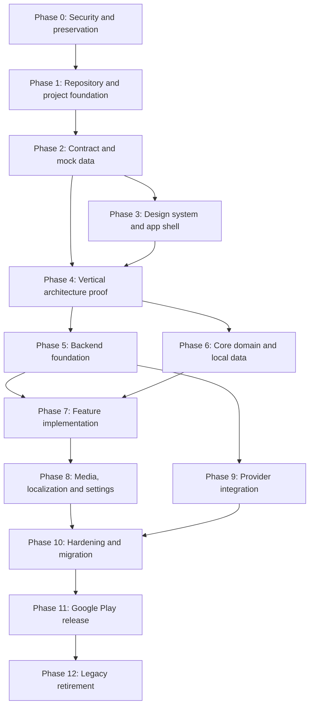

# GridView - Implementation Plan

## Document information

- Product: GridView
- Document type: Implementation Plan
- Version: 0.1
- Status: Draft
- Platform: Android
- Mobile technology: Flutter
- Backend technology: Cloudflare Workers with TypeScript
- Existing Android application ID: `com.sejuma.gridview`
- Related documents:
  - `GridView_PRD.md`
  - `GridView_App_Flow.md`
  - `GridView_UI_UX_Design.md`
  - `GridView_TRD.md`
  - `GridView_Backend_Scheme.md`
- Product phase: Complete reconstruction of the existing application
- Document date: 2026-07-17

---

## 1. Purpose

This document defines the implementation sequence for reconstructing GridView while preserving the existing Google Play application identity.

It converts the product, design and technical decisions into an actionable delivery plan.

The plan establishes:

- Work phases.
- Dependencies.
- Milestones.
- Deliverables.
- Technical validation gates.
- Testing expectations.
- Migration activities.
- Release preparation.
- Legacy-system retirement.
- Definition of completion.

The plan is intentionally structured around validated vertical slices rather than building all backend, frontend or design work independently and integrating them only at the end.

---

## 2. Delivery principles

### 2.1 Build the foundation once

The reconstruction must create a stable basis for future features. Temporary shortcuts that reproduce the fragility of the legacy project are not acceptable.

### 2.2 Validate architecture through working features

The architecture should be proven through a complete vertical slice before it is repeated across every feature.

### 2.3 Use mocks before committing to the production provider

Mobile and backend development should progress using stable mock contracts while provider rights and licensing are resolved.

### 2.4 Keep the app usable throughout synchronization

The local database is the immediate source for UI rendering. Network requests update the database without blocking the whole application.

### 2.5 Integrate continuously

Every phase must leave the repository in a buildable and testable state.

### 2.6 Preserve the published application identity

The implementation may replace almost all code, but it must preserve:

- `com.sejuma.gridview`.
- Compatible signing.
- Monotonically increasing Android version codes.
- Upgrade compatibility with the current published application.

### 2.7 Scope discipline

The first reconstructed release includes only:

- Home.
- Calendar.
- Grand Prix details.
- Circuits.
- Drivers.
- Teams.
- Drivers' standings.
- Constructors' standings.
- Basic settings.

New ideas must be recorded for later phases rather than inserted into the v1 reconstruction.

---

## 3. Overall delivery model

The project will be implemented through the following phases:


```mermaid
flowchart TD
    P0[Phase 0: Security and preservation]
    P1[Phase 1: Repository and project foundation]
    P2[Phase 2: Contract and mock data]
    P3[Phase 3: Design system and app shell]
    P4[Phase 4: Vertical architecture proof]
    P5[Phase 5: Backend foundation]
    P6[Phase 6: Core domain and local data]
    P7[Phase 7: Feature implementation]
    P8[Phase 8: Media, localization and settings]
    P9[Phase 9: Provider integration]
    P10[Phase 10: Hardening and migration]
    P11[Phase 11: Google Play release]
    P12[Phase 12: Legacy retirement]

    P0 --> P1
    P1 --> P2
    P2 --> P3
    P2 --> P4
    P3 --> P4
    P4 --> P5
    P4 --> P6
    P5 --> P7
    P6 --> P7
    P7 --> P8
    P5 --> P9
    P8 --> P10
    P9 --> P10
    P10 --> P11
    P11 --> P12
```

Some phases may overlap once their dependencies are satisfied, but release gates must remain sequential.

---

## 4. Milestones

| Milestone | Outcome |
|---|---|
| M0 | Legacy project secured and preserved |
| M1 | New repository structure and CI operational |
| M2 | GridView API v1 contract and fixtures approved |
| M3 | Design system and navigation shell operational |
| M4 | End-to-end vertical slice working offline |
| M5 | Cloudflare backend foundation deployed to staging |
| M6 | All core data stored and queried through Drift |
| M7 | All core product screens implemented with mock/staging data |
| M8 | Media, localization, settings and accessibility baseline completed |
| M9 | Adopted data sources integrated under their public licence, and production snapshots generated. **No provider approval is involved** — see [ADR 0019](../adr/0019-formula-one-provider-legal-gate.md) |
| M10 | Release candidate passes migration, performance and quality gates |
| M11 | Reconstructed app released through Google Play |
| M12 | Railway, Spring Boot and MySQL retired |

---

## 5. Phase 0 - Security repair and project preservation

## 5.1 Objective

Secure the legacy infrastructure and preserve a recoverable reference before reconstruction begins.

## 5.2 Tasks

### Security

- Rotate the exposed Railway/MySQL credentials.
- Review whether the exposed credentials are still active.
- Remove credentials from the current backend configuration.
- Rewrite or purge the secret from Git history.
- Confirm that Firebase service-account files are not tracked.
- Confirm that Android signing files are not tracked.
- Disable or protect public scraper-trigger endpoints.
- Review Railway logs for unusual access.
- Revoke unused API keys and tokens.

### Preservation

- Create a Git tag for the current production-compatible frontend.
- Create a Git tag for the final legacy backend state.
- Record the latest Google Play `versionCode` and `versionName`.
- Confirm the production application ID.
- Confirm Play App Signing status.
- Back up the upload key securely.
- Export any legacy data that may be useful as reference.
- Record the current production backend URL.
- Capture representative screenshots and functional behavior.
- Store legacy JSON examples for migration and regression testing.

### Documentation

- Add a prominent legacy/deprecation note to the backend README.
- Record known security incidents and remediation.
- Create the initial Architecture Decision Record directory.
- Add ADRs for retaining Flutter and replacing the backend.

## 5.3 Deliverables

- Rotated credentials.
- Sanitized active repositories.
- Legacy source tags.
- Signing and Play Console verification record.
- Legacy behavior inventory.
- Security remediation checklist.

## 5.4 Exit criteria

- No known live database credential remains in Git.
- Production signing access is confirmed.
- The current application can be rebuilt or referenced from a tag.
- Public write-trigger scraper routes are disabled or secured.
- Reconstruction can proceed without risking loss of the published-app identity.

---

## 6. Phase 1 - Repository and project foundation

## 6.1 Objective

Transform the existing frontend repository into the primary GridView monorepo and establish reproducible development workflows.

## 6.2 Repository tasks

- Rename the repository to `GridView` if desired.
- Keep the Flutter project at the repository root.
- Add:
  - `services/edge-api/`
  - `content/`
  - `docs/`
  - `docs/adr/`
  - `scripts/`
  - `.github/workflows/`
- Remove tracked build artifacts.
- Remove `android/app/.cxx/` from tracking.
- Replace narrow generated-file ignores with correct directory ignores.
- Add secret and environment-file patterns to `.gitignore`.
- Add editor configuration.
- Add contribution and branching guidance.
- Replace the minimal README with project setup instructions.

## 6.3 Flutter baseline tasks

- Pin the chosen Flutter stable SDK.
- Upgrade Android build configuration carefully.
- Preserve `com.sejuma.gridview`.
- Create development, staging and production flavors.
- Configure non-production application IDs.
- Establish environment configuration.
- Remove unused dependencies from the legacy application.
- Remove Unity Ads.
- Remove legacy Hive integration after migration planning is in place.
- Add strict analyzer configuration.
- Add code-generation commands.
- Add localization generation.
- Verify a clean development build.

## 6.4 Backend baseline tasks

- Initialize the TypeScript Worker project.
- Configure Wrangler environments.
- Create dev/staging/production Worker names.
- Configure KV namespaces.
- Configure R2 staging and production buckets.
- Add TypeScript strict mode.
- Add linting and formatting.
- Add local Worker tests.
- Add configuration validation.

## 6.5 CI tasks

Create pull-request workflows for:

- Flutter formatting.
- Flutter analysis.
- Flutter unit and widget tests.
- Development Android build.
- TypeScript type checking.
- Backend linting.
- Backend tests.
- Curated-content schema validation.
- Secret scanning.

## 6.6 Deliverables

- Buildable monorepo.
- Reproducible Flutter and Worker environments.
- Initial CI pipeline.
- Environment separation.
- Updated repository documentation.

## 6.7 Exit criteria

- A clean clone can build the Flutter dev application.
- A clean clone can run the Worker locally.
- Pull requests run automated quality checks.
- No generated build artifacts are tracked.
- Production application ID remains unchanged.

---

## 7. Phase 2 - API contract, domain vocabulary and mock data

## 7.1 Objective

Define the shared language between backend and mobile before implementing production integrations.

## 7.2 Domain tasks

Finalize the meaning and relationships of:

- Season.
- Driver.
- Constructor.
- Circuit.
- Grand Prix.
- Session.
- Driver season entry.
- Constructor season entry.
- Driver standing.
- Constructor standing.
- Race result.
- Race result entry.
- Media asset.
- Data freshness.

## 7.3 Identifier tasks

Define stable identifiers for:

- Drivers.
- Constructors.
- Circuits.
- Grand Prix events.

Create mapping fixtures for representative entities.

## 7.4 OpenAPI tasks

Create `gridview-api-v1.yaml` covering:

- Status.
- Bootstrap.
- Home.
- Season metadata.
- Calendar.
- Grand Prix details.
- Race results.
- Driver standings.
- Constructor standings.
- Driver list and detail.
- Constructor list and detail.
- Circuit list and detail.
- Content manifest.
- Error responses.

## 7.5 Fixture tasks

> **Status correction (Phase 8C-3).** These scenarios exist and are validated in
> the **Edge API contract corpus** under
> `services/edge-api/test/fixtures/api/v1/`, which remains the single source of
> truth for contract fixtures. They are **not** all present in the **app's**
> bundled development inventory, `assets/dev_fixtures/`, which currently contains
> only `home.json`, `grand-prix-2026-12.json` and `grand-prix-2026-13.json`.
> There is no bundled bootstrap or current-season response, so
> `FixtureGridViewApi` returns `notFound` for both and every season-scoped screen
> shows "Season unavailable".
>
> This is a **development-tooling gap**. It does not affect the production or
> staging HTTP path, production never falls back to fixtures, and it does not
> block Phase 8 engineering closure. The follow-up — deriving the app's bundled
> inventory from the already-validated contract corpus rather than authoring new
> data — belongs to the owner of this section and of §8.8. It is **not fixed**,
> and fixture mode is **not** removed.

Create validated fixtures for:

- Standard weekend.
- Sprint weekend.
- Upcoming event.
- Current event.
- Completed event.
- Cancelled session.
- Postponed event.
- Fractional championship points.
- Missing optional profile fields.
- Mid-season driver change.
- Constructor rebranding.
- Provider failure.
- Stale snapshot.
- Empty first-launch state.

## 7.6 Curated content tasks

Create JSON schemas and initial content for:

- Driver registry.
- Constructor registry.
- Circuit registry.
- Season entries.
- Media metadata.
- Provider-ID mappings.
- Manual overrides.

## 7.7 Client contract tasks

- Implement API DTOs.
- Implement JSON generation.
- Implement mapping tests.
- Define internal failure categories.
- Define freshness metadata behavior.
- Confirm nullability and numeric types.
- Confirm UTC and timezone rules.

## 7.8 Deliverables

- Approved OpenAPI v1 document.
- Domain glossary.
- Stable-ID policy.
- Mock API responses.
- Curated-content schemas.
- Contract tests.

## 7.9 Exit criteria

- Flutter can parse all fixture responses.
- Backend can validate and serve all fixture responses.
- Unknown optional fields do not break parsing.
- Missing values remain null instead of false zero values.
- Sprint and standard weekends fit the same contract.
- The contract is sufficient for every v1 screen.

---

## 8. Phase 3 - Design system and application shell

## 8.1 Objective

Implement the reusable visual and navigation foundation without depending on production data.

## 8.2 Theme tasks

- Implement GridView color tokens.
- Implement dark theme.
- Decide whether light theme ships in v1.
- Integrate Sora and Inter if final licensing and package size are acceptable.
- Implement typography tokens.
- Implement spacing, radius and elevation tokens.
- Implement semantic colors.
- Implement safe team-color contrast helpers.

## 8.3 Component tasks

Implement and document:

- App bar.
- Bottom navigation.
- Section header.
- Segmented control.
- Status chip.
- Primary and secondary buttons.
- Hero card.
- Data card.
- Session row.
- Standings row.
- Driver row.
- Team row.
- Circuit row.
- Result row.
- Skeleton loader.
- Error state.
- Empty state.
- Offline/stale notice.
- Reserved advertisement container.
- Remote-image placeholder.

## 8.4 Navigation tasks

- Configure `go_router`.
- Implement the four primary branches:
  - Home.
  - Calendar.
  - Standings.
  - Explore.
- Implement Settings as a secondary route.
- Preserve branch state.
- Implement unknown-route handling.
- Add typed entity routes.
- Verify Android system back.
- Verify duplicate-route prevention.

## 8.5 Screen skeleton tasks

Create responsive screen structures for:

- Home.
- Calendar.
- Grand Prix detail.
- Standings.
- Explore.
- Driver detail.
- Team detail.
- Circuit detail.
- Settings.

Use fixture or placeholder data only.

## 8.6 Accessibility tasks

- Add semantics to shared components.
- Verify touch-target sizes.
- Verify text scaling.
- Verify focus and traversal behavior.
- Verify information is not color-only.
- Establish contrast testing.

## 8.7 Deliverables

- Reusable design-system components.
- App navigation shell.
- Screen skeletons.
- Dark-theme golden tests.
- Accessibility baseline.

## 8.8 Exit criteria

- All routes are navigable with mock data. **Qualified since Phase 8C-3:** this
  was satisfied for the Phase 3 screen skeletons, and every route remains
  navigable and fully exercised in the widget/golden suites, which inject their
  own fixtures. It is **not** currently true of the **bundled**
  `assets/dev_fixtures/` inventory: that bundle carries only `home.json` and two
  Grand Prix rounds, with no bootstrap or current-season response, so a
  `DATA_SOURCE=fixture` build cannot resolve the current season and every
  season-scoped screen renders "Season unavailable". See §7.5 and
  [GridView_Synchronization.md](GridView_Synchronization.md) §8.1.
- Primary navigation preserves state.
- Comparable screens behave consistently.
- Core components render correctly at supported text sizes.
- No production data dependency exists.

---

## 9. Phase 4 - Vertical architecture proof

## 9.1 Objective

Prove the complete architecture using one small but representative user journey before multiplying the pattern.

## 9.2 Selected vertical slice

```text
Home next Grand Prix card
    -> Home controller
    -> repository
    -> mock GridView API
    -> API DTO validation
    -> Drift transaction
    -> local database stream
    -> UI render
    -> offline reopen
    -> Grand Prix detail route
    -> media placeholder/cache
```

## 9.3 Tasks

### Local database

- Initialize Drift.
- Export the initial schema.
- Add season, circuit, Grand Prix and session tables.
- Add synchronization metadata.
- Enable foreign keys.
- Add representative indexes.
- Add transaction tests.

### Data flow

- Implement API client.
- Implement request cancellation.
- Implement timeout policy.
- Implement error mapping.
- Implement repository contract.
- Implement mock remote data source.
- Implement local data source.
- Implement synchronization command.
- Implement stale-while-revalidate behavior.
- Deduplicate simultaneous requests.

### UI flow

- Read Home data from local database streams.
- Render initial loading only when no local data exists.
- Preserve cached data during refresh.
- Show a non-blocking failure state.
- Open Grand Prix detail with stable route parameters.
- Verify back navigation.

### Observability

- Add request IDs.
- Add structured logging.
- Add placeholder crash/performance hooks.
- Ensure logs do not expose response bodies or keys.

### Tests

- Unit mapping tests.
- Repository tests.
- Database tests.
- Widget loading/data/error tests.
- Integration test for online first launch.
- Integration test for offline second launch.

## 9.4 Architecture review

After the slice works, review:

- Folder structure.
- Provider granularity.
- DTO/domain/database mapping overhead.
- State-management approach.
- Database query design.
- Error model.
- Code-generation strategy.
- Test ergonomics.
- Performance.

Any major architecture correction must occur now, before every feature adopts the pattern.

## 9.5 Deliverables

- End-to-end working slice.
- Architecture review notes.
- Updated ADRs.
- Approved reusable feature template.

## 9.6 Exit criteria

- The app opens with local data while offline.
- Remote refresh updates the local database.
- The UI reacts to local data.
- Failed refresh does not erase content.
- Navigation works.
- Tests demonstrate the entire path.
- The team accepts the pattern for broader implementation.

---

## 10. Phase 5 - Backend foundation

## 10.1 Objective

Deploy a staging GridView API capable of serving normalized snapshots independently of the external production provider.

## 10.2 Worker tasks

- Implement routing.
- Implement response envelopes.
- Implement error envelopes.
- Implement request IDs.
- Implement parameter validation.
- Implement `ETag`.
- Implement `If-None-Match` and `304`.
- Implement cache headers.
- Implement HEAD behavior.
- Implement structured logging.
- Implement status endpoint.

## 10.3 KV tasks

- Implement snapshot storage abstraction.
- Implement versioned keys.
- Implement active-version pointer.
- Implement previous-version rollback.
- Implement synchronization metadata.
- Implement content-version metadata.
- Implement local/mock KV adapter for tests.

## 10.4 Synchronization tasks

- Implement scheduled handler.
- Implement due-job calculation.
- Implement mock provider adapter.
- Implement snapshot validation.
- Implement atomic publication.
- Implement previous-snapshot preservation.
- Implement quota-state model.
- Implement protected manual synchronization.

## 10.5 Derived snapshot tasks

Generate:

- Bootstrap.
- Home.
- Calendar.
- Grand Prix details.
- Driver list.
- Constructor list.
- Circuit list.
- Driver standings.
- Constructor standings.

## 10.6 Administration tasks

Provide controlled operations for:

- Full synchronization.
- Single-resource synchronization.
- Home rebuild.
- Rollback.
- Cache purge.
- Quota inspection.
- Last-sync inspection.

## 10.7 Testing tasks

- Route tests.
- `ETag` tests.
- Cache-header tests.
- Invalid-parameter tests.
- Atomic-publication tests.
- Rollback tests.
- Provider-failure tests.
- Quota-low tests.
- Protected-route tests.

## 10.8 Deliverables

- Staging Worker.
- Staging KV.
- Protected sync operation.
- Mock provider.
- OpenAPI-aligned endpoints.
- Automated backend tests.

## 10.9 Exit criteria

- Staging API serves the approved contract.
- Public requests do not call the provider.
- A failed sync preserves the active snapshot.
- Rollback works.
- Cache behavior is verified.
- Flutter can synchronize from staging.

---

## 11. Phase 6 - Complete local data and repository layer

## 11.1 Objective

Complete the offline-first data foundation for all v1 features.

## 11.2 Database schema tasks

Add and test:

- Seasons.
- Drivers.
- Constructors.
- Driver season entries.
- Constructor season entries.
- Circuits.
- Grand Prix events.
- Sessions.
- Driver standings.
- Constructor standings.
- Race results.
- Race result entries.
- Media metadata.
- Synchronization metadata.

## 11.3 Query tasks

Implement local queries for:

- Home snapshot composition.
- Ordered calendar.
- Next event.
- Latest completed event.
- Grand Prix detail.
- Current session.
- Drivers by season.
- Constructors by season.
- Circuits by season.
- Driver standings.
- Constructor standings.
- Driver detail with season entry.
- Team detail with line-up.
- Circuit detail with related event.
- Race result entries.

## 11.4 Repository tasks

Implement:

- Season repository.
- Calendar repository.
- Grand Prix repository.
- Driver repository.
- Constructor repository.
- Circuit repository.
- Standings repository.
- Home repository.
- Content/media repository.

## 11.5 Synchronization tasks

- Implement bootstrap synchronization.
- Implement resource-level freshness.
- Persist API `ETag` values.
- Process `304` responses.
- Use transactional collection replacement.
- Preserve local data after invalid remote responses.
- Prevent overlapping refreshes.
- Support manual refresh.
- Support application-foreground refresh.

## 11.6 Migration tasks

- Define schema version 1.
- Add migration test harness.
- Export schema snapshots.
- Document migration workflow.
- Add CI migration verification.

## 11.7 Deliverables

- Complete Drift schema.
- DAOs and repositories.
- Synchronization orchestration.
- Database migration tests.
- Offline query coverage.

## 11.8 Exit criteria

- Every v1 screen can be supplied from local data.
- All remote updates pass through repositories.
- No widget directly calls Dio or Drift.
- Database migrations are reproducible.
- Offline behavior works for all synchronized entities.

---

## 12. Phase 7 - Core feature implementation

## 12.1 Objective

Implement all product screens using staging/mock API data and the completed local data layer.

Features should be implemented in dependency-aware order.

---

## 12.2 Feature 1 - Calendar and Grand Prix

### Tasks

- Implement Calendar controller.
- Implement chronological event list.
- Highlight next event.
- Preserve scroll position.
- Support completed/current/upcoming/postponed/cancelled states.
- Implement Grand Prix hero.
- Implement session schedule.
- Support sprint and standard weekends.
- Implement local timezone presentation.
- Implement result availability state.
- Link to Circuit detail.
- Link result entries to Driver and Team detail.
- Add loading, partial, empty, error and offline states.
- Add unit, widget and integration tests.

### Completion gate

- Every fixture weekend format renders correctly.
- Session order comes from data rather than hardcoded assumptions.
- Calendar changes do not require a mobile release.

---

## 12.3 Feature 2 - Standings

### Tasks

- Implement Drivers/Constructors selector.
- Implement driver standings.
- Implement constructor standings.
- Support fractional points.
- Add leader emphasis.
- Show freshness metadata.
- Preserve selected table and scroll position.
- Navigate to Driver and Team details.
- Preserve cached standings on refresh failure.
- Add tests.

### Completion gate

- Standings are correctly ordered.
- Missing values do not appear as false zeroes.
- Background refresh leaves data visible.

---

## 12.4 Feature 3 - Drivers

### Tasks

- Implement driver list.
- Implement driver sorting.
- Decide whether search ships.
- Implement driver detail hero.
- Implement current team association.
- Implement standing summary.
- Implement optional statistics.
- Hide missing sections cleanly.
- Link to Team detail.
- Add image fallbacks.
- Add tests.

### Completion gate

- Current-season driver/team relationships are season-aware.
- Mid-season changes fit the data model.
- Driver detail remains useful without optional biography/media.

---

## 12.5 Feature 4 - Teams

### Tasks

- Implement constructor list.
- Implement team identity cards.
- Implement Team detail.
- Implement current line-up.
- Implement standing summary.
- Implement team facts.
- Apply team colors through contrast-safe helpers.
- Link to Driver details.
- Add tests.

### Completion gate

- Line-ups are season-aware.
- Team rebranding does not change stable identity.
- Missing media does not break layout.

---

## 12.6 Feature 5 - Circuits

### Tasks

- Implement circuit list.
- Implement Circuit detail.
- Implement layout-image area.
- Implement physical facts.
- Implement related Grand Prix.
- Support placeholders.
- Add tests.

### Completion gate

- Every current-season circuit is reachable.
- Circuit-to-event and event-to-circuit navigation avoid duplicate loops.
- Units are consistently formatted.

---

## 12.7 Feature 6 - Home

Home should be completed after its dependencies are stable.

### Tasks

- Implement season-context resolver.
- Implement pre-event state.
- Implement race-weekend state.
- Implement post-race state.
- Implement next Grand Prix hero.
- Implement session timing block.
- Implement championship leader cards.
- Implement latest result.
- Implement upcoming events.
- Implement freshness state.
- Link every card to its related detail.
- Add tests for temporal states.

### Completion gate

- The next relevant event is immediately understandable.
- Home is useful from cached data.
- Partial data produces a coherent screen.
- No non-essential request blocks startup.

---

## 13. Phase 8 - Media, localization, settings and platform services

## 13.1 Objective

Complete cross-cutting product capabilities after core screens are stable.

## 13.2 Media tasks

These split into engineering, which Phase 8 owns and has delivered, and external
operator actions, which Phase 8 cannot perform and does not own.

**Engineering — delivered in Phase 8B (merged, PR #1):**

- Create media-processing script. **Done** — deterministic, offline dry-run,
  no credentials required.
- Generate WebP variants. **Done** — never upscales, never overwrites an
  immutable object key.
- Implement remote image component. **Done** — `GvRemoteImage`, data-agnostic.
- Implement disk cache policy. **Done** — one shared bounded cache; image bytes
  never enter Drift.
- Implement placeholders. **Done** — one stable fallback for every no-image
  state, at the same size, with no broken-image icon and no URL on screen.
- Implement the media URL policy. **Done** — HTTPS only, non-empty host, no
  embedded credentials; the loopback relaxation must be injected explicitly and
  no environment selects it.
- Verify no oversized image is used in small rows. **Done** — a pure
  size-and-DPR variant selector decides before the widget is built.
- Profile list scrolling and memory. **Measured in Phase 8C-3 as provisional
  evidence**, on the authorized HONOR DNP-NX9 in profile mode: placeholder-only
  Explore scrolling (2 025 frames across six category/cache-state captures) and
  240 repeated-navigation round trips with no monotonic heap retention. Recorded
  in [GridView_Performance.md](GridView_Performance.md). The DNP-NX9 is
  **flagship-class, not representative mid-range**, and no media existed to
  scroll, so this is **not** representative-device acceptance: that is deferred
  to Phase 10 (§15) and the real-media measurements to the media-publication
  owner.

**External operator actions — reassigned, not completed:**

- Define approved media inventory. **Not done. External.**
- Collect rights and attribution metadata. **Not done. External.**
- Upload staging media to R2. **Not done. External** — no R2 bucket is
  provisioned in any environment.
- Publish media manifest. **Not done. External** — blocked by the two above.

These four are **prerequisites for media publication**, and they are tracked on
the operator checklist in their owning phase. They are **not blockers for Phase
8 engineering closure** — see §13.9.

## 13.3 Localization tasks

- Establish English source ARB.
- Implement Spanish translations.
- Remove hardcoded user-facing text.
- Localize dates, times and numbers.
- Test text expansion.
- Test fallback language.
- Review Formula 1 proper-name behavior.

## 13.4 Settings tasks

Implement:

- Language.
- Theme.
- Time display if retained.
- Data source and acknowledgements.
- Privacy policy.
- App version.
- Feedback/contact.

## 13.5 Firebase tasks

- Decide whether existing Firebase projects are retained.
- Configure dev/staging/production Firebase.
- Integrate Crashlytics.
- Integrate Performance Monitoring.
- Add global error capture.
- Add selected non-fatal reports.
- Verify release-like symbol handling.

## 13.6 Advertising tasks

**Closed: advertising is not retained for v1.** See
[ADR 0018](../adr/0018-advertising-not-retained-for-v1.md). The PRD (§17) says
advertising *may* remain, so it was optional rather than mandatory, and the §25
decision deadline — before Phase 8 production integration — passed with no
approval to integrate it.

No task in this subsection is performed in Phase 8. There is no advertising SDK,
no consent SDK, no ad unit, no ad request and no advertising runtime; the
forbidden-dependency gate in `android/app/build.gradle` fails the build if
`play-services-ads` is ever resolved. The production AdMob **application ID**
`meta-data` is preserved unchanged as published-app identity (§2.6) and is inert
without the SDK. `GvAdContainer` remains a development catalogue component only,
unreachable from every live production route. Dev and staging need no test ad
units, because there is no integration to point at one.

The original task list is retained below as the starting point a future
advertising phase would work from. It describes no Phase 8 work.

<details>
<summary>Superseded task list (a future advertising phase only)</summary>

- Retain Google Mobile Ads only.
- Remove Unity Ads.
- Configure test IDs outside production.
- Implement consent flow where required.
- Initialize after first frame.
- Reserve ad layout space.
- Verify ad failure does not affect content.
- Avoid interstitial ads in v1.

</details>

## 13.7 Accessibility tasks

The original task list is preserved above the outcome, because it is what the
phase set out to do. The classification below records what actually happened,
under the product-priority decision documented in
[GridView_Accessibility.md](GridView_Accessibility.md) §5.

- Run screen-reader review.
- Run text-scale review.
- Run contrast review.
- Verify semantic state announcements.
- Verify reduced-motion behavior where applicable.
- Fix clipping and small-touch targets.

**Outcome (Phase 8C-3):**

- Automated semantics baseline — **complete.** 111 passing tests in `test/a11y`,
  plus the component-level suites; reading order, semantic flags, identifier
  suppression, EN/ES.
- Touch-target verification — **complete**, including under 200% text.
- Text-scale matrix — **complete.** 200% across every width, locale and theme.
- Contrast verification — **complete**, for both themes, **with one confirmed
  exception**: the selected segmented-control label draws 14 px bold text on the
  decorative red at 3.55:1 in the dark palette, below the 4.5:1 small-text
  threshold. Pre-existing, unfixed and recorded in
  [GridView_Accessibility.md](GridView_Accessibility.md) §4.11.
- Reduced-motion automated verification — **complete**, with a non-vacuity guard.
- Populated TalkBack review — **executed once**, on the dedicated emulator
  against public staging data, with human-heard confirmation. Findings recorded
  in [GridView_Accessibility.md](GridView_Accessibility.md) §4 and **not fixed**.
- Further manual screen-reader polish — **deferred, non-blocking.** No longer a
  Phase 8 engineering exit criterion.
- Formal accessibility certification — **outside v1 scope.** None is claimed.

What the text-scale matrix establishes at 200% is bounded, and worth stating
precisely: no `RenderFlex` overflow exception, the important semantic labels
still present, the applicable 48 dp touch-target minimum, and a surviving
`Scrollable` where it asserts one.

It does **not** detect visual truncation. A `Text` that ellipsizes under
`maxLines` keeps its full semantics label and throws no exception, so the suite
stays green through it. Small-touch-target coverage is therefore established;
**absence of visible clipping at 200% is not**, and is neither claimed nor
disproven here.

## 13.8 Deliverables

- R2 media pipeline — **the pipeline is implemented**; the R2 bucket itself is
  not provisioned, which is an external operator action (§13.2).
- English and Spanish UI.
- Settings screens.
- Crash/performance monitoring.
- ~~Controlled advertising integration.~~ Not applicable: advertising is not
  retained for v1 ([ADR 0018](../adr/0018-advertising-not-retained-for-v1.md)).
- Accessibility review report — **delivered** as
  [GridView_Accessibility.md](GridView_Accessibility.md).
- Performance evidence report — **delivered** as
  [GridView_Performance.md](GridView_Performance.md), with its provisional,
  partial and blocked classifications intact.

## 13.9 Exit criteria

Each criterion is assessed honestly below. A deferred or blocked measurement is
never recorded as satisfied.

- **Every user-facing string is localized — satisfied.** ARB parity and the
  existing localization coverage hold, subject to the previously documented
  development-only catalogue copy, which is unreachable in production.
- **Missing media always has a stable fallback — satisfied.** Confirmed on a
  physical device during Phase 8C-3: every media slot rendered the same stable
  placeholder at the same size, with no broken-image icon, no error text, no URL
  on screen and no layout shift, including where a detail request was genuinely
  attempted and failed.

**Resolving the media-publication conflict.** Phase 8 engineering closure
requires the *implemented* media architecture: variant selection, the stable
fallback, the URL policy, the cache behaviour, and the operator publication
pipeline. All of these exist and are merged.

It does **not** require GridView to display a published image. No Formula 1
media rights have been approved and no R2 bucket is provisioned, so the approved
inventory is empty and nothing has been published. A placeholder is therefore
the **correct** rendered outcome of a working architecture, not evidence of a
missing one.

Rights approval, R2 provisioning, media upload and manifest publication are
**external operator actions**, reassigned to the operator checklist and their
owning phase (§13.2). They remain **visible prerequisites for media
publication** and are **not marked complete**. They do not block Phase 8
engineering closure, and no engineering work is waiting on them.
- **Crash reports arrive from a release-like build — satisfied by Phase 8C-2.**
  Console-confirmed from a production **debug** pass and from a **release-like**
  pass built from a signed, R8-minified, non-debuggable production release APK.
  No staging Firebase project exists, and none is claimed: dev and staging own no
  Firebase configuration at all.
- **Ads never block startup — not applicable, because advertising is not
  retained for v1** ([ADR 0018](../adr/0018-advertising-not-retained-for-v1.md)).
  Deliberately *not* recorded as satisfied: nothing would be proved by it. No
  advertising integration was built, so none was tested, and the risk this
  criterion guards against cannot occur because its cause does not exist.
- **Settings persist correctly — satisfied.**
- **Core screens meet the selected v1 accessibility baseline — satisfied under
  the revised product-priority decision.** The automated baseline is implemented
  and retained (111 `test/a11y` tests within a 1977-test suite); one populated
  manual TalkBack review was executed with human-heard confirmation; and the
  screen-reader polish issues it found are documented and deferred in
  [GridView_Accessibility.md](GridView_Accessibility.md) §4.
  **This does not state that every accessibility defect is fixed** — four
  confirmed duplicate-announcement findings, a focus-restoration gap, an
  unrepeated keyboard observation and one confirmed dark-theme contrast
  shortfall on the selected segmented-control label (§4.11) remain open and
  unfixed. Manual TalkBack validation is no longer a Phase 8 engineering exit
  criterion.

## 13.10 Performance tasks — outcome

Classified against the evidence in
[GridView_Performance.md](GridView_Performance.md). No partial or blocked
measurement is converted into a pass.

- P9 offstage-prefetch regression guard — **complete**, permanently automated.
- Placeholder / reference-device profiling — **complete as provisional
  evidence** on flagship hardware with no media present.
- Repeated-navigation memory — **complete without media pressure.**
- Representative mid-range acceptance — **deferred to Phase 10 (§15).** The
  TRD requirement is unchanged; only its acceptance owner and phase move.
- Real-media decode and cache-pressure measurements (P2, populated P4, P3 under
  pressure) — **deferred until approved media publication exists**, and owned by
  the media-publication owner.
- Startup and app-size measurements (P7 / P8, P10) — **remain Phase 10.**
- Thresholds — **still not invented.** No agreed threshold exists for janky
  frames, memory, disk-cache bytes, image-cache occupancy or rebuild counts.

## 13.11 Phase 8 status

**Phase 8C-3 engineering implementation and evidence collection are complete on
this branch, with explicitly documented deferrals.**

**Phase 8 engineering scope is ready for review and may be formally closed after
this branch is merged and post-merge CI is green.** Neither the merge nor the
post-merge CI run has happened yet, and neither is claimed here. Release
readiness remains separately blocked by the external Play and privacy
requirements tracked in
[`../release/play-store-baseline.md`](../release/play-store-baseline.md).

---

## 14. Phase 9 - Production provider integration

**Phase 9 has started. Phase 9A is complete and merged** (PR #7, merge commit
`b233da4`), **and its post-merge CI is green. Phase 9B implementation has
started**: Phase 9B-1 (2026-08-23) closed **G6** and **G10 / G-k**,
Phase 9B-2 (2026-08-23) closed **G7** and **G-f**, Phase 9B-3 (2026-08-25)
closed **G8 / G-e**, Phase 9B-4 (2026-08-26) closed **G4 / G-c**, and
Phase 9B-5 (2026-09-02) closed **deep normalized-contract validation** - the
[ADR 0023](../adr/0023-multi-source-provider-coordination.md) D14 activation
gate - together with the deferred **F3**, **F4** and **F5** referential
findings. **Phase 9B (2026-09-20) added a fixture-tested Jolpica
`season-calendar` port** (§14.0.16). It is **dormant**: it is absent from the
runtime composition and from the Worker entry point's import closure, it is not
registered with the coordination seam and not selectable through
`PROVIDER_MODE`, no production coordinator or event-aware scheduler invokes it,
and the dry-run bundle is byte-identical to the baseline. It consumes the
curated event and circuit mappings only when exercised directly by tests, and
**no deployed or application path consumes it**. **Phase 9B (2026-09-22) added a
second, equally dormant `season-circuits` port** (§14.0.17) on the same terms:
not registered, not reachable from the Worker, never used for a provider
request, with a byte-identical dry-run bundle. **Phase 9B (2026-09-23) decided
the season-participation semantics** ([ADR 0026](../adr/0026-season-participation-semantics-and-derivation.md),
§14.0.18) as documentation only. Nothing implements it. **Phase 9B (2026-09-24)
added a third, equally dormant `season-participants` port** (§14.0.21), which
implements only the identity half of that decision: two sequential requests,
canonical drivers and constructors, one constructor season entry per
constructor and no driver entry. It needed [ADR 0023 amendment A1](../adr/0023-multi-source-provider-coordination.md#amendment-a1---ordered-attempts-and-interrupted-executions)
(ordered multi-request attempts and an `interrupted` outcome). It is not
registered, not reachable from the Worker and was never used for a provider
request, and the dry-run bundle is byte-identical. **Phase 9B (2026-09-26)
added a fourth, equally dormant race-results port** (§14.0.22) for the race
`session-classification` only, under the curator decisions of
[ADR 0023 amendment A2](../adr/0023-multi-source-provider-coordination.md#amendment-a2---jolpica-race-result-normalization).
It derives no span, is not registered and was not used for a provider
request, and the dry-run bundle is byte-identical. Everything else remains
open: **no complete Jolpica adapter - participation spans, event schedules,
non-race session classifications and standings are unimplemented - and no
event-aware scheduler,
reconciliation or provenance state machine, live provider mode, production cron
or provider request exists**. GridView's application code, the Worker provider
client and the rate limiter have made no provider request; the only requests on
record are authorized research requests - roughly 25 on 2026-08-19 and one
calendar-evidence request on 2026-09-19 (Provider Evaluation §8.1, §8.8).
*Since then, two more separately authorized captures ran: the participant
identity lists on 2026-09-23 (Provider Evaluation §8.9, §8.10) and 14
race-results requests on 2026-09-24 (Provider Evaluation §8.11).*
`PROVIDER_MODE` still admits exactly `mock | none` and production remains
`"none"`. See §14.0 and §14.0.5-§14.0.9.

## 14.0 Phase 9A status

Phase 9A ran as a research, evaluation and licensing-basis pass on 2026-08-19.
Its licence-compliance analysis, permitted-use mapping, mandatory obligations,
feasibility evidence, dual-source design, quota model, residual-risk record,
optional clarification templates and code audit are in
[GridView_Provider_Evaluation.md](GridView_Provider_Evaluation.md), and the
decision it produced is
[ADR 0019](../adr/0019-formula-one-provider-legal-gate.md) (**Accepted** as an
architecture and product-risk decision, not as provider approval).

| Item | Status |
|---|---|
| Provider evaluation and licensing basis | **Complete and merged** — PR #7, merge commit `b233da4`, post-merge CI green. Phase 9A was documentation-only. |
| Licensing basis | **Settled: the public CC BY-NC-SA 4.0 licence** published by OpenF1 and Jolpica. For uses inside its scope, the licence is the permission. |
| Individual provider permission | **Not required and not awaited.** Outreach is an optional courtesy channel only. **No inquiry has been sent**, and no waiting period exists. |
| Provider approval | **None.** No provider, and no Formula 1 entity, has approved, endorsed or reviewed GridView. None has been asked. |
| Formula 1 rights clearance | **Not obtained and not claimed.** A licensor can only license rights it holds, and CC BY-NC-SA 4.0 §2(b) does not license trademark rights. Accepted as residual risk. |
| Production provider adapter | **Not implemented and not activated.** Production remains `PROVIDER_MODE = "none"`; the mock provider is unchanged. |
| Phase 9B entry decisions (E5a, E5b, E6) | **Recorded 2026-08-21** in [ADR 0020](../adr/0020-provider-source-observation-and-reconciliation.md). Documentation and contract-description only — no adapter, no live request, no infrastructure change. |
| Phase 9B-1 (source-aware accounting and quota foundation) | **Implemented 2026-08-23** (§14.0.5). Typed provider identity, typed per-source request accounting and per-source locally modelled quota state. No adapter, no request and no deployment at implementation. Now in staging version `985115b7-…` (2026-09-12; see the note below this table), on the existing mock-provider synchronization path only: staging's `PROVIDER_MODE` is `"mock"` and no real source is contacted. |
| Phase 9B-2 (outbound hardening and per-provider rate limiter) | **Implemented 2026-08-23** (§14.0.6). One hardened outbound boundary and a Durable Object rate limiter with one identity per real source. No adapter, no request, and no Cloudflare provisioning or deployment at implementation. The 2026-09-12 staging deployment (version `985115b7-…`) later provisioned and bound the staging `PROVIDER_RATE_LIMITER` namespace and carries the `ProviderRateLimiter` class; there is no evidence that the class or any object instance has been invoked. The hardened HTTP client is not reachable from the Worker entry point, no live provider adapter exists and `PROVIDER_MODE` remains `"mock"`, so no provider request is possible. |
| Phase 9B-3 (curated provider-identifier mapping registry) | **Implemented 2026-08-25** (§14.0.7). A season-qualified, exactly-matched, fail-closed identifier mapping registry with structural and semantic validation. **Dormant: no adapter consumes it.** No request and nothing deployed at implementation. It is in the operator-recorded source tree of staging version `985115b7-…`, but nothing outside `src/providers/mappings/` imports it, so it is not reachable from the Worker entry point and not in the deployed bundle. |
| Phase 9B-4 (multi-source provider coordination) | **Implemented 2026-08-26** (§14.0.8). A typed, deterministic, fail-closed coordination seam over independent per-source resource ports, superseding the whole-season provider call. **Dormant: no adapter consumes it and no port is registered.** No request and nothing deployed at implementation. The coordination seam is in the operator-recorded source tree of staging version `985115b7-…` but is not reachable from the Worker entry point, so it is not in the deployed bundle; the slice's publication-path corrections (version inventory, rejected-publication classification) are, on the existing mock-provider path. |
| Phase 9B-5 (deep normalized-contract validation) | **Implemented 2026-09-02** (§14.0.9). Field-by-field validation of every normalized value an adapter produces, at the coordination boundary. **Dormant: no adapter produces one.** No request and nothing deployed at implementation. `src/contract/normalized/` is in the operator-recorded source tree of staging version `985115b7-…`, but only the dormant coordination seam imports it, so it is not in the deployed bundle. |
| Phase 9B-6 (snapshot revision identity) | **Partially implemented 2026-09-03** (§14.0.10). The canonical revision input and `snapshotRevision` hashing exist and are tested; **they have no production caller and no published value changed.** The observation clock is **blocked** on a serialization guarantee Workers KV cannot provide; 9B-6b's Mechanism and Integration slices build the mechanism that would provide it but leave it disabled and unprovisioned (*staging provisioning followed on 2026-09-12; the mechanism is still disabled — see the 9B-6b row*). **Still open** — not closed by 9B-6b below, and not closed by the 2026-09-16 staging activation either: the staging cutover that unblocks the serialization mechanism is complete for season 2026, but no publication has run through the sequencer since, so `snapshotRevision` still has no production caller and no `snapshotObservedAt` is computed or published. |
| Phase 9B-6b (season publication authority and rollback republication) | **Design decision recorded 2026-09-05**; **Mechanism slice implemented 2026-09-06**; **Integration slice implemented 2026-09-08** (§14.0.11), [ADR 0025](../adr/0025-season-publication-authority-and-rollback-republication.md). The two-phase protocol is now wired into the publisher, rollback and public-read paths through `SequencedPublicationService` and a `PublicationAuthorityMode` composition boundary — **disabled by default**: no environment sets `SEASON_PUBLICATION_AUTHORITY`, the composition builds the exact legacy `SnapshotPublisher`, and no path performs a Durable Object lookup. **Still dormant for deployment at that slice: no `wrangler.toml` binding, `[exports]` entry, migration or Durable Object namespace declares the class; nothing is provisioned, deployed, seeded, cut over or activated;** legacy KV pointers remain authoritative in every deployed environment. `snapshotRevision` still has **no production caller** (the integrated path that would compute one is gated off), the resource-level `sourceObservedAt` half of G-i is unimplemented, and **Phase 9B-6 and gap G-i remain operationally open** — closing them requires the separately authorized staging provisioning + cutover (*superseded in part 2026-09-12: provisioning is done — see the end of this row; the cutover sequence remains*). **Integration review corrections (2026-09-08)**, six independently reproduced Codex findings on PR #18, all bounded to the Integration slice and none a new design decision: an explicit sequencer selection with no reachable binding now fails closed instead of resolving to `legacy` (absent/unrecognised configuration still resolves to `legacy`, unchanged); `meta:current-season` and the content-metadata sidecar moved out of the candidate write phase into post-commit maintenance; a cross-season publication now purges the outgoing season's aliases, resolved through that season's own authority; a propagation fallback is served non-cacheable (`no-store`, no `CDN-Cache-Control`, no validator); snapshot `ETag` material now includes the immutable publication version, so a rollback republication cannot reuse its historical target's validator (internal only — no public DTO or OpenAPI field); and a strictly older ordinary candidate is reported `rejected`/`older-source-updated-at` again, the benign completed no-op the publication contract already defined. No binding, migration, provisioning, deployment, cutover or activation accompanied them. **Staging cutover preparation slice (2026-09-10)** — the repository-side half of §14.0.11 item 3: the class is now a named Worker export with an `[exports.SeasonPublicationSequencer]` SQLite entry and a `SEASON_PUBLICATION_SEQUENCER` binding for **`env.staging` only** (production declares none; still no `[[migrations]]` block), a default-off `SEASON_PUBLICATION_CUTOVER_CONTROL` closes one named season's legacy publication and rollback admission before `SnapshotPublisher` is reached, and an authenticated internal `CutoverPreparationService` implements D12's migration and its separate activation confirmation. **Declared is not deployed:** no `wrangler deploy`, no Cloudflare resource, no namespace, no seed, no activation, no remote variable or secret, no provider contact and no call to a deployed endpoint; both `SEASON_PUBLICATION_AUTHORITY` and `SEASON_PUBLICATION_CUTOVER_CONTROL` are unset in every committed environment, staging still uses legacy pointers and production is untouched. D12's pre-cutover historical-floor precondition is now **represented** (a closed operator-evidence union with a required audit reference) and **not satisfied** for any real environment. **Staging provisioning (2026-09-12)** — the operator-recorded source tree at the reviewed `master` commit `ea8b68a0f106f36913d386064645b79cf1c10e1b` (Cloudflare records only source `Upload` and does not attest the commit; see the Staging provisioning row of §14.0.11) was deployed to the existing staging Worker (new active version `985115b7-abb3-4346-8845-d8ff41c80cf6`, superseding the 2026-07-20 Phase 5B version `5c24d00e-dc4e-46cf-a4d4-99b09e97e12a`), carrying every edge change merged since July in its source tree (only modules reachable from the Worker entry point are bundled; see the note below this table) and provisioning **two** Durable Object bindings and namespaces there — `SEASON_PUBLICATION_SEQUENCER` and `PROVIDER_RATE_LIMITER` — neither looked up by any deployed code path. The provider path stays closed because `PROVIDER_MODE` is `mock` and no live adapter exists. **Publication authority is still disabled** and **admission was still open in that deployed version**: `SEASON_PUBLICATION_AUTHORITY` and `SEASON_PUBLICATION_CUTOVER_CONTROL` remained unset in every deployed environment, no season was paused, no checkpoint was approved, no seed, activation or endpoint smoke occurred, and production was neither deployed nor contacted. **Admission-closure configuration prepared (2026-09-12, repository only)** — the authenticated operator explicitly selected season 2026; `services/edge-api/wrangler.toml` declared `SEASON_PUBLICATION_CUTOVER_CONTROL = "seed:2026"` under `[env.staging.vars]` only, not yet deployed at that point. **Superseded the same day: admission closure — DONE (2026-09-12).** A separately authorized `wrangler deploy --env staging` uploaded that configuration from operator-recorded source revision `d3de839a7b297c060e6e4ee7cf1d9974a198be93`, replacing staging version `985115b7-abb3-4346-8845-d8ff41c80cf6` with `00012c06-6c09-4b2f-b24c-02d6e51ec08d` at 100% traffic. Season 2026's legacy publication and rollback admission is now closed in deployed staging; `SEASON_PUBLICATION_AUTHORITY` remains absent everywhere and no checkpoint, seed or activation occurred. **Phase 9B-6 and both halves of G-i remain operationally open.** *Superseded in part 2026-09-15: staging version `cccdcf11-…` made `SEASON_PUBLICATION_AUTHORITY = "sequencer"` live, and season 2026 was seeded; it is not authoritative and not active. See the Next action row.* **Superseded again 2026-09-16:** staging version `c297d260-c81b-4110-bdf2-7572e1206af3` made `activate:2026` live, one authenticated activation request committed the `seeded → active` transition, and the post-activation verification passed. Season 2026 is now **active and authoritative in staging**; the legacy pointers remain present and unchanged but are no longer authoritative for it. Production is untouched and unauthorized. See the Next action row. |
| Phase 9B event identity decision | **Decision recorded 2026-09-16** (§14.0.12), as a dated amendment to [ADR 0022](../adr/0022-curated-provider-identifier-mappings.md#amendment-2026-09-16-grand-prix-event-identity): a curated event registry owns an immutable `eventSlug`, Jolpica events resolve through a complete season-scoped locator, and the calendar status, `hasResults`, missing-time and dormancy-proof semantics are fixed. |
| Phase 9B event-registry mechanism | **Implemented 2026-09-19** (§14.0.13), dormant and unbundled: the curated event registry, the `event` mapping entity, the composite locator key, `CanonicalRegistries` events, schemas, `validate:content` coverage and tests. **The `hasResults` assembly change (A7) and the Jolpica adapter are still not implemented**; the mechanism slice itself contacted no provider and deployed nothing. *The registry was committed empty by that slice; the 2026 dataset followed the same day - see the next row.* |
| Phase 9B 2026 event dataset | **Curated 2026-09-19** (§14.0.14): 23 curator-approved `eventSlug` identities, and a reviewed mapping and evidence entry for every one of the 23 Jolpica locators observed by one separately authorized calendar request that day (Provider Evaluation §8.8). Point-in-time, dormant, nothing deployed. **Circuit coverage completed 2026-09-20** (§14.0.15, Provider Evaluation §8.8.1): all 23 observed circuits are curated and mapped, so **the calendar resource is no longer blocked on data**. **Superseded 2026-09-20** (§14.0.16): a fixture-tested Jolpica `season-calendar` port now exists and consumes these mappings when exercised directly by tests. It is dormant - outside the runtime composition and import closure, not registered or selectable through `PROVIDER_MODE`, invoked by no production coordinator or event-aware scheduler - so no deployed or application path consumes it. The **complete Jolpica adapter and the A7 assembly change remain unimplemented**. |
| Phase 9B 2026 constructor identity dataset | **Curated 2026-09-23** (§14.0.19, Provider Evaluation §8.9): all 11 observed Jolpica `constructorId`s are mapped to 11 curated constructors, from one separately authorized constructor-list request that day. `audi` continues `sauber` (current canonical name and short name now `Audi` by curator decision; season entrant names stay season-scoped), and `rb` maps to `racing-bulls`. Five new identity-only rows were added. **Driver identity coverage remains incomplete**, participant identities as a whole are not complete, and no drivers, constructors or participants port exists. Dormant, nothing deployed. |
| Phase 9B 2026 driver identity dataset | **Curated 2026-09-23** (§14.0.20, Provider Evaluation §8.10): all 32 observed Jolpica `driverId`s are mapped to curated drivers, from the driver-list response of the same separately authorized capture. 25 identity-only rows were added (nine from name-only provider rows), so the registry holds 33 drivers; `antonelli` maps to `andrea-kimi-antonelli`, and `max-verstappen` and `lando-norris` lost their unreliable `permanentNumber`. OpenF1 `driver_number` `12` stays acknowledged and unmapped. **Participant identity coverage is complete at 32 of 32 drivers and 11 of 11 constructors, but no drivers, constructors or participants port exists** and the ADR 0026 implementation prerequisites remain open. Dormant, nothing deployed. *Superseded in part 2026-09-24 (§14.0.21): a dormant participants port now exists.* |
| Phase 9B Jolpica season-participants port | **Implemented 2026-09-24** (§14.0.21), fixture-tested and **dormant**. A third Jolpica port answers `season-participants` only, with two sequential requests (`/{season}/drivers/?limit=100`, then `/{season}/constructors/?limit=100`). It returns the 32 canonical drivers, the 11 canonical constructors, one `ConstructorSeasonEntry` per constructor and an empty `driverEntries` (ADR 0026 D10, D11). [ADR 0023 amendment A1](../adr/0023-multi-source-provider-coordination.md#amendment-a1---ordered-attempts-and-interrupted-executions) lets an outcome report every request it made, in order, and adds a closed `interrupted` outcome. The port is not registered with any coordinator, is absent from every Worker bundle and has never contacted the provider. **No participation span, race-result derivation or publication path exists**, and the ADR 0026 publication prerequisites remain open. Nothing deployed. |
| Phase 9B Jolpica race-results port | **Implemented 2026-09-26** (§14.0.22), fixture-tested and **dormant**. A fourth Jolpica port answers the race `session-classification` only, with one request (`/{season}/{round}/results/?limit=100`), and returns one `final` `RaceResult` with every row, under the curator decisions C-1 to C-9 of [ADR 0023 amendment A2](../adr/0023-multi-source-provider-coordination.md#amendment-a2---jolpica-race-result-normalization). It was designed from the private capture of 2026 rounds 1-14 (Provider Evaluation §8.11), in which every identity maps and the `liam-lawson` change at round 12 makes ADR 0026 D12 item 1 a real blocker. The port is not registered with any coordinator, is absent from every Worker bundle and was not used to contact the provider. **No participation span, `hasResults` derivation or publication path exists**, and the ADR 0026 publication prerequisites remain open. Nothing deployed. |
| Phase 9B split driver participation | **Implemented 2026-09-26** (§14.0.23): ADR 0026 D12 items 1 to 5. `SeasonDriverSummary` gains the required `entryId`, `startRound` and `endRound` (additive v1), and the season Drivers collection publishes one row per `DriverSeasonEntry`. Driver detail selects the open span, else the latest start, on the server and the client. The D7 entry identity is implemented and enforced (`driver-entry-identity`), and the new closed relations `result-entry-span` and `driver-entry-support` prove classification-span integrity in both directions. The client persists every span under its published id and words null/null as "From season start". **Span derivation, A7 and D12 items 6 to 13 (including D14-D16) remain unimplemented**; all four Jolpica ports stay dormant, no provider was contacted and nothing was deployed. |
| Next action | **A separate production-readiness assessment and an explicit operator decision** (§14.0.11 item 3); the season-2026 staging cutover it follows is **complete (2026-09-16)** and needs no further operator procedure. Staging provisioning is **done** (2026-09-12): the sequencer and rate-limiter bindings and namespaces are live in staging. Since 2026-09-15 the sequencer is looked up, and since the 2026-09-16 activation season 2026 is active and authoritative there, so the legacy KV pointers are no longer authoritative for it. Admission closure for season 2026 is **done** (2026-09-12): a separately authorized `wrangler deploy --env staging` uploaded `SEASON_PUBLICATION_CUTOVER_CONTROL = "seed:2026"` from source revision `d3de839a7b297c060e6e4ee7cf1d9974a198be93`, replacing staging version `985115b7-…` with `00012c06-6c09-4b2f-b24c-02d6e51ec08d` at 100% traffic; season 2026's legacy publication and rollback admission is now closed. **Inventory recovery executed (2026-09-13):** no retained season-2026 version recorded an exact `__inventory`, so a separately authorized recovery window ran (§14.0.11 item 3). It reopened admission as version `38b5169a-…` from `master` `d50ef2f…`, made exactly one publication (`20260913183106443-4f683541`, with its exact `__inventory`), and re-closed admission as version `c35f99c0-…` from `549bb5f…` with `seed:2026`. The reclosure configuration is merged (PR #24, `ca5142a`). **Client baseline recorded (2026-09-14)** through `authorized-client-baseline-reset` ([ADR 0025 D12, "What the authorized client-baseline reset supplies (2026-09-14)"](../adr/0025-season-publication-authority-and-rollback-republication.md#what-the-authorized-client-baseline-reset-supplies-2026-09-14)). The eligible clients are the `gv_phase8c2_verify` emulator and the reference phone, the HONOR DNP-NX9, which is the operator's Honor 400 Pro. Its 2026-09-13 decommissioning record was invalidated when it was reintroduced. The evidence PR merged (PR #28), the checkpoint audit re-ran and passed, and the operator approved the exact checkpoint on 2026-09-15. **Seed authority deployed and season 2026 seeded (2026-09-15):** staging version `cccdcf11-0eb0-44cf-8854-1ceb0eb30e2c` made `SEASON_PUBLICATION_AUTHORITY = "sequencer"` live with `seed:2026`. One authenticated seed request then committed season 2026 as `seeded` on its first attempt; it is not authoritative and not active ([ADR 0025 D12, "What the season-2026 seed supplies (2026-09-15)"](../adr/0025-season-publication-authority-and-rollback-republication.md#what-the-season-2026-seed-supplies-2026-09-15)). **Staging cutover complete (2026-09-16).** A separately authorized, cutover-sensitive deployment of `master` `36b0fd21c31c78a7b213f5c542f4367f8471c1e0` replaced version `cccdcf11-…` with `c297d260-c81b-4110-bdf2-7572e1206af3` at 100% traffic (between `2026-09-16T16:02:49.010Z` and `16:03:09.042Z` UTC; version created `16:03:01.459Z`), moving the control from `seed:2026` to `activate:2026` with `sequencer` unchanged and no other intended change. **It activated nothing and needed no rollback**: immediately afterwards season 2026 was still seeded, non-authoritative and admission-closed. Under a further authorization, exactly one authenticated activation `POST` (request `48bc9ea7-87bf-42a6-ae1e-da45e3dbf9fa`, 481-byte body, SHA-256 `ca3766731417914103aff9b9801bcffb8e2c6d9d89b6b67064541bc5707f0fa7`, HTTP `200`, `no-store`) committed the `seeded → active` transition under the approved fingerprint, so `admissionClosed` became `false` and **the activation alone resumed the mutators, with no third deployment** ([ADR 0025 D12, "What the season-2026 activation supplies (2026-09-16)"](../adr/0025-season-publication-authority-and-rollback-republication.md#what-the-season-2026-activation-supplies-2026-09-16)). `CutoverActivationReceipt` is the HTTP response shape; **no durable receipt object or KV receipt key exists**, and the durable proof is the authority record itself. Post-activation verification passed read-only the same day: the official smoke ran once unmodified for **41 checks and exit code 0**, correct ETag/`HEAD`/`304` behaviour on three routes, **twelve concurrent `200`s with no `429` or `5xx`**, combined **p95 94.7 ms** against the internal cached-public-API target of p95 at most 300 ms, and **163 local fallback tests** across eleven files; the live state was byte-identical to its baseline and the KV key set identical by name (2328 keys: 2321 snapshot, 7 non-snapshot) ([ADR 0025 D12, "What the post-activation verification supplies (2026-09-16)"](../adr/0025-season-publication-authority-and-rollback-republication.md#what-the-post-activation-verification-supplies-2026-09-16)). **The Phase 9B-6 staging observation-clock dependency is closed to the extent D12 establishes: the season-2026 staging cutover is complete.** Both halves of G-i stay open — no publication has run through the sequencer since activation, so `snapshotRevision` still has no production caller, and the resource-level `sourceObservedAt` half is unimplemented. **The next step is a separate production-readiness assessment and an explicit operator decision, not an automatic production rollout.** Production has no Worker, KV namespace, sequencer binding, admin token or provider configuration; no real provider was exercised; the provisional 60 requests-per-minute limit is not enforced in Worker code; no monthly availability was demonstrated; no live fallback failure was injected; no legacy pointer was deleted; and no phone or emulator participated in this verification. It is **not** production activation and **not** a provider adapter. Independently, **continue Phase 9B implementation** (§14.3-§14.7) from the Jolpica adapter, which the coordination seam is still missing. **Amended 2026-09-16:** no Jolpica resource that produces a `GrandPrix` or `Session` can start until the curated event registry, the `event` mapping support and curated event mapping data for its season exist (§14.0.12). **Amended 2026-09-19:** the registry and `event` mapping **mechanism** now exist and are dormant (§14.0.13), but the curated event **dataset** does not - the registry is committed empty and no complete locator is recorded anywhere - so those resources stay blocked. The next Phase 9B task is **creation and review of the curated event dataset from separately authorized evidence, not adapter registration.** **Amended again 2026-09-19:** the 2026 event dataset now exists (§14.0.14), so event identity no longer blocks those resources for 2026; **circuit coverage did** - after the five mappings approved on 2026-09-19 (Provider Evaluation §8.8.1), 17 of the 23 observed Jolpica circuit identifiers still had no curated circuit mapping. **Amended 2026-09-20:** that gap is closed (§14.0.15, Provider Evaluation §8.8.1) - all 23 observed circuits are curated and mapped - so **no dataset blocks a Jolpica calendar resource for 2026 any more**. **The remaining next steps are the Jolpica adapter itself and the A7 `hasResults` assembly change, both still unimplemented**, not more curation. The OpenF1 real-network path stays locked until a justified session-end bound is recorded with its official source and access date. **Amended 2026-09-23:** constructor identity coverage for 2026 is complete at 11 of 11 (§14.0.19), but driver identity coverage is not, so ADR 0026 participants work stays blocked on the driver dataset and the ADR 0026 implementation prerequisites (§14.0.18). **Amended again 2026-09-23:** driver identity coverage for 2026 is complete too, at 32 of 32 (§14.0.20), so no identity dataset blocks ADR 0026 participants work for 2026 any more. **The participants port and the ADR 0026 implementation prerequisites (§14.0.18) remain unimplemented**, and a deploy of a `master` containing the new driver identities changes the staging mock snapshot, so it is cutover-sensitive. *Amended 2026-09-24:* the dormant, fixture-tested participants identity port now exists (§14.0.21). It is not registered, and every other ADR 0026 implementation and publication prerequisite remains open. |

**Implementation-time versus current staging state.** In the Phase 9B-1 to
9B-5 rows, "at implementation" records what each slice itself did: none of
them deployed or provisioned anything. The 2026-09-12 staging deployment —
version `985115b7-abb3-4346-8845-d8ff41c80cf6`, deployed from the
operator-recorded source tree `ea8b68a` (Cloudflare does not attest the
commit; see the Staging provisioning row of §14.0.11) — later carried that
source into staging. Wrangler bundles only modules reachable from
`src/index.ts`, so what each row says is or is not in the deployed bundle comes
from a local `wrangler deploy --dry-run --env staging` bundle of the same
executable source; it was not read back from Cloudflare. Being deployed is not
being enabled: that deployment authorized or activated no provider,
publication or cutover path, no live provider adapter exists, and staging's
`PROVIDER_MODE` remains `"mock"`.

### 14.0.1 Product constraints governing Phase 9

Recorded on 2026-08-19 and binding on every provider decision:

| # | Constraint |
|---|---|
| C1 | Provider budget for v1 is **EUR 0** |
| C2 | GridView remains **free** while it relies on non-commercial data sources |
| C3 | **No monetisation**: no advertising, in-app purchases, subscriptions, affiliate links or sponsorship |
| C4 | Any future monetisation requires written commercial permission from every affected provider, or migration to a provider whose licence permits it — and **reopens the provider decision** |
| C5 | **No live telemetry or live timing** is required |
| C6 | Freshness objective for **provisional** results, points and standings: **30-60 minutes after a session ends** |
| C7 | Freshness objective for **reconciled** data: **within 24 hours**, subject to provider availability |
| C8 | **Reliability and replaceability matter more** than in-session updates |

C3 restates an existing state rather than removing anything: advertising was
already absent from v1 per
[ADR 0018](../adr/0018-advertising-not-retained-for-v1.md). **It is not the
removal of an implemented advertising SDK, because none exists.** While these
sources are in use, C1–C3 are **licence compliance requirements**, not merely
product preferences: CC BY-NC-SA 4.0 permits use only for NonCommercial
purposes.

**C6 and C7 are GridView objectives, not provider guarantees.** Neither source
publishes an SLA, an uptime commitment or a correctness guarantee, and both
disclaim them. Reconciliation latency is currently **unmeasured**.

### 14.0.2 Adopted direction

A **dual-source, zero-cost, post-session model**, operating under the public
CC BY-NC-SA 4.0 licence each project publishes. **For uses inside that licence's
scope, the licence is the permission**; separate written permission from either
project is not required before Phase 9B.

| Source | Role | Status |
|---|---|---|
| **OpenF1** | *Provisional* post-session classification, points and championship state | **Specified but NOT unlocked** — see below |
| **Jolpica F1** | *Complete* season metadata, calendar, session times, participants, circuits, historical depth, and *reconciled* final results and standings | **Selected and unlocked** — only two **dormant, fixture-tested ports** exist, `season-calendar` (§14.0.16) and `season-circuits` (§14.0.17); they are outside the runtime composition and import closure, are not selectable through `PROVIDER_MODE`, and the **complete adapter and every other Jolpica resource remain unimplemented**, so no deployed or application path consumes them and nothing is running |

**The OpenF1 path is locked, and Phase 9B must not implement it as though it
were live.** OpenF1's data is free only outside a live window that closes **30
minutes after a session actually ends**. A delayed or red-flagged session moves
that boundary, so GridView may only fetch from a **justified upper bound** on
the actual end — and where no such bound exists, it **skips the session
entirely**.

**No usable bound is recorded today.** The one candidate that looked serviceable
— the scheduled start of the next session — is unsound, because delays cascade
and its timestamp passes while the earlier session is still running.
Consequently:

- the skip rule applies to **every** session;
- **Jolpica is the source for all data**, including session schedules — once its
  complete adapter is built. Today only the **dormant, fixture-tested Jolpica
  `season-calendar`, `season-circuits` and `season-participants` ports and
  the race-results port** exist (§14.0.16, §14.0.17, §14.0.21, §14.0.22) and
  **no OpenF1 adapter exists at all**; all four ports are absent from the
  runtime composition and import closure, are not registered or selectable
  through `PROVIDER_MODE`, and no production coordinator or event-aware
  scheduler invokes them, so no deployed or application path consumes them,
  nothing is running and production remains
  `PROVIDER_MODE = "none"`;
- **the C6 freshness objective is not met by any implemented mechanism**;
- **no GridView request reaches OpenF1 by any route** — there is no baseline
  poll, metadata refresh or health check outside the gated path.

Recording a bound, with an official source and access date, is the **first Phase
9B item** on this path. Until then the OpenF1 adapter may be built and tested
against fixtures, but it must not be enabled against the live service.

Sportmonks is **rejected for v1 on budget grounds only** (C1) and is the named
fallback if C1 or C3 is relaxed. API-Sports remains unselected and unverified.

The licence carries mandatory obligations — non-commercial operation,
attribution in the app and the public API documentation, ShareAlike on adapted
data and derived datasets, no additional downstream restrictions, and an
excluded-material list covering logos, photographs, audio, broadcasts, branding
and live telemetry. These are Phase 9B implementation requirements and release
requirements, not optional polish.

### 14.0.3 Phase 9B entry criteria

Phase 9B may begin once Phase 9A is merged and its post-merge CI is green,
provided all twelve criteria below hold. They are of **two kinds**, matching
[GridView_Provider_Evaluation.md](GridView_Provider_Evaluation.md) §15.2.1:

- **State checks** — something that must be true of the repository *now*. E1
  (unmonetised), E9 (no protected imports) and E10 (no approval claimed) are
  licence-critical states, and writing the requirement down does **not** satisfy
  them; the state itself must hold at the moment of entry.
- **Specification checks** — whether a requirement is decided and written down
  clearly enough to build against.

Neither kind requires Phase 9B's own output, which would be circular.
Verification that a requirement was *built* belongs to §14.8 and the release
sweep. Every one is objective and verifiable in
this repository. **No provider email, reply or waiting period is a
prerequisite.** Full detail in
[GridView_Provider_Evaluation.md](GridView_Provider_Evaluation.md) §15.2.

> **Status mirror, not the owner.** The authoritative status table is
> [GridView_Provider_Evaluation.md](GridView_Provider_Evaluation.md) §15.2; this
> one summarises it and must not diverge. As of **2026-08-21** — Phase 9A merged
> and its post-merge CI green, and the Phase 9B-0 entry-decision package
> recorded in [ADR 0020](../adr/0020-provider-source-observation-and-reconciliation.md) —
> **all twelve hold and Phase 9B implementation may begin.** Entry is not
> release approval (§14.0.4), and none of the §14.3-§14.7 work has started.

| # | Criterion | Status |
|---|---|---|
| E1 | The product remains **unmonetised** | **Holds** (state check, verified 2026-08-21) |
| E2 | **Both current licence notices are recorded**, with source URL and access date | **Holds** |
| E3 | **Attribution requirements are part of the implementation plan** — in the app and in the public API documentation | **Holds** (specified; built in §14.3, verified at §14.8) |
| E4 | The **separation of provider-derived data from application source code is specified** | **Holds** |
| E5 | The normalized data output has a **documented ShareAlike strategy** | **Holds** |
| E5a | **Both halves of the absent-recency-signal problem are decided** — the `sourceUpdatedAt` conflict ([GridView_Provider_Evaluation.md](GridView_Provider_Evaluation.md) §10.7.1) **and** the residual reconciled-ordering risk (§10.9.1), which share one root cause. Neither source publishes an update timestamp, yet the field is contract-required and is [ADR 0005](../adr/0005-snapshot-conflict-and-freshness.md)'s primary conflict key. | **Decided** — [ADR 0020](../adr/0020-provider-source-observation-and-reconciliation.md) §1 (publish the snapshot-level `snapshotObservedAt` under `sourceUpdatedAt`, bound to `snapshotRevision`; the resource-level `sourceObservedAt` stays internal and is never published, D1.12; field stays required, wire shape unchanged) and §2 (residual ordering risk accepted with monitoring) |
| E5b | The **five settling invariants are recorded and accepted as binding** ([GridView_Provider_Evaluation.md](GridView_Provider_Evaluation.md) §10.4.1). The design itself is a §14.3 task verified at exit, not an entry condition | **Satisfied at entry** — ADR 0020 §3. The design was additionally completed early (Evaluation §10.4.1); its **implementation** is still a §14.3 task verified at §14.8 |
| E6 | **Live-window and rate-limit restrictions are written down as binding requirements** | **Specified and binding** — ADR 0020 §5. **Not implemented**; the OpenF1 real-network path stays locked until a session-end bound is recorded |
| E7 | **Independent per-source disablement is specified** — the switches themselves are §14.3 work and are verified at exit | **Holds** |
| E8 | The **provider-neutrality requirement for the public DTO contract is recorded** | **Holds** |
| E9 | **No protected images, logos or branding are imported** | **Holds** (state check, verified 2026-08-21) |
| E10 | **No provider is described as officially approving GridView** | **Holds** (state check, verified 2026-08-21) |

ADR 0019 records the structural seams Phase 9B must add, the largest being that
the current single-call provider interface cannot express two sources with
different roles. **None of G1-G10 has been implemented, scaffolded or stubbed.**

### 14.0.4 Release remains separately gated

Phase 9B entry is not release approval. Public release remains subject to the
existing Play, privacy, media and production-environment gates, **plus a final
licence-compliance sweep** verifying the non-commercial, attribution,
ShareAlike, no-additional-restrictions and excluded-material obligations in the
shipped build and the published API documentation.

### 14.0.5 Phase 9B-1 status - source-aware accounting and quota foundation

Implemented on **2026-08-23**. Documentation-plus-code, entirely inside the
Worker: **no provider was contacted, no outbound request was made or made
possible, and no Cloudflare resource, binding, secret, migration or deployment
was added or changed.**

| Item | Status |
|---|---|
| **G6 - untyped provider call counting** | **Implemented.** The `as unknown as { callCount?: unknown }` cast is gone. `FormulaOneProvider` requires a typed `sourceId`, a `quotaPolicy` and a `requestMetrics()` method, so an adapter that omits telemetry fails to compile rather than silently reporting zero. `SyncResult` keeps its `providerCallCount` lifetime total and adds typed `providerRequests` detail: operation-scoped and lifetime attempt counts, split by canonical source and by synchronization job category, with successful, failed and rate-limited attempts counted separately. A failure and a rate-limit rejection both count as attempted requests. |
| **G10 / G-k - quota state with the wrong windows and no per-source identity** | **Implemented.** The fixed `dailyLimit` / `dailyRemaining` / `perMinuteLimit` / `perMinuteRemaining` shape is replaced by an extensible per-source window collection carrying usage, remaining capacity, window start and reset, a bounded burst-saturation streak, last provider success and failure, `Retry-After`, usage by job category and a derived warning level. OpenF1 is modelled as per-second and per-minute, Jolpica as per-second and per-hour, and **no adopted source is given a daily bucket**. The mock limits are marked test-only. Persistence is source-specific (`quota:provider:<sourceId>`) in both the memory and KV implementations. |
| **G4 and every other Phase 9B gap** | **Still open at the end of 9B-1.** G7 - the outbound HTTP helper and the per-provider rate limiter - was subsequently **closed by Phase 9B-2** (§14.0.6), G8 - the provider-ID mapping registry - by **Phase 9B-3** (§14.0.7), and G4 - the multi-source coordination mechanism - by **Phase 9B-4** (§14.0.8); everything below remains open. No provider adapter, no multi-source coordinator, no event-aware scheduling (G5), no production cron (G3/G-b), no reconciliation or provisional/reconciled state (G9), no `sourceObservedAt` / `snapshotRevision` / `snapshotObservedAt` persistence, no operator backlog, no attribution or ShareAlike publication surface. |
| Provider modes | **Unchanged.** `PROVIDER_MODE` admits exactly `mock` and `none`; production is `"none"`; the mock provider remains the only runtime provider. Canonical source identifiers are internal and never reach a v1 DTO, the OpenAPI schema or a generated fixture. |
| OpenF1 | **Still fail-closed and still incapable of a real request** ([ADR 0020](../adr/0020-provider-source-observation-and-reconciliation.md) §5). Recording its published window policy is quota modelling, not an unlock: no adapter exists and the session-end bound remains unrecorded. |

The warning semantics implemented are the ones in
[GridView_Backend_Scheme.md](GridView_Backend_Scheme.md) §16.1: sustained
windows escalate at 30%, 15% and 5% remaining; a single saturated burst window
is normal pacing pressure and does not follow that progression; repeated burst
saturation stays observable; a provider rate-limit rejection is critical and
preserves `Retry-After`; the most severe relevant condition wins. **This is
quota modelling and alert-state calculation, which is a different concern from
the per-provider rate limiter**; that limiter was delivered separately by Phase
9B-2 (§14.0.6).

### 14.0.6 Phase 9B-2 status - outbound hardening and the per-provider rate limiter

Implemented on **2026-08-23**. Code and configuration only, entirely inside the
Worker: **no provider was contacted, no request was made or made possible, and
no Cloudflare resource was provisioned or deployed.**

| Item | Status |
|---|---|
| **G7 - HTTP hardening and rate limiter** | **Implemented.** One hardened outbound boundary supplies every Backend Scheme §23.3 control, and the per-provider rate limiter is a Durable Object with one identity per canonical real source, reserving across every published window atomically. |
| **G-f - outbound hardening helper** | **Closed** with the same boundary, including Jolpica's mandatory identifying `User-Agent`. |
| **G4, G5, G9 and everything else** | **Still open at the end of 9B-2.** G8 - the provider-ID mapping registry - was subsequently **closed by Phase 9B-3** (§14.0.7), and G4 - the multi-source coordination mechanism - by **Phase 9B-4** (§14.0.8). No Jolpica or OpenF1 adapter, no event-aware scheduling, no production cron, no reconciliation or provenance persistence, no operator backlog, no attribution or ShareAlike publication surface. |
| Provider modes | **Unchanged.** `PROVIDER_MODE` admits exactly `mock` and `none`; staging is `mock`, production is `none`; the mock provider remains the only runtime provider and stays deterministic and network-free. |
| OpenF1 | **Still fail-closed** ([ADR 0020](../adr/0020-provider-source-observation-and-reconciliation.md) §5). Recording its origin and published windows is hardening and pacing, not an unlock: no adapter exists and the session-end bound is still unrecorded. |
| Cloudflare | The `PROVIDER_RATE_LIMITER` Durable Object binding and its SQLite `exports` entry are declared and validated locally. **Nothing is provisioned or deployed**, and while the namespace is unbound every reservation resolves to `unavailable`, so no request can be issued. **Superseded for staging on 2026-09-12** (§14.0.11): staging version `985115b7-abb3-4346-8845-d8ff41c80cf6` bound it and created its staging namespace; production has never been deployed. Nothing reserves through it — no adapter exists and no production module constructs the hardened client — and staging stays off the network because `PROVIDER_MODE` is `mock` with no live adapter, not because of the binding. |

**A reservation is not a provider attempt.** A local deferral or an unavailable
limiter means nothing left GridView, so it increments no request ledger, no
quota usage and no provider success or failure timestamp. A typed
`ProviderRequestNotAttemptedError` carries that case and deliberately does not
extend `ProviderError`, so the synchronization service cannot record a failed
attempt for a request that never happened. An upstream HTTP 429 remains an
attempted, rate-limited request.

A deferral carries a deterministic `retryAt` for a future scheduler. **Acting
on it is G5 event-aware scheduling, which remains open**, and nothing in this
phase reschedules anything.

The **10-second timeout** and **2 MiB response cap** are chosen engineering
constants, not published provider figures. They are tunable only while
preserving the bounded-wait and bounded-memory invariants they enforce.

### 14.0.7 Phase 9B-3 status - the curated provider-identifier mapping registry

Implemented on **2026-08-25**. Curated content, validation and Worker code
only: **no provider was contacted, no request was made or made possible, and
nothing was provisioned or deployed.**

| Item | Status |
|---|---|
| **G8 / G-e - provider-ID mapping registry (mechanism)** | **Implemented.** A curated, version-controlled, season-qualified registry keyed on season, source, entity kind, exact provider field and exact provider value together, with an immutable typed resolver that fails closed. Backend Scheme §8.1 is satisfied: unknown provider entities fail synchronization validation instead of minting an unstable ID. |
| Matching | **Exact typed equality only.** The value type is part of the key, so integer `1` is never string `"1"`. No case folding, trimming before lookup, punctuation removal, transliteration, whitespace collapsing, slug generation, substring matching, display-name fallback, fuzzy matching or cross-field fallback exists anywhere in resolution, and a test asserts the modules contain no such primitive. |
| Validation | **Structural and semantic.** JSON Schema 2020-12 owns one record (closed discriminated union of the six valid combinations, `additionalProperties: false`, bounded strings, no empty or whitespace-padded value, safe-integer bounds, public-ID grammar). Composite-key uniqueness, target existence in the matching curated registry and evidence coverage are enforced semantically, both inside the existing `npm run validate:content`. |
| Failure mode | **All-or-nothing.** One malformed, duplicated, ambiguous or dangling record means no index is exposed at all and every lookup answers `registry-invalid`. There is no valid subset and no last-entry-wins behaviour. |
| Operational signal | One bounded structured event (`failureCategory: provider_mapping_unresolved`) carrying source, season, entity kind, provider field and a closed failure reason, plus the bounded exact provider value in a single **internal** diagnostic field. No registry, mapping record, upstream payload or exception body is serialized. |
| Provider-ID containment | **Unchanged and extended.** Provider identifiers appear only in the curated mapping and evidence content, the internal diagnostic log field and narrowly scoped internal tests. Tests assert they reach no public v1 response, no OpenAPI text, no public fixture, no published snapshot and no Flutter-facing artifact. |
| Operator workflow | A **reviewed repository change**, documented in [GridView_Provider_Mapping_Guide.md](../operations/GridView_Provider_Mapping_Guide.md). There is no admin mutation endpoint and no KV, Durable Object or database store. |
| **G-l - mapping dataset coverage** | **Open, and deliberately so.** The mechanism is complete; the dataset is not. Only identifiers already recorded in Provider Evaluation §8 are curated, and three approved identities are explicitly acknowledged as unmapped. *Updated 2026-09-23 (§14.0.19, §14.0.20):* all three are OpenF1 values (`driver_number` `12`, `Cadillac`, `Racing Bulls`) whose canonical GridView identity now exists but whose OpenF1 mapping has not been approved. The circuit portion is complete (23 of 23 observed 2026 circuits, §8.8.1), and so are the 2026 Jolpica constructor (11 of 11) and driver (32 of 32) portions. Every one blocks the affected resource. This is tracked separately from G8 so "the registry works" is never read as "the season is mapped". |
| **G4, G5, G9 and everything else** | **Still open at the end of 9B-3.** G4 - the multi-source coordination mechanism - was subsequently **closed by Phase 9B-4** (§14.0.8). No Jolpica or OpenF1 adapter, no event-aware scheduling (G5), no production cron (G3/G-b), no reconciliation or provisional/reconciled state (G9), no `sourceObservedAt` / `snapshotRevision` / `snapshotObservedAt` persistence, no operator backlog, no attribution or ShareAlike publication surface. |
| Provider modes | **Unchanged.** `PROVIDER_MODE` admits exactly `mock` and `none`; staging is `mock`, production is `none`. |
| OpenF1 | **Still fail-closed** ([ADR 0020](../adr/0020-provider-source-observation-and-reconciliation.md) §5). Recording its field names and a driver number is curation, not an unlock. |

**The registry is dormant.** No adapter consumes it, and a test asserts that no
runtime module outside `src/providers/mappings/` imports it. The mock provider
emits GridView-owned identities and therefore neither needs nor may have a
mapping: `mock` is not a member of the mapping-source union at all.

**Coverage is bounded by recorded evidence.** Only identifiers already recorded
in [GridView_Provider_Evaluation.md](GridView_Provider_Evaluation.md) §8 are
seeded; nothing was fetched, scraped, inferred from a display name or recalled
from memory. Two of the four §8.5 constructor-name disagreements -
`Cadillac` and `Racing Bulls` - have **no canonical GridView
constructor identity** (the curated registry holds six constructors against the
eleven on the recorded grid), so they are left unmapped with a written reason
rather than having an ID minted for them. No OpenF1 `circuit_key` value is
recorded anywhere, so no OpenF1 circuit mapping could be seeded. **This does not
establish live-provider coverage**, and nothing here authorizes production
synchronization or public release.

> **Note 2026-09-23.** The six-constructor figure above describes the registry
> at Phase 9B-3. The 2026 constructor dataset (§14.0.19) curated `cadillac` and
> `racing-bulls` and brought the registry to 11. The OpenF1 `Cadillac` and
> `Racing Bulls` values remain unmapped, now because no OpenF1 mapping has been
> approved rather than for want of an identity.

### 14.0.8 Phase 9B-4 status - multi-source provider coordination

Implemented on **2026-08-26**. Worker code, tests and documentation only: **no
provider was contacted, no request was made or made possible, and nothing was
provisioned or deployed.**

| Item | Status |
|---|---|
| **G4 / G-c - the provider interface cannot express two sources** | **Implemented as a mechanism.** The whole-season `fetchSeasonSource(season, jobs)` assumption is superseded by a typed multi-source coordination seam in `services/edge-api/src/providers/coordination/`. Provider Evaluation §10.10 is satisfied: the adapters are independent ports and reconciliation lives above them. |
| Adapter independence | **Structural.** A port is asked for one resource and answers with one typed outcome. It receives the source identity, the resource identity and the caller's cancellation signal and nothing else - not the plan, not another source's outcome, not the selection. A test asserts the request shape carries no additional field. |
| Request granularity | **Per resource, per source.** A closed discriminated union of resource identities carrying season, and round or session scope only where the resource genuinely has one. The job category used for accounting is **derived** from the resource kind by a total function, never supplied by the caller, and **no resource kind maps to `home-rebuild`** - a derived document can never become a provider request. |
| Source role and capability | **Owned above the adapters and closed.** Jolpica is `reconciled` over every coordinated resource; OpenF1 is `provisional` over the documented post-session result and championship resources only, with **no** telemetry, live-timing, media, baseline-metadata refresh or health-check exception. A request outside a source's capability is skipped with a bounded typed reason **before** the adapter is called, so it can never reserve capacity or reach transport. |
| OpenF1 | **Still fail-closed** ([ADR 0020](../adr/0020-provider-source-observation-and-reconciliation.md) §5, D5.1-D5.8). Eligibility is an already-decided input the coordinator consumes, never a bound it calculates, and **no bound is recorded** - the production policy constant is `null`. Absence, `null`, a bare number, a wrong discriminant, a non-integer, a non-positive or absurd value and an extra property all mean **locked**. A locked source performs no reservation, no transport and no attempted-request accounting. |
| Outcome taxonomy | **Closed, and structurally honest.** Not-attempted (`source-locked`, `source-unavailable`, `resource-unsupported`, `rate-limit-deferred`, `limiter-unavailable`, `cancelled`), attempted failure (`provider-rate-limited`, `provider-unavailable`, `invalid-payload`) and coordination failure (`malformed-outcome`, `adapter-error`, `mapping-unresolved`, `coordination-invariant`) are separate. The not-attempted variant **carries no attempt field at all**, so counting one as a provider request is unrepresentable rather than merely forbidden. |
| Selection | **Declared role only.** `reconciled` outranks `provisional`, and that table is the whole decision. Arrival time, completion order, plan order, payload size, truthiness, display-name similarity and string comparison are unreachable from selection. A provisional payload therefore never overwrites a reconciled one, is returned only for a resource the provisional source can serve, and is never relabelled as reconciled. |
| Partial success | **First class.** Each resource carries its own selection plus every considered source's contribution, including the diagnostic outcome of a source that lost. One failing resource never blocks an independent one, and a healthy subset never conceals an invariant violation. A duplicate logical resource **rejects the whole plan fail-closed** with nothing attempted - never last-entry-wins, never a silent canonicalization. |
| Accounting | **Exactly once per real request.** An outcome carries a bounded transport reference identifying the single physical request it came from; one response serving several derived resources is counted once while crediting every job category it served. A reference is scoped to its source - the adapters are independent and share no token namespace, so the same string from both is two requests, never deduplicated - and a same-source reference claiming a different attempt outcome fails the later contribution closed. A 429 stays an attempted, source-attributed, rate-limited request; a limiter deferral stays not attempted and may carry `retryAt` as **data only**. The one knowing under-report is an adapter that throws instead of answering: the coordinator will not invent an attempt it cannot observe, and the Durable Object reservation ledger - not these counts - is the pacing authority. |
| Mapping | **Contained, not duplicated.** Identity resolution stays with the adapter and the Phase 9B-3 registry raises its own bounded signal there. An unmapped identity or an invalid registry fails only the affected contribution; unrelated resources continue. No coordination module imports the registry, and nothing infers, normalizes or mints an identity. |
| Publication and last-known-good | **Unchanged.** The coordinator never publishes and never writes an active pointer. One guarded step assembles a complete season or withholds with a bounded gap reason, and calls the existing publisher **at most once** from one call site with no loop and no retry. A cancelled run, a rejected plan, an unavailable planned resource, a missing required resource and a calendar round without a race classification are distinct and none reaches the publisher. A publisher failure leaves the prior active release serving. |
| Cancellation and concurrency | **Bounded.** A pre-cancelled run performs no reservation, adapter call, accounting write or publication; a mid-run cancellation stops scheduling further operations and never publishes; a granted reservation is not returned. Cancellation and timeout stay distinguishable. Overlap is an explicit pool with a hard ceiling, defaulting to **sequential** exactly as the synchronization service is today. |
| Operational signals | Three bounded structured events - contribution, selection and run summary - carrying only operation, season, source id, source role, resource kind, job category, status, attempted flag, closed failure reason, validated `retryAt` / `retryAfter` and integer counts. No payload, snapshot body, entity identity, transport reference or raw exception is ever logged. |
| **G5** | **Open and untouched.** The coordinator executes an explicit plan and computes no event offset, session-relative window or recurring cadence; a test asserts the coordination modules contain none of the scheduler's primitives. |
| **G9** | **Open and untouched.** No source role, provenance value or reconciliation state is persisted and no schema changes. `sourceUpdatedAt` and the rest of the snapshot metadata are supplied by the caller, exactly as the mock provider supplies them today, because deriving them is G9. |
| **G1, G3, G-l** | **Open.** No live provider mode, no production cron, and the mapping dataset is still limited to identifiers already recorded in Provider Evaluation §8. |
| **Deep normalized-contract validation** | **Open, and an activation gate.** `SnapshotValidator` is structural - snapshot metadata, required top-level document shape and provider neutrality - not a deep per-field OpenAPI validator, and this is stated rather than implied. Per-field validation of normalized output is an **adapter** responsibility, and a real Jolpica or OpenF1 adapter must not be registered or enabled until its normalized outputs pass the authoritative contract validators. The gate belongs to G1 and to the adapter work; it is not evidence of reconciliation running today. The coordinator-owned **normalized outcome** does **not** close this gate: it guarantees that every value the coordinator uses after the port boundary - variant, attempt reference and outcome, reason, retry hints and payload - is a copy taken once and validated as taken, not that the payload satisfies the public contract field by field. The **session-to-event** identity relation does not close it either: it is one declared identity rule enforced in the referential preflight, not per-field validation. |
| Version transitions | **Recoverable.** Each version records the exact set of document names generation produced; completeness, rollback eligibility, cache invalidation and the operator purge all derive from that one set rather than from the collection documents, which are known to omit documents a version really carries. `setActiveVersion` is the commit point and `previous:{season}` is written after it, so a failed publication can no longer overwrite the one version a default rollback reaches, and an already-active rollback is a bounded no-op. Every expected storage or purge failure in rollback returns a bounded result naming the phase instead of a rejected promise. |
| Payload ownership | **Detached at the boundary.** An accepted candidate payload is the coordinator's own snapshot, taken the instant the adapter's outcome crosses the boundary and before the next operation in the plan can run. Resource binding is evaluated against that snapshot and the **same** snapshot is stored, selected, assembled and published, so an adapter that keeps and mutates the object it returned, refills one buffer for its next request, or answers through a stateful accessor cannot change a contribution after it was classified. Detachment uses the platform `structuredClone`, never a JSON round trip, which normalizes rather than copies. A payload that cannot be detached - a function-valued field, a hostile proxy - is contained as the existing bounded `malformed-outcome` contribution: never selected, never assembled, never published, with the real request still accounted exactly once and `attempted` still true, and a healthy fallback still able to carry the resource. This is an aliasing and time-of-check/time-of-use guarantee and is **not** deep normalized-contract validation. |
| Boundary closure | **Plan, attempt and payload.** The plan object is validated as untrusted input - closed root shape, bounded season, array `resources` read by index, all reflection contained - so a hostile plan becomes a bounded `plan-rejected` run with no port call, no accounting and no hostile detail logged. Resource identities are closed with the same `Reflect.ownKeys` / `Object.hasOwn` / `in` mechanism the outcome boundary uses, and a validated identity is executed as a frozen copy whose fields were read once. A transport attempt is shape-closed, and a `null` or array candidate payload is refused before resource validation. |
| Season entry identity | **Both keys checked.** A season entry has two independent stored identities - the row's own `id` and the participant it names. Only the second was checked for constructor entries, so two entries naming different teams under one entry `id` collided on the primary key. Both entry collections are now checked on both identities, and the documented multiplicities (split driver participation spans, historical circuit lap-record drivers) stay accepted. |
| Rejected publication | **Classified explicitly.** Only `older-source-updated-at` is a benign completed no-op; `contract-validation`, `active-version-incomplete` and every other integrity refusal fail the synchronization, preserve `lastCompletedAt`, mark no due job successful and log `sync.failed`. One exhaustive switch with no default, so a new reason is a compile error rather than a silent success. |
| Provider modes | **Unchanged.** `PROVIDER_MODE` admits exactly `mock` and `none`; staging is `mock`, production is `none`. |

**The seam is dormant.** No Jolpica adapter and no OpenF1 adapter exists, so no
port is registered anywhere in production wiring, and a test asserts that no
runtime module outside `src/providers/coordination/` consumes the coordinator.
`SynchronizationService` is deliberately **not** rewired: every branch would be
unreachable today, which is a dead duplicate orchestration path beside the
service that actually runs. The mock provider continues to serve the
synchronization path unchanged.

**G4 is closed as a coordination mechanism, not as working reconciliation.**
Real multi-source synchronization is not operating, has never run, and cannot
run until an adapter exists. Nothing here authorizes a live provider mode, a
cron trigger, a deployment, production synchronization or public release.

### 14.0.9 Phase 9B-5 status - deep normalized-contract validation

Implemented on **2026-09-02**. Worker code, tests and documentation only: **no
provider was contacted, no request was made or made possible, and nothing was
provisioned or deployed.**

| Item | Status |
|---|---|
| **Deep normalized-contract validation** | **Implemented as a mechanism**, closing the [ADR 0023](../adr/0023-multi-source-provider-coordination.md) D14 activation gate ([ADR 0024](../adr/0024-deep-normalized-contract-validation.md)). `src/contract/normalized/` validates a normalized value field by field - property presence, exact primitive types, integer versus general number, finiteness, identifier grammar, patterned strings, enumerated vocabularies, calendar dates, RFC 3339 date-times, absolute URLs, array elements and nested objects - over every entity the seven `CoordinatedPayload` variants carry. |
| Authority | **Explicit and ordered.** `src/contract/types.ts` decides which properties exist (declared without `?` means present; absent optionals are represented as `null`, and only `MediaVariants` declares optional keys). `docs/api/gridview-api-v1.yaml` decides what values may be; its `required` list is the floor a *consumer* may rely on, not a licence for a producer to omit a declared property. |
| Bounds | **Only what the contract states.** `position >= 1`, `round >= 1` and the season range are enforced. No sign or range rule is invented for wins, podiums, laps, lengths, corner counts, coordinates, aspect ratios, durations, gaps or points, and tests pin those as accepted. |
| Unknown properties | **Refused**, including symbol-keyed and non-enumerable own keys. This is the producing direction and does not contradict the tolerant-consumer posture: `snapshots/generator.ts` carries a normalized entity into `driver:{id}`, `constructor:{id}`, `circuit:{id}`, `grand-prix:{round}`, `grand-prix:{round}:results`, `standings:*`, `home` and `bootstrap` **verbatim**, so an undeclared property is provider-controlled content published unexamined. Both consumer-tolerance fixtures are asserted to be *refused* by the producing rule, so the distinction is pinned rather than assumed. `unknown` stays a valid enum member - it is what an adapter must normalize an unrecognised token into - while the raw token is refused. |
| Where it runs | **The coordination boundary**, after outcome normalization, after payload detachment and after resource binding, on the same detached snapshot that is later selected, assembled and published. Publication is deliberately not the place: a document reaching the publisher was already assembled from candidates. `RuntimeSnapshotValidator` keeps its existing structural scope **unchanged**. |
| Failure containment | The **existing** `invalid-payload` attempted-failure contribution. No new reason, status or vocabulary. The contribution stays `attempted`, the transport is counted exactly once, the payload is never selected, assembled or published, a healthy fallback still carries the resource, an independent resource is unaffected, and the run is not tainted. |
| Redaction | An issue says **where** and **what kind**, never **what**. Structural paths and closed codes only - no value, no key name, no upstream token - and the issue list reaches neither a contribution nor a log line. |
| Hostile input | **Contained, never executed.** Accessor-backed, inherited, prototype-polluted, symbol-keyed, non-enumerable, sparse-array and throwing-proxy cases all answer bounded issues rather than throwing. Every declared field is read once through the shared `ownDataProperty` discipline, which moved to `src/runtime/` so the contract validator and the coordination package can share one implementation without either depending on the other. |
| Bounds on traversal | A documented collection cap and issue cap, both an order of magnitude above real season data. **No depth limit is invented**: the schema is finite and non-recursive, so traversal depth is bounded statically. |
| **F3 / F4 / F5** | **Closed**, and recorded in the repository rather than only in PR #12's discussion. Three independent relations join the closed `seasonRelations` vocabulary: `event-identity` (`calendar[].id` must equal `{season}-{eventSlug}`), `constructor-entry-identity` (`{season}-{constructorId}`) and `driver-entry-span` (no inverted or overlapping participation spans, mirroring `CompetitorDao._validateDriverSpans()` including its null-bound semantics and its treatment of touching spans). No symmetric identity relation is added for a *driver* season entry, because §6.7 appends a start round for a split seat and its identity is therefore not a strict function of the payload. |
| Non-vacuity | The curated mock season and every production public fixture validate clean, so the gate is demonstrably openable rather than merely closed. |
| **G1, G3, G5, G9, G-l** | **Open.** No live provider mode, no production cron, no event-aware scheduling, no persisted provenance or provisional/reconciled state, and the mapping dataset is still limited to identifiers already recorded in Provider Evaluation §8. |
| Adapters | **Still none.** Registering a real adapter remains gated on that adapter's own normalization being correct for its source: this validator proves conformance of what an adapter produces, not that it maps its provider's semantics correctly, which is per-source work needing recorded evidence. |
| OpenF1 | **Still fail-closed** ([ADR 0020](../adr/0020-provider-source-observation-and-reconciliation.md) §5). No maximum-session-duration bound is recorded; the production policy constant is still `null`. |
| Attribution and ShareAlike | **Still outstanding.** No per-source attribution or ShareAlike publication surface exists. |
| Provider modes | **Unchanged.** `PROVIDER_MODE` admits exactly `mock` and `none`; staging is `mock`, production is `none`. |

**The seam stays dormant.** No class implements `ProviderResourcePort`, no
production module constructs `MultiSourceCoordinator`,
`SynchronizationService` remains on the single-provider path, the rate-limiter
namespace remains unbound (at that phase; staging's was provisioned on
2026-09-12, §14.0.11), and the existing dormancy assertions are unchanged
and green. Nothing here authorizes a live provider mode, a cron trigger, a
deployment, production synchronization or public release.

### 14.0.10 Phase 9B-6 status - snapshot revision identity (partial)

Implemented on **2026-09-03**, as the **inert half** of the block. Worker code,
tests and documentation only: **no provider was contacted, no request was made
or made possible, nothing was provisioned or deployed, and no published value
changed.**

| Item | Status |
|---|---|
| **Canonical revision input** | **Implemented.** A schema-aware canonical representation of the normalized public `data` payload plus its `schemaVersion`, one declaration per snapshot key (`src/publication/canonical/snapshot-schemas.ts`). The input is **constructed**, never filtered out of a serialized envelope, so every [ADR 0020](../adr/0020-provider-source-observation-and-reconciliation.md) D1.7 exclusion holds by construction. |
| **`snapshotRevision`** | **Implemented.** SHA-256 over the UTF-8 bytes of a length-framed canonical text prefixed `gv-canon/1`, rendered `sha256:<64 hex digits>`. Both the canonical text and the digest encoding are pinned by test. |
| Determinism | UTF-8 byte key ordering with a dedicated comparator (JavaScript's default UTF-16 unit order is **not** the documented rule); ordered arrays kept in domain order; exactly two arrays declared unordered, each with its stable GridView identity; absent/null collapsed only for the properties the contract declares with `?`; RFC 3339 canonicalized to UTC without truncating fractional precision and without `Date`; one canonical numeric spelling. |
| `freshness` | **Excluded wholesale.** `HomeData.freshness` is the one place excluded metadata lives inside `data`, and all five of its properties are D1.7 exclusions - `sourceUpdatedAt` among them, which would otherwise be hashed into the input that derives it. |
| Precision | ADR 0020's "fixed precision" is implemented as **one canonical spelling**, not a digit cap. Truncating to the publication clock's millisecond would make two distinct instants share a revision, which contradicts the wire contract Phase 9B-5 deliberately accepts. Recorded as an ADR implementation note, not a change to the decision. |
| Hostile input | **Contained, never executed.** Every property is taken once through the shared `ownDataProperty` discipline, records are classified by prototype, and every reflective trap that can throw is contained. The public boundary never throws; a mismatch becomes a bounded marker carrying the *kind* of mismatch, never the value. |
| **`snapshotObservedAt` / D1.9-D1.11** | **Not implemented, and D1.10 is blocked.** The assignment `max(now, previous + 1 ms)` must be computed pre-commit from the pair the active pointer names, and two publications for one season can both reach `SnapshotPublisher` - the staging cron and the protected `/internal/admin/sync/full`, which forces every job and always publishes. Both read the same pointer, neither observes the other, and the commit order is decided by interleaving, so two changed revisions can receive equal or decreasing timestamps. Workers KV offers no compare-and-set and no cross-isolate lock ([ADR 0007](../adr/0007-versioned-kv-publication-active-pointer.md), [ADR 0010](../adr/0010-workers-kv-consistency-limitation.md)). Closing it needs a mechanism that genuinely serializes the assignment - an infrastructure decision Phase 9B-6 was not authorized to take. |
| **`meta.sourceUpdatedAt`** | **Unchanged.** Still the provider-supplied value; staging still publishes the mock provider's constant. No wire, DTO, OpenAPI, Drift or client change. |
| **G-i** | **Open, in both halves.** Neither the published-snapshot half nor the resource-level half is complete. *(2026-09-16: the staging cutover that unblocks the serialization mechanism is complete for season 2026 — §14.0.11 item 3 — but no publication has run through the sequencer since activation, so `snapshotObservedAt` is still neither computed nor published, and the resource-level half is still unimplemented. Both halves stay open.)* |
| **G1, G3, G5, G9, G-l** | **Open.** No live provider mode, no production cron, no event-aware scheduling, no persisted provenance or provisional/reconciled state, and no curated identity work. |
| Adapters | **Still none.** |
| OpenF1 | **Still fail-closed.** No maximum-session-duration bound is recorded; the production policy constant is still `null`. |
| Provider modes | **Unchanged.** `PROVIDER_MODE` admits exactly `mock` and `none`; staging is `mock`, production is `none`. |

**The seam stays dormant.** No class implements `ProviderResourcePort`, no
production module constructs `MultiSourceCoordinator`,
`SynchronizationService` remains on the single-provider path, the rate-limiter
namespace remains unbound (at that phase; staging's was provisioned on
2026-09-12, §14.0.11), and `src/publication/snapshot-revision.ts` has **no
production caller at all**. Nothing here authorizes a live provider mode, a cron
trigger, a deployment, production synchronization or public release.

### 14.0.11 Phase 9B-6b — Season publication authority and rollback republication (design; Mechanism + Integration slices implemented)

Recorded on **2026-09-05** as a design decision:
[ADR 0025](../adr/0025-season-publication-authority-and-rollback-republication.md).
The **Mechanism slice** of the separated future work below was implemented on
**2026-09-06**, review-corrected on **2026-09-07** (three P2 findings) and
residual-corrected on **2026-09-08** (R1 decoder cross-field invariants and
request binding, R2 tokenless pending-slot cleanup request form, R3 total
instant handling at the accepted upper boundary — all code-level, no design
decision changed). The **Integration slice** was implemented on **2026-09-08**:
the two-phase protocol is now wired into the publisher, rollback and
public-read paths through `SequencedPublicationService` and a
`PublicationAuthorityMode` composition boundary that is **disabled by default**.
**None of this closes Phase 9B-6 or gap G-i, and none of it provisions,
deploys, seeds, cuts over or activates anything** — see the row above.

**What the staging cutover preparation slice added, and its boundary
(2026-09-10):**

| Item | Status |
|---|---|
| Durable Object export and registration | **Declared, not provisioned** at this slice (*superseded 2026-09-12: provisioned in staging — see the Staging provisioning row below*). `SeasonPublicationSequencer` is a named export of the Worker entry point — which is how Wrangler resolves a `class_name` — and `wrangler.toml` declares `[exports.SeasonPublicationSequencer]` with `storage = "sqlite"`, the same supported `exports` form `ProviderRateLimiter` already uses. **No `[[migrations]]` block**, which conflicts with `exports`. `ProviderRateLimiter`'s own declaration is unchanged. A local non-mutating `wrangler deploy --dry-run --env staging` and `wrangler types` both resolve the configuration without contacting Cloudflare. |
| Staging binding | **Declared, not provisioned** at this slice (*superseded 2026-09-12: provisioned in staging — see the Staging provisioning row below*). `SEASON_PUBLICATION_SEQUENCER` is bound for `env.staging` only. **Production declares no season-publication binding at all**, so a production deployment cannot reach the class even by accident. Declaring the binding creates no namespace; `SEASON_PUBLICATION_AUTHORITY` is still unset everywhere, so nothing performs the lookup. |
| Cutover control | **Added, unset in every committed environment.** `SEASON_PUBLICATION_CUTOVER_CONTROL` accepts exactly `seed:<supported season>` or `activate:<supported season>`. Absent or empty is disabled and preserves today's behaviour exactly; a **malformed non-empty value is a bounded `ConfigurationError`**, the same one an unknown `PROVIDER_MODE` produces, never a silent disable. |
| Admission closure | **Implemented, engaged by nothing.** When the control names a season, `CutoverPausedPublicationCommands` wraps the composed publication surface, so **that season's** publication and rollback are refused before `SnapshotPublisher` is reached, with the new bounded `season-paused-for-cutover` reason whose synchronization consequence is `failed` — an operational refusal, not the benign `older-source-updated-at` no-op. Every other season is untouched, the operator cache purge stays available, and public reads keep resolving through the legacy authority while the season is `uninitialized` or `seeded`. It is an **admission-closure boundary, not a quiescence guarantee**: no sleep is presented as proof that admission is closed, and nothing claims an already-admitted invocation has drained. |
| Operator checkpoint and fingerprint | **Implemented.** An authenticated operator names the season, the exact `activeVersion`, an optional `previousVersion`, an opaque migration identity and one closed historical-floor evidence variant. **No `sourceOrderingInput` field exists** and no fingerprint may be supplied: it is derived from a canonical, length-framed rendering of every checkpoint field (`cutover1:<64 hex>`, bounded to the sequencer's opaque-identifier charset), with a distinct absent marker for a nullable component. No checkpoint field is ever inferred from a live legacy pointer. |
| Migration (D12 steps 2-10) | **Implemented.** Reads the checkpoint's versions by **exact immutable versioned key** — never `active:{season}`/`previous:{season}`, never `listVersions` — under a bounded, injectable, deterministic retry budget that covers inventory, document and provenance-sidecar reads alike; validates every named document; computes revisions with the existing canonical `snapshotRevision`; imports each `meta.sourceUpdatedAt` as the initial `snapshotObservedAt`; resolves provenance by calling the **shared rollback resolver verbatim**. **Active is mandatory** (any inventory, document, timestamp or provenance failure aborts with no Durable Object state written); **previous is best-effort** (any failure, at first read or at the step-9 recheck, drops both the pointer and its timestamp contribution and seeds `null`). The high-water mark is the maximum of the active timestamps, surviving previous timestamps, the migration clock and any audited upper bound, computed **after** the rechecks. No sidecar is created or backfilled and no legacy pointer moves. |
| Activation (D12 step 11) | **Prepared, never executed.** A separate method and route requiring staging, an explicit `sequencer` mode, a reachable port, `activate:<same season>`, a season already reporting `seeded`, an explicit `true` confirmation, and a **locally recomputed** fingerprint matching the seeded one. Seed mode cannot activate, activate mode cannot seed, no helper does both, and a seed never activates as a side effect. An identical retry is idempotent; any mismatch fails closed with the seeded attempt untouched. |
| Internal operator routes | **Added, authenticated, absent from the public contract.** `GET /internal/admin/publication/cutover/status?season=YYYY`, `POST …/seed`, `POST …/activate`, all behind the existing `ADMIN_TOKEN`, all `Cache-Control: no-store`, none in `gridview-api-v1.yaml`. Bodies are decoded and validated at runtime; the season is never inherited from `meta:current-season`; status distinguishes **disabled**, **unavailable**, **uninitialized**, **seeded** and **active** and never infers authority from a legacy pointer; responses carry a bounded refusal or a safe operator receipt and never a token, secret, storage key or unrestricted Durable Object state. |
| Historical-floor precondition | **Represented, not satisfied.** A closed union of D12's four alternatives, each with a required opaque audit reference; an audited upper bound is folded into the high-water-mark seed before the fingerprint-bound seed commits. The code records and validates operator-supplied evidence and **never treats a `listVersions` scan as proof of completeness**. Satisfying it for a real environment remains a separate operator obligation. |
| Provisioning, deployment, activation | **None** at this slice (*staging provisioning followed on 2026-09-12 — see below; activation is still none*). No `wrangler deploy`, no Cloudflare resource created or modified, no Durable Object seeded, no season activated, no remote environment variable or secret changed, no provider contacted and no deployed endpoint called. **Staging still uses legacy pointers; production is untouched.** |
| Tests | **104 added, 2526 total, all green.** Default-off and malformed-control fail-closed, season-scoped admission closure, fingerprint determinism and per-field sensitivity, the full mandatory/best-effort migration matrix, bounded retry success and exhaustion, both rechecks, high-water-mark composition, idempotent and conflicting seeds, every activation guard, and the admin boundary driven through the real Worker. No test sleeps, deploys or reaches the network. |
| Review corrections (2026-09-10) | **Two reproduced PR #19 findings corrected, 68 regression tests added, 2594 total.** (1) An identical seed retry recomputed its high-water mark from a later clock and reported `conflicting-cutover-seed`; the service now retrieves the seed committed under the checkpoint's fingerprint first — through a read-only, request-bound `recover-cutover-seed` sequencer command with a named, cross-checked decoder — and re-presents it unchanged, so a retry reuses the committed seed and floor without re-reading legacy artifacts; two overlapping identical attempts that both found the season uninitialized resolve to `seeded` and `already-seeded` through exactly one post-conflict recovery and one unchanged re-presentation, while a different checkpoint still conflicts and an irreconcilable committed seed fails closed as `committed-seed-incoherent`. (2) Provenance resolution now shares the bounded retry budget, retrying only an unreadable sidecar; malformed, absent-required and invalid legacy provenance still fail at once. No fingerprint, authority or configuration change, and no deployment, provisioning, seed or activation. |
| Staging provisioning (2026-09-12) | **One `wrangler deploy --env staging` from the operator-recorded source tree at the reviewed `master` commit `ea8b68a0f106f36913d386064645b79cf1c10e1b`.** Immediately before deploying, the operator verified that local `HEAD`, its upstream and `origin/master` were all at that commit; Cloudflare records the version's source only as `Upload`, with no tag, deployment message or git commit, so it does not attest the tree ([ADR 0025 D12, "What staging provisioning supplies"](../adr/0025-season-publication-authority-and-rollback-republication.md#what-staging-provisioning-supplies-2026-09-12)). New active version `985115b7-abb3-4346-8845-d8ff41c80cf6` (~10:01 UTC, 100% of staging traffic), superseding the Phase 5B version `5c24d00e-dc4e-46cf-a4d4-99b09e97e12a` of 2026-07-20 — so the deployed source tree includes every edge change merged on `master` since July; only modules reachable from the Worker entry point are bundled (§14.0, note below the status table). The bindings and variables Cloudflare reports for the version match the committed `env.staging` configuration. **Two Durable Object bindings and namespaces** entered staging, neither present before: `SEASON_PUBLICATION_SEQUENCER` and `PROVIDER_RATE_LIMITER`. Provisioned, not used: no deployed code path looks either up, and nothing shows either class has been invoked. The provider path stays closed because `PROVIDER_MODE` is `mock` and no live adapter exists — not because of the rate-limiter binding. `ADMIN_TOKEN` remained the only staging secret, confirmed by name only. `SEASON_PUBLICATION_AUTHORITY` and `SEASON_PUBLICATION_CUTOVER_CONTROL` remain absent — no season's admission was closed, no checkpoint was constructed or approved, no seed or activation ran, no smoke test or provider request occurred, and no deployed endpoint (staging or production) was called. Production was not deployed, changed or contacted, and still does not exist as a Worker on the account. Legacy KV pointers remain authoritative in staging. A later PR #20 review-correction commit changes `wrangler.toml` comments and documentation only, needs no redeployment, and leaves `985115b7-…` as the staging record. |
| Phase 9B-6 / G-i | **Both still open.** `snapshotRevision` still has no production caller in any deployed environment, and the resource-level `sourceObservedAt` half of G-i is unimplemented. |

**What the Integration slice added, and its boundary:**

| Item | Status |
|---|---|
| Authority-mode boundary | **Implemented.** `RuntimeConfig.publicationAuthorityMode` (from `SEASON_PUBLICATION_AUTHORITY`; only the exact string `sequencer` opts in, missing/malformed resolves to `legacy`, never throws), a test-only `__SEASON_PUBLICATION_SEQUENCER` port binding and an optional `SEASON_PUBLICATION_SEQUENCER` namespace type for future constructibility. `resolvePublicationAuthority` returns `legacy` whenever the mode is not set; the exact sequencer selection returns `sequencer` with a reachable port and **`sequencer-unavailable`** without one — fail-closed, never a silent return to legacy pointers. `PROVIDER_MODE` is untouched and still admits exactly `mock`/`none`. |
| Ordinary publication | **Implemented behind the gate.** `SequencedPublicationService.publish` runs the exact ADR 0025 D3/D4 lifecycle: version-independent manifest + per-key `snapshotRevision` + `expectedManifestCommitment` before `prepare`; the caller never mints a version; each key's assigned `snapshotObservedAt` is baked into `meta.sourceUpdatedAt`; the `__publication_metadata` sidecar is part of the required write set; `completionAttestation` only after every write succeeds; cache invalidation after `finalize`, preserving the visible purge-failure semantics. Any pre-`finalize` failure cancels and bounded-cleans the candidate and leaves the active release untouched. No legacy `active`/`previous` KV pointer write in the sequencer commit path. |
| Rollback republication | **Implemented behind the gate.** ADR 0025 D8 Model 1: read and validate the target's inventory and every named document, copy the stable normalized `data` verbatim, regenerate volatile fields, resolve the target's own `sourceOrderingInput` (valid sidecar either namespace; absent-on-`pm1-` fails closed; absent-on-legacy uniform-document fallback; malformed/unreadable fail closed) **before** `prepare`, then `prepare` with `operationKind: 'rollback-republication'` and the same `finalize`/cleanup path. Provider-independent; never a direct pointer flip. |
| Public router | **Implemented behind the gate.** ADR 0025 D6: in sequencer-authority mode the router resolves `activeVersion`/`previousVersion` from the per-season sequencer, validates the active inventory before deciding anything about the document, returns the intended not-found for a validly excluded route with no previous lookup, allows one bounded adjacent-version fallback only when the previous inventory also names the document, returns a bounded degraded response for an unreadable active inventory, and fails closed on an unavailable authoritative lookup — never a legacy KV pointer. `uninitialized`/`seeded` seasons keep the legacy path. |
| Binding, provisioning, activation | **Superseded by the staging cutover preparation slice below (2026-09-10).** As of the Integration slice there was no binding at all; the preparation slice adds a *declared* `[exports]` entry and a staging-only binding. **Still no provisioning, deployment, seeding, cutover or activation, and still no `[[migrations]]` block**; legacy pointers remain authoritative in every deployed environment (*superseded in part 2026-09-12: staging provisioning and deployment followed — see the Staging provisioning row of the staging cutover preparation table; seeding, cutover and activation are still none*). |
| Phase 9B-6 / G-i | **Both still open.** `snapshotRevision` still has no production caller (the integrated path that computes one is gated off), and the resource-level `sourceObservedAt` half of G-i is unimplemented. Closing them requires item 3 below. |

**What the Mechanism slice implemented, and what it deliberately did not:**

| Item | Status |
|---|---|
| `SeasonPublicationSequencer` Durable Object class | **Implemented, inert.** Classic `(state)` + `fetch` interface, so it needs no `cloudflare:workers` import and stays loadable in the plain-Node test runner. |
| Durable state representation | **Implemented.** One constant-size per-season authority record (`cutoverState`, `activeVersion`, `previousVersion`, `committedSourceOrderingInput`, `seasonSnapshotObservedAtHighWaterMark`, the last allocated `operationEpoch`, the cutover fingerprint), one current operation record carrying everything `finalize` verifies or commits, at most one constant-size pending-cleanup record (a displaced retired operation's cleanup identity), and **one bounded record per document key** under a committed and a prepared prefix — never one oversized serialized value and never a retired-operation history. Atomicity comes from SQLite-backed `transactionSync` over the synchronous `ctx.storage.kv` API, which is the ADR 0025 D9 capacity obligation satisfied by its first permitted route. |
| `prepare` / `finalize` / `cancel` | **Implemented (instant handling made total 2026-09-08).** `prepare` allocates the epoch, the token and the `pm1-<epoch>-<opaque>` candidate version itself and assigns the two-case per-key timestamps; `finalize(season, operationEpoch, operationToken, completionAttestation)` performs the single atomic `prepared → committed` transition. No Workers KV I/O occurs anywhere in the component. Every clock reading and derived deadline is routed through one bounded conversion helper: an unusable clock reading fails closed as `state-corrupt`, and an assignment floor or deadline that would leave the four-digit RFC 3339 year range fails closed as the distinct `timestamp-space-exhausted` — both with no write and no exception, through both the coordinator and the in-process local port. |
| Cleanup authorization | **Implemented (corrected 2026-09-07; request forms split 2026-09-08).** Authorizes deletion of exactly one named retired identity — from the current `cancelled` operation record, or from a single constant-size **pending-cleanup record** it is moved to when a later `prepare` displaces it — never for an authoritative version. The request comes in two explicit forms: a token-bearing **current-record** form (the only one that can touch a still-current `cancelled` record) and a tokenless **pending-slot** form built straight from the `RetiredCleanupHandle` a displacing `prepare` returns, which is what lets a restarted replacement caller drain the slot without ever seeing the retired token. A second retirement while that one slot is occupied meets `pending-cleanup-required` backpressure; an idempotent `acknowledge-cleanup` transition retires the identity once the external deletion succeeds. No unbounded operation history, and the external best-effort Workers KV deletion is **not** performed here with no atomicity claimed between the two. |
| Cutover transitions | **Implemented, inert.** Atomic complete-seed commit, idempotent retry, fail-closed conflicting seed, fingerprint-bound idempotent activation, and state-specific authority across `uninitialized`/`seeded`/`active`. The migration runner, operator authentication, KV convergence checks and the production cutover are **not** implemented. |
| `__publication_metadata` sidecar | **Storage operations implemented.** Exact key construction, validated four-valued read (*valid* / *absent* / *malformed* / *unreadable*), immutable write refusing a conflicting rewrite, and explicit delete — consistent across the memory and Workers KV adapters. It is **not** in `__inventory`, not a `SnapshotDocumentName`, not in `snapshotRevision`, and not publicly routed. |
| Internal port/client | **Implemented (hardened 2026-09-07; cross-field invariants 2026-09-08).** A `SeasonPublicationSequencerPort` interface plus an in-process adapter and a namespace-backed client. The client fully decodes every transport response — every required and nested field of the selected variant, every array member, bounded reason codes, authority-flag consistency — before acting on it, and additionally rejects a well-typed response that describes a state the protocol cannot produce: an epoch/candidate-version pair that disagree (on the outcome and on every returned cleanup/live-operation handle), an empty or duplicate-bearing assignment set, an assignment set that does not correspond to the request the client sent, a result whose version is not the one the request's epoch owns, and a `seeded`/`active` authority with no active version or fingerprint. Any undecodable, request-incoherent or transport-failure response maps to the method's bounded fail-closed outcome; forward-compatible extra fields are ignored. |
| Binding, registration, caller | **Superseded by the later slices.** As of the Mechanism slice there was no binding, no `[exports]` entry, no named export and no caller. Integration added callers behind a disabled gate; the staging cutover preparation slice adds the named export, the `[exports]` entry, a staging-only binding and the migration runner and admin routes. Still **no `[[migrations]]` block, no production binding, no provisioning and no deployment** (*superseded in part 2026-09-12: staging provisioning and deployment followed — see the Staging provisioning row of the staging cutover preparation table*), and the assertions that hold are in `inertness.test.ts` rather than only stated here. |
| Public surface | **Unchanged.** No public API or OpenAPI field, no snapshot inventory shape change, no routing or cache-behaviour change. |
| Provisioning, deployment, activation | **None** at this slice (*staging provisioning followed on 2026-09-12; nothing is migrated, cut over or activated*). Nothing provisioned, deployed, migrated, cut over or activated; `PROVIDER_MODE` unchanged; no provider contacted. |
| Phase 9B-6 / G-i | **Both still open.** `snapshotRevision` still has no production caller and no `snapshotObservedAt` is computed on any publication path. |

**The design decision the Mechanism slice implements:**

| Item | Status |
|---|---|
| Decision | **Recorded.** One `SeasonPublicationSequencer` Durable Object per season (`idFromName(String(season))`) becomes the sole authority for `activeVersion`/`previousVersion`, per-key `snapshotRevision`/`snapshotObservedAt`, one durable per-season `seasonSnapshotObservedAtHighWaterMark` floor, and publication-operation state, via a `prepare`/`finalize` protocol. The authoritative commit is one atomic Durable Object storage transaction with **no** external Workers KV pointer write inside it. |
| Why | A read-only design-safety pass, folded into ADR 0025's Context, found that layering a state machine on top of the existing two Workers KV pointer writes cannot prove either safety property a correct design needs (no two write-sequences in flight per season; no earlier write landing after a later commit) — Workers KV documents last-write-wins with no cross-instance ordering guarantee and no conditional write. Moving authority to Durable Object storage, which is documented as strongly consistent, closes both, backed by a documented shutdown guarantee that a request still touching a Durable Object's own storage is stopped and errors rather than allowed to land later. |
| Rollback | **Model 1 authorized.** Rollback becomes republication of historical public data as a new immutable version, provider-independent, with per-key timestamps compared against the currently active revision (a withdrawn-and-restored key floored by the season-wide high-water mark, never its own discarded pre-withdrawal value) and committed through the same `prepare`/`finalize` protocol — never a direct pointer flip. No public activation-epoch field. |
| Rollback provenance | **Recorded (ADR 0025 D3, D8).** Each immutable release additionally stores one **internal** record, `snapshot:{season}:{version}:__publication_metadata`, carrying that release's own `sourceOrderingInput`, written as part of the required publication write set. A rollback resolves the target release's ordering input from that record — never from Durable Object state (which holds only the active release's value), never from an operator-supplied timestamp, and never from `meta.sourceUpdatedAt` on a post-cutover document. An **absent** record on a **legacy-format** version permits one bounded fallback (a single uniform `meta.sourceUpdatedAt` across every inventory-named document); an absent record on a **sidecar-required** version, a **malformed** or **unreadable** record, or non-uniform legacy timestamps, reject the target before `prepare` with a bounded internal reason. **No public contract field is added**, `__inventory` keeps its existing array shape, and the record is never publicly routed. |
| Version namespace | **Recorded (ADR 0025 D3, D4).** Every version the sidecar-aware protocol creates — ordinary publication and rollback destination alike — is **allocated by the sequencer inside `prepare`**, never minted by the caller, in a reserved `pm1-<operationEpoch, injectively encoded>-<opaque component>` namespace. A reader can therefore tell from the immutable identifier whether a sidecar was required, and — because the epoch encoding is injective and `operationEpoch` is durable and strictly increasing per season — no version a retired operation owned can ever be allocated again, which is what makes orphan cleanup safe to authorize against a named, retired operation. This is what makes the legacy fallback decidable: a `null` KV read cannot prove absence (propagation lag reads identically — ADR 0010), and uniform `meta.sourceUpdatedAt` cannot prove legacy status either (post-cutover, every key changed in one `prepare` shares a timestamp, and that value is a per-key activation time, not a release-wide ordering input). Today's `releaseVersionFor` output always begins with a digit, so every existing version is legacy-format by construction and none can collide; the prefix is colon-free so `parseVersionFromSnapshotKey` is unaffected; no version-format validator exists to relax; and release identifiers remain internal — **no public API field is added**. |
| Cutover validation scope | **Corrected (ADR 0025 D12).** The selected `activeVersion`'s inventory, documents and provenance are **mandatory** — any failure aborts that season's cutover. The optional `previousVersion` is **best-effort**: its failure never aborts the active-version migration, and an invalid or absent previous version is omitted from the high-water-mark seed and committed as `null` rather than seeded as a known-invalid authoritative rollback target. |
| `snapshotRevision` / D1.9-D1.11 | **Unchanged.** Still no production caller ([ADR 0020](../adr/0020-provider-source-observation-and-reconciliation.md)). ADR 0025 names the mechanism that will let D1.10's assignment be computed safely; it does not implement it. |
| Provider state | **Unchanged.** `PROVIDER_MODE` still admits exactly `mock`/`none`; `recordedProvisionalSessionEndBound` is still `null`; no provider was contacted. |
| Cloudflare resources | **None provisioned or activated** at this slice. The Mechanism slice added a Durable Object *class* in code; no binding, `[exports]` entry, migration, namespace or deployment existed, and the runtime could not instantiate the class because it was not a named export of the Worker entry point (*superseded: the 2026-09-10 preparation slice added the export, the `[exports]` entry and a staging-only binding, and the 2026-09-12 staging deployment provisioned the staging namespace; there is still no `[[migrations]]` block, and nothing is seeded or activated*). |

**Separated future work**, each requiring its own explicit authorization
before starting:

1. **Mechanism PR — DONE (2026-09-06; see the table above).** An inert
   `SeasonPublicationSequencer` class, its
   storage state machine, a port/client interface and deterministic tests.
   No production caller. No binding, no provisioning. This PR also owns the
   `SnapshotStorage` read/write/delete operations for the per-version
   `__publication_metadata` record (ADR 0025 D3), consistent across the memory
   and Workers KV implementations — including the absent-versus-unreadable
   distinction D8's classification depends on — plus the Durable Object tests
   listed under ADR 0025 "Testing obligations".
2. **Integration PR — DONE (2026-09-08; see the table above).** Two-phase
   snapshot construction wired into the publisher and rollback paths, and
   public-router authority-lookup wiring, with the sequencer authority mode
   **disabled by default**. No staging activation. This PR delivered the
   publisher-side obligations: every candidate — ordinary and rollback
   destination — is minted by `prepare` in the `pm1-…` sidecar-required
   namespace, the per-version metadata record is written as part of the
   required publication write set, rollback provenance is resolved (valid
   record in either namespace, absent-on-legacy fallback, fail-closed on
   absent-on-`pm1-`, malformed or unreadable) with a bounded rejection reason,
   and cleanup removes the record with its version.
3. **Staging provisioning and cutover** — the Durable Object export/binding
   declared through this repository's supported `exports` mechanism (the
   pattern `ProviderRateLimiter` already uses, not the legacy
   `[[migrations]]` block, which conflicts with it); explicit deployment
   authorization; the one-time per-season migration against an
   operator-approved cutover checkpoint (the mandatory validated
   `activeVersion` and its resolved provenance, the best-effort
   `previousVersion` or `null`, `committedSourceOrderingInput`, per-key
   revision/timestamp state, and the conservatively seeded high-water mark —
   ADR 0025 D12), committed as a durable `seeded` state; resolution of D12's pre-cutover historical-floor
   activation precondition; only then the separate, idempotent `seeded →
   active` transition that switches authority and resumes mutators; bounded
   smoke tests.

   **Staging cutover preparation — DONE (2026-09-10; see the table below).**
   The **repository-side** half only: the export, the staging-only binding,
   the default-off cutover control, the operator runner, its internal routes
   and their tests. **Nothing was deployed, provisioned, seeded, cut over or
   activated.**

   **Staging provisioning — DONE (2026-09-12; see the table below).** One
   `wrangler deploy --env staging` from the operator-recorded source tree at
   the reviewed `master` commit `ea8b68a0f106f36913d386064645b79cf1c10e1b`
   (verified as local `HEAD`, upstream and `origin/master` immediately before
   deploying; Cloudflare records only source `Upload` and does not attest the
   commit) produced the new active version
   `985115b7-abb3-4346-8845-d8ff41c80cf6` on the existing
   `gridview-api-staging` Worker, superseding the Phase 5B version
   `5c24d00e-dc4e-46cf-a4d4-99b09e97e12a` of 2026-07-20. It was a whole Worker
   deployment: its source tree includes every edge change merged on `master`
   since July (only modules reachable from the Worker entry point are
   bundled), and **two** Durable Object bindings and namespaces were
   provisioned there — `SEASON_PUBLICATION_SEQUENCER` and
   `PROVIDER_RATE_LIMITER` — neither looked up by any deployed code path. The
   provider path stays closed because `PROVIDER_MODE` is `mock` and no live
   adapter exists. **Publication authority is still disabled**
   (`SEASON_PUBLICATION_AUTHORITY` absent everywhere) and **admission was
   still open in that deployed version** (`SEASON_PUBLICATION_CUTOVER_CONTROL`
   absent) — no season's legacy publication or rollback was paused, no
   checkpoint was constructed or approved, and no seed, activation, smoke
   test, provider request or endpoint call occurred. Production was not
   deployed, changed, or contacted, and still does not exist as a Worker on
   the account.

   **Admission-closure configuration prepared — DONE, repository only
   (2026-09-12).** The authenticated operator explicitly selected **season
   2026** — never inferred from a KV pointer, a calendar or a provider.
   `services/edge-api/wrangler.toml` now declares, under
   `[env.staging.vars]` only, `SEASON_PUBLICATION_CUTOVER_CONTROL =
   "seed:2026"`. The live staging version above predates this line and does
   not carry it, so season 2026's admission remains **open** in deployed
   staging until a separately authorized `wrangler deploy --env staging`
   uploads it. Preparing the value does not construct a checkpoint, seed the
   sequencer, activate sequencer authority, resume mutation or contact a
   provider; `SEASON_PUBLICATION_AUTHORITY` remains absent everywhere. What
   remains, in order, each separately authorized:

   1. deployment of the prepared `seed:2026` configuration, closing admission
      for season 2026 in live staging;
   2. operator checkpoint construction and approval, as ADR 0025 D12's
      checkpoint-timing rule specifies;
   3. the seed;
   4. the separately authorized activation confirmation and mutation
      resumption;
   5. smoke and latency verification;
   6. any later production decision.

   **Item 1 above is superseded — admission closure — DONE (2026-09-12).**
   A separately authorized `wrangler deploy --env staging` uploaded the
   prepared `seed:2026` configuration from the operator-recorded source
   revision `d3de839a7b297c060e6e4ee7cf1d9974a198be93` (local `HEAD`,
   upstream and `origin/master` verified equal immediately before deploying;
   Cloudflare records only source `Upload` and does not attest the commit),
   replacing staging version `985115b7-abb3-4346-8845-d8ff41c80cf6` with
   `00012c06-6c09-4b2f-b24c-02d6e51ec08d` at 100% of staging traffic. Season
   2026's legacy publication and rollback admission is now closed.
   `SEASON_PUBLICATION_AUTHORITY` remains absent, so publication stays on
   legacy KV pointers; no checkpoint was constructed or approved, no seed or
   activation occurred, `PROVIDER_MODE` remains `mock`, and the
   `GRIDVIEW_DATA`/`PROVIDER_RATE_LIMITER`/`SEASON_PUBLICATION_SEQUENCER`
   bindings, the `ADMIN_TOKEN` secret (by name only), the cron trigger and
   observability configuration were all preserved unchanged. Production was
   not touched, and no application endpoint or smoke test was called. No
   later deployment has replaced this value. What remains, in order, each
   separately authorized:

   1. operator checkpoint construction and approval, as ADR 0025 D12's
      checkpoint-timing rule specifies;
   2. the seed;
   3. the separately authorized activation confirmation and mutation
      resumption;
   4. smoke and latency verification;
   5. any later production decision.

   **Temporary reopening configuration prepared (2026-09-13, repository
   only).** The read-only D12 checkpoint audit found that no retained
   season-2026 version records an exact `__inventory`, so item 1 above cannot
   start, and no existing release may be given a reconstructed inventory.
   The reopening configuration (PR #23) omits
   `SEASON_PUBLICATION_CUTOVER_CONTROL` from `[env.staging.vars]` in
   `services/edge-api/wrangler.toml`, and a reclosure configuration, prepared
   after it and before any reopening deployment, restores exactly
   `seed:2026`; neither is deployed, and live staging (`00012c06-…`) still
   carries `seed:2026` and stays closed. Before item 1, each separately
   authorized: a time-bounded deployment reopening admission; exactly one
   season-2026 publication under the current code; reclosure to `seed:2026`
   by deploying that reclosure configuration immediately afterwards;
   verification of the new version and its inventory; the staging-client
   baseline reset; and a re-run of the checkpoint audit. Routine staging
   deployment is prohibited while the reopening configuration is committed
   without the reclosure.

   **Recovery window executed (2026-09-13).** This supersedes two statements
   above: "neither is deployed" in the preceding paragraph and "No later
   deployment has replaced this value", which were true when written. Under
   separate authorization, which also covered rotating `ADMIN_TOKEN`:
   - Staging version `38b5169a-6e3b-4e44-aed1-89ef74c0995c` (from `master`
     `d50ef2f8daa6e0292274e97a5effe231951cc9fd`) reopened admission.
   - Exactly one manual full synchronization (request
     `995967b7-9b7a-46dc-97dc-d7c18fdb5beb`) published
     `20260913183106443-4f683541` (`applied`, mock provider only) with its
     exact `__inventory`. The pointers moved to it and to
     `20260912031739186-f641607c`.
   - Version `c35f99c0-9e89-4dd7-8fbe-449d295fb567` (from
     `549bb5f3f3ee3963727a816b96fa39752355e9cd`) restored `seed:2026` about
     2 minutes 36 seconds later.

   The repository's `importRelease` accepts the new active release.
   Authority stayed absent, and there was no checkpoint, seed, activation,
   client reset or smoke test. Still before item 1, each separately
   authorized: merge the reclosure configuration; reset the staging app data
   on the emulator and the reference phone, and record durable evidence of
   it; re-run the checkpoint audit. Record:
   [staging runbook, "Recovery window record (2026-09-13)"](../operations/GridView_Staging_Edge_Runbook.md#recovery-window-record-2026-09-13).

   **Client reset narrowed (2026-09-13).** The reclosure configuration is
   merged (PR #24, `ca5142a`). The reference phone is the former DNP-NX9, now
   permanently decommissioned from staging and **not** reset — no erasure is
   claimed. The `gv_phase8c2_verify` emulator with every restorable snapshot,
   and the new reference phone, still need verification or a separate reset
   before the audit re-run. See
   [ADR 0025 D12, "What the client decommissioning record supplies (2026-09-13)"](../adr/0025-season-publication-authority-and-rollback-republication.md#what-the-client-decommissioning-record-supplies-2026-09-13).

   **Client-baseline evidence recorded (2026-09-14).** This supersedes the
   paragraph above, which was true when written.
   - The operator's Honor 400 Pro is the same HONOR DNP-NX9. It was
     reintroduced on 2026-09-14, so its decommissioning record is invalid and
     no different new phone exists.
   - Every restorable disk state of the emulator held no staging package.
   - The phone was migrated through one protected staging installation
     (PR #27), which restored no data and was then removed.
   - The retained unprotected staging APKs were deleted.

   The precondition is recorded through `authorized-client-baseline-reset`,
   with its limitations, in
   [ADR 0025 D12, "What the authorized client-baseline reset supplies (2026-09-14)"](../adr/0025-season-publication-authority-and-rollback-republication.md#what-the-authorized-client-baseline-reset-supplies-2026-09-14).
   No checkpoint, fingerprint, seed or activation occurred. Next, each
   separately authorized: merge that record, then re-run the checkpoint
   audit.

   **Seed authority deployed and season 2026 seeded (2026-09-15).** This
   supersedes the "Next" sentence above and the "What remains" lists earlier
   in this item, which were true when written.
   - The record merged (PR #28), the checkpoint audit re-ran and passed, and
     the operator approved the exact checkpoint.
   - Staging version `cccdcf11-0eb0-44cf-8854-1ceb0eb30e2c` made
     `SEASON_PUBLICATION_AUTHORITY = "sequencer"` live with `seed:2026`.
   - One authenticated seed request committed season 2026 as `seeded` on its
     first attempt. The season is neither authoritative nor active, and no
     activation receipt exists.
   - `services/edge-api/wrangler.toml` now commits `activate:2026`. It is
     not deployed.

   What remains, each separately authorized:
   - a cutover-sensitive deployment of `activate:2026`;
   - the activation confirmation, re-presenting the approved checkpoint
     exactly with `confirmActivation: true`, whose success alone resumes
     season-2026 publication and rollback through the sequencer. Until then,
     `activate:2026` keeps them closed, and an unreadable authority fails
     closed;
   - smoke and latency verification.

   Record:
   [ADR 0025 D12, "What the season-2026 seed supplies (2026-09-15)"](../adr/0025-season-publication-authority-and-rollback-republication.md#what-the-season-2026-seed-supplies-2026-09-15).

   **Activation phase deployed, season 2026 activated and verified
   (2026-09-16).** This supersedes the "What remains" list immediately above,
   which was true when written. Each step ran under its own authorization.
   - Staging version `c297d260-c81b-4110-bdf2-7572e1206af3`, from `master`
     `36b0fd21c31c78a7b213f5c542f4367f8471c1e0`, made `activate:2026` live at
     100% traffic between `2026-09-16T16:02:49.010Z` and `16:03:09.042Z` UTC
     (version created `16:03:01.459Z`), keeping `sequencer` and changing
     nothing else. **It activated nothing** — season 2026 was still seeded,
     non-authoritative and admission-closed immediately afterwards — and **no
     rollback was required**.
   - Exactly one authenticated activation `POST` (request
     `48bc9ea7-87bf-42a6-ae1e-da45e3dbf9fa`, 481-byte body, HTTP `200`,
     `no-store`) committed the `seeded → active` transition under the approved
     fingerprint. `admissionClosed` became `false`, so **the activation alone
     resumed season-2026 publication and rollback, with no third deployment**.
   - The legacy `active:2026` and `previous:2026` pointers are present and
     unchanged but **no longer authoritative**. **No publication or rollback
     was triggered during activation.** `CutoverActivationReceipt` is the HTTP
     response shape only: **no durable receipt object or KV receipt key
     exists**.
   - Post-activation verification passed read-only: **41 smoke checks and exit
     code 0** from one unmodified run (60 requests, 59 public `GET`/`HEAD` and
     one `405`-asserting `POST` that reaches no handler), correct ETag/`HEAD`/
     `304` behaviour, **twelve concurrent `200`s with no `429` or `5xx`**,
     combined **p95 94.7 ms** against a 300 ms target, and **163 local fallback
     tests** across eleven files. Final state was byte-identical to its
     baseline, with 58 retained versions and a KV key set identical by name
     (2328 keys: 2321 snapshot, 7 non-snapshot).
   - **Limitations.** Cron configuration was inferred unchanged, not read. KV
     listing is eventually consistent, and the Wrangler version list is rolling
     and capped. **No live failure was injected**, so fallback behaviour is
     proven by tests. The latency sample is bounded and client-observed,
     demonstrates **no monthly availability**, and is **not** a
     before-and-after comparison. The provisional 60 requests-per-minute figure
     is **not implemented as a Worker per-IP limiter**.
   - **What remains: a separate production-readiness assessment and an explicit
     operator decision.** Production is untouched and unauthorized.

   Record:
   [ADR 0025 D12, "What the season-2026 activation supplies (2026-09-16)"](../adr/0025-season-publication-authority-and-rollback-republication.md#what-the-season-2026-activation-supplies-2026-09-16)
   and
   ["What the post-activation verification supplies (2026-09-16)"](../adr/0025-season-publication-authority-and-rollback-republication.md#what-the-post-activation-verification-supplies-2026-09-16).
4. **Production activation** — a separate future decision, blocked behind
   every Phase 9B exit gate and production-readiness requirement, exactly
   like every other Phase 9B production step above.

### 14.0.12 Phase 9B event identity decision - curated events and the Jolpica locator

Recorded on **2026-09-16** as a dated amendment to
[ADR 0022](../adr/0022-curated-provider-identifier-mappings.md#amendment-2026-09-16-grand-prix-event-identity).
**Documentation only: no code, test, schema, registry, content, configuration or
CI file changed, no provider was contacted, and nothing was deployed.**

It resolves the blocker that stopped the first dormant Jolpica
`season-calendar` slice at `88f3b18`: a Jolpica race object carries no event
identifier, no curated event registry existed, and deriving `eventSlug` from
`raceName` would be slug minting.

| Item | Status |
|---|---|
| **Canonical event identity** | **Decided.** A curator creates each `eventSlug` in a curated GridView event registry; an accepted slug is immutable; `GrandPrix.id` remains `{season}-{eventSlug}`. No adapter derives, normalizes or mints an `eventSlug`, and provider display names, rounds and circuit identifiers are never canonical identities (A1). |
| **Jolpica event locator** | **Decided.** A season-scoped, curated provider locator: the complete tuple `season`, `round`, exact `raceName`, exact `circuitId`. Every component must match; no subset, fuzzy, slugified, case-folded or punctuation-normalized match; an absent, ambiguous or conflicting locator fails closed as a mapping failure. Calendar changes need a reviewed mapping update with evidence; historical aliases may target one slug; one observation never matches two events; two events may share a circuit (A2-A4). |
| Event status | **Decided.** The Jolpica calendar adapter emits `unknown` for `GrandPrix.status` and `Session.status`, never inferred from the clock. Consequence: the `missing-round-classification` completeness gap cannot fire for such a calendar (A6). |
| `hasResults` | **Decided.** A calendar contribution carries a provisional `false`; season assembly owns the final value, `true` only for a selected race classification carrying `final` or `provisional`. Verified against `season-integrity.ts`: without an assembly change, the first classified round would fail `event-has-results`. The required adjustment - derive the flag in assembly before the preflight, relations unchanged - amends ADR 0023 D11's "never rewritten" rule for coordinated assembly and is **not implemented** (A7). |
| Missing dates or times | **Decided.** Nothing is manufactured and fetch time is never substituted. An absent optional session block stays absent; a present block without a complete instant, or a race without the date and time its race session needs, fails the calendar resource as `invalid-payload`. That is an adapter rule stricter than the contract, which types `Session.startTime` as nullable. The Provider Evaluation §10.4 end-of-day scheduling anchor must not be reused (A8). |
| Dormancy proof | **Decided.** A future adapter may live at `src/providers/jolpica/`; dormancy is proven by composition and dependency boundaries, not file names. `provider-neutrality.test.ts` is **unchanged**; its "no Jolpica file name" assertion must be replaced when adapter implementation begins (A9). |
| Event registry and `event` mapping support | **Implemented as a mechanism on 2026-09-19** (§14.0.13). `event` is in the mapping entity union, the locator is a typed closed composite with an injective length-prefixed key, `CanonicalRegistries` carries events, and JSON Schema plus `validate:content` cover the registry, the mapping and the evidence corpus (A5). Dormant and unbundled. |
| Event mapping dataset | **Created for 2026 on 2026-09-19** (§14.0.14) from separately authorized evidence: 23 identities, 23 mapped locators. |
| Jolpica adapter | **Not implemented and not registered**, for any resource. The calendar resource stays blocked until the registry mechanism and curated mapping data exist. |
| **G1, G5, G9, G-l** | **Open.** No live provider mode, no event-aware scheduling, no persisted provenance or provisional/reconciled state, and mapping dataset coverage - now including event locators - remains incomplete. |
| Provider modes | **Unchanged.** `PROVIDER_MODE` admits exactly `mock` and `none`; staging is `mock`, production is `none`. |

### 14.0.13 Phase 9B event-registry mechanism - implemented, dormant, no dataset

Implemented on **2026-09-19** against the A5 shape recorded in
[ADR 0022's amendment](../adr/0022-curated-provider-identifier-mappings.md#a5---required-implementation-shape).
**Mechanism only: no curated event identity, no event mapping record, no
adapter, no provider request, no configuration change and nothing deployed.**

| Item | Status |
|---|---|
| Curated event registry | **Implemented.** `content/registries/events.development.json` (`kind: event-registry`) owns every immutable `eventSlug`, with its own JSON Schema, closed with `additionalProperties: false`. It stores no provider value and constructs no `GrandPrix.id`. **Committed empty.** |
| `event` mapping entity | **Implemented.** A seventh closed combination - Jolpica, `event`, `eventLocator` - joins the key union. No OpenF1 event combination exists. |
| Jolpica event locator | **Implemented.** A closed composite value `{ round, raceName, circuitId }`; the season is the key's existing qualifier, supplied by the season file, and a record carrying an inner `season` is rejected by the schema and the resolver alike. `round` uses the existing curated 1-40 bound. |
| Key encoding | **Implemented.** The value type is tagged `locator` and the three components are emitted as separate length-prefixed frames, so the tag fixes the frame count and the encoding stays injective across scalar and composite keys. |
| Matching | **Exact only.** No subset, fuzzy, slugified, case-folded, trimmed or punctuation-normalized match, and no fallback to circuit, race name or round. |
| Fail-closed behaviour | **Implemented.** Absent, ambiguous, duplicated, dangling or malformed records fail the **whole** registry (D8); an unknown locator answers `unmapped`; ambiguity never selects the first record. `CanonicalRegistries` carries events, so `target-missing` covers event targets. |
| Bounded signal | **Implemented.** The locator's diagnostic rendering bounds **each** component, so the signal stays bounded (D10) without truncating away the components that identify the event. |
| Validation | **Implemented** inside the single `npm run validate:content`. JSON Schema owns record shape; the semantic pass owns complete-tuple uniqueness, target existence and evidence coverage. Duplicate canonical registry ids are now rejected rather than silently collapsed. |
| Dormancy | **Proven by composition**, not file names (A9). No runtime module outside `src/providers/mappings/` imports the mechanism, `src/index.ts` does not reach it, and `provider-neutrality.test.ts` is **unchanged**. No `src/providers/jolpica/` was added. |
| **Event dataset** | **Not created by this slice**, which committed the registry empty. **Created separately on 2026-09-19** (§14.0.14). |
| **Jolpica adapter** | **Not implemented and not registered.** Every Jolpica resource producing a `GrandPrix` or `Session` stays blocked. |
| `hasResults` derivation (A7) | **Not implemented.** Season assembly and the `event-has-results` relation are unchanged. |
| G-m | **Closed as a mechanism only.** |
| **G1, G5, G9, G-l** | **Open.** |
| Provider modes | **Unchanged.** `PROVIDER_MODE` admits exactly `mock` and `none`; staging is `mock`, production is `none`. |

**Next task: creation and review of the curated event dataset** - the
`eventSlug` identities and the Jolpica locators that target them, from
separately authorized evidence - **not adapter registration.** *Done for 2026
on 2026-09-19 (§14.0.14).*

### 14.0.14 Phase 9B 2026 event dataset - curated, dormant (circuits completed later, §14.0.15)

Curated on **2026-09-19** under ADR 0022 amendment A1-A4. **Content, evidence
and tests only: no adapter, no runtime or configuration change, and nothing
deployed.**

| Item | Status |
|---|---|
| Evidence | **One separately authorized Jolpica `GET`** of `https://api.jolpi.ca/ergast/f1/2026/races/?limit=100` at 2026-09-19T19:38:15Z: HTTP 200, 23 of 23 races, raw-response SHA-256 `87dd8cad5d33eb67f97aa46de7d024715135b9429707de99f8966c498c8e0bed`. Recorded, with its licence and attribution, in [Provider Evaluation §8.8](GridView_Provider_Evaluation.md#88-2026-calendar-observation-and-the-curated-event-dataset-2026-09-19); the raw response is **not** committed. The official Formula 1 2026 calendar, accessed the same day, corroborates each identity. |
| Curated event registry | **23 curator-approved identities**, each created by explicit curator decision, including `barcelona-grand-prix` (round 7), `spanish-grand-prix` (round 14, Madrid), `bahrain-grand-prix` (round 16, held at Sepang) and `sao-paulo-grand-prix` (round 20, which Jolpica names `Brazilian Grand Prix`). No slug was derived from a provider name. |
| Jolpica event mappings | **23**, one per observed locator: exact `round`, `raceName` and `circuitId`, season taken from the 2026 file, no inner `season`, no alias and no normalization. |
| Evidence corpus | All 23 locators recorded as approved identities; none acknowledged. |
| Coverage | **Event-mapping coverage of the observed 2026 calendar is complete.** It is a point-in-time observation: a later calendar change, rename, round shift or venue change fails closed until another reviewed mapping update on new evidence. |
| Proof | `npm run validate:content` (schema, key uniqueness, target existence, two-way evidence coverage) and `test/providers/mappings/event-dataset-2026.test.ts`, which pins the curator table, reconstructs Provider Evaluation §8.8 from the committed content, and proves order independence and exact-only resolution. It runs from a clean checkout without the raw capture. |
| **Circuit coverage** | **Complete at 23 of 23** (2026-09-20, Provider Evaluation §8.8.1). `albert_park` from §8.4, five added on 2026-09-19 whose canonical GridView circuit already existed - `monaco`, `monza`, `silverstone`, `suzuka` and `spa` → `spa-francorchamps` - and 17 canonical identities approved on 2026-09-20, each new registry row carrying only `id` and `name`. No observed 2026 `circuitId` is acknowledged as unmapped. An event mapping still never implies a circuit, so each is its own curated mapping. **Circuit coverage no longer blocks a calendar adapter. Superseded 2026-09-20** (§14.0.16): a **dormant, fixture-tested `season-calendar` port** now consumes this coverage when exercised directly by tests, while the **complete Jolpica adapter stays unimplemented** and no deployed or application path consumes it. **Amended 2026-09-22** (§14.0.17): a dormant, fixture-tested `season-circuits` port consumes the same 23 mappings on the same terms. |
| **Jolpica adapter** | **Not implemented and not registered.** |
| `hasResults` derivation (A7) | **Not implemented.** |
| Provider requests | GridView's application code, the Worker provider client and the rate limiter have made **none**. The only requests on record are the authorized research requests of 2026-08-19 (Provider Evaluation §8.1) and the one calendar-evidence request above. |
| **G-l** | **Open.** Its 2026 event-identity sub-gap closed here; its circuit sub-gap closed on 2026-09-20 (§14.0.15). |
| **G1, G5, G9** | **Open.** |
| Provider modes | **Unchanged.** `PROVIDER_MODE` admits exactly `mock` and `none`; staging is `mock`, production is `none`. |

### 14.0.15 Phase 9B 2026 circuit dataset - curated, dormant, still no adapter

Curated on **2026-09-20** under ADR 0022. **Content, evidence, documentation
and tests only: no adapter, no runtime or configuration change, and nothing
deployed.**

| Item | Status |
|---|---|
| Evidence | **No additional provider request was made.** Every value was read from the single 2026-09-19 response already recorded in §14.0.14 and [Provider Evaluation §8.8](GridView_Provider_Evaluation.md#88-2026-calendar-observation-and-the-curated-event-dataset-2026-09-19), raw-response SHA-256 `87dd8cad5d33eb67f97aa46de7d024715135b9429707de99f8966c498c8e0bed`. The curator decisions are tabulated in §8.8.1; the raw response is **not** committed. |
| Curated circuit registry | **6 → 23 identities.** The 17 new ones are curator-authored: a commercially named venue takes an immutable geographic ID with the branding in the mutable display name (`red_bull_ring` → `spielberg`, `madring` → `madrid`), an official name wins over a colloquial one (`interlagos` → `jose-carlos-pace`, `losail` → `lusail`), and generic circuit words are stripped from the ID. No ID was derived from a provider value. |
| Registry row shape | **Only `id` and `name`.** No locality, country, coordinates, length, corner count, direction, first-Grand-Prix year or lap record was committed: GridView does not own those facts for these venues. |
| Jolpica circuit mappings | **6 → 23**, one per observed `circuitId`, exact and unnormalised, with no inner `season` and no alias. |
| Evidence corpus | **7 → 23 circuit identities**; the existing `hungaroring` identity was reused and updated rather than duplicated. |
| Acknowledgements | **5 → 4.** The `hungaroring` acknowledgement was removed because it is mapped now. The four that remain - `antonelli`, OpenF1 `driver_number` `12`, `Cadillac`, `Racing Bulls` - are **not circuits**. |
| Dataset totals | **53 exact mappings**, **57 approved evidence identities**, **4 acknowledgements**. Event registry, mappings and evidence are unchanged at 23 each. |
| Coverage | **Circuit coverage of the observed 2026 calendar is complete at 23 of 23**, and **no longer blocks a calendar adapter**. Like the event dataset, it is a point-in-time observation: a later calendar or venue change fails closed until another reviewed update. |
| One source change | The normalized contract requires every optional circuit fact to be **present as an explicit `null`**, so identity-only registry rows would otherwise be refused and season assembly would report `resource-unavailable`. `withCircuitMedia` in the mock provider supplies those defaults at the content-loading seam. **The contract, the mapping mechanism and every schema are untouched.** |
| Proof | `npm run validate:content` and `test/providers/mappings/circuit-dataset-2026.test.ts`, which pins both curator tables, reconstructs Provider Evaluation §8.8.1 from the committed content, and rejects a swapped target, a minted identity, a duplicated registry id and a removed one. Registry-duplicate rejection is asserted against the validator in `test/scripts/provider-mapping-rules.test.mjs`. It runs from a clean checkout without the raw capture. |
| **Jolpica adapter** | **Still not implemented and not registered.** A complete mapping dataset is not an adapter, a runtime path or a production capability. |
| `hasResults` derivation (A7) | **Still not implemented.** |
| **G-l** | **Open.** Its 2026 event and circuit sub-gaps are both closed; the four non-circuit acknowledgements above and the unrecorded OpenF1 `circuit_key` keep it open. |
| **G1, G5, G9** | **Open.** No live provider mode has been enabled. |
| Provider modes | **Unchanged.** `PROVIDER_MODE` admits exactly `mock` and `none`; staging is `mock`, production is `none`. |

### 14.0.16 Phase 9B Jolpica season-calendar port - implemented, fixture-tested, dormant

Implemented on **2026-09-20** under ADR 0022 amendment A5-A10 and ADR 0023.
**Code and tests only: no runtime wiring, no configuration change, no provider
request and nothing deployed.**

> **Weekend format, 2026-09-20.** The one field this slice first shipped without
> an accepted rule is now decided: **ADR 0022 amendment A10** records the
> three-way evidence rule and the adapter implements it. Nothing else in this
> section changes, and the resource remains dormant.

| Item | Status |
|---|---|
| What exists | The **Jolpica season-calendar port** at `services/edge-api/src/providers/jolpica/`, implementing the existing `ProviderResourcePort` unchanged. It is honestly named, per A9. |
| Supported resource | **`season-calendar` only.** Every other coordinated resource returns the established `resource-unsupported` not-attempted outcome **before** reserving limiter capacity, constructing a request, invoking transport or counting an attempt. |
| **Not implemented by this slice** | **Participants, event schedules, session classifications and standings.** Participant-resource pagination is a later slice. This is **not a working full Jolpica adapter and not release readiness.** |
| Provider access | **No provider request was made.** Every test drives an injected in-memory transport; the adapter never calls global `fetch`, never builds a second HTTP client and never names an origin. |
| Transport boundary | The existing hardened boundary only (`providers/http/provider-http-client.ts`), which owns origin pinning, `GET`, the identifying `User-Agent`, no cookies/credentials/authorization, limiter reservation, timeout, redirect, content-type and response-size caps. The request is `GET /ergast/f1/{season}/races/?limit=100`, with the season taken from the requested resource rather than a constant. |
| Pagination | **Fails closed.** A complete page within the explicit limit is accepted; metadata indicating more rows exist than were returned fails the resource. Nothing is truncated and no multi-page accounting is invented, because one calendar resource maps to one transport attempt. |
| Identity | Resolved **only** through the curated season-qualified event locator and the independent curated circuit mapping. No slug minting, case folding, trimming, fuzzy matching, alias, provider-ID fallback or silent row drop. An unresolved event or circuit fails the **whole** calendar as `mapping-failure` with bounded diagnostics and no partial payload. |
| Normalization | `GrandPrix.status` and `Session.status` are `unknown` (A6); provisional `hasResults: false` (A7); no manufactured timestamp and no clock read (A8); absent optional blocks emit no session; a present block without a complete instant fails the resource as `invalid-payload`. Canonical identities come from the existing helpers. **Sessions are delivered ordered by their own start instants**, not in a fixed block sequence: `sessions` is an ordered list the client renders without re-sorting, the PRD requires chronological display, and App Flow §7.4 requires supporting changed session orders, so a rescheduled weekend must still arrive in order. Equal instants keep block order, so the canonical serialization stays deterministic. |
| `GrandPrix.format` | **Decided and implemented under ADR 0022 amendment A10** (2026-09-20), which closes the gap this slice originally recorded as unresolved. Three answers, each needing its own positive evidence: either sprint-specific block - `Sprint` or `SprintQualifying` - gives `sprint` independently, because the two are separately optional upstream and the missing counterpart is never inferred; the complete `FirstPractice`/`SecondPractice`/`ThirdPractice`/`Qualifying` signature gives `standard`, and only on the branch reached after sprint evidence has already been ruled out; anything less gives `unknown`. **The absence of sprint blocks alone is never promoted to `standard`.** The format never adds, removes, reorders or synthesizes a session - the ordered `sessions` array stays authoritative and an unusual combination is carried by its actual list - and is never derived from the event name, round, date, clock, another season or an assumed Formula 1 rule. **No enum, contract, runtime or provider-mode change**; `WeekendFormat` already carried `unknown`. |
| Dormancy | **Proven by composition, per A9.** `src/index.ts` cannot reach it, nothing outside its directory imports it, no production composition constructs it, `SynchronizationService` is unchanged, `PROVIDER_MODE` still admits exactly `mock` and `none`, and no binding, variable, route or cron names it. The **dry-run Worker bundle is byte-identical** to the baseline bundle (`a04e6f7764afbd8b3fd580dab07bd5eb413e70dd8c95cc399a39be4a5bad2d97`), and contains none of the adapter's symbols. |
| Structural tests | The A9 replacement was made **in the same change**: the "no Jolpica file name" assertions in `provider-neutrality.test.ts` and `coordination-containment.test.ts` are replaced by transitive-import-closure, importer, construction and configuration assertions. The OpenF1 file-name assertion is untouched. |
| Fixtures | **Repository-owned and synthetic.** The preserved raw provider response is **not** committed and is not read. The 23-row case is a minimal projection rebuilt from `content/seasons/2026/provider-mappings.development.json` at test time. No coordinate, Wikipedia URL, locality or country field appears in any fixture. |
| Mock provider | **Byte-for-byte unchanged.** |
| Coverage | **Calendar identity coverage 23 of 23; circuit identity coverage 23 of 23.** The four non-circuit acknowledgements remain. |
| `hasResults` derivation (A7) | **Still not implemented.** It remains a separate season-assembly task and is deliberately not done here. |
| **G1** | **Open.** No live provider mode was added. |
| **G-l** | **Open overall.** |
| **G5, G9** | **Open.** |
| Provider modes | **Unchanged.** `PROVIDER_MODE` admits exactly `mock` and `none`; staging is `mock`, production is `none`. |

### 14.0.17 Phase 9B Jolpica season-circuits port - implemented, fixture-tested, dormant

Implemented on **2026-09-22** under ADR 0022 D2-D10 and amendment A9, and ADR
0023. **Code and tests only: no runtime wiring, no configuration change, no
provider request and nothing deployed.**

| Item | Status |
|---|---|
| What exists | The **Jolpica season-circuits port** (`JolpicaCircuitsPort`) at `services/edge-api/src/providers/jolpica/`, implementing the existing `ProviderResourcePort` unchanged, beside - not inside - the calendar port. |
| Supported resource | **`season-circuits` only.** Every other coordinated resource, including `season-calendar`, returns `resource-unsupported` before reserving limiter capacity, building a request, invoking transport or counting an attempt. The calendar port is **unchanged** and still refuses `season-circuits`. |
| Provider access | **No provider request was made.** Every test drives an injected in-memory transport. GridView software has never fetched circuit data. |
| Transport boundary | The existing hardened boundary and its Jolpica limiter reservation only. The request is `GET /ergast/f1/{season}/circuits/?limit=100`, with the season taken from the requested resource. |
| Pagination | **Explicit `limit=100`** (the documented cap; Provider Evaluation §8.7 M10). `limit`, `offset` and `total` are strict non-negative integer strings; a JSON number, sign, exponent, padding, whitespace or non-finite value fails. A complete page is required: `offset` 0, the echoed `limit` as requested, and `total` equal to the rows returned and within the limit. One resource is one transport attempt. |
| Envelope | `MRData.CircuitTable` must restate the requested season as a string, and `Circuits` must be an array of objects each carrying a non-empty string `circuitId`. Two rows with one `circuitId` fail the resource. The table's `season` field mirrors the calendar's `RaceTable.season`; it is not separately evidenced for this endpoint in the repository, and its absence fails closed. |
| Identity | Every `circuitId` resolves **only** through the curated season-qualified mapping. No slug minting, case folding, trimming, alias rule or provider-ID fallback. An unresolved row fails the **whole** resource as `mapping-failure` with the bounded mapping signal and no partial payload (ADR 0022 D10). Two distinct provider identities resolving to one canonical circuit fail as `invalid-payload`. |
| Canonical content | Identity, `name` and every descriptive fact come from the curated circuit registry. **The provider's `circuitName`, `url` and `Location` - coordinates, locality and country - are never decoded**, so they can neither reach nor alter the payload. The 17 identity-only rows yield an explicit `null` for all ten descriptive facts, by the same defaults as the mock provider's content seam, pinned by a parity test; the six rows with curated development facts keep them exactly. `media` is `null`, as on the calendar's `GrandPrix`: the only committed circuit media is mock media. |
| M8 (24 circuits for 23 races) | **Still open and unexplained** (Provider Evaluation §8.7). No selection rule was invented: the resource is exactly the provider's rows, each resolved, or nothing. It is not filtered against the calendar and its size is not compared with the number of races. A 24th row without a curated mapping fails the resource; a curated one would be carried. Calendar coverage remains the season preflight's `event-circuit` relation. |
| Failures | Transport failures map exactly as the calendar port's do (parity-tested). A rate-limit deferral or unavailable limiter is `not-attempted`, never an attempt. A decode or normalization exception becomes `invalid-payload` and never escapes the port. **Logging is bounded, not provider-free:** an unmapped `circuitId` is reported through the existing mapping signal, whose internal `providerMappingValue` field deliberately carries the bounded exact value (ADR 0022 D10). No raw payload, response body, header, provider error text or descriptive field - `circuitName`, `url`, `Location` - is logged, and decode and contradiction failures log only a closed failure code. |
| Dormancy | **Proven by composition, per A9**, with the existing esbuild-metafile tests under Wrangler's own options, plus a module-by-module check that the circuits modules are buildable from the port yet absent from the Worker entry point's graph. Nothing outside the adapter directory imports or constructs it. The **dry-run Worker bundle is byte-identical** to the baseline at `5037e42` (`a04e6f7764afbd8b3fd580dab07bd5eb413e70dd8c95cc399a39be4a5bad2d97`, recomputed for this change) and contains none of the port's symbols. |
| Mock provider, calendar port | **Unchanged.** |
| Mapping data | **Unchanged**: 23 circuit identities, 23 circuit mappings, zero circuit acknowledgements, 23 event identities and locators. |
| `hasResults` derivation (A7) | **Still not implemented.** |
| **G1** | **Open.** No live provider mode was added; `PROVIDER_MODE` admits exactly `mock` and `none`. |
| **G-l, G5, G9** | **Open.** |

### 14.0.18 Phase 9B season-participation semantics - decided, not implemented

Recorded on **2026-09-23** as
[ADR 0026](../adr/0026-season-participation-semantics-and-derivation.md) (Model
F). **Documentation only: no code, test, schema, content, configuration or CI
file changed, no provider was contacted, no provider evidence was captured and
nothing was deployed.**

| Item | Status |
|---|---|
| Meaning of `season-participants` | **Decided.** An identity inventory plus race participation. It is not a line-up and not general weekend participation (D1). |
| Identity universe | **Decided.** `/{season}/drivers/?limit=100` and `/{season}/constructors/?limit=100` define it. Every row resolves through a curated season-qualified mapping or the whole identity resource fails. No row is dropped. The 31 recorded 2026 driver identities stay identities even if some never race, and an identity without a span never enters the season Drivers collection (D2). |
| Participation source | **Decided.** Only selected, classified Jolpica **race**-result rows create a `DriverSeasonEntry`. The season lists, standings, qualifying, sprint, practice, the calendar, a clock, an expected line-up and unselected or invalid documents never do (D3). |
| Round accounting | **Decided.** Future rounds never close a span. A round left unaccounted at or before the coverage horizon withholds the candidate. The horizon is the later of this run's latest classified round and the authoritative snapshot's, so "future" is never judged from the current run alone. Cancellation counts only through an accepted curated record, which does not exist yet, and is never inferred (D4, D14). |
| Span derivation | **Decided.** Spans are rebuilt from scratch from the complete selected set. Same constructor across accounted rounds extends a span; a constructor change or an observed absence closes it at the previous observed round; a return opens a new span. Contradictory or duplicate rows invalidate the candidate (D5). Rebuilding from scratch does not authorize historical truncation (D14) or the removal or reassignment of a published participation fact (D15). A later round in which a driver is absent still closes the span normally. |
| Null semantics | **Decided.** `endRound: null` means no exit observed yet; it predicts nothing. Domain Model §6.7 is amended, with no schema change (D6). |
| Entry identity | **Decided.** `{season}-{driverId}` when `startRound` is null, and `{season}-{driverId}-{startRound}` when it is non-null, whatever the span's position among the driver's spans (D7). Inserting an earlier span renames no later span; a mid-season-only driver is suffixed; a corrected `startRound` may change that span's ID. It matches the unchanged OpenAPI example `2026-franco-colapinto-7`. The rule is deterministic but **not globally injective**: the base entry of a driver `foo-7` equals the round-7 entry of a driver `foo`, so uniqueness is a separate validation (see below). **Not implemented.** The mock `driver-entries` data still gives a round-1 span `startRound: 1` and is unchanged. *Implemented 2026-09-26 (§14.0.23): `canonicalDriverSeasonEntryId` and the `driver-entry-identity` relation. The mock `2026-jack-doohan` span now has `startRound: null` in content and its two contract fixtures.* |
| Optional fields | **Decided.** `raceNumber` and `shortCode` are `null`; `role` is `race`; constructor branding is `null` unless separately sourced; `driverLineup` is `null` (D8). |
| Pre-season | **Decided.** Zero spans before the first classified race, accepted as a temporary limitation, and only while no authoritative snapshot has yet published a classified round. There is no guessed line-up and no standings fallback (D9, D14). |
| Ownership | **Decided.** Identity normalization emits identities and constructor entries only. The race-results port owns classifications. Season assembly derives spans from the selected rows, amending ADR 0023 D11 by reference. No second result request and no participants schedule are introduced (D11, D13). |
| Validation | **Required, not implemented.** New closed relations in both directions (every selected row in exactly one span; every span supported by a row), an atomic candidate, and last-known-good on failure (D12). Also the classified-coverage guard, the global entry-ID uniqueness check, the participation-fact guard and atomic comparison and publication below (D12 items 10 to 13). *Implemented in part 2026-09-26 (§14.0.23): the two closed relations exist as `result-entry-span` and `driver-entry-support`. Items 10 to 13 remain unimplemented.* |
| Driver-detail current span | **Known defect, not fixed.** `snapshots/generator.ts` takes the first matching entry. It must select the open span, else the latest `startRound`, before any multi-span season is published (D12). *Fixed 2026-09-26 (§14.0.23): `selectCurrentDriverEntry` on the server and `sortBySpanRelevance` in the client.* |
| Split-span season collection | **Contract gap, undecided.** `SeasonDriverSummary` carries no entry `id` or bounds, and the client derives `{season}-{driverId}` for every summary, so two spans of one driver would collide in `replaceDriverSeasonEntries`. A separately decided contract and client change must precede any multi-span season (D12). *Decided and implemented 2026-09-26 (§14.0.23): one `SeasonDriverSummary` per entry with the required `entryId`, `startRound` and `endRound`; the client stores the published id.* |
| Provisional-source participation | **Undecided.** Only Jolpica rows create spans. A selected OpenF1 race classification withholds the candidate, and this must be decided before OpenF1 is unlocked (D3). |
| Classified-coverage non-regression | **Decided (added during review, 2026-09-23), not implemented.** A candidate's classified-round set must contain every classified round of the authoritative snapshot, or the whole update is withheld and the previous snapshot stays live. An empty pre-season Drivers list is allowed only before any classified round was published. Removing published coverage needs a separate accepted decision or a curated recovery operation, never a temporarily incomplete response. Previous state is consulted only as this guard, never as span input. Season assembly has no read of the authoritative snapshot or of durable coverage metadata today; persisted coverage metadata would depend on the open **G9** gap (D14, D12 item 10). |
| Entry-ID global uniqueness | **Decided (added during review, 2026-09-23), not implemented.** Every candidate validates derived entry IDs across the complete `driverEntries` collection. Any collision fails the whole candidate; no entry is dropped, merged or renamed, and resolving one needs an explicit curator and contract decision. The ID syntax and the OpenAPI example are unchanged. The current curated driver IDs do not exercise the case (D7, D12 item 11). *Note 2026-09-26 (§14.0.23): the existing `duplicate-identity` category `driver-season-entry-id` already covers every `driverEntries` id and is now tested against a cross-driver D7 collision. Item 11 stays open until a derived collection exists for it to run on.* |
| Participation-fact non-regression | **Decided (added during review, 2026-09-23), not implemented.** Round-level coverage alone is not enough: a still-`final` but truncated classification keeps its round present. Every canonical participation fact `(season, round, canonicalDriverId, canonicalConstructorId)` of the authoritative snapshot must exist unchanged in the candidate, or the whole update is rejected and the previous snapshot stays live. A candidate may add facts, but never automatically removes a published driver from a round or replaces that driver's constructor for a published round. Finishing position, status, points and ordering are not frozen. The missing row is never copied into the candidate; previous state is a guard only. A provider response alone never authorizes a destructive historical correction; that needs a separately accepted, reviewed correction mechanism, which is not defined, so such corrections fail closed. A driver's absence from a later round still closes a span normally, because the guard compares each published round with the same round in the candidate. The round-level guard stays required alongside it (D15, D12 item 12). |
| Atomic comparison and publication | **Decided (added during review, 2026-09-23), not implemented.** The coverage and participation-fact checks must run against the same authoritative version the candidate replaces, serialized with publication for the season through the ADR 0025 publication authority or protected by an equivalent compare-and-swap on the authoritative version. If that version changed after the comparison, the candidate is stale and is rejected or rebuilt and rechecked, never published on the earlier comparison, so two overlapping runs cannot let a narrower candidate overwrite a wider one. No such serialization of these checks exists today (D16, D12 item 13). |
| Split-span ID stability | **Decided (revised during review, 2026-09-23).** The start-boundary rule above replaced a draft "first or only span keeps the base ID" rule, which would have renamed a published later span when a correction inserted an earlier one (D7). |
| Client "Full season" inference | **Known defect, not fixed.** `EntityFormatter.participationSpan` and the `isFullSeason` getters treat `startRound == null && endRound == null` as "Full season". Under D6 that value proves only participation from the observed season start with no observed exit. The Flutter client must stop inferring "Full season" from it, using non-predictive wording until completed-season evidence exists, before any ADR 0026-derived span reaches a client (D12). *Fixed 2026-09-26 (§14.0.23): null/null reads "From season start" in en and es; `participationFullSeason` and both `isFullSeason` getters are removed.* |
| `hasResults` derivation (A7) | **Still not implemented.** It remains a separate required assembly change. |
| Provider captures | **Missing.** The season drivers and constructors responses and the per-round race results are not preserved. 29 of 31 driver and 9 of 11 constructor Jolpica identifiers are unrecorded. *Superseded in part 2026-09-23 (§14.0.19): the season constructor list was captured and all 11 constructor identifiers are recorded and mapped. The drivers response was captured too, but its identifiers are not curated yet.* *Superseded again 2026-09-23 (§14.0.20): all 32 driver identifiers are recorded and mapped. The per-round race results are still not preserved.* *Superseded again 2026-09-26 (§14.0.22, Provider Evaluation §8.11): the race results of rounds 1-14 were captured on 2026-09-24 and are preserved privately. Rounds 15-23 had not been run.* |
| Identities and mappings | **Incomplete.** The registries are still `status: mock`. `antonelli` still blocks; OpenF1 `12`, `Cadillac` and `Racing Bulls` are unchanged. *Superseded in part 2026-09-23 (§14.0.19): constructor identities and Jolpica constructor mappings are complete at 11 of 11. `Cadillac` and `Racing Bulls` remain OpenF1 acknowledgements, now with the reason `no-approved-provider-mapping`. Driver identities and mappings remain incomplete.* *Superseded again 2026-09-23 (§14.0.20): driver identities and Jolpica driver mappings are complete at 32 of 32, and `antonelli` no longer blocks. OpenF1 `12` stays acknowledged, now with the reason `no-approved-provider-mapping`. The registries keep `status: mock`.* |
| Drivers and constructors identity port, race-results port, assembly derivation | **Not implemented.** *Superseded in part 2026-09-24 (§14.0.21): the drivers and constructors identity normalization exists as a dormant, fixture-tested `season-participants` port. The race-results port and assembly derivation remain unimplemented.* *Superseded again 2026-09-26 (§14.0.22): the race-results port exists, dormant and unregistered. Assembly derivation remains unimplemented.* |
| Request budget | **Reconciliation outstanding.** The Provider Evaluation §11.2 weekly participants line must be counted at the actual owning resources before runtime wiring. No volume has been measured. |
| **G1, G5, G9, G-l** | **Open.** No runtime wiring and no provider activation. `PROVIDER_MODE` admits exactly `mock` and `none`. |

### 14.0.19 Phase 9B 2026 constructor identity dataset - curated, dormant, drivers still pending

Curated on **2026-09-23** under ADR 0022 and ADR 0026. **Content, evidence,
documentation and tests, plus one content-loading seam change. No port, no
runtime composition or configuration change, and nothing deployed.**

| Item | Status |
|---|---|
| Evidence | One separately authorized `GET https://api.jolpi.ca/ergast/f1/2026/constructors/?limit=100` at 2026-09-23T18:33:16Z returned HTTP 200 with 11 of 11 rows, raw-response SHA-256 `bbf4c76a4d5ad9e519e26e73af9641fcee7cd97942185866d5c30f82ab2c988e`. It is recorded in [Provider Evaluation §8.9](GridView_Provider_Evaluation.md#89-2026-constructor-identity-observation-and-the-curated-constructor-dataset-2026-09-23) with Jolpica F1 attribution under CC BY-NC-SA 4.0. The raw response is **not** committed. |
| Curated constructor registry | **6 → 11 identities.** `aston-martin`, `cadillac`, `haas`, `racing-bulls` and `williams` are new, identity-only rows. Their IDs and names are curator-authored, and no provider name, nationality, URL or other optional fact was imported. |
| `sauber` / `audi` | Jolpica `audi` continues the stable `sauber` identity through a curator-authored lineage mapping, and **no `audi` identity exists**. *Amended 2026-09-23 (curator decision; the first wording cited the Domain Model §6.8 season-branding rule):* this is a substantive curated identity transition under the Domain Model §6.3 naming layers. The ID `sauber` is unchanged; the current canonical `name` **and** `shortName` change from `Sauber` to `Audi`; every other property of the row, including its biography, is byte-identical. The exact 2026 entrant name is deferred to the 2026 `ConstructorSeasonEntry.fullName`, and historical season names stay in their season entries. |
| Presentation prerequisite (recorded, not implemented) | Historical and season-scoped presentation must prefer `ConstructorSeasonEntry.fullName` over the current global `Constructor.name` (Domain Model §6.3, §6.8), so `Audi` is never projected onto a season raced under another name. **Current code does not fully meet this, and nothing here changes it.** The Flutter race-result rows name the team from the global constructor name (`ResultsDao`, `constructorNames` built from `ConstructorRow.name`), and the edge season snapshot's constructor summary carries the global `name` beside the entry `fullName` and falls back to the global `shortName` when an entry has none (`src/snapshots/generator.ts`). Driver standings and the constructor profile already prefer the season entry and fall back to the global name only when it is absent. These must be reconciled before any season other than the current one is published with a renamed lineage. |
| `rb` | Maps to the curator-authored `racing-bulls`. `rb` is never an ID. Because it is too short to be a string leak marker, an exact dataset assertion pins it. |
| Jolpica constructor mappings | **2 → 11**, one per observed `constructorId`, exact and unnormalised. There is no alias and no inner `season`. `mclaren` and `mercedes` are byte-identical. |
| Evidence corpus | **2 → 11 Jolpica constructor identities.** Each new one cites Provider Evaluation §8.9 and the response hash. |
| Acknowledgements | **Still 4.** The OpenF1 `Cadillac` and `Racing Bulls` acknowledgements stay unmapped. Their reason changes from `no-canonical-gridview-identity`, which is no longer true, to the new internal content-validation reason `no-approved-provider-mapping`. `antonelli` and OpenF1 `12` are unchanged. |
| Dataset totals | **62 exact mappings**, **66 approved evidence identities**, **4 acknowledgements**. Drivers stay at 8 identities and one Jolpica mapping. Events and circuits stay at 23 / 23. |
| One source change | The normalized contract requires every optional constructor fact to be **present as an explicit `null`**. `withConstructorMedia` in the mock provider now supplies those defaults at the content-loading seam, following the circuit precedent (§14.0.15). `id` and `name` lead, so every pre-existing row's normalized output is unchanged. **The contract, the validator, the public schemas and OpenAPI are untouched.** |
| Proof | `test/providers/mappings/constructor-dataset-2026.test.ts` pins the accepted table, reconstructs Provider Evaluation §8.9 from committed content, and rejects a swapped, removed, normalized or aliased `rb` and any 10-of-11 dataset. `test/providers/constructor-media-defaults.test.ts` pins the seam. Both run from a clean checkout without the raw capture. |
| Coverage | **Constructor identity coverage is complete at 11 of 11.** **Driver identity coverage remains incomplete**, so participant identities as a whole are not complete. |
| Ports | **No drivers, constructors or participants port exists.** The two Jolpica ports (§14.0.16, §14.0.17) remain dormant and unchanged. |
| ADR 0026 | **Implementation prerequisites remain open** (§14.0.18). No functioning `season-participants` resource exists. |
| **G1, G5, G9, G-l** | **Open.** `PROVIDER_MODE` admits exactly `mock` and `none`, and no live provider mode has been enabled. Nothing was deployed and no cutover occurred. |

> **Note 2026-09-23.** The totals, driver counts and acknowledgement rows above
> describe the constructor dataset when it merged. The driver dataset
> (§14.0.20) brought the totals to 93 exact mappings, 96 approved evidence
> identities and three acknowledgements, and the driver registry to 33
> identities with 32 Jolpica mappings. No constructor row changed.

### 14.0.20 Phase 9B 2026 driver identity dataset - curated, dormant, participants port still pending

Curated on **2026-09-23** under ADR 0022 and ADR 0026. **Content, evidence,
documentation and tests, plus one content-loading seam change. No port, no
runtime composition or configuration change, and nothing deployed.**

| Item | Status |
|---|---|
| Evidence | The driver response of the same separately authorized capture as §14.0.19: `GET https://api.jolpi.ca/ergast/f1/2026/drivers/?limit=100` at 2026-09-23T18:33:12Z returned HTTP 200 with 32 of 32 rows, raw-response SHA-256 `2af29a2ae8fe8d3c1f2774d708fa9f8594ff27be69e0b2ce70b1d0513a4f0743`. The curator approved the recommended driver payload of a private decision pack (SHA-256 `faa23a5f9acad648489515a82e8d57f15165762c79d7732c3613a7694764c47b`). Both are recorded in [Provider Evaluation §8.10](GridView_Provider_Evaluation.md#810-2026-driver-identity-observation-and-the-curated-driver-dataset-2026-09-23) with Jolpica F1 attribution under CC BY-NC-SA 4.0. Neither file is committed. |
| Curated driver registry | **8 → 33 identities.** 25 new identity-only rows carry only `id` and `fullName`, including all nine name-only provider rows. IDs and names are curator-authored. Each ID is the ASCII slug of the complete recorded given and family name (`andrea-kimi-antonelli`), and each display name keeps its diacritics (`Nico Hülkenberg`, `Sergio Pérez`). No provider name part, code, number, nationality, date of birth or URL was imported. `jack-doohan` stays canonical with no Jolpica mapping. |
| Pre-existing rows | Byte-identical except that `max-verstappen` and `lando-norris` lost `permanentNumber`. The captured field is a season car number (Norris `1`), not a career permanent number, and the mock values are unsourced; the season number belongs in `DriverSeasonEntry.raceNumber`. No replacement number was added. |
| Jolpica driver mappings | **1 → 32**, one per observed `driverId`, exact and unnormalised. There is no alias and no inner `season`. `norris` is byte-identical. |
| Evidence corpus | **2 → 32 Jolpica driver identities.** Each non-`norris` record cites Provider Evaluation §8.10 and the response hash; the existing `antonelli` record now does too. |
| Acknowledgements | **4 → 3, all OpenF1.** Jolpica `antonelli` is mapped and no longer acknowledged. OpenF1 `driver_number` `12` stays unmapped; its reason changes from `no-canonical-gridview-identity`, which is no longer true, to `no-approved-provider-mapping`. `Cadillac` and `Racing Bulls` are unchanged. |
| Dataset totals | **93 exact mappings**, **96 approved evidence identities**, **3 acknowledgements**. Constructors stay at 11 / 11, events and circuits at 23 / 23. No OpenF1 mapping was added. |
| One source change | The normalized contract requires every optional driver fact to be **present as an explicit `null`**. `withDriverMedia` in the mock provider now supplies those defaults at the content-loading seam, following the constructor and circuit precedents (§14.0.19, §14.0.15). `id` and `fullName` lead, so every pre-existing row keeps its key order. **The contract, the validator, the public schemas and OpenAPI are untouched.** |
| Proof | `test/providers/mappings/driver-dataset-2026.test.ts` pins the accepted 32-row table, the 25 new identity-only rows, the eight pre-existing rows and the three acknowledgements, reconstructs Provider Evaluation §8.10 from committed content, and rejects a removed mapping, an omitted name-only identity, a retargeted `antonelli`, a dropped or parked provider row, a copied provider fact and a removed or mapped OpenF1 `12`. `test/providers/driver-media-defaults.test.ts` pins the seam. Both run from a clean checkout without the raw capture. |
| Coverage | **Jolpica participant identity coverage for 2026 is complete**: 32 of 32 drivers and 11 of 11 constructors. |
| Staging sensitivity | The registries feed the mock provider, so the staging mock snapshot gains 25 driver identities and loses two `permanentNumber` values. A later deploy of a `master` containing this change is **cutover-sensitive**. None was performed or prepared. |
| Ports | **No drivers, constructors or participants port exists.** No participant span is derived, and no result or standing is available. The two Jolpica ports (§14.0.16, §14.0.17) remain dormant and unchanged. |
| ADR 0026 | **Implementation prerequisites remain open** (§14.0.18). No functioning `season-participants` resource exists. |
| **G1, G5, G9, G-l** | **Open.** `PROVIDER_MODE` admits exactly `mock` and `none`, and no live provider mode has been enabled. Nothing was deployed and no cutover occurred. |

> **Note 2026-09-24.** The "Ports" rows of §14.0.19 and this section
> describe the repository when each dataset merged. A dormant
> `season-participants` port now consumes these mappings (§14.0.21). The
> datasets themselves are unchanged.

### 14.0.21 Phase 9B Jolpica season-participants port - implemented, fixture-tested, dormant

Implemented on **2026-09-24** under ADR 0026 D2, D8, D10, D11 and D13, ADR 0022
D2-D10 and amendment A9, and ADR 0023 as amended by
[A1](../adr/0023-multi-source-provider-coordination.md#amendment-a1---ordered-attempts-and-interrupted-executions).
**Code, tests and documentation only: no runtime wiring, no configuration
change, no provider request and nothing deployed.**

| Item | Status |
|---|---|
| What exists | The **Jolpica season-participants port** (`JolpicaParticipantsPort`) at `services/edge-api/src/providers/jolpica/`, beside the calendar and circuits ports. It is the first port that needs two provider requests for one resource. |
| Contract amendment | [ADR 0023 A1](../adr/0023-multi-source-provider-coordination.md#amendment-a1---ordered-attempts-and-interrupted-executions). `candidate`, `failed` and `mapping-failure` carry an ordered, non-empty, unique-reference `attempts` collection. A new closed `interrupted` outcome records one or more successful requests followed by a cancellation, limiter deferral or limiter refusal of the next one. It carries no payload and is never selectable. `not-attempted` still means zero requests. The per-attempt outcome remains the only accounting classification, and the coordinator registers an outcome's attempts all or nothing. The calendar and circuits ports report a one-element collection, and their payloads are unchanged. Internal only: the public API, OpenAPI, normalized DTOs and Flutter are unchanged. |
| Supported resource | **`season-participants` only.** Every other coordinated resource returns `resource-unsupported` before reserving limiter capacity, building a request, invoking transport or counting an attempt. |
| Requests | Exactly two, strictly sequential and fail fast: `GET /ergast/f1/{season}/drivers/?limit=100`, then `GET /ergast/f1/{season}/constructors/?limit=100`, both through the hardened boundary and the Jolpica limiter (pinned origin, identifying `User-Agent`, no redirect, no retry, no cache, no second page). The constructors request is never begun unless the drivers response was decoded and fully resolved. |
| Accounting | A successful resource reports two successful attempts. A second-request transport failure or `429` reports a successful first attempt plus a `failed` or `rate-limited` second attempt. An invalid second response reports two successful attempts. A cancellation or limiter refusal between the requests is `interrupted`, carrying only the first attempt. A refusal before the first request is `not-attempted`. |
| Pagination | Per endpoint: `limit`, `offset` and `total` are strict non-negative integer strings; `offset` 0, the echoed `limit` as requested, and `total` equal to the rows returned and within the limit. A truncated, inconsistent or malformed page fails the whole resource. No row count is assumed: 32 and 11 are the 2026 fixture's values, not rules. |
| Decoding | Only `driverId`, `constructorId` and the pagination envelope, each taken as an own data property. Names, codes, numbers, dates, nationalities, URLs and constructor names are never decoded. |
| Identity | Every identity resolves **only** through the curated season-qualified mappings. An unmapped, wrong-season or wrong-field identity, or a target missing from its registry, fails the whole resource as `mapping-failure`. A duplicate provider identity or two identities resolving to one canonical identity fail it as `invalid-payload`. No row is dropped and no alias or fallback exists. `audi` resolves to `sauber` (current name Audi), `rb` to `racing-bulls` and `antonelli` to `andrea-kimi-antonelli`. |
| Payload | Exactly `drivers` (32 for 2026), `constructors` (11), `driverEntries: []` and `constructorEntries` (11). Names and facts come from the curated registries with explicit `null` defaults, pinned to the mock provider's content seam by a parity test. `media` is `null`. Each constructor entry is `{season}-{constructorId}`, with every seasonal fact and `driverLineup` set to `null` (ADR 0026 D8, D10). The port assigns no driver to a constructor, and it derives no span, role, race number, start round or end round. |
| Proof | `test/providers/jolpica/participants-adapter.test.ts` (130 tests) and `test/providers/coordination/multi-attempt-accounting.test.ts` (42 tests), with the production coordinated-payload validator and the season reference relations. Negative controls covered single-attempt recording, an omitted first attempt, a double-counted final attempt, an interruption reported as not-attempted, empty constructor entries, an emitted driver entry, branded constructor entries, dropped rows, a bypassed mapping, accepted duplicate targets, and an import or construction outside the package. Each made the suite fail and was restored byte for byte. |
| Dormancy | **Proven by composition, per A9.** The esbuild-metafile tests cover the participants modules and the coordination seam module by module, and check construction outside the package. The Wrangler dry-run `index.js` for default, staging and production is **byte-identical** to the `69d3bae` baseline (`b6c85e746502590b4fe9de1196a274ebaa1d27ce81d8866d117ad23eb0981d5e`, all three), and contains none of the port's symbols. |
| Provider access | **None.** Every test uses an in-memory transport. The port has never contacted Jolpica. |
| Mapping data, registries, evidence | **Unchanged**: 93 mappings, 96 evidence identities, three OpenF1 acknowledgements, which remain unresolved. |
| ADR 0026 | **Identity half implemented, dormant.** Participation-span derivation, the race-results port, the new integrity relations, the D14/D15/D16 guards, the split-span contract and client changes, and the other D12 publication prerequisites are **not** implemented (§14.3). No participant can be published through coordination. |
| **G1, G5, G9, G-l** | **Open.** No coordinator registers the port, no weekly schedule exists, `PROVIDER_MODE` admits exactly `mock` and `none`, and staging and production are unchanged. |

### 14.0.22 Phase 9B Jolpica race-results port - implemented, fixture-tested, dormant

Implemented on **2026-09-26** under ADR 0023 as amended by
[A2](../adr/0023-multi-source-provider-coordination.md#amendment-a2---jolpica-race-result-normalization)
(curator decisions C-1 to C-9), ADR 0022 D2-D10 and amendment A9, and ADR 0026
D3 and D11. **Code, tests and documentation only: no runtime wiring, no
configuration change, no provider request and nothing deployed.**

| Item | Status |
|---|---|
| What exists | The **Jolpica race-results port** (`JolpicaResultsPort`) at `services/edge-api/src/providers/jolpica/` (`results-port.ts`, `results-payload.ts`, `results-normalizer.ts`), beside the calendar, circuits and participants ports. |
| Supported resource | **`session-classification` with `sessionType: 'race'` only.** Every other resource, and qualifying, sprint and sprint-qualifying classifications, return `resource-unsupported` before reserving limiter capacity, building a request, invoking transport or counting an attempt. Cancellation is checked before reservation. |
| Request | Exactly one `GET /ergast/f1/{season}/{round}/results/?limit=100` through the hardened boundary and the Jolpica limiter. One attempt, no retry, no second page. |
| Evidence | The private capture of 2026 rounds 1-14 on 2026-09-24 (14 requests, 308 rows, 23 drivers, 11 constructors, all mapped; Provider Evaluation §8.11). Hashes are recorded in ADR 0023 A2.2. No captured response or row is committed. |
| Decoding | Strict integer-string pagination; `offset` 0, `limit` 100, `total` equal to the row count; one race whose season and round restate the request. Only the event locator, the two identities and the contract's classification facts are read, as own data properties. The car number and every descriptive field are ignored. |
| Status table | Closed to the six observed pairs (ADR 0023 A2.4). Anything else, including a disqualification, exclusion, non-qualification or not-classified code, is `invalid-payload` for the whole resource (C-5). |
| Normalization | One `final` `RaceResult` (C-1) per round with all rows in provider order, including DNS and retired rows. A `Lapped` row displayed as `R` stays classified and lapped (C-2). `lapsBehind` is `winnerLaps - laps` for classified lapped rows only (C-3). A classified retirement keeps its position as `dnf` (C-4). The grid slot is positive or `null` (C-6). The fastest-lap time is parsed exactly or `null` (C-7). Every gap and `gapText` is `null` (C-8). Only the winner carries `elapsedTimeMillis`. |
| Failure outcomes | An unmapped event, driver or constructor is `mapping-failure`. A structural, pagination, status, duplicate or cross-row contradiction is `invalid-payload`. An empty race list is `provider-unavailable` over one successful attempt (C-9). Every one reports the single attempt, and no row is ever dropped. |
| Not produced | No participation span, no `DriverSeasonEntry` or `ConstructorSeasonEntry`, and no `hasResults`. ADR 0026 D3-D7 derivation, the A7 correction, D12 items 1-13 and the D14-D16 guards are unimplemented. |
| Proof | `test/providers/jolpica/results-adapter.test.ts` (106 tests) with the production coordinated-payload and race-result validators and the real coordinator's accounting. Negative controls: an admitted unknown status, a lapped time turned into a gap, a dropped DNS row, and a runtime import and construction of the port. Each made its tests fail and was restored byte for byte. The same code was also run privately against the 14 captured responses: every round produced a valid `final` candidate with no validator issue. |
| PR #43 carry-over | One participants-adapter test now covers the client refusing the second (constructors) URL before transport after a successful drivers request: `failed` / `provider-unavailable` with only the first attempt, one reservation and no further request. No production change was needed. |
| Dormancy | **Proven by composition, per A9.** The esbuild-metafile tests cover the results modules one by one, and check that nothing outside the package constructs the port. The Wrangler dry-run `index.js` for default, staging and production is **byte-identical** to the `aa4f162` baseline (`b6c85e746502590b4fe9de1196a274ebaa1d27ce81d8866d117ad23eb0981d5e`, all three) and contains none of the port's symbols. |
| Provider access | **None** during implementation. Every test uses an in-memory transport. |
| Mapping data, registries, evidence | **Unchanged**: 93 mappings, 96 evidence identities, three OpenF1 acknowledgements. |
| ADR 0026 | The race-results half of D11 now exists as a dormant port. The capture answers D3 (non-starters are listed) and makes D12 item 1 a real blocker, because `liam-lawson` has two spans from round 12. Span derivation and every publication prerequisite remain open (§14.3). |
| **G1, G5, G9, G-l** | **Open.** No coordinator registers the port, no schedule exists, `PROVIDER_MODE` admits exactly `mock` and `none`, and staging and production are unchanged. |

### 14.0.23 Phase 9B split driver participation - implemented, D12 items 1 to 5

Implemented on **2026-09-26** under
[ADR 0026](../adr/0026-season-participation-semantics-and-derivation.md) D6,
D7 and D12 items 1 to 5. **Contract, server, client, tests and documentation
only: no span derivation, no provider request, no runtime wiring, no
configuration change and nothing deployed.**

| Item | Status |
|---|---|
| Public contract (item 1) | `SeasonDriverSummary` gains three **required** properties: `entryId` (`GridViewId`, exactly `DriverSeasonEntry.id`), and `startRound` and `endRound` (nullable integers of at least 1, keys always present). The eleven properties are pinned in order. It is an additive v1 change: no new endpoint or version. The OpenAPI schema has a conforming example. |
| Season Drivers collection | `GET /v1/seasons/{season}/drivers` and bootstrap publish **one row per `DriverSeasonEntry`**: identity fields from the stable driver, `entryId`, constructor and bounds from that exact entry. Nothing is grouped, flattened or deduplicated. Drivers keep the first-entry order, and one driver's spans are chronological, a null start first. A driver identity with no entry stays absent. The canonical revision schema includes the three fields. |
| Driver detail (item 2) | `DriverDetail` stays singular. `selectCurrentDriverEntry` picks the unique open span, else the latest effective start, whatever the source order, and throws rather than guess between two open spans or two equal starts (both already refused by `driver-entry-span`). The constructor summary follows the selected span. |
| D7 identity (item 4) | `canonicalDriverSeasonEntryId(season, driverId, startRound)` gives `{season}-{driverId}` or `{season}-{driverId}-{startRound}`. The closed `driver-entry-identity` relation requires exact equality, and `validate:content` applies the same rule, collection-wide id uniqueness and span consistency to curated entries. A cross-driver collision (`foo-7` base versus `foo` round 7) fails the candidate through the existing `duplicate-identity` check; nothing is renamed. |
| Integrity (item 5) | Two new closed relations over the selected, classified **race** classifications. `result-entry-span`: every row lies in exactly one span of its driver, and that span names the row's constructor. `driver-entry-support`: every span is observed, for its driver and constructor, at its opening round (its `startRound`, or the first classified round when null), at its closing round (its `endRound`, or the latest classified round when null) and at every classified race round in between, and is not observed at the classified race round just before or after it (an absence closes a span; the same seat next door would have extended it); a non-null start at the first classified round is refused because D8 spells it null. Rounds with no selected classification are not observations here. Either failure is `inconsistent-references` for the whole candidate. Before the first classified race no span can exist. |
| Fixture correction | `2026-jack-doohan` `startRound` `1` → `null` in `content/seasons/2026/driver-entries.mock.json`, `drivers/detail-missing-optional.json` and `entities/driver-season-entries-alpine.json`, so its existing ID is the D7 one. Of the 87 generated mock documents only `drivers`, `bootstrap` (three added keys per row) and `driver:jack-doohan` (that bound) changed. |
| Client (items 1-3) | `SeasonDriverSummaryDto` reads `entryId` and the bounds; the mapper stores `entryId` verbatim and never rebuilds `{season}-{driverId}`. Every span persists under its own id and a refresh replaces the season set in one transaction. One `sortBySpanRelevance` rule serves the card (with `spanCount`), the profile and the detail. Null/null reads "From season start" / "Desde el inicio de la temporada"; `participationFullSeason` and both `isFullSeason` getters are gone, and `TeamLineupMember` gains `entryId` and a non-predictive `hasObservedBoundary`. Line-up rows are keyed by entry id. No Drift schema change or migration. |
| Proof | Edge: `participation-integrity.test.ts`, `season-driver-summary.test.ts`, the two `test/scripts` suites and the reworked span and identity suites, on an authored split season (Lawson at racing-bulls to round 11 and red-bull from round 12, Tsunoda from round 12, Hadjar to round 11). The generator-derived `drivers/season-drivers-split.json` joins the contract fixtures. Review (Codex, PR #45) found that the first version checked only span boundaries, so one span could bridge a classified round the driver missed; the consolidated fix added the interior and neighbouring-round checks with tests for a bridged absence, a valid return and a split continuous stint. Client: `split_participation_test.dart`, `participation_span_wording_test.dart` and widget tests. The `driver_detail_partial` golden changed only because the longer copy wraps. Five targeted negative controls each made tests fail and were restored byte for byte. |
| Coordination test fixture | `seasonFixture()` keeps only the curated spans its own classification supports (the mock line-up is authored, not derived); the public mock snapshots are unaffected because the mock path does not run the coordinated gate. |
| Dormancy | All four Jolpica ports are unchanged and unregistered; nothing outside `src/providers/jolpica/` imports them. The Wrangler dry-run `index.js` is `dc1298c5b4d4b428294fe214a1477b592f5e0014edab52fb3da006212801d416` for default, staging and production (it changed from `b6c85e74…1d5e` because public runtime code changed) and contains none of the port symbols. `PROVIDER_MODE` admits exactly `mock` and `none`. |
| Still open | Span derivation in season assembly, A7 `hasResults`, D12 items 6 to 13 (D14 coverage, D15 facts, D16 atomicity, item 11 on a derived collection), OpenF1 participation, runtime wiring, scheduling and deployment. A split season still cannot publish through coordination. |
| Deployment note | A client built on this contract requires `entryId` in every driver summary. Snapshots already published by an older Worker lack it, so a season must be republished by the new Worker before such a client is released. |

## 14.1 Objective

Replace the mock backend provider with production data sources used in
compliance with their published public licence.

**Not "legally cleared".** GridView holds no Formula 1 competition-data or
trademark clearance and does not claim any. It relies on each project's
published CC BY-NC-SA 4.0 licence, whose limits are recorded in
[GridView_Provider_Evaluation.md](GridView_Provider_Evaluation.md) §7.3.4 and
whose residual risk is accepted in §14.

## 14.2 Licence-compliance gate

> This section was previously the **legal gate** and was written around obtaining
> approval from a commercial provider. Under
> [ADR 0019](../adr/0019-formula-one-provider-legal-gate.md) it is a
> **compliance gate**: the permission is the public licence each source
> publishes, and what must be established is that GridView's use stays inside it.
> **No provider reply, approval or waiting period is required or awaited**, and
> none has been sought. The one case that does require contacting a provider is
> monetisation, which must reopen the decision **before** implementation.

Before implementation is enabled in production, verify each of the following.
Every item is checkable inside this repository against
[GridView_Provider_Evaluation.md](GridView_Provider_Evaluation.md); none depends
on a third party responding.

- **Record the licence each source publishes**, with its source URL and access
  date. For OpenF1 and Jolpica that is CC BY-NC-SA 4.0 (Evaluation §7.1, §7.2).
- **Confirm the intended use is inside the licence.** For v1 that use is free
  and unmonetised (C1-C3), following
  [ADR 0018](../adr/0018-advertising-not-retained-for-v1.md), which satisfies
  the NonCommercial term. Separately establish that any future monetisation
  would leave that scope and must reopen the provider decision first. The
  original wording of this line ("Confirm ad-supported use") predates ADR 0018
  and the zero-monetisation constraint, and is reinterpreted rather than
  deleted.
- **Verify caching and retention are inside the grant** — Evaluation §7.5
  acts 2, 3 and 7.
- **Verify redistribution through GridView's own public API is inside the
  grant** — Evaluation §7.5 acts 8-10, classified as Sharing and potentially
  adapting licensed database material.
- **Verify attribution is implemented**, in both the application and the public
  API documentation, per source, including the modification notice and the
  unofficial-status notice — Evaluation §7.6.2.
- **Verify the ShareAlike strategy is documented and honoured** for adapted
  data, the normalized database material and any publicly redistributed derived
  dataset — Evaluation §7.6.3.
- **Verify no additional downstream restrictions** are imposed by GridView's own
  terms or API documentation, keeping operational rate limiting visibly distinct
  from the data licence — Evaluation §7.6.4.
- **Verify the excluded-material list is respected** — no logos, photographs,
  audio, broadcasts, protected artwork, official branding or live telemetry, and
  no claim of official status — Evaluation §7.6.5.
- **Verify provider-imposed operational limits are honoured** — OpenF1's live
  window and Jolpica's rate limits and mandatory `User-Agent`.
- **Record the compliance decision in project documentation**, as ADR 0019 and
  the evaluation do. **What is recorded is a licence-compliance decision, not a
  provider approval and not legal clearance.**

If a use cannot be shown to sit inside the licence, change the use or select
another source rather than bypassing the requirement.

## 14.3 Adapter tasks

> **Two adapters, not one, and one of them is locked. Neither exists yet.**
> Build a **Jolpica** adapter (selected and unlocked) and an **OpenF1** adapter
> (selected but locked, §14.0.2) behind a coordinator, since the single-call provider interface cannot
> express two sources with different roles. The OpenF1 adapter may be built and
> tested against fixtures but **must not contact the live service** until an end
> bound is recorded.

- ~~Specify the post-reconciliation cadence and settling predicate.~~
  **Already specified** in
  [GridView_Provider_Evaluation.md](GridView_Provider_Evaluation.md) §10.4.1
  under [ADR 0020](../adr/0020-provider-source-observation-and-reconciliation.md)
  §3-§4: the five invariants are binding, and the state machine, the bounded
  cadence and the fixed-budget slow sweep resolve the I3/I4 tension. The Phase
  9B task is now to **implement it as specified** and record the implementation
  against I1-I5 individually, verified at exit (§14.8).
- ~~Implement the reconciliation coordinator.~~ **Done in Phase 9B-4**
  (§14.0.8, [ADR 0023](../adr/0023-multi-source-provider-coordination.md)) as a
  **dormant coordination mechanism**: independent per-source ports, typed
  per-resource requests and outcomes, source role and capability policy above
  the adapters, deterministic role-based selection, exact accounting and a
  guarded at-most-once bridge to the unchanged publisher. Real reconciliation
  additionally needs both adapters and **G9**.
- ~~Implement the curated **event registry** and the `event` mapping entity
  with its complete-tuple Jolpica locator, schemas and `validate:content`
  coverage.~~ **Done as a mechanism on 2026-09-19** (§14.0.13,
  [ADR 0022 amendment](../adr/0022-curated-provider-identifier-mappings.md#amendment-2026-09-16-grand-prix-event-identity)
  A1-A5), dormant and unbundled. ~~Still outstanding: curate the event
  identities and event mappings themselves from separately authorized
  evidence.~~ **Done for 2026 on 2026-09-19** (§14.0.14): 23 identities and
  23 mapped locators. A later calendar change needs another reviewed update.
- ~~Curate **circuit coverage** for the 2026 calendar.~~ **Done on 2026-09-20**
  (Provider Evaluation §8.8.1): all 23 observed Jolpica circuit identifiers are
  curated and mapped, so no Jolpica resource that produces a `GrandPrix` or
  `Session` is blocked on circuit coverage any more. **Only the dormant,
  fixture-tested `season-calendar` port** (2026-09-20, §14.0.16) and, since
  2026-09-22, the equally dormant **`season-circuits` port** (§14.0.17)
  consume it, and only when exercised directly by tests; the **complete Jolpica adapter
  remains unimplemented** and no deployed or application path consumes it.
  Since 2026-09-24 the equally dormant **`season-participants` port**
  (§14.0.21) consumes the driver and constructor mappings on the same terms.
  Since 2026-09-26 the equally dormant **race-results port** (§14.0.22)
  consumes the event, driver and constructor mappings on the same terms.
- Derive `hasResults` in season assembly from selected, classified race
  results before the preflight, leaving `event-has-results` unchanged (A7).
- Implement [ADR 0026](../adr/0026-season-participation-semantics-and-derivation.md)
  (§14.0.18). Each item below is outstanding:
  - ~~capture the season drivers and constructors responses and the per-round
    race results under separate authorization~~ **done**: the season lists on
    2026-09-23 (§14.0.19, §14.0.20) and rounds 1-14 on 2026-09-24
    (§14.0.22); later rounds need later captures;
  - ~~curate the identities and mappings~~ **done 2026-09-23** (§14.0.19,
    §14.0.20);
  - ~~build the drivers and constructors identity normalization with explicit
    `limit=100`~~ **done 2026-09-24 as a dormant, unregistered port**
    (§14.0.21); ~~build the race-results port~~ **done 2026-09-26 as a
    dormant, unregistered port** (§14.0.22);
  - derive participation spans in season assembly from the selected
    classifications;
  - add the two new closed integrity relations; *(done 2026-09-26,
    §14.0.23)*
  - add the classified-round coverage guard and the participation-fact
    non-regression guard, each with a read of the authoritative snapshot or
    of equivalent durable metadata (D14, D15; possibly G9);
  - bind both guards to the authoritative version the candidate replaces,
    through the ADR 0025 publication authority or an equivalent
    compare-and-swap, rejecting or rebuilding a stale candidate (D16);
  - fix driver detail to select the current span; *(done 2026-09-26,
    §14.0.23)*
  - decide and implement the season-collection contract change for split
    spans; *(done 2026-09-26, §14.0.23)*
  - remove the Flutter client's null/null-to-"Full season" inference, with
    tests; *(done 2026-09-26, §14.0.23)*
  - implement the D7 start-boundary entry-ID rule deterministically; *(done
    2026-09-26, §14.0.23)*
  - decide provisional-source (OpenF1) participation before OpenF1 is
    unlocked;
  - reconcile the weekly participants request budget.
- Implement the **Jolpica** adapter against the coordination port, emitting
  `unknown` calendar statuses and never manufacturing a timestamp (A6, A8). In
  the same change, replace the "no Jolpica file name" assertion in
  `provider-neutrality.test.ts` with composition and dependency dormancy
  assertions (A9). **The season-calendar resource is done** (2026-09-20,
  §14.0.16): implemented, fixture-tested and dormant, with the A9 replacement
  made in the same change. **The season-circuits resource is done**
  (2026-09-22, §14.0.17): implemented, fixture-tested and dormant, inside the
  existing A9 boundary. **Participants, event schedules, classifications
  and standings are not implemented**, so this is not a working full adapter.
- Implement the **OpenF1** adapter, fixture-tested only, behind the
  bound-or-skip gate.
- ~~Add runtime response validation.~~ **Done in Phase 9B-5** (§14.0.9,
  [ADR 0024](../adr/0024-deep-normalized-contract-validation.md)): an
  authoritative per-field validator for every entity a coordinated payload
  carries, enforced at the coordination boundary on the detached snapshot, with
  a closed unknown-property rule, bounded redacted issues and hostile-value
  containment. A real adapter is still responsible for **normalizing** its own
  source correctly; this is what **verifies** the result.
- ~~Add the **curated provider-ID mapping registry** — mandatory, because 4 of 11
  constructor names differ between the two sources
  ([GridView_Provider_Evaluation.md](GridView_Provider_Evaluation.md) §8.5).~~
  **Done in Phase 9B-3** (§14.0.7,
  [ADR 0022](../adr/0022-curated-provider-identifier-mappings.md)): season-qualified,
  exactly matched, fail-closed, structurally and semantically validated. It is
  **dormant** until an adapter consumes it, and it seeds only identifiers already
  recorded in §8.
- Add the **curated maximum-session-duration bound** that unlocks the OpenF1
  path, with an official source and access date. **Until this exists every
  provisional fetch is skipped.**
- Normalize dates and time zones.
- Normalize standings and points.
- Normalize race/session states, including deriving sprint from OpenF1
  `session_name` because `session_type` conflates it with race.
- Handle pagination — Jolpica defaults to 30 and caps at 100. The 31-driver
  season result is silently truncated without an explicit `limit`; the 23-race
  calendar is not, but passing `limit` explicitly on season-scoped queries costs
  nothing and survives a calendar growing past 30.
- ~~Capture quota headers.~~ **Neither source publishes any**
  (Evaluation §8.6); model quota locally per source instead.
- ~~Add an **explicit per-provider rate limiter**.~~ **Done in Phase 9B-2**
  ([ADR 0021](../adr/0021-hardened-provider-boundary-and-durable-object-rate-limiter.md)):
  a Durable Object with one identity per real source performing exact
  sliding-window reservations across every published window. Nothing is paced
  yet: the only ports that reserve through it are the dormant, fixture-tested
  `season-calendar`, `season-circuits` and `season-participants` ports and
  the race-results port (§14.0.16, §14.0.17, §14.0.21, §14.0.22), which do
  so only when exercised directly by tests against an injected transport, and
  no deployed or application path reaches them.
- Implement provider-specific error mapping.
- ~~Add response-size and timeout controls, a fixed-hostname outbound helper,
  and Jolpica's mandatory identifying `User-Agent`.~~ **Done in Phase 9B-2**:
  a 2 MiB streamed body cap, a 10-second whole-operation timeout, pinned
  origins and path prefixes, no followed redirects, JSON-only content types,
  no automatic retry, and the identifying `User-Agent` as a reviewed constant.
  Every future adapter must route through this boundary.
- **Implement the `sourceUpdatedAt` decision** (Evaluation §10.7.1,
  [ADR 0020](../adr/0020-provider-source-observation-and-reconciliation.md) §1).
  Neither source publishes an update timestamp, so the published value is
  `snapshotObservedAt` — the first observation of the currently published
  normalized **snapshot revision**, persisted with it in the publication
  transaction, assigned strictly monotonically per snapshot key, never advanced
  by an identical revision, and never GridView's fetch time. The per-resource
  `sourceObservedAt` is **internal** reconciliation state and is never published.
  Both are **coordinator/publication** state, not adapter state, because deriving
  them needs the previously stored revision.

## 14.4 Data validation tasks

Validate against the current season:

- Event count.
- Round order.
- Session schedules.
- Sprint weekends.
- Active driver list.
- Team line-ups.
- Circuit mappings.
- Driver standings.
- Constructor standings.
- Completed race result.
- Future race without result.
- Mid-season substitutions if present.

## 14.5 Refresh-policy tasks

The policy is specified in
[GridView_Provider_Evaluation.md](GridView_Provider_Evaluation.md) §10 and §11;
these are the implementation tasks.

- Add a **production cron trigger** — none exists today; only staging has one.
- Implement the **event-aware schedule**, replacing the fixed-interval
  scheduler. Not doing so would cost roughly 415 requests a day year-round
  against a modelled figure of about 356 a month — itself a lower bound for the
  Jolpica path until the §10.4.1 settling design is fixed.
- Implement the **bound-or-skip live-window guard** for OpenF1, anchored on the
  actual session end, with the detect-and-re-anchor backstop.
- Implement the **Jolpica start-anchored cadence** — +5/+9/+15/+24 hours from
  the scheduled session start, then daily — and the six-hourly calendar poll
  that both meets the §25 freshness target and drives every session trigger.
- Implement result finalization to the **specified** state machine
  ([GridView_Provider_Evaluation.md](GridView_Provider_Evaluation.md) §10.4.1),
  including the bounded cadence, the 14-day ceiling, the fixed-budget weekly
  post-settlement sweep and both operational events. Corroboration and the
  superseded-revision ledger **reduce** the chance of a stale read rolling data
  back; they do not prevent it. An older payload GridView never stored passes
  both while the record is unsettled (§10.9.1). The strategy chosen under
  **E5a** is *accept the residual risk with monitoring*
  ([ADR 0020](../adr/0020-provider-source-observation-and-reconciliation.md)
  §2), so build the mitigations and the monitoring, and **do not certify a
  guarantee that strategy does not deliver**.
- Reserve capacity for manual recovery and configure alerts on **locally
  modelled** counters, since neither source returns quota headers.
- Verify provider calls remain independent of public request volume.

## 14.6 Production snapshot tasks

- Generate staging snapshot from **Jolpica** — the only unlocked source.
- Compare with trusted public references manually.
- Resolve mappings and overrides.
- Generate production snapshot.
- Verify the public API.
- Verify Flutter synchronization.
- Preserve mock provider for automated tests.

## 14.7 Deliverables

- Jolpica adapter, plus a fixture-tested OpenF1 adapter behind its gate.
- Reconciliation coordinator with provenance and provisional/reconciled state.
- ~~Curated provider-ID mapping registry.~~ **Mechanism delivered in Phase
  9B-3** (§14.0.7,
  [ADR 0022](../adr/0022-curated-provider-identifier-mappings.md)), dormant
  until an adapter consumes it. **The mapping dataset remains incomplete and
  is still outstanding work under gap G-l**: 93 exact mappings are curated -
  47 driver and constructor mappings, including all 11 season-2026 Jolpica
  constructor mappings (§14.0.19, Provider Evaluation §8.9) and all 32
  season-2026 Jolpica driver mappings (§14.0.20, Provider Evaluation §8.10),
  the 23 season-2026 circuit mappings and the 23 season-2026 event locators
  (§14.0.14, Provider Evaluation §8.8 and §8.8.1) - and three approved identities are explicitly acknowledged as
  unmapped, so any identity outside that set still blocks its resource. The
  **circuit portion of G-l is complete at 23 of 23** observed 2026 circuits,
  which **no longer blocks a calendar adapter**. The **dormant, fixture-tested
  `season-calendar` port** (§14.0.16) consumes the curated event and circuit
  mappings, and the equally dormant **`season-circuits` port** (§14.0.17) the
  circuit mappings, and the equally dormant **`season-participants` port**
  (§14.0.21) the driver and constructor mappings, and the equally dormant
  **race-results port** (§14.0.22) the event, driver and constructor
  mappings, **only when exercised
  directly by tests**; the **complete Jolpica adapter is still unimplemented**,
  and no deployed or application path consumes the registry.
- Locally modelled quota monitoring (Phase 9B-1) and a per-provider rate
  limiter (Phase 9B-2, [ADR 0021](../adr/0021-hardened-provider-boundary-and-durable-object-rate-limiter.md)).
- Attribution surface in the app and in the public API documentation, held as
  per-source data rather than hard-coded strings.
- Documented ShareAlike strategy for the normalized output.
- Validated current-season snapshots.
- ~~Legal approval record.~~ **A licence-compliance record instead**
  ([ADR 0019](../adr/0019-formula-one-provider-legal-gate.md)). No provider
  approval exists or is sought.

## 14.8 Exit criteria

- All v1 resources are supplied reliably.
- No provider DTO leaks into the public contract.
- Provider failure preserves the previous snapshot.
- **Reconciled-write behaviour matches the strategy chosen under E5a, and the
  guarantee claimed is the one that strategy actually delivers.** If E5a accepts
  the residual risk (§10.9.1), the criterion is that the mitigations and the
  monitoring are in place and the residual rollback hole is documented — not
  that it cannot occur, which would be false. If E5a requires review for every
  reconciled overwrite, the criterion is that none reaches publication without
  it. A blanket "no stale or superseded payload can replace a newer one" was the
  withdrawn absolute assurance and must not reappear.
- Quota usage fits the published free limits, measured against locally modelled
  counters.
- **Licence obligations are implemented and verifiable** — non-commercial
  operation, per-source attribution in both surfaces, the ShareAlike strategy,
  no additional downstream restrictions, and the excluded-material list
  (Evaluation §7.6).
- **No GridView request reaches OpenF1 outside its gate**, and the gate is
  either unlocked by a recorded bound or skipping every session.
- `sourceUpdatedAt` carries `snapshotObservedAt` per
  [ADR 0020](../adr/0020-provider-source-observation-and-reconciliation.md) §1:
  bound to the snapshot revision, assigned strictly monotonically per snapshot
  key at millisecond precision, never advanced by an identical revision, never
  GridView's fetch time, and surviving a restart. A snapshot that changed only
  by a removal or a membership change is published rather than rejected. No
  surface describes it as the upstream modification time or claims provider
  ordering from it.
- The implementation **matches** the settling design in §10.4.1, satisfies all
  five invariants, and is recorded against I1-I5 individually.
- The reconciled-overwrite and staged-review events exist and respect the
  bounded, non-personal field discipline (ADR 0020 D2.7-D2.9).

---

## 15. Phase 10 - Hardening, legacy migration and release candidate

## 15.1 Objective

Prepare a production-quality update and verify installation over the existing GridView app.

## 15.2 Legacy preference migration

Preserve where valid:

- Language.
- Theme.
- Consent state when legally reusable.

Discard:

- Legacy Hive API cache.
- Legacy image paths.
- Legacy synchronization timestamps.
- Unsupported preferences.
- Provider-specific data.

### Migration tasks

- Detect legacy keys.
- Validate values.
- Map values to the new preference model.
- Mark migration complete.
- Make migration idempotent.
- Remove obsolete cache after successful startup.
- Test corrupted and unknown legacy data.

## 15.3 Upgrade test matrix

Test installation over the legacy version with:

- Empty legacy cache.
- Populated legacy cache.
- Dark theme.
- Alternate language.
- No network.
- Slow network.
- Corrupted cache.
- Older supported Android version.
- Current Android version.

Verify:

- Package identity.
- Signature.
- Preferences.
- Database initialization.
- First useful screen.
- No crash caused by old Hive files.
- Successful future launches.

## 15.4 Performance tasks

Measure in profile/release mode:

- Cold startup.
- Warm startup.
- Cached Home rendering.
- Database opening.
- Bootstrap synchronization.
- Calendar scrolling.
- Standings scrolling.
- Driver/team image lists.
- Detail-screen transitions.
- Memory after repeated navigation.
- App size.

Optimize only using measured bottlenecks.

## 15.5 Reliability tasks

- Test provider outage.
- Test KV outage behavior.
- Test stale snapshot.
- Test partial API data.
- Test image CDN failure.
- Test Firebase unavailable.
- Test advertisement unavailable.
- Test repeated manual refresh.
- Test application resume after long background period.

## 15.6 Security tasks

- Run secret scan.
- Review production configuration.
- Verify cleartext traffic disabled.
- Verify no provider keys in APK.
- Verify non-production endpoints are absent from production build.
- Review Android permissions.
- Review SDK data collection.
- Review Worker administrative routes.
- Review public rate limits.
- Review logs for sensitive content.

## 15.7 Store tasks

- Update privacy policy.
- Update Data Safety declaration.
- Update app description and screenshots.
- Review independent/non-official branding.
- Review asset licenses.
- Prepare release notes.
- Confirm target SDK.
- Confirm `versionCode`.
- Build signed AAB.
- Store obfuscation symbols if enabled.

## 15.8 Release-candidate gate

The release candidate must pass:

- Formatting and static analysis.
- Unit tests.
- Widget tests.
- Database tests.
- Backend tests.
- Contract tests.
- Integration tests.
- Golden tests selected for release.
- Migration tests.
- Production AAB build.
- Internal Play installation.
- Performance targets.
- Security review.
- Privacy review.
- Provider legal gate.

## 15.9 Deliverables

- Signed release candidate.
- Migration report.
- Performance report.
- Security/privacy checklist.
- Store-listing assets.
- Release notes.

## 15.10 Exit criteria

- The reconstructed build installs over the current public app.
- No release-blocking crash or ANR is known.
- Core journeys work online and offline.
- Production API and media are stable.
- Google Play requirements are satisfied.
- Rollback and emergency-response procedures exist.

---

## 16. Phase 11 - Google Play release

## 16.1 Objective

Publish GridView as an update to the existing application with controlled risk.

## 16.2 Release sequence

1. Upload to internal testing.
2. Install from Google Play on representative devices.
3. Validate Play-delivered signing and bundle splits.
4. Promote to closed testing.
5. Monitor Crashlytics, ANRs and backend health.
6. Start staged production rollout.
7. Expand rollout after each observation window.
8. Complete rollout.

Suggested rollout percentages:

- 5%.
- 20%.
- 50%.
- 100%.

Given the very small active-user population, the rollout may be accelerated after initial stability is confirmed, but the internal and closed-track checks should still be performed.

## 16.3 Monitoring during rollout

Monitor:

- Crash-free users.
- ANRs.
- Startup traces.
- API error rate.
- Snapshot age.
- Image failures.
- Migration failures.
- Provider quota.
- Ad initialization issues.
- Store reviews.

## 16.4 Stop conditions

Pause rollout for:

- Reproducible startup crash.
- Signing/update incompatibility.
- Widespread migration failure.
- Corrupted local database.
- API contract mismatch.
- Excessive ANR rate.
- Significant privacy/configuration error.
- Provider/legal issue.
- Severe data inaccuracy.

## 16.5 Corrective release

A rollback through Google Play requires a new build with a higher `versionCode`.

Prepare corrective-release capability by:

- Keeping the release branch.
- Keeping previous source tags.
- Maintaining server backward compatibility during the short rollout window.
- Using feature flags only for non-core modules.
- Preserving previous backend snapshot versions.

---

## 17. Phase 12 - Legacy retirement

## 17.1 Objective

Remove the old infrastructure shortly after the reconstructed release is confirmed stable.

Long-term support for users remaining on the old version is not required.

## 17.2 Tasks

- Confirm the reconstructed app is stable.
- Confirm no rollback to the old backend is expected.
- Export any final legacy records worth retaining.
- Shut down the Railway Spring Boot service.
- Close or delete the MySQL database.
- Revoke Railway and database credentials.
- Remove DNS references if any.
- Archive the backend repository.
- Preserve the legacy source tag.
- Update documentation to identify the edge API as the only active backend.
- Remove obsolete monitoring and billing.
- Confirm no recurring Railway charges remain.

## 17.3 Deliverables

- Legacy shutdown record.
- Archived backend repository.
- Revoked credentials.
- Updated architecture documentation.
- Final cost review.

## 17.4 Exit criteria

- The production app uses only the edge backend.
- Railway and MySQL are no longer running.
- No legacy secret remains active.
- The old backend incurs no continuing cost.

---

## 18. Workstream dependencies

| Workstream | Depends on |
|---|---|
| Design system | UI/UX document |
| App shell | App Flow and route decisions |
| API contract | PRD, App Flow and TRD |
| Mock fixtures | API contract |
| Drift schema | Domain model and API contract |
| Vertical slice | App shell, fixtures and initial Drift schema |
| Backend staging | API contract and mock provider |
| Feature screens | Design system, repositories and local queries |
| Production provider | Legal gate and provider adapter |
| Media publication | Rights metadata and R2 pipeline |
| Release candidate | All core features and production integration |
| Google Play release | Migration, signing, target SDK and QA |
| Legacy retirement | Confirmed reconstructed-release stability |

---

## 19. Recommended implementation order by pull request

The implementation should use small, reviewable pull requests.

Suggested sequence:

1. Security and Git cleanup.
2. Repository structure and README.
3. Flutter SDK and Android baseline.
4. Development/staging/production flavors.
5. CI quality gates.
6. Worker project baseline.
7. Domain glossary and OpenAPI v1.
8. JSON fixtures and validation.
9. Theme tokens and typography.
10. Shared design-system components.
11. `go_router` shell.
12. Initial Drift schema.
13. API client and typed errors.
14. Next-Grand-Prix vertical slice.
15. Worker snapshot storage and status.
16. Worker mock synchronization.
17. Calendar repository and UI.
18. Grand Prix detail.
19. Standings data and UI.
20. Driver data and UI.
21. Constructor data and UI.
22. Circuit data and UI.
23. Home composition.
24. Media pipeline and remote-image component.
25. English/Spanish localization.
26. Settings.
27. Firebase observability.
28. Advertising and consent.
29. Production data-source adapters — Jolpica selected and unlocked, OpenF1 selected but locked (§14.0.2). Neither is built.
30. Legacy preference migration.
31. Performance and accessibility hardening.
32. Release candidate.
33. Play internal/closed release.
34. Production rollout.
35. Legacy backend shutdown.

Large pull requests containing an entire feature plus unrelated infrastructure should be avoided.

---

## 20. Branching and release strategy

## 20.1 Branches

Recommended model:

- `main`: always releasable or close to releasable.
- Short-lived feature branches.
- Optional temporary `release/*` branch for final release hardening.
- No long-lived frontend/backend development branches.

## 20.2 Pull requests

Every pull request should include:

- Clear purpose.
- Linked issue.
- Testing performed.
- Screenshots for visual changes.
- Migration impact.
- API-contract impact.
- Accessibility impact where relevant.
- Follow-up work explicitly listed.

## 20.3 Commit style

Use clear English commit messages.

Suggested categories:

```text
feat
fix
refactor
test
docs
build
ci
chore
```

## 20.4 Tags

Use tags for:

- Legacy reference.
- Release candidates.
- Production releases.

Example:

```text
legacy-mobile-v1.2.1
legacy-backend-final
v2.0.0-rc.1
v2.0.0
```

The final reconstructed application version does not have to be `2.0.0`, but a major-version increment is appropriate for a complete rebuild.

---

## 21. Issue and backlog structure

Recommended issue hierarchy:

```text
Epic
  -> Feature
      -> Technical task
      -> Test task
      -> Documentation task
```

Suggested epics:

- Security and legacy cleanup.
- Project foundation.
- API contract.
- Design system.
- Offline data.
- Backend snapshots.
- Calendar and Grand Prix.
- Standings.
- Drivers.
- Teams.
- Circuits.
- Home.
- Media and legal assets.
- Localization and settings.
- Observability and ads.
- Provider integration.
- Migration and release.

Each issue should include:

- Scope.
- Non-scope.
- Acceptance criteria.
- Dependencies.
- Test expectations.
- Documentation impact.

---

## 22. Definition of Ready

A task is ready for implementation when:

- Product behavior is understood.
- Required design exists or the task is intentionally non-visual.
- API/data requirements are known.
- Dependencies are available.
- Acceptance criteria are testable.
- Legal approval exists for any required external **asset**. For **provider
  use**, the equivalent is licence compliance demonstrated against the published
  licence (§14.2) — there is no provider approval to obtain, and claiming one
  would be false.
- Unknowns that could invalidate the work have been resolved.

---

## 23. Definition of Done

A task is complete when:

- Code is implemented.
- Code follows architecture and style rules.
- Tests cover relevant behavior.
- Static analysis passes.
- No new secret or sensitive data is introduced.
- Loading, error and empty states are handled.
- Accessibility is considered.
- Localization is included.
- Documentation is updated.
- CI passes.
- The feature works in a release-like build.
- The acceptance criteria are demonstrated.

A feature is not complete merely because its successful online path renders.

---

## 24. Release-blocking requirements

The reconstructed release must not ship if any of the following remain unresolved:

- Production provider rights are unclear.
- Provider key is present in the mobile app.
- Exposed legacy credentials remain active.
- App update signing is unverified.
- `com.sejuma.gridview` is changed.
- Migration over the current app fails.
- Cold startup is blocked by network or ads.
- Core screens cannot render cached data.
- Database migration tests fail.
- API contract is unstable.
- Crash reporting is not operational.
- Privacy/Data Safety declarations are inaccurate.
- Critical images or fonts lack permitted use.
- Target SDK does not meet Play requirements.
- A release-blocking crash or ANR is known.

---

## 25. Optional scope decisions to close early

These decisions should be made before their affected phase begins:

### Light theme

Recommendation:

- Retain theme architecture for light mode.
- Ship dark mode first if light mode threatens schedule or visual quality.

Decision deadline:

- Before Phase 3 component completion.

### Explore search

Recommendation:

- Include only if local search is simple and design space permits it.
- Do not add remote search.

Decision deadline:

- Before Phase 7 Explore implementation.

### Race results

Recommendation:

- Include race classification because it is part of the approved PRD.
- Do not expand into qualifying, lap-by-lap or telemetry in v1.

Decision deadline:

- Before final provider contract approval.

### Advertising

**Closed — decision: not retained for v1.** See
[ADR 0018](../adr/0018-advertising-not-retained-for-v1.md).

Recommendation (as written):

- Retain only if revenue or continuity justifies SDK and consent complexity.
- Do not allow advertising to delay core reconstruction.

Decision deadline:

- Before Phase 8 production integration. **This deadline passed with no approval
  to integrate advertising**, which under this section is a decision not to
  retain it. The PRD (§17) makes advertising optional ("may remain"), so no
  product change was required to close it this way. Reintroducing advertising
  requires a new reviewed phase, not an amendment here.

### Light historical season support

Recommendation:

- Keep season-aware architecture.
- Do not expose historical browsing in the first release.

Decision deadline:

- Already considered out of scope unless negligible.

---

## 26. Risk register

| Risk | Impact | Mitigation |
|---|---|---|
| Provider use falls outside the public licence — for example through monetisation, missing attribution or a ShareAlike breach | Release blocked; licence breach | Treat the §14.0.1 constraints and the licence obligations as binding requirements; final licence-compliance sweep before release |
| A provider or rights holder objects to GridView's use | Affected source must stop | Independent adapters, runtime switches to disable either source, last-known-good snapshots, immediate reassessment |
| Residual Formula 1 competition-data and trademark rights are not held by anyone in the chain | Unresolved third-party-rights exposure | Accepted residual risk; no protected media, no official-affiliation language, conservative volumes, annual licence review |
| External provider lacks required fields | Feature gaps | Curated content and provider-independent contract |
| Architecture becomes overcomplicated | Slow delivery | Validate one vertical slice and simplify early |
| Legacy signing is unavailable | Cannot update existing app | Verify in Phase 0 |
| Legacy local data crashes new app | Failed update | Idempotent migration and upgrade tests |
| Remote images hurt performance | Slow scrolling and memory pressure | Variants, caching and profiling |
| Team/driver mappings change mid-season | Incorrect content | Stable IDs and curated mappings |
| A season-list driver or constructor identity has no curated mapping, including one who never races (ADR 0026 D2) | The participants identity resource fails closed as `mapping-failure`; last-known-good stays published | Curate every `/drivers/` and `/constructors/` row from preserved evidence before enabling a season (§14.0.18) |
| A race classification is missing for a round before the latest classified round, or a round is cancelled with no curated record (ADR 0026 D4) | The participants candidate is withheld; last-known-good stays published | Complete round accounting; an accepted curated cancellation record, which does not exist yet |
| A later run cannot select an already published classified round, because a provider response is temporarily incomplete (ADR 0026 D14) | Without a guard, rebuilt spans would be truncated or an empty roster republished; with it, the whole update is withheld and last-known-good stays published | The D14 classified-coverage guard, which needs a read of the authoritative snapshot or durable coverage metadata (possibly G9); intentional removal only by a separate decision or curated recovery; not implemented |
| A provider returns a still-`final` but truncated classification for an already published round, or reassigns a driver's constructor in it (ADR 0026 D15) | The round-coverage guard passes because the round is still present; without a row-level guard, rebuilt spans would drop or reassign a published driver. With it, the whole update is rejected and last-known-good stays published | The D15 participation-fact guard, alongside the D14 guard; genuine destructive corrections only through a separately accepted, reviewed correction mechanism, which does not exist, so they fail closed; not implemented |
| Two same-season runs overlap and both compare against the same authoritative snapshot (ADR 0026 D16) | Without atomicity, both pass and the narrower candidate can overwrite the wider one; with it, the later commit sees a changed authoritative version and its candidate is stale | Serialize comparison and publication through the ADR 0025 publication authority, or compare-and-swap on the authoritative version; reject or rebuild and recheck a stale candidate; not implemented |
| Two drivers derive the same season-entry ID, e.g. the base entry of `foo-7` and the round-7 entry of `foo` (ADR 0026 D7) | The whole participants candidate is rejected; last-known-good stays published. No entry is dropped, merged or renamed | Cross-collection entry-ID uniqueness validation before publication (D12 item 11, not implemented); a curator and contract decision for any real collision. Not exercised by the current curated driver IDs *2026-09-26: `duplicate-identity` rejects it and is tested against this case (§14.0.23).* |
| ADR 0026-derived spans reach the current Flutter client, which renders `startRound == null && endRound == null` as "Full season" (ADR 0026 D6, D12) | An in-progress season predicts that a driver stays with the constructor to the season end | Remove the null/null-to-"Full season" inference and use non-predictive wording before any derived span is published; a mandatory D12 prerequisite, not implemented *Mitigated 2026-09-26: null/null reads "From season start" (§14.0.23).* |
| A calendar change, sponsor rename, round shift or circuit change breaks a curated Jolpica event locator | The season calendar fails closed until a reviewed mapping update lands; last-known-good stays published | Complete-tuple locators, explicit alias records with evidence, the bounded `provider_mapping_unresolved` signal (§14.0.12) |
| Jolpica's season circuits include a row with no curated mapping - Provider Evaluation §8.4 recorded 24 circuits for 23 races (§8.7 M8, unexplained) | The dormant `season-circuits` resource fails closed as `mapping-failure` once enabled; last-known-good stays published | No calendar filter and no assumed row count; resolve the extra identity through a reviewed mapping on separately authorized evidence before enabling the resource (§14.0.17) |
| Jolpica-sourced event and session status is `unknown` | Weaker completeness: a race that was in fact completed, but whose classification was never planned or was selected as the `unavailable` absence document, publishes with `hasResults: false` instead of withholding the season; no status label is shown | Date-based client relevance rules; stronger status only from a separately selected resource or G5/G9 (§14.0.12) |
| A present Jolpica session lacks a usable start time | The whole calendar resource fails as `invalid-payload`; last-known-good stays published | No manufactured timestamps; evidence review before enabling a season (§14.0.12) |
| Flutter dependency changes | Build instability | Pin SDK and dependencies |
| Worker/KV eventual consistency causes mixed data | Inconsistent snapshots | Versioned atomic publication |
| Provider quota is exhausted | Stale data | Scheduled snapshots, alerts and quota reserve |
| Scope expands during rebuild | Delayed release | Enforce PRD out-of-scope list |
| Ads degrade startup | Poor UX | Deferred initialization or removal |
| Media rights are uncertain | Legal risk | Rights metadata as publication gate |
| Release target SDK changes | Store rejection | Verify during Phase 10 |
| Small user base reduces testing feedback | Hidden production issues | Internal/closed tests and automated coverage |

---

## 27. Documentation deliverables

The repository should contain:

```text
docs/
├── product/
│   ├── GridView_PRD.md
│   ├── GridView_App_Flow.md
│   └── GridView_UI_UX_Design.md
├── technical/
│   ├── GridView_TRD.md
│   ├── GridView_Backend_Scheme.md
│   └── GridView_Implementation_Plan.md
├── adr/
├── api/
│   └── gridview-api-v1.yaml
├── testing/
├── release/
└── operations/
```

Additional documents to create during implementation:

- Local development guide.
- Environment configuration guide.
- API contract.
- Database schema and migration guide.
- ~~Data-provider mapping guide.~~ **Created in Phase 9B-3**:
  [`../operations/GridView_Provider_Mapping_Guide.md`](../operations/GridView_Provider_Mapping_Guide.md).
- Media-rights register.
- Analytics tracking plan.
- Test strategy.
- Release checklist.
- Incident runbook.
- Legacy shutdown record.

---

## 28. Suggested first implementation cycle

The first cycle should produce visible and technically meaningful progress.

### Cycle scope

- Secure repository.
- Establish new monorepo structure.
- Pin Flutter.
- Set up CI.
- Create OpenAPI draft.
- Create current-season mock fixtures.
- Implement dark theme tokens.
- Implement four-branch app shell.
- Create initial Drift schema.
- Complete the next-Grand-Prix vertical slice.

### Cycle outcome

At the end of the first cycle:

- The app launches into the new visual shell.
- Home can display a next Grand Prix from local Drift data.
- A mock API refresh can update it.
- The same content remains visible offline.
- Grand Prix detail navigation works.
- Automated tests cover the flow.
- The architecture is ready for review before broader implementation.

This cycle is more valuable than separately completing either the entire backend skeleton or every static screen.

---

## 29. Project completion criteria

The GridView reconstruction is complete when:

### Product

- All PRD v1 features are available.
- The app clearly supports casual and habitual followers.
- The current season can be followed from Home, Calendar and Standings.
- Drivers, Teams and Circuits are fully connected.

### Design

- The dark-first design system is consistent.
- Core screens match the approved UI/UX direction.
- Loading, empty, error and offline states are designed.
- Accessibility baseline is met.

### Mobile

- The app is offline-first after initial synchronization.
- All dynamic content is stored through Drift.
- Riverpod and `go_router` architecture is established.
- Remote images are optimized and cached.
- English and Spanish are supported.
- Production errors are observable.

### Backend

- Cloudflare Worker serves API v1.
- KV snapshots are versioned and rollback-capable.
- Provider calls happen only during controlled synchronization.
- R2 serves approved media.
- Provider quota and synchronization are monitored.

### Security and legal

- No production secret is in source control or the APK.
- Provider use is **compliant with the published licence** and the compliance
  sweep in §14.0.4 has passed. There is no provider approval to obtain.
- Media rights are recorded.
- Privacy and Data Safety declarations are accurate.

### Release

- The app updates over the existing published version.
- The signed AAB is accepted by Google Play.
- Internal and closed tests pass.
- Production rollout completes.
- Railway, Spring Boot and MySQL are retired.

---

## 30. Implementation summary

The reconstruction should proceed in this order:

```text
Secure the legacy project
    -> establish the monorepo and CI
    -> define the API contract and fixtures
    -> build the design system and navigation shell
    -> prove one offline-first vertical slice
    -> complete the edge backend and local database
    -> implement core features
    -> add media, localization, settings and observability
    -> integrate the adopted licence-compliant sources
    -> harden and test the update path
    -> publish through Google Play
    -> retire the legacy backend
```

The central implementation rule is:

> Do not build every layer independently. Complete and validate one vertical slice, then extend the proven pattern across the product.

This approach minimizes late architectural surprises and ensures that GridView becomes a coherent, maintainable application rather than another collection of disconnected components.
