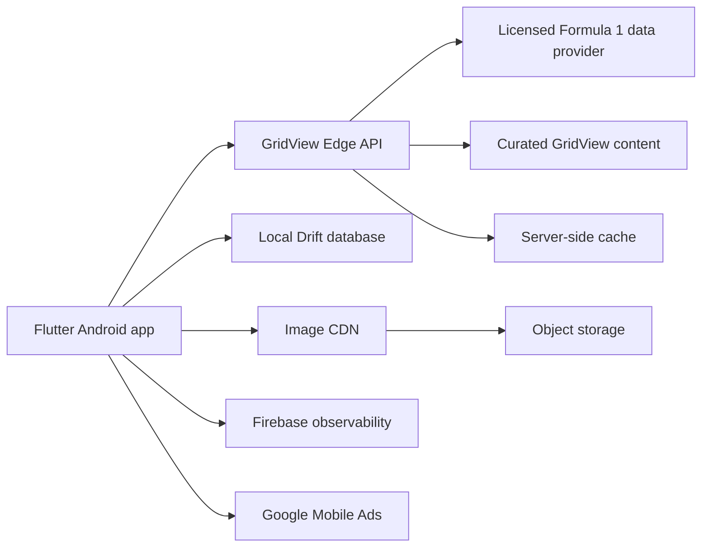
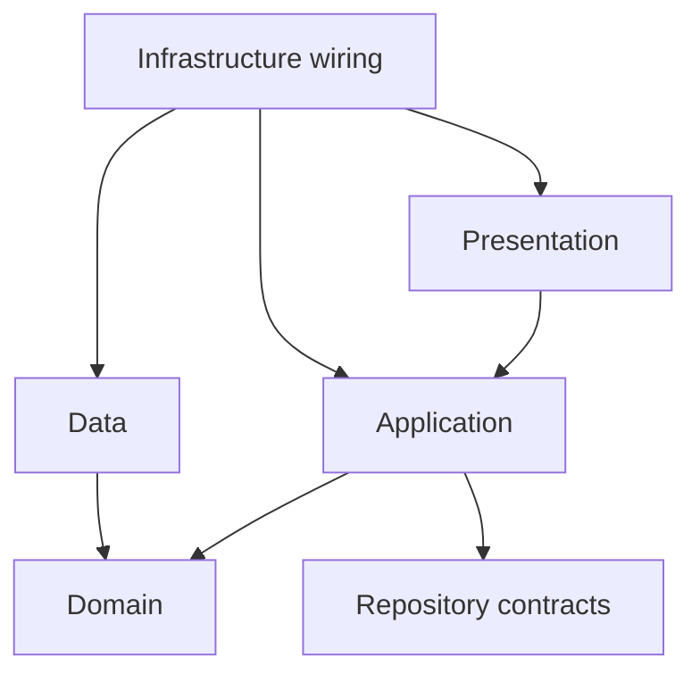
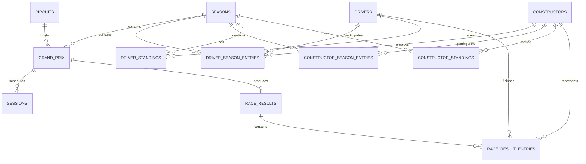
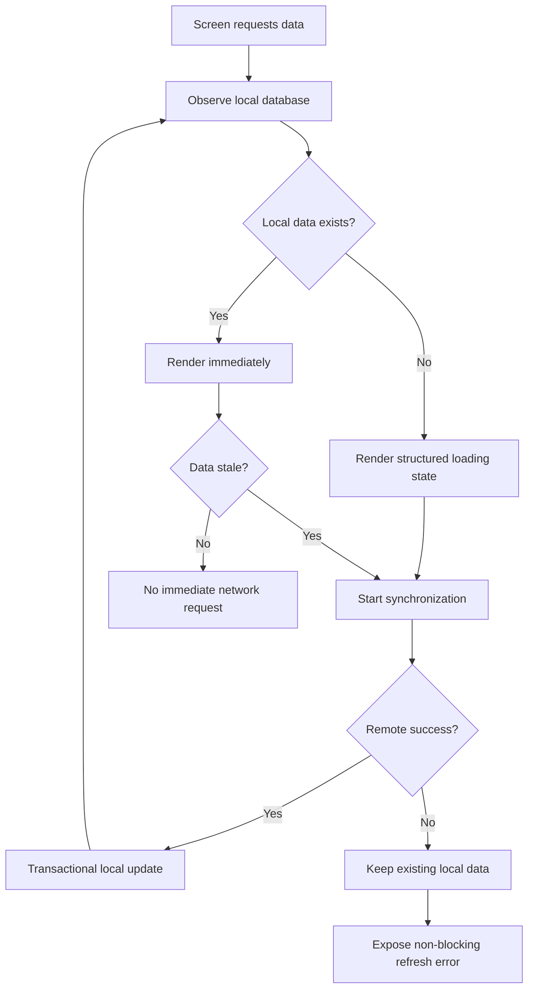

# GridView - Technical Requirements Document

## Document information

- Product: GridView
- Document type: Technical Requirements Document
- Version: 0.1
- Status: Draft
- Platform: Android
- Primary client technology: Flutter
- Existing Android application ID: `com.sejuma.gridview`
- Related documents:
  - `GridView_PRD.md`
  - `GridView_App_Flow.md`
  - `GridView_UI_UX_Design.md`
- Product phase: Complete reconstruction of the existing application
- Document date: 2026-07-17

---

## 1. Purpose

This document defines the technical requirements for reconstructing GridView as a reliable, maintainable and performant Android application.

It converts the product, navigation and design decisions into technical constraints and implementation standards.

The TRD covers:

- System architecture.
- Flutter application architecture.
- State management.
- Navigation.
- Networking.
- Local persistence and caching.
- Data modelling.
- Image delivery.
- Error handling.
- Security and privacy.
- Performance.
- Testing.
- Observability.
- Build, CI/CD and release requirements.
- Migration from the existing published application.

The detailed remote service design, provider selection, server-side data model and deployment topology will be defined in the separate Backend Scheme document.

---

## 2. Technical objectives

The reconstructed GridView must:

1. Preserve the existing Google Play application identity.
2. Replace the fragile scraper-driven client dependency with a stable API contract.
3. Open quickly and render cached content before remote refresh completes.
4. Continue working in a degraded offline mode after at least one successful synchronization.
5. Separate presentation, application logic, domain models and data access.
6. Support seasonal changes without hardcoded driver, team or event lists.
7. Support future features without another structural rewrite.
8. Use a reproducible and testable development environment.
9. Prevent secrets and third-party provider credentials from being included in the mobile binary.
10. Provide production observability for crashes, non-fatal errors and performance regressions.

---

## 3. Scope

## 3.1 Included

The technical implementation must support:

- Home.
- Calendar.
- Grand Prix details.
- Session schedules.
- Race results when available.
- Circuits.
- Drivers.
- Teams.
- Drivers' Championship standings.
- Constructors' Championship standings.
- English and Spanish localization.
- Dark-first theming.
- Offline cached content.
- Remote image delivery and caching.
- Basic settings.
- Advertising if retained.
- Crash and performance monitoring.
- Updating the existing Google Play application.

## 3.2 Excluded from the first release

The first technical implementation will not require:

- User accounts.
- Authentication.
- User-generated content.
- Cloud user profiles.
- Live telemetry.
- Live timing.
- WebSockets.
- Push notifications.
- Background notification scheduling.
- Social features.
- Payment processing.
- iOS release.
- Web release.
- Tablet-specific layouts.
- A traditional always-running Spring Boot application.
- A relational server database solely for duplicating third-party read-only Formula 1 data.

---

## 4. Architecture decision summary

GridView will use the following architecture:



### 4.1 Client

The Android client will remain a Flutter application.

It will be designed as a feature-first modular monolith:

- One mobile application.
- One deployable Android artifact.
- Independently structured feature modules.
- Shared infrastructure only where genuinely common.
- No micro-frontends.
- No internal package fragmentation during the initial reconstruction unless a package boundary provides a clear benefit.

### 4.2 Remote data boundary

The mobile client will communicate with a GridView-owned API contract.

The production app must not call a third-party Formula 1 provider directly.

The GridView API will:

- Protect provider credentials.
- Normalize provider-specific fields.
- Expose stable GridView identifiers.
- Apply caching and rate-limit protection.
- Provide consistent error responses.
- Allow provider replacement without requiring immediate mobile-app changes.

### 4.3 Local data boundary

The client will persist normalized data in a local SQLite database managed through Drift.

The local database will be the immediate read source for screens after data has been synchronized.

Remote responses will update the local database transactionally, and the UI will react to local data changes.

### 4.4 Media boundary

Large content images will not be bundled with the application except for essential brand assets and fallbacks.

Remote images will be served through a CDN with size-specific variants.

---

## 5. Technology baseline

The implementation should begin with the current stable ecosystem at the time the reconstruction branch is created.

Initial baseline as of this document:

| Area | Technology | Initial baseline |
|---|---|---|
| UI framework | Flutter | 3.44.x stable |
| Language | Dart | Version bundled with the selected Flutter SDK |
| Android build | Gradle / Android Gradle Plugin | Flutter-supported stable versions |
| State management | Riverpod | 3.3.x |
| Navigation | `go_router` | 17.x |
| HTTP client | Dio | 5.10.x |
| Local database | Drift + SQLite | Drift 2.34.x |
| Immutable models | Freezed | 3.2.x |
| JSON generation | `json_serializable` | Compatible stable release |
| Image loading | `cached_network_image` | 3.4.x |
| Preferences | `shared_preferences` | Compatible stable release |
| Localization | Flutter ARB generation + `intl` | Flutter-supported versions |
| Crash reporting | Firebase Crashlytics | Compatible FlutterFire release |
| Performance | Firebase Performance Monitoring | Compatible FlutterFire release |
| Tests | `flutter_test`, `integration_test`, Drift migration tools | Flutter-supported versions |
| CI | GitHub Actions | Repository workflow |
| Distribution | Android App Bundle | `.aab` |

### 5.1 Version policy

- Exact dependency versions will be committed through `pubspec.lock`.
- The Flutter SDK version will be pinned for local development and CI.
- Dependency upgrades will occur intentionally, not automatically in production branches.
- Major-version upgrades require an Architecture Decision Record when they affect public APIs or architecture.
- The project must remain on the Flutter stable channel.
- Pre-release dependencies are prohibited in production unless explicitly approved and documented.

---

## 6. Repository strategy

The existing frontend repository will become the primary GridView repository.

Recommended structure:

```text
/
├── android/
├── assets/
├── lib/
├── test/
├── integration_test/
├── services/
│   └── edge-api/
├── content/
├── docs/
├── scripts/
├── .github/
│   └── workflows/
├── pubspec.yaml
└── README.md
```

### 6.1 Rationale

- The existing Android application identity and signing configuration are associated with the current Flutter project.
- Keeping Flutter at the root avoids unnecessary Gradle and path migration risk.
- The edge service can coexist in `services/edge-api`.
- Documentation and curated content can remain versioned with the product.
- The repository becomes a simple monorepo without moving the Android application into an unnecessarily deep folder structure.

### 6.2 Legacy repository

The current backend repository should:

1. Have exposed credentials rotated immediately.
2. Have secrets removed from its Git history.
3. Be tagged with a final legacy version.
4. Be documented as deprecated.
5. Be archived after any reusable information is migrated.

Its Spring Boot implementation will not be used as the production foundation for the reconstructed release.

---

## 7. Flutter application structure

The codebase will be organized primarily by feature.

Recommended structure:

```text
lib/
├── app/
│   ├── app.dart
│   ├── bootstrap.dart
│   ├── router/
│   └── environment/
├── core/
│   ├── database/
│   ├── network/
│   ├── errors/
│   ├── logging/
│   ├── localization/
│   ├── theme/
│   ├── media/
│   └── widgets/
├── features/
│   ├── home/
│   ├── calendar/
│   ├── grand_prix/
│   ├── standings/
│   ├── drivers/
│   ├── teams/
│   ├── circuits/
│   └── settings/
└── main.dart
```

Each feature may contain:

```text
feature/
├── data/
│   ├── datasources/
│   ├── dtos/
│   ├── mappers/
│   └── repositories/
├── domain/
│   ├── entities/
│   ├── repositories/
│   └── use_cases/
├── application/
│   ├── controllers/
│   └── providers/
└── presentation/
    ├── screens/
    └── widgets/
```

### 7.1 Architecture pragmatism

The project will not apply layers mechanically.

Rules:

- A simple feature may omit a dedicated use-case class.
- Domain logic must not live inside widgets.
- DTO parsing must not happen inside screens.
- Database rows must not be exposed directly to presentation code.
- Repository interfaces should exist when they enable testing or provider substitution.
- Abstractions must solve a real boundary rather than increase file count.

---

## 8. Dependency direction

Allowed dependency direction:



### 8.1 Rules

- Presentation may depend on application state and domain entities.
- Presentation must not depend directly on Dio, Drift or provider-specific DTOs.
- Domain code must not import Flutter.
- Data implementations may depend on Dio, Drift and generated serializers.
- External SDKs must be isolated behind adapters when they affect business logic.
- Cross-feature imports should use domain/public interfaces, not private implementation files.

---

## 9. State management

Riverpod will replace the current `provider` and singleton-service approach.

### 9.1 Provider categories

Use:

- `Provider` for stateless dependencies.
- `FutureProvider` or generated functional providers for read-only asynchronous computations.
- `AsyncNotifier` for user-triggered or refreshable asynchronous state.
- `Notifier` for synchronous application state.
- Provider families for entity-specific state such as `driverById`.

Avoid:

- `ChangeNotifier` for new feature state.
- Global mutable singletons.
- Reading service fields directly from widget `build()` methods.
- Storing duplicated domain collections independently in multiple providers.

### 9.2 State ownership

Examples:

- Local database streams own persisted collections.
- Repositories own synchronization behavior.
- Feature controllers own transient UI actions and refresh state.
- Widgets own only ephemeral presentation state such as animation controllers.
- Preferences own persisted user choices.

### 9.3 State representation

Asynchronous screens must represent:

- Initial loading.
- Data available.
- Background refresh.
- Empty.
- Recoverable error.
- Stale cached data.
- Partial data.

Existing data must remain visible during background refresh.

### 9.4 Experimental Riverpod persistence

Riverpod's experimental offline-persistence API will not be used for core season data in v1.

Drift will remain the explicit persistence layer because:

- The data is relational.
- Migrations must be testable.
- Queries and joins are required.
- Persistence should not depend on an experimental API.
- The database must remain independently inspectable.

---

## 10. Navigation

`go_router` will be used for declarative navigation.

### 10.1 Shell navigation

The four primary destinations will use a state-preserving shell route:

- Home.
- Calendar.
- Standings.
- Explore.

Recommended mechanism:

- `StatefulShellRoute.indexedStack` or the current equivalent supported by the selected `go_router` version.
- One branch navigator per primary destination.
- Root navigator for modal and full-screen detail routes when required.

### 10.2 Typed routes

Typed route generation should be used where practical.

Route parameters must use stable identifiers:

- Season.
- Round.
- Driver ID.
- Team ID.
- Circuit ID.

Display names must not be used as identifiers.

### 10.3 Route examples

```text
/
/calendar
/calendar/:season/:round
/standings/drivers/:season
/standings/constructors/:season
/explore/drivers
/explore/teams
/explore/circuits
/drivers/:driverId
/teams/:teamId
/circuits/:circuitId
/settings
```

### 10.4 Route requirements

- Android system back must restore the originating context.
- Bottom-navigation branches must preserve scroll state.
- Duplicate entity loops must be prevented.
- Unknown routes must render a recoverable not-found screen.
- The route model must remain compatible with future deep links.
- Route transitions must respect reduced-motion accessibility preferences where available.

---

## 11. Domain model

The reconstructed domain model must be season-aware and must separate identity from participation and standings.

Core entities:

```text
Season
Driver
Constructor
Circuit
GrandPrix
Session
DriverSeasonEntry
ConstructorSeasonEntry
DriverStanding
ConstructorStanding
RaceResult
RaceResultEntry
MediaAsset
DataFreshness
```

### 11.1 Identity and season data

`Driver` represents stable identity and biography.

`DriverSeasonEntry` represents:

- Driver participation in a season.
- Constructor association.
- Race number.
- Role.
- Season-specific media or branding.

`Constructor` represents a stable constructor identity.

`ConstructorSeasonEntry` represents:

- Season-specific name.
- Branding.
- Driver line-up.
- Power unit.
- Team principal where available.

This prevents current-team data from being treated as a permanent property of a driver.

### 11.2 Missing values

Rules:

- Missing values remain `null`.
- Missing numeric values must never default to zero.
- Unknown enum values map to an explicit `unknown` case.
- Empty strings are not valid substitutes for absent values.
- Parsing failures must be observable and testable.
- Domain entities should reject structurally invalid required fields.

### 11.3 Numeric types

Use:

- `int` for whole counts and positions.
- `double` or a decimal-safe representation for championship points when fractional values are possible.
- `Duration` for durations.
- `DateTime` in UTC for instants.
- Explicit units for length, distance and speed.

Do not store numeric values as strings.

### 11.4 Dates and time zones

- All instants received from the API must use RFC 3339 / ISO 8601 with an explicit UTC offset.
- Persist instants in UTC.
- Convert session times to device-local time in presentation.
- Keep event-local timezone metadata when provided.
- Do not infer time zones from country names.
- Date formatting must be locale-aware.

---

## 12. DTO, database and domain separation

Three representations will be maintained where required:

1. API DTO.
2. Local database row.
3. Domain entity.

### 12.1 API DTO

Responsible for:

- Exact JSON contract.
- Serialization.
- Provider/API version compatibility.
- Optional field handling.

### 12.2 Database row

Responsible for:

- Persistent columns.
- Foreign keys.
- Indexes.
- Synchronization metadata.
- Schema migrations.

### 12.3 Domain entity

Responsible for:

- Product meaning.
- Type-safe values.
- Business rules.
- UI-independent behavior.

### 12.4 Mapping

Mapping functions must be explicit and tested:

```text
API DTO -> Domain or persistence command
Database row -> Domain
Domain -> presentation model where required
```

Generated JSON models must not be used directly as long-lived UI state.

---

## 13. Networking

Dio will be the HTTP client.

### 13.1 Client configuration

The shared API client must support:

- Base URL by environment.
- HTTPS only.
- Connection timeout.
- Receive timeout.
- Request cancellation.
- Interceptors.
- Structured error mapping.
- Correlation/request IDs.
- Conditional requests using `ETag` / `If-None-Match`.
- Optional response compression.
- Safe logging in development only.

Initial timeout guidance:

- Connection timeout: 5 seconds.
- Receive timeout: 10 seconds.
- Send timeout: 5 seconds.

The exact values may be adjusted using production measurements.

### 13.2 Retry policy

Automatic retries are permitted only for idempotent requests.

Requirements:

- Maximum two automatic retries after the first attempt.
- Exponential backoff with jitter.
- No retry for most client errors.
- Retry selected transient responses such as 408, 429 and 5xx according to server guidance.
- Respect `Retry-After`.
- Cancellation must stop pending retries.
- Manual user retry remains available.

### 13.3 Concurrency

- Duplicate simultaneous requests for the same resource should be deduplicated.
- A screen rebuild must not trigger another network request.
- Global refresh must not launch overlapping synchronizations.
- Large independent collections may refresh concurrently when safe.
- Database writes from a synchronization must be transactional.

### 13.4 API versioning

The mobile app will consume a versioned contract:

```text
/v1/...
```

Breaking contract changes require:

- A new API version, or
- Backward-compatible server support for all active app versions.

The edge API must not silently repurpose existing fields.

---

## 14. API response contract requirements

A recommended collection response:

```json
{
  "data": [],
  "meta": {
    "apiVersion": "1",
    "season": 2026,
    "generatedAt": "2026-07-17T18:00:00Z",
    "sourceUpdatedAt": "2026-07-17T17:55:00Z",
    "staleAfter": "2026-07-17T18:15:00Z",
    "requestId": "..."
  }
}
```

### 14.1 Contract rules

- Field names use consistent `camelCase`.
- IDs are stable and documented.
- Time values include timezone offsets.
- Optional data uses `null` or omitted optional fields according to the schema.
- Zero is used only when zero is a confirmed value.
- Error responses use a stable machine-readable code.
- Pagination is supported if a future collection requires it.
- The app must ignore unknown additive fields.
- The server must not depend on the app parsing provider-specific undocumented fields.

### 14.2 Error response

Recommended shape:

```json
{
  "error": {
    "code": "UPSTREAM_UNAVAILABLE",
    "message": "The requested data is temporarily unavailable.",
    "requestId": "..."
  }
}
```

User-facing copy must be generated by the app from an internal error category, not displayed directly from arbitrary server text.

---

## 15. Local persistence

Drift with SQLite will replace the generic Hive JSON cache.

### 15.1 Local database responsibilities

The database will persist:

- Seasons.
- Drivers.
- Constructors.
- Driver season entries.
- Constructor season entries.
- Circuits.
- Grand Prix events.
- Sessions.
- Driver standings.
- Constructor standings.
- Race results.
- Media metadata.
- Synchronization metadata.
- API `ETag` values where useful.

### 15.2 Database requirements

- Foreign keys enabled.
- Unique constraints for stable identities.
- Indexes for common list and detail queries.
- Transactions for collection replacement.
- Schema versioning from the first release.
- Exported schema snapshots.
- Automated migration verification.
- No destructive production migration without an explicit approved strategy.

### 15.3 Suggested table relationships



The final column-level local schema will be documented during implementation and may be included in the Backend Scheme where shared contracts are relevant.

---

## 16. Cache and synchronization strategy

GridView will use cache-first, stale-while-revalidate behavior.

### 16.1 Read flow



### 16.2 Freshness categories

Different data types require different policies.

| Resource | Typical volatility | Default client policy |
|---|---|---|
| Driver biography | Low | Long-lived; refresh on season/content version change |
| Constructor profile | Low/medium | Long-lived; refresh on season/content version change |
| Circuit profile | Low | Long-lived |
| Calendar | Medium | Refresh periodically and on foreground |
| Session schedule | Medium/high near event | Refresh more frequently during event week |
| Standings | High after sessions | Use server-provided freshness |
| Race results | High until official, then stable | Refresh until final; then long-lived |
| Media manifest | Low | Versioned URLs and long-lived cache |

The server should provide freshness metadata. Client defaults are fallbacks, not the source of truth.

### 16.3 Offline behavior

After one successful synchronization:

- Cached Home content must render.
- Calendar remains browsable.
- Standings remain visible with last-update information.
- Driver, team and circuit details remain available if previously synchronized.
- Cached images remain available when retained by the media cache.
- Remote refresh failure must not erase valid local data.

### 16.4 Cache invalidation

Use:

- Server-provided `staleAfter`.
- `ETag`.
- Entity/content version.
- Season ID.
- Explicit schema/content migration.

Do not use:

- One global 24-hour cache timestamp for all resources.
- Clearing every collection after one failed refresh.
- Time-based invalidation without resource context.

---

## 17. Image and media delivery

### 17.1 Bundled assets

Bundle only:

- GridView logo.
- App icon resources.
- Essential UI icons not supplied by the icon system.
- Neutral image placeholders.
- Minimal decorative backgrounds.
- Optional small country flags only after legal and size review.

Do not bundle the full driver, car, team and circuit media library.

### 17.2 Remote media

Remote media will use:

- CDN URLs.
- Versioned immutable paths.
- WebP as the default raster format.
- JPEG or PNG fallback where required.
- Multiple dimensions per asset.
- Meaningful aspect-ratio metadata.
- Long-lived CDN caching for versioned assets.

Suggested variants:

```text
thumbnail
card
detail
hero
```

### 17.3 Client image behavior

Use `cached_network_image` or an equivalent reviewed abstraction.

Requirements:

- Disk caching.
- Placeholder during loading.
- Error fallback.
- Reserved layout dimensions.
- Decoding close to display size where possible.
- No downloading hero-resolution assets for small rows.
- Cancellation or deprioritization for rapidly scrolled off-screen items.
- A cache policy with reasonable disk limits.

### 17.4 Media model

A `MediaAsset` should contain:

- Stable media ID.
- Entity relationship.
- Variant URLs.
- Width and height.
- Aspect ratio.
- Format.
- Version.
- Optional attribution.
- Optional copyright/license metadata.
- Fallback category.

---

## 18. Startup and bootstrap

### 18.1 Essential startup tasks

Before or during initial rendering:

- Initialize Flutter bindings.
- Install global error handlers.
- Resolve environment configuration.
- Open preferences.
- Open the local database.
- Initialize localization and theme state.
- Initialize required Firebase core services under a defined startup budget.
- Render the app shell.

### 18.2 Deferred startup tasks

After the first rendered frame or on demand:

- Advertising initialization.
- Non-essential analytics configuration.
- Remote refreshes not required by Home.
- Image prefetching.
- Secondary feature data.
- Optional performance traces.

### 18.3 Prohibited startup behavior

- Waiting for all remote collections.
- Waiting for an advertisement.
- Retrying remote requests indefinitely before rendering.
- Displaying a fixed-duration splash animation.
- Requiring a successful network request to enter the app.

---

## 19. Environment configuration

The project will support:

- Development.
- Staging.
- Production.

### 19.1 Android IDs

- Production: `com.sejuma.gridview`
- Staging: `com.sejuma.gridview.staging`
- Development: `com.sejuma.gridview.dev`

The production ID must never change.

### 19.2 Environment values

Configuration may include:

- GridView API base URL.
- CDN base URL.
- Firebase project configuration.
- Ad unit IDs.
- Logging level.
- Feature flags.
- Build metadata.

### 19.3 Secret policy

- No provider secret may be compiled into the app.
- No database password may exist in source control.
- `.env` files containing sensitive values must be ignored.
- GitHub Actions secrets must be stored in repository or environment secrets.
- Mobile configuration values must be treated as extractable even when obfuscated.
- Any value requiring confidentiality must remain server-side.

---

## 20. Error model

The application will use a typed internal failure model.

Suggested categories:

```text
NetworkUnavailable
NetworkTimeout
RateLimited
ServerUnavailable
InvalidResponse
UnsupportedApiVersion
LocalDatabaseFailure
CacheReadFailure
CacheWriteFailure
MediaFailure
ConfigurationFailure
UnknownFailure
```

### 20.1 Rules

- Raw exceptions must not reach presentation.
- Error categories may include diagnostic context for logging.
- User-facing messages must be localized.
- Retryability must be explicit.
- Fatal and non-fatal failures must be distinguished.
- A partial failure must not become an application-wide error.

### 20.2 Result strategy

Repositories may use:

- Sealed result types.
- Typed exceptions caught at the application boundary.
- Riverpod `AsyncValue` for UI state.

The project must choose one consistent pattern and document it in an ADR.

---

## 21. Logging and diagnostics

### 21.1 Local logging

Use structured logging with levels:

- Debug.
- Info.
- Warning.
- Error.
- Fatal.

### 21.2 Production rules

- Do not log secrets.
- Do not log full API responses by default.
- Do not log personal identifiers.
- Redact URLs if query parameters may be sensitive.
- Include request IDs for server correlation.
- Disable verbose network logs in release builds.

### 21.3 Diagnostic context

Useful fields:

- App version.
- Build number.
- Environment.
- Route.
- Feature.
- Request ID.
- Data version.
- Cache state.
- Connectivity state.
- Device/OS details supplied safely by observability tools.

---

## 22. Observability

### 22.1 Crash reporting

Firebase Crashlytics will capture:

- Uncaught Flutter errors.
- Uncaught asynchronous errors.
- Fatal platform errors.
- Selected non-fatal failures.
- ANRs where supported.

### 22.2 Performance monitoring

Firebase Performance Monitoring and Flutter DevTools profiling will be used for:

- Startup.
- Network request duration.
- Slow screen traces.
- Frame rendering issues.
- Critical synchronization flows.

### 22.3 Analytics

Analytics must remain minimal and product-focused.

Suggested events:

- App opened.
- Primary section viewed.
- Grand Prix opened.
- Driver opened.
- Team opened.
- Circuit opened.
- Standings type selected.
- Refresh failed.
- Offline cached state used.

Rules:

- No event per scroll item impression in v1.
- No collection of unnecessary personal data.
- Event naming documented in a tracking plan.
- Consent requirements reviewed before collection.

---

## 23. Advertising

If advertising remains enabled:

- Google Mobile Ads will be the only advertising SDK in the first reconstructed release unless a clear business requirement justifies another.
- Legacy Unity Ads integration should be removed.
- Consent must be resolved before requesting ads where required.
- Ad initialization must not block startup.
- Ad widgets must reserve layout space.
- Ad failures must not affect page content.
- No interstitial advertisements are required for v1.
- Ad placement must be configured separately for development, staging and production.
- Test ad units must be enforced outside production.

---

## 24. Security requirements

### 24.1 Transport

- HTTPS only.
- Cleartext traffic disabled.
- Valid TLS certificates.
- No certificate-validation bypass.
- No production endpoint using raw IP addresses.

### 24.2 API security

Even though the API is read-only:

- Apply server-side rate limiting.
- Validate all input parameters.
- Restrict methods to required operations.
- Do not expose scraper-trigger endpoints.
- Do not expose provider credentials.
- Return generic public errors and keep sensitive details in server logs.
- Consider signed or attested client requests only if abuse justifies the complexity.

### 24.3 Repository security

- Run secret scanning.
- Review Git history for leaked credentials.
- Rotate all already-exposed credentials.
- Keep signing materials outside source control.
- Use dependency update alerts.
- Review third-party SDKs before adoption.

### 24.4 Mobile storage

GridView does not require highly sensitive user data in v1.

- Preferences may use standard application storage.
- Secrets must not be stored locally because none should be delivered to the client.
- If future credentials are introduced, use platform-secure storage and reassess the threat model.

### 24.5 Obfuscation

Dart obfuscation may be enabled for production builds with `--obfuscate` and `--split-debug-info`.

It must not be treated as secret protection.

Symbol files must be stored securely for crash deobfuscation.

---

## 25. Privacy requirements

- Minimize permissions.
- Do not request location, contacts, camera, microphone or storage permissions for the v1 feature set.
- Internet access is the primary required Android permission.
- Advertising, analytics and crash SDK collection must be documented.
- Consent handling must comply with the user's region and current platform requirements.
- Google Play Data Safety information must match actual SDK behavior.
- Privacy policy and data-provider acknowledgements must be accessible from Settings.
- The application must not claim official Formula 1 affiliation.

---

## 26. Localization

Use Flutter's generated ARB localization system.

### 26.1 Required languages

- English.
- Spanish.

### 26.2 Requirements

- English will be the source locale.
- No user-facing feature text may be hardcoded.
- Dates, times and numbers must use locale-aware formatting.
- Translation keys should express meaning, not widget location.
- Formula 1 proper names should not be translated unless the data contract explicitly supplies localized forms.
- Missing locale values fall back to English.
- Existing translations from the legacy app must be reviewed before reuse.
- Layouts must support text expansion.

---

## 27. Theming and design system

The UI will use Material 3 foundations with a custom GridView design system.

### 27.1 Requirements

- Dark-first theme.
- Design tokens for color, typography, spacing, radius and elevation.
- Sora for headings and Inter for body text, subject to final licensing and implementation validation.
- Semantic colors independent from team colors.
- Team colors used only through safe helper functions with contrast checks.
- Reusable components rather than repeated local styling.
- No dependency on legacy Formula 1 fonts.

### 27.2 Theme persistence

- Theme preference stored in `shared_preferences`.
- Supported values: system, light and dark if light mode ships.
- If light mode is deferred, preserve a theme model capable of adding it later.

---

## 28. Accessibility

Requirements:

- Semantic labels for controls and meaningful images.
- Touch targets should generally meet Android accessibility guidance.
- Important information cannot rely only on color.
- Support text scaling without clipping for common accessibility sizes.
- Screen-reader traversal order must follow visual hierarchy.
- Loading, error and empty states must be announced appropriately.
- Animations must avoid unnecessary motion.
- Contrast must be validated for primary and secondary text.
- Team-color accents must include textual or positional cues.

Accessibility checks will form part of QA acceptance.

---

## 29. Performance requirements

Performance will be measured on at least one representative mid-range Android device, not only an emulator or flagship phone.

### 29.1 Startup targets

Provisional targets:

- App shell visible from cold launch: p75 <= 2.0 seconds on the reference device.
- Cached Home useful content visible: p75 <= 2.5 seconds.
- Warm launch to useful content: p75 <= 1.2 seconds.
- No remote service is required to meet cached startup targets.

### 29.2 Rendering

- Target 60 FPS on standard Android displays.
- Avoid sustained UI-thread work above one frame budget.
- Janky frames during key flows should remain below an agreed threshold measured in profile/release mode.
- Large JSON parsing must move off the UI isolate if profiling demonstrates frame impact.
- Long lists must use lazy builders.
- Widgets should use `const` constructors where meaningful.
- Rebuild scope must be limited through provider selection and component boundaries.

### 29.3 Network

- Avoid duplicate requests.
- Use compression and conditional requests.
- Request only screen-relevant data.
- Do not fetch every detail entity during startup.
- Preserve valid local data on network failure.

### 29.4 Images

- Use size-appropriate variants.
- Avoid decoding images far larger than their display size.
- Provide placeholders.
- Profile memory while scrolling driver, team and circuit lists.
- Precache only the next likely hero asset, not entire collections.

### 29.5 Application size

Targets:

- Initial Play-delivered base download target: <= 25 MB where practical.
- Soft ceiling: 35 MB unless an approved asset or native dependency requires more.
- Release builds must be checked with Flutter's app-size analysis tools.
- Generated build artifacts must never be committed.

---

## 30. Android platform requirements

### 30.1 Identity

Must retain:

```text
applicationId = com.sejuma.gridview
```

### 30.2 SDK requirements

Initial recommendation:

- `compileSdk`: 36.
- `targetSdk`: 36 for releases submitted under the 2026 Google Play requirement.
- `minSdk`: provisional API 23.

The final `minSdk` must be confirmed using:

- Existing Play Console device distribution.
- Required plugin minimum versions.
- Security and maintenance cost.
- The impact on existing installed users.

Any increase in `minSdk` must be documented before release.

### 30.3 Packaging

- Build and publish an Android App Bundle.
- Preserve release signing compatibility.
- Confirm Play App Signing status.
- Store the upload key securely.
- Do not regenerate or replace signing material casually.
- Use a monotonically increasing `versionCode`.

### 30.4 Back behavior

The app must support current Android back-navigation expectations and be tested against predictive-back behavior supported by the chosen Flutter/Android versions.

---

## 31. Build variants

Recommended flavors:

| Flavor | App ID | API | Firebase | Ads |
|---|---|---|---|---|
| Dev | `com.sejuma.gridview.dev` | Local/dev | Dev project | Test units |
| Staging | `com.sejuma.gridview.staging` | Staging | Staging project | Test units |
| Production | `com.sejuma.gridview` | Production | Production project | Production units |

### 31.1 Requirements

- Visible environment label in non-production builds.
- Production builds fail if test configuration is detected.
- Non-production builds must not write production analytics.
- Environment values must be supplied through controlled build configuration.
- CI must build at least dev and production-compatible artifacts.

---

## 32. Testing strategy

The project will use a test pyramid.

## 32.1 Unit tests

Required for:

- Domain rules.
- DTO parsing.
- DTO-to-domain mapping.
- Repository synchronization decisions.
- Cache freshness calculations.
- Timezone conversion helpers.
- Error mapping.
- Sorting and standings rules.
- Theme and preference migration where logic exists.

## 32.2 Database tests

Required for:

- Table constraints.
- DAO queries.
- Transactions.
- Collection replacement.
- Foreign keys.
- Schema migrations.
- Legacy cleanup behavior.
- Preservation of valid cached data after failed synchronization.

Drift schema exports and migration-verification tools must be used.

## 32.3 Widget tests

Required for:

- Loading states.
- Data states.
- Empty states.
- Error states.
- Offline stale state.
- Standings selector.
- Navigation actions.
- Large text handling.
- Image fallback layout.

## 32.4 Golden tests

Recommended for stable design-system components and critical screens:

- Home core states.
- Standings rows.
- Driver hero.
- Grand Prix schedule.
- Error and empty states.
- Dark theme.
- Light theme if included.

Golden tests should not replace behavioral tests.

## 32.5 Integration tests

Required critical journeys:

1. App launch with cached data.
2. First launch with successful network.
3. First launch without network.
4. Home -> Grand Prix -> Circuit -> back.
5. Standings -> Driver -> Team -> back.
6. Explore -> Driver/Team/Circuit.
7. Manual refresh success and failure.
8. Preference changes.
9. Legacy app update migration.
10. Release build startup.

Flutter's official `integration_test` package will be used.

## 32.6 Contract tests

Use representative JSON fixtures for:

- Standard race weekends.
- Sprint weekends.
- Cancelled sessions.
- Fractional points.
- Mid-season driver changes.
- Missing optional profile fields.
- Unknown additive enum values.
- Partial upstream responses.
- Error responses.

## 32.7 Coverage policy

Coverage should focus on critical logic rather than a single repository-wide vanity percentage.

Minimum expectation:

- High coverage for domain, mapping, freshness and migration logic.
- Every production bug should add a regression test where practical.
- Untested critical paths block release.

---

## 33. Quality gates

A pull request must pass:

- Dart formatting.
- Static analysis.
- Lint rules.
- Unit tests.
- Widget tests.
- Database tests.
- Generated-code consistency check.
- Secret scan.
- Dependency vulnerability review where tooling supports it.
- Dev Android build.

Release candidates must additionally pass:

- Integration tests.
- Production AAB build.
- Signing verification.
- App-size review.
- Performance smoke test.
- Upgrade test over the current public version.
- Data Safety and privacy review.
- Internal track installation test.

---

## 34. CI/CD

GitHub Actions will run the automated pipeline.

Suggested workflows:

```text
pull_request.yml
main.yml
release_candidate.yml
```

### 34.1 Pull request pipeline

- Checkout.
- Install pinned Flutter.
- Restore dependency cache.
- `flutter pub get`.
- Verify generated code is current.
- `dart format --output=none --set-exit-if-changed`.
- `flutter analyze`.
- Run unit/widget/database tests.
- Build a development APK or equivalent smoke artifact.

### 34.2 Main pipeline

- All pull-request checks.
- Integration smoke tests where infrastructure allows.
- Produce staging artifact.
- Store test reports and build artifacts.

### 34.3 Release candidate pipeline

- Manual trigger or release tag.
- Production configuration validation.
- Full tests.
- Build signed AAB.
- Generate obfuscation symbols if enabled.
- Produce checksums and release notes.
- Upload artifact for controlled Play Console release.

Automatic public production rollout is not required for v1.

---

## 35. Code generation

Code generation may be used for:

- Riverpod providers.
- Freezed models.
- JSON serialization.
- Drift database code.
- Typed routes.

Requirements:

- Generated files follow one consistent commit policy.
- The recommended policy is to commit generated Dart files required for deterministic review and build simplicity.
- CI verifies that regeneration produces no diff.
- Build scripts document the single command used to regenerate code.
- Generated files are not manually edited.

---

## 36. Coding standards

- Enable strict analysis options.
- Prefer immutable data.
- Avoid `dynamic` except at controlled JSON boundaries.
- Avoid forced null assertions unless correctness is guaranteed and documented.
- No business logic inside widget `build()` methods.
- No direct API calls from widgets.
- No direct database calls from widgets.
- Public APIs require concise documentation when intent is not obvious.
- Files and classes should have one clear responsibility.
- Do not create generic `utils.dart` dumping grounds.
- Use feature-specific naming.
- Use English for code, comments, documentation and commit messages.

---

## 37. Feature flags and remote configuration

The first release may use a limited feature-flag mechanism.

Potential flags:

- Advertising enabled.
- Light theme enabled.
- Search enabled.
- Race results enabled.
- Optional Home modules enabled.

Requirements:

- Defaults must be safe when remote configuration is unavailable.
- Core navigation must not disappear because of a remote flag error.
- Flags must not replace release testing.
- Provider selection and security-critical behavior must not be controlled solely by client-side flags.

Firebase Remote Config is a possible implementation, but the final choice should remain proportionate to the number of flags.

---

## 38. Legacy migration

The reconstructed app will be installed as an update over the existing app.

### 38.1 Data to preserve

Preserve where valid:

- Language preference.
- Theme preference.
- Any explicit user setting that remains supported.
- Consent state if legally and technically reusable.

### 38.2 Data to discard

Discard or replace:

- Legacy Hive API cache.
- Obsolete update metadata.
- Paths to bundled driver/team/circuit images.
- Legacy provider-specific data.
- Old ad initialization state.
- Invalid or unknown settings.

### 38.3 Migration approach

1. Detect the legacy version/keys.
2. Read supported preferences.
3. Validate and map values to the new preference model.
4. Open and initialize the new Drift database.
5. Perform first synchronization or render without data.
6. Mark migration complete.
7. Remove obsolete cache only after the new application has started successfully.
8. Keep migration idempotent.

### 38.4 Upgrade test

A release candidate must be tested by:

1. Installing the current Play-compatible production version.
2. Opening it and generating representative cache/preferences.
3. Installing the reconstructed signed build over it.
4. Verifying application identity and signing compatibility.
5. Verifying migrated preferences.
6. Verifying old cache cannot crash parsing.
7. Verifying first useful screen.
8. Repeating with offline startup.

---

## 39. Release strategy

Recommended rollout:

1. Local signed update test.
2. Google Play internal testing.
3. Closed testing.
4. Small staged production rollout.
5. Expand rollout after crash, ANR and performance review.
6. Full rollout.

Suggested staged percentages:

- 5%.
- 20%.
- 50%.
- 100%.

Exact steps depend on active-user volume.

### 39.1 Rollback

Long-term service compatibility for the previous GridView version is not required because the active legacy-user population is negligible.

- Keep the previous stable source tag and build metadata.
- The remote API must remain backward-compatible with the previous public version during rollout.
- Keep the legacy server only for a short rollback window after the reconstructed release; long-term support for old clients is not required.
- A corrective release must use a higher `versionCode`; Google Play does not deploy an older bundle as an update.
- Feature flags may disable non-core problematic modules while a fix is prepared.

---

## 40. Backend Scheme boundary

The following decisions are intentionally delegated to the Backend Scheme:

- Exact Formula 1 data provider.
- Licensing and commercial-use validation.
- Edge runtime vendor.
- Server-side cache technology.
- Exact endpoint inventory.
- Provider-to-GridView normalization mapping.
- Server data snapshots or database requirement.
- Refresh scheduling.
- Rate limits.
- Image object storage and CDN vendor.
- Curated content publication workflow.
- Server monitoring.
- Deployment and rollback.
- Cost estimates.

The Backend Scheme must satisfy the client contract and technical requirements in this document.

---

## 41. Architecture Decision Records

Significant technical decisions should be recorded under:

```text
docs/adr/
```

Initial ADRs should cover:

1. Flutter retained for the reconstruction.
2. Feature-first modular monolith.
3. Riverpod state management.
4. `go_router` shell navigation.
5. Drift local database.
6. GridView-owned edge API boundary.
7. Remote CDN media.
8. Production observability choice.
9. Repository/monorepo structure.
10. Legacy cache migration strategy.

ADR status values:

- Proposed.
- Accepted.
- Superseded.
- Rejected.

---

## 42. Definition of technical completion

The reconstructed technical foundation is complete when:

- The application updates over the existing Play-compatible build.
- `com.sejuma.gridview` is preserved.
- Home renders cached data without waiting for the network.
- All primary routes and entity relationships work.
- Dynamic data comes through the GridView API contract.
- No provider secret exists in the mobile app or repository.
- The Drift schema and migrations are tested.
- Screens support initial, data, refresh, empty, offline and error states.
- Remote images use size-specific CDN variants and disk cache.
- Crash reporting works in a release-like environment.
- Performance targets are measured on a representative device.
- CI quality gates pass.
- A signed production AAB is installable through an internal Play track.
- Upgrade testing from the legacy application succeeds.

---

## 43. Risks and mitigations

### 43.1 Overengineering

Risk:

- Excessive layers and generated code slow development.

Mitigation:

- Apply boundaries pragmatically.
- Omit unnecessary use-case classes.
- Review architecture after the first complete vertical feature.

### 43.2 Data-provider mismatch

Risk:

- Provider fields do not satisfy all product screens.

Mitigation:

- Validate representative responses before implementation.
- Keep provider mapping server-side.
- Support curated content for missing static fields.

### 43.3 Provider licensing

Risk:

- A free API does not permit ad-supported use.

Mitigation:

- Licensing approval is a release gate.
- The mobile app remains provider-agnostic.

### 43.4 Legacy update failure

Risk:

- Signing, package identity or old local data prevents update.

Mitigation:

- Test signed upgrades early, not only at release time.
- Keep migration idempotent.
- Preserve the production package ID.
- Treat rollback to the legacy backend as a short-term safety mechanism, not a long-term compatibility requirement.

### 43.5 Image costs or performance

Risk:

- Remote media increases latency and CDN costs.

Mitigation:

- Use variants, immutable caching, WebP and placeholders.
- Keep essential fallbacks local.
- Monitor transfer volume.

### 43.6 Dependency churn

Risk:

- Fast-moving Flutter packages introduce breaking changes.

Mitigation:

- Pin SDK and dependencies.
- Upgrade deliberately.
- Avoid experimental production APIs.
- Maintain tests around boundaries.

### 43.7 Observability and advertising startup cost

Risk:

- SDK initialization degrades startup.

Mitigation:

- Measure startup.
- Defer non-essential SDK work.
- Remove duplicate ad SDKs.
- Define startup budgets.

---

## 44. Open technical decisions

The following require resolution before implementation reaches production integration:

- Final Formula 1 provider.
- Edge API vendor.
- Image storage/CDN vendor.
- Final `minSdk`.
- Whether light theme ships in v1.
- Exact analytics events and consent flow.
- Whether Remote Config is required.
- Whether Dart obfuscation is enabled.
- Exact application-size budget after prototype measurement.
- Final local database column-level schema.
- Final API endpoint and response schemas.
- Whether race results are part of the initial provider contract.
- Whether existing Firebase projects are retained or replaced.

These decisions do not prevent building the app shell, design system and mocked vertical slices.

---

## 45. Recommended implementation proof

Before building every feature, create one complete vertical slice:

```text
Home next Grand Prix card
    -> Riverpod controller
    -> repository
    -> mock GridView API response
    -> Drift persistence
    -> offline render
    -> Grand Prix detail route
    -> image placeholder/cache
    -> unit, widget and integration tests
```

This slice should validate:

- Folder structure.
- State model.
- API DTO mapping.
- Database writes.
- Cache-first behavior.
- Navigation.
- Error handling.
- Design-system components.
- Testing strategy.
- Observability hooks.

Architecture changes should be made after this proof, before duplicating the pattern across all features.

---

## 46. Reference sources

The technical baseline should be verified against current official documentation during implementation:

- [Flutter release notes](https://docs.flutter.dev/release/release-notes)
- [Flutter supported deployment platforms](https://docs.flutter.dev/reference/supported-platforms)
- [Flutter performance best practices](https://docs.flutter.dev/perf/best-practices)
- [Flutter testing overview](https://docs.flutter.dev/testing/overview)
- [Flutter integration testing](https://docs.flutter.dev/testing/integration-tests)
- [Flutter Android deployment](https://docs.flutter.dev/deployment/android)
- [Google Play target API requirements](https://developer.android.com/google/play/requirements/target-sdk)
- [Android app signing](https://developer.android.com/studio/publish/app-signing)
- [Android App Bundles](https://developer.android.com/guide/app-bundle)
- [Android security checklist](https://developer.android.com/privacy-and-security/security-tips)
- [Riverpod documentation](https://riverpod.dev/)
- [`go_router` package](https://pub.dev/packages/go_router)
- [Dio package](https://pub.dev/packages/dio)
- [Drift documentation](https://drift.simonbinder.eu/)
- [Drift migrations](https://drift.simonbinder.eu/migrations/)
- [Freezed package](https://pub.dev/packages/freezed)
- [Firebase Crashlytics for Flutter](https://firebase.google.com/docs/crashlytics/flutter/get-started)

---

## 47. Technical summary

The reconstructed GridView will be a Flutter modular monolith with:

- Riverpod for state and dependency management.
- `go_router` for state-preserving navigation.
- Dio for network access.
- A GridView-owned versioned edge API.
- Drift/SQLite for offline-first local persistence.
- Freezed and generated JSON models for type-safe data boundaries.
- CDN-hosted, size-specific cached media.
- Firebase Crashlytics and performance monitoring.
- GitHub Actions quality gates.
- Android App Bundle release through the existing Google Play identity.

The most important architectural principle is that the user interface reads reliable local data while synchronization occurs independently in the background.

The mobile app will no longer depend on a scraper, a remote MySQL database or a single global network-loading step before it becomes usable.
